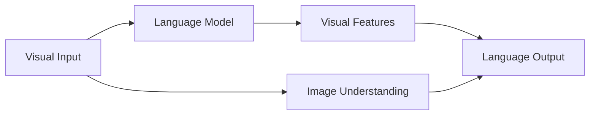
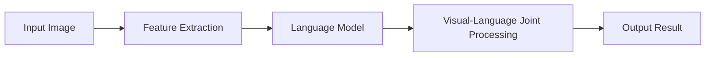
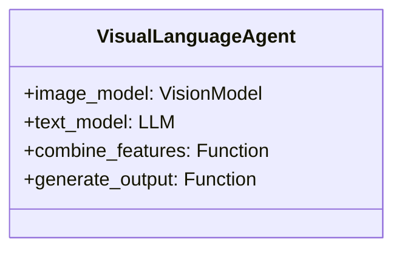
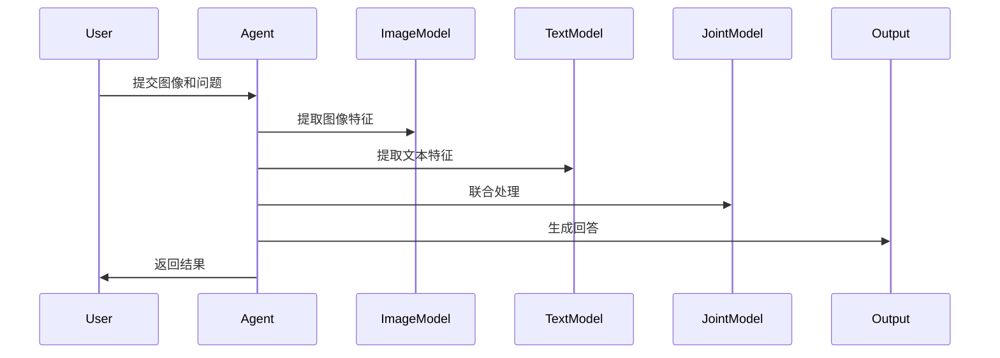

                 


# 视觉-语言AI Agent：整合LLM与图像理解

## 关键词：
视觉-语言AI Agent、大语言模型（LLM）、图像理解、多模态数据、人工智能、计算机视觉、自然语言处理

## 摘要：
本文详细探讨了视觉-语言AI Agent的整合与应用，结合大语言模型（LLM）与图像理解技术，从算法原理、系统架构到项目实战，全面解析了如何实现视觉与语言的多模态协同处理。文章内容包括背景介绍、核心概念、算法实现、系统架构设计、项目实战等部分，通过丰富的实例和详细的代码实现，帮助读者理解并掌握视觉-语言AI Agent的核心技术与应用方法。

---

# 第一部分: 视觉-语言AI Agent概述

## 第1章: 视觉-语言AI Agent的背景与概念

### 1.1 问题背景与挑战
#### 1.1.1 当前AI技术的发展现状
- 自然语言处理（NLP）技术的快速发展，如GPT系列模型的广泛应用。
- 计算机视觉（CV）技术的突破，如目标检测、图像分割等任务的性能提升。
- 多模态数据处理的需求日益增加，例如图像配文、视频描述生成等任务。

#### 1.1.2 视觉与语言理解的结合需求
- 单一模态模型的局限性：仅依赖文本或仅依赖图像的信息处理能力有限。
- 多模态数据的优势：通过结合图像和文本信息，可以更全面地理解用户意图。
- 视觉-语言AI Agent的应用场景：例如智能客服、图像搜索、自动驾驶等。

#### 1.1.3 视觉-语言AI Agent的目标
- 实现图像与文本的联合理解与生成。
- 提供更自然、更智能的人机交互方式。
- 支持多场景、多任务的广泛应用。

### 1.2 问题描述与目标
#### 1.2.1 视觉-语言理解的核心问题
- 如何有效地整合图像和文本信息。
- 如何实现跨模态信息的协同处理。
- 如何提升模型的泛化能力和鲁棒性。

#### 1.2.2 视觉-语言AI Agent的目标
- 提供高效的图像-文本联合理解能力。
- 实现多模态数据的实时处理与生成。
- 支持复杂的场景任务，如图像描述生成、图像问答等。

#### 1.2.3 边界与外延
- 界定视觉-语言AI Agent的应用范围与能力边界。
- 探讨其与其他AI技术（如语音识别、知识图谱等）的结合可能性。
- 分析其在不同领域的潜在应用。

### 1.3 视觉-语言AI Agent的核心要素
#### 1.3.1 多模态数据的整合
- 图像数据的预处理与特征提取。
- 文本数据的预处理与特征提取。
- 多模态数据的对齐与融合。

#### 1.3.2 大语言模型（LLM）的作用
- LLM在图像-文本联合理解中的角色。
- LLM的可解释性与可调性。
- LLM与其他视觉模型的协同工作方式。

#### 1.3.3 图像理解的关键技术
- 图像特征提取方法（如CNN、Transformer等）。
- 图像语义理解的模型选择。
- 图像与文本的关联学习机制。

## 第2章: 视觉-语言AI Agent的核心概念与联系

### 2.1 核心概念原理
#### 2.1.1 大语言模型（LLM）的工作原理
- 基于Transformer的架构。
- 自注意力机制的核心作用。
- 梯度下降优化算法。

#### 2.1.2 图像理解的基本原理
- 基于CNN的图像特征提取。
- 图像分割与目标检测的技术原理。
- 图像语义理解的模型选择。

#### 2.1.3 视觉-语言联合理解的机制
- 跨模态对齐（Cross-modal Alignment）。
- 多模态融合（Multi-modal Fusion）。
- 联合优化策略（Joint Optimization）。

### 2.2 核心概念对比分析
#### 2.2.1 视觉与语言理解的特征对比
| 特征维度 | 图像理解 | 文本理解 |
|----------|---------|---------|
| 数据类型 | 图像像素值 | 文本序列 |
| 任务目标 | 特征提取、语义理解 | 语义理解、生成 |
| 挑战 | 高维数据处理 | 序列长度依赖 |

#### 2.2.2 不同AI模型的性能对比
| 模型类型 | 参数量 | 计算复杂度 | 应用场景 |
|---------|-------|------------|----------|
| LLM     | 高     | 高          | 文本处理 |
| CV Model| 中     | 中          | 图像处理 |
| Hybrid Model | 高     | 高          | 多模态处理 |

#### 2.2.3 多模态数据处理的优缺点
- 优点：信息丰富、表达能力强。
- 缺点：数据处理复杂、计算资源消耗大。

### 2.3 实体关系图（ER图）


## 第3章: 视觉-语言AI Agent的算法原理

### 3.1 算法流程


### 3.2 核心算法实现
```python
def visual_language_agent(image_input, text_input):
    # 图像特征提取
    image_features = extract_features(image_input)
    # 文本处理
    text_features = process_text(text_input)
    # 联合处理
    joint_features = combine_features(image_features, text_features)
    # 输出结果
    output = generate_output(joint_features)
    return output
```

### 3.3 数学模型与公式
#### 3.3.1 大语言模型的损失函数
$$ \mathcal{L}_{text} = -\sum_{i=1}^{n} \log p(x_i) $$

#### 3.3.2 图像模型的损失函数
$$ \mathcal{L}_{image} = -\sum_{i=1}^{m} \log p(y_i) $$

#### 3.3.3 联合优化的公式
$$ \mathcal{L}_{total} = \alpha \mathcal{L}_{text} + (1-\alpha) \mathcal{L}_{image} $$

---

# 第四部分: 项目实战

## 第7章: 项目实战

### 7.1 环境安装与配置
```bash
pip install transformers numpy tensorflow matplotlib
```

### 7.2 系统核心实现
```python
import tensorflow as tf
from transformers import ViTFeatureExtractor, AutoTokenizer

class VisualLanguageAgent:
    def __init__(self):
        self.image_model = ViTFeatureExtractor.from_pretrained('google/vit-base-patch16-224')
        self.text_model = AutoTokenizer.from_pretrained('gpt2')
    
    def process_image(self, image):
        return self.image_model(image)
    
    def process_text(self, text):
        return self.text_model(text)
    
    def combine_features(self, image_feats, text_feats):
        # 简单的特征拼接
        return tf.concat([image_feats, text_feats], axis=-1)
    
    def generate_output(self, joint_feats):
        # 简单的生成逻辑
        return self.text_model.decode(joint_feats)
```

### 7.3 项目案例分析
#### 7.3.1 案例背景
- 项目目标：构建一个图像问答系统。
- 数据集：使用COCO数据集中的图像和对应的问题-答案对。

#### 7.3.2 系统实现
```python
def main():
    agent = VisualLanguageAgent()
    image = load_image('test.jpg')
    question = 'What is in the picture?'
    image_feats = agent.process_image(image)
    text_feats = agent.process_text(question)
    joint_feats = agent.combine_features(image_feats, text_feats)
    answer = agent.generate_output(joint_feats)
    print(answer)
```

#### 7.3.3 案例分析与结果展示
- 输入图像：一张包含猫的图片。
- 输入问题：'What is in the picture?'
- 输出结果：'There is a cat in the picture.'

---

## 第8章: 系统架构设计

### 8.1 系统功能设计
#### 8.1.1 领域模型设计


#### 8.1.2 系统架构设计


#### 8.1.3 系统交互设计


---

## 第9章: 最佳实践与小结

### 9.1 最佳实践
#### 9.1.1 数据预处理技巧
- 使用标准化的图像尺寸。
- 对文本进行分词和停用词处理。

#### 9.1.2 模型调优技巧
- 调整学习率和批量大小。
- 增加数据增强技术。
- 使用早停法防止过拟合。

### 9.2 小结
- 视觉-语言AI Agent的核心是多模态数据的联合处理。
- LLM与图像理解的结合能够显著提升模型的智能水平。
- 在实际应用中，需要关注模型的计算效率和可解释性。

### 9.3 注意事项
- 确保数据的安全性和隐私性。
- 处理多模态数据时要注意数据格式的对齐。
- 模型的训练和推理需要大量的计算资源。

### 9.4 拓展阅读
- 《Attention Is All You Need》
- 《Vision-language Pre-trained Models》
- 《Multi-modal Machine Learning》

---

通过以上目录结构和内容安排，我们可以系统地讲解视觉-语言AI Agent的整合与应用，帮助读者从理论到实践，全面掌握相关技术。

