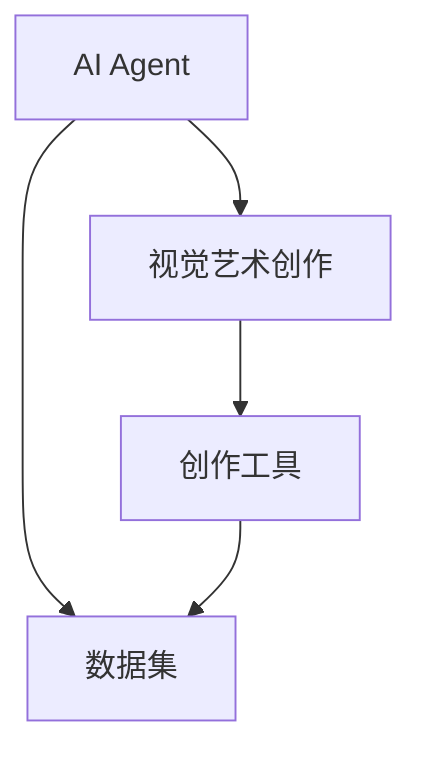
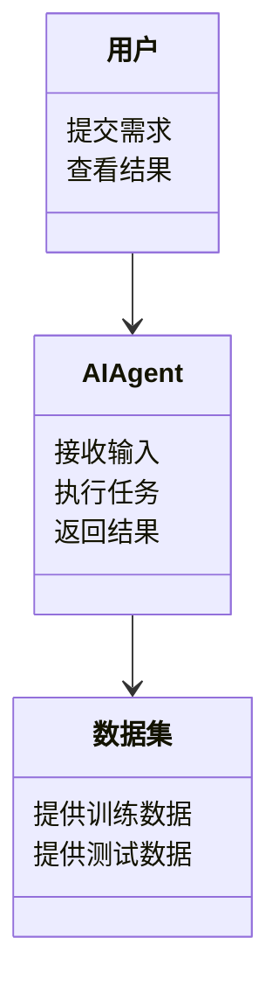
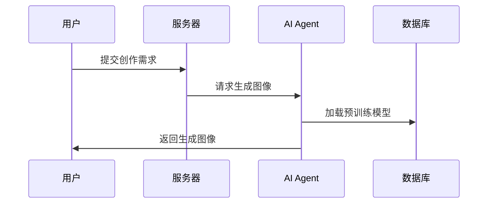

                 


# 视觉艺术领域的AI Agent创作工具

## 关键词：AI Agent、视觉艺术、创作工具、算法原理、系统设计、项目实战

## 摘要：  
本文详细探讨了AI Agent在视觉艺术创作中的应用，从概念、原理到实际实现，全面解析了AI Agent如何助力视觉艺术创作工具的开发与优化。通过系统分析与架构设计，结合实际案例，本文为视觉艺术领域的技术实践者提供了深入的技术指导和实践参考。

---

# 第一章: 视觉艺术与AI Agent的结合

## 1.1 问题背景与问题描述  
### 1.1.1 问题背景  
随着人工智能技术的快速发展，AI在艺术创作中的应用日益广泛。然而，现有的视觉艺术创作工具在智能化、个性化和效率方面仍存在诸多瓶颈。  

### 1.1.2 问题描述  
传统视觉艺术创作工具主要依赖人工操作，效率低且难以满足多样化的需求。AI Agent的引入可以显著提升创作效率、降低学习门槛，并提供更丰富的创作可能性。  

### 1.1.3 问题解决的思路与方法  
通过引入AI Agent，实现对视觉艺术创作过程的智能化辅助，包括图像生成、风格迁移、色彩优化等。  

### 1.1.4 问题的边界与外延  
本文聚焦于AI Agent在视觉艺术创作工具中的具体应用，不涉及AI在音乐、文学等其他艺术形式中的应用。  

## 1.2 视觉艺术创作工具的核心概念  
### 1.2.1 AI Agent的定义与属性  
- **AI Agent**：一种能够感知环境、执行任务并做出决策的智能实体。  
- **属性**：智能性、自主性、反应性、主动性。  

### 1.2.2 视觉艺术创作工具的核心要素  
- **用户交互界面**：提供直观的操作界面。  
- **算法模块**：实现图像生成、风格迁移等核心功能。  
- **数据集**：支持训练和推理的数据集。  

### 1.2.3 AI Agent与视觉艺术创作的关联  
通过AI Agent的智能决策和执行能力，提升视觉艺术创作工具的自动化和智能化水平。  

## 1.3 视觉艺术创作工具的概念结构与核心要素  
### 1.3.1 概念结构图  


### 1.3.2 核心要素组成  
- **用户需求**：个性化创作需求。  
- **AI算法**：生成图像的核心算法。  
- **数据集**：训练和推理的数据支持。  

## 1.4 本章小结  
通过本章的介绍，读者可以理解AI Agent在视觉艺术创作中的重要作用，并为后续章节的深入分析奠定基础。

---

# 第二章: AI Agent的核心原理与视觉艺术创作的结合

## 2.1 AI Agent的核心原理  
### 2.1.1 AI Agent的基本原理  
AI Agent通过感知环境、分析任务目标，并基于推理和决策机制执行操作。  

### 2.1.2 AI Agent的类型与特点  
- **基于规则的AI Agent**：通过预定义规则执行任务。  
- **基于模型的AI Agent**：利用模型进行推理和决策。  
- **基于学习的AI Agent**：通过机器学习模型进行自适应优化。  

### 2.1.3 AI Agent的决策机制  
- **基于规则的决策**：简单、高效，适用于任务明确的场景。  
- **基于模型的决策**：复杂、灵活，适用于任务多样化的场景。  

## 2.2 视觉艺术创作工具的核心原理  
### 2.2.1 视觉艺术创作工具的工作流程  
1. **用户输入**：用户输入创作需求。  
2. **算法处理**：AI算法生成图像。  
3. **结果输出**：输出生成的图像并提供反馈。  

### 2.2.2 视觉艺术创作工具的关键技术  
- **图像生成算法**：如GAN、VAE等。  
- **风格迁移技术**：基于深度学习的风格迁移算法。  

### 2.2.3 视觉艺术创作工具的实现逻辑  
1. **用户需求分析**：解析用户的创作需求。  
2. **算法选择与优化**：根据需求选择合适的算法并进行优化。  
3. **图像生成与反馈**：生成图像并提供反馈以供用户调整。  

## 2.3 AI Agent与视觉艺术创作的关联  
### 2.3.1 AI Agent在视觉艺术创作中的角色  
- **辅助创作**：帮助用户生成灵感和创意。  
- **自动化优化**：自动优化图像质量。  

### 2.3.2 AI Agent与视觉艺术创作工具的交互方式  
通过API或用户界面实现交互，AI Agent接收用户的输入并返回生成的图像。  

### 2.3.3 AI Agent对视觉艺术创作的影响  
显著提升了创作效率和作品质量，降低了创作门槛。  

## 2.4 本章小结  
本章详细介绍了AI Agent的核心原理及其在视觉艺术创作中的应用，为后续章节的实现提供了理论基础。

---

# 第三章: 视觉艺术创作工具的算法原理与数学模型

## 3.1 视觉艺术创作工具的算法概述  
### 3.1.1 常见的视觉艺术创作算法  
- **生成对抗网络（GAN）**：用于图像生成。  
- **变分自编码器（VAE）**：用于图像生成与修复。  

### 3.1.2 算法的选择与优化  
根据具体需求选择合适的算法，并通过超参数调整和模型优化提升性能。  

### 3.1.3 算法实现的关键步骤  
1. **数据预处理**：对数据进行归一化处理。  
2. **模型训练**：训练生成器和判别器。  
3. **图像生成**：利用训练好的模型生成图像。  

## 3.2 AI Agent算法的实现原理  
### 3.2.1 AI Agent算法的基本原理  
通过感知输入、分析任务目标并执行操作。  

### 3.2.2 AI Agent算法的核心步骤  
1. **感知环境**：获取输入数据。  
2. **任务分析**：解析任务目标。  
3. **决策与推理**：基于模型做出决策。  
4. **执行操作**：输出结果。  

### 3.2.3 AI Agent算法的优化策略  
- **模型优化**：通过剪枝、蒸馏等技术优化模型。  
- **算法优化**：通过并行计算、分布式训练提升效率。  

## 3.3 视觉艺术创作工具的数学模型  
### 3.3.1 数学模型的构建与应用  
- **生成对抗网络的数学模型**  
  - 生成器：$G(z)$，将噪声$z$映射到数据空间。  
  - 判别器：$D(x)$，判别输入$x$是真实数据还是生成数据。  
  - 损失函数：$\mathcal{L} = \mathbb{E}[\log(D(x))] + \mathbb{E}[\log(1-D(G(z)))]$  

### 3.3.2 数学模型的优化与调整  
通过调整学习率、批量大小等参数优化模型性能。  

### 3.3.3 数学模型的验证与测试  
通过验证集评估模型的生成效果，并通过测试集验证模型的泛化能力。  

## 3.4 本章小结  
本章详细介绍了视觉艺术创作工具的算法原理与数学模型，为后续章节的实现提供了技术支持。

---

# 第四章: 视觉艺术创作工具的系统分析与架构设计

## 4.1 系统分析的背景与目标  
### 4.1.1 系统分析的必要性  
通过系统分析明确需求，确保系统设计的合理性和可行性。  

### 4.1.2 系统分析的目标  
- 明确用户需求。  
- 确定系统功能。  
- 设计系统架构。  

## 4.2 系统功能设计  
### 4.2.1 领域模型  


### 4.2.2 功能模块  
- **用户交互模块**：接收用户输入并返回结果。  
- **算法处理模块**：实现图像生成和优化。  
- **数据管理模块**：管理训练和测试数据。  

## 4.3 系统架构设计  
### 4.3.1 架构图  


### 4.3.2 接口设计  
- **API接口**：提供RESTful API供用户调用。  
- **数据接口**：实现数据的输入输出。  

## 4.4 系统交互设计  
### 4.4.1 序列图  


## 4.5 本章小结  
通过系统分析与架构设计，明确了系统的功能和实现方式，为后续章节的项目实战奠定了基础。

---

# 第五章: 视觉艺术创作工具的项目实战

## 5.1 环境安装与配置  
### 5.1.1 环境搭建  
- **安装Python**：版本>=3.6。  
- **安装深度学习框架**：如TensorFlow、PyTorch。  
- **安装其他依赖**：如Pillow、numpy等。  

### 5.1.2 数据集准备  
- 下载并解压数据集。  
- 数据预处理：归一化、裁剪等。  

## 5.2 系统核心实现  
### 5.2.1 代码实现  
```python
import tensorflow as tf
from tensorflow.keras import layers

# 定义生成器
def generator():
    model = tf.keras.Sequential()
    model.add(layers.Dense(256, activation='relu', input_dim=100))
    model.add(layers.Reshape((16, 16, 1)))
    model.add(layers.Conv2DTranspose(16, (3,3), padding='same', activation='relu'))
    model.add(layers.Conv2DTranspose(8, (3,3), padding='same', activation='relu'))
    model.add(layers.Conv2D(1, (3,3), padding='same', activation='sigmoid'))
    return model

# 定义判别器
def discriminator():
    model = tf.keras.Sequential()
    model.add(layers.Conv2D(8, (3,3), padding='same', activation='relu', input_shape=(32,32,1)))
    model.add(layers.Conv2D(16, (3,3), padding='same', activation='relu'))
    model.add(layers.Flatten())
    model.add(layers.Dense(1, activation='sigmoid'))
    return model
```

### 5.2.2 代码解读与分析  
- **生成器**：将噪声向量映射到图像空间。  
- **判别器**：判别输入是否为真实图像。  

### 5.2.3 实际案例分析  
通过训练生成器和判别器，实现图像生成，并展示生成结果。  

## 5.3 项目小结  
通过本章的实战，读者可以掌握视觉艺术创作工具的实现方法，并为进一步优化提供思路。

---

# 第六章: 视觉艺术创作工具的最佳实践

## 6.1 小结与总结  
- 本文详细介绍了AI Agent在视觉艺术创作中的应用。  
- 通过系统分析与架构设计，明确了实现方法。  
- 通过项目实战，展示了具体的实现过程。  

## 6.2 注意事项  
- 数据集的质量直接影响生成效果。  
- 模型的训练时间与计算资源密切相关。  
- 用户反馈是优化系统的重要依据。  

## 6.3 拓展阅读  
- **推荐书籍**：《深度学习》、《生成对抗网络实战》。  
- **推荐论文**：相关领域的最新研究论文。  

## 6.4 本章小结  
通过本章的总结与建议，读者可以更好地理解和应用AI Agent在视觉艺术创作中的潜力。

---

# 第七章: 未来展望与研究方向

## 7.1 未来展望  
AI Agent在视觉艺术创作中的应用前景广阔，随着技术的不断发展，生成效果将更加逼真，创作工具将更加智能化。  

## 7.2 研究方向  
- **多模态创作**：结合文本、图像等多种模态信息进行创作。  
- **实时互动**：提升创作工具的实时性和互动性。  
- **个性化优化**：根据用户偏好提供定制化服务。  

## 7.3 本章小结  
通过本章的展望，读者可以了解AI Agent在视觉艺术创作中的未来发展方向。

---

# 附录: 参考文献与代码仓库

## 附录A: 参考文献  
1. Goodfellow, I., Pouget-Abadie, J., et al. "Generative Adversarial Nets." arXiv preprint arXiv:1406.2657 (2014).  
2. Kingma, D. P., & Welling, M. "Variational autoencoders." arXiv preprint arXiv:1312.6114 (2013).  

## 附录B: 代码仓库  
- GitHub仓库地址：[https://github.com/username/Project-Name](https://github.com/username/Project-Name)  

---

# 结语  
本文系统地介绍了AI Agent在视觉艺术创作工具中的应用，从理论到实践，为读者提供了全面的技术指导。希望本文能为视觉艺术领域的技术实践者提供有价值的参考。

