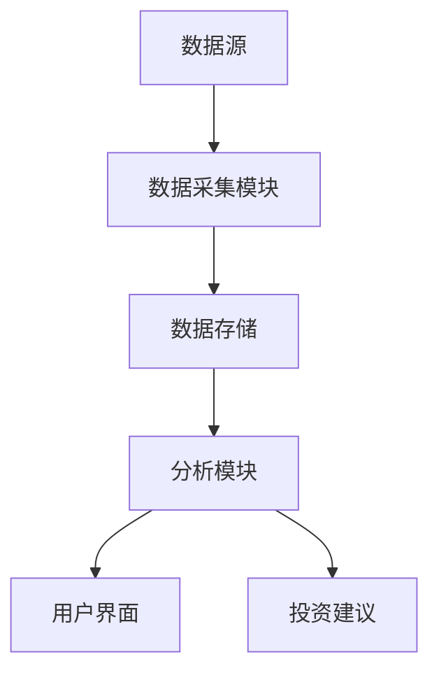

                 


# 詹姆斯·蒙蒂尔的行为金融学与价值投资

> 关键词：行为金融学、价值投资、詹姆斯·蒙蒂尔、投资策略、心理偏差

> 摘要：本文深入探讨了詹姆斯·蒙蒂尔在行为金融学与价值投资领域的贡献，分析了行为偏差对投资决策的影响，结合数学模型和系统架构，展示了如何将行为金融学理论应用于实际投资策略中，提供了详细的项目实战案例和最佳实践建议。

---

## 第一部分: 行为金融学与价值投资概述

### 第1章: 背景介绍

#### 1.1 传统金融学的局限性
传统金融学基于理性假设，认为市场是有效的，投资者行为是理性的。然而，2008年的金融危机暴露了这些假设的缺陷，特别是在市场下跌时，投资者的恐慌情绪往往导致非理性决策，传统模型无法解释这些现象。

#### 1.2 行为金融学的起源与发展
行为金融学起源于心理学与经济学的交叉研究，强调投资者心理因素对市场的影响。学者如丹尼尔·卡尼曼的研究为行为金融学奠定了基础，其前景理论揭示了人们在面对收益和损失时的决策差异。

#### 1.3 价值投资的核心理念
价值投资由本杰明·格雷厄姆提出，强调寻找市场低估的股票，注重安全边际和长期持有。詹姆斯·蒙蒂尔继承并发展了这一理念，结合行为金融学，提出了更具心理维度的投资策略。

---

### 第2章: 行为偏差与投资决策

#### 2.1 认知偏差的影响
认知偏差如确认偏差和锚定效应导致投资者过度自信或忽视反面信息，影响其投资决策。例如，投资者可能过分关注近期的市场表现，忽视长期趋势。

#### 2.2 情绪偏差的作用
情绪波动如贪婪和恐惧影响市场定价，导致市场的非理性波动。行为金融学强调情绪指标在投资中的重要性，如VIX指数用于衡量市场恐慌程度。

#### 2.3 社会性偏差的分析
从众心理和羊群效应在市场中普遍存在，投资者倾向于跟随大众决策，特别是在市场波动剧烈时，这种行为加剧了市场的波动性。

---

### 第3章: 行为金融学与数学模型

#### 3.1 前景理论的应用
前景理论将损失和收益的权重分开，损失厌恶导致投资者对损失的敏感度高于收益。这一理论可以用数学模型表示，如：
$$
V = \sum_{i} w_i u(x_i)
$$
其中，\(w_i\)是权重，\(u(x_i)\)是效用函数。

#### 3.2 行为资产定价模型
行为CAPM考虑了投资者情绪和认知偏差，模型如下：
$$
E(R_i) = R_f + \beta_i (E(R_m) - R_f) + \alpha_i
$$
其中，\(\alpha_i\)是情绪因子，反映了投资者情绪对预期收益的影响。

---

### 第4章: 价值投资的数学模型

#### 4.1 安全边际的计算
安全边际通过比较内在价值和市场价格确定，公式为：
$$
安全边际 = (内在价值 - 市场价格) / 市场价格
$$

#### 4.2 股票估值方法
使用市盈率和市净率进行估值，公式分别为：
$$
市盈率 = 股价 / 每股收益
$$
$$
市净率 = 股价 / 每股净资产
$$

---

### 第5章: 系统分析与架构设计

#### 5.1 系统架构
系统包括数据采集、分析模块和用户界面，架构图如下：



#### 5.2 接口设计
系统接口包括数据接口和用户接口，数据接口接收市场数据，用户接口展示分析结果。

---

### 第6章: 项目实战

#### 6.1 Python代码实现
代码示例用于计算市盈率：

```python
import pandas as pd

# 加载数据
data = pd.read_csv('stocks.csv')

# 计算市盈率
data['市盈率'] = data['股价'] / data['每股收益']

# 输出结果
print(data.head())
```

#### 6.2 投资组合管理
构建投资组合管理系统，包括数据获取、分析和优化模块，代码示例如下：

```python
import numpy as np
from scipy.optimize import minimize

# 定义优化函数
def optimize_portfolio(weights, returns, risk_free_rate):
    portfolio_return = np.dot(weights, returns)
    portfolio_risk = np.sqrt(np.dot(weights.T, np.dot(returns.cov(), weights)))
    return -portfolio_return + risk_free_rate * portfolio_risk

# 最优化权重
weights = minimize(optimize_portfolio, ..., method='SLSQP')
```

---

## 第七章: 总结与展望

### 7.1 小结
行为金融学与价值投资的结合提供了更全面的投资视角，考虑了心理因素对市场的影响，帮助投资者做出更理性的决策。

### 7.2 注意事项
投资者应结合市场环境和个人情况应用这些理论，避免过度依赖单一模型，同时注意数据质量和模型假设。

### 7.3 拓展阅读
推荐进一步阅读《行为投资学手册》和《价值投资实战》等书籍，深入了解行为金融学与价值投资的最新研究和应用。

---

通过本文的分析，读者可以系统地理解行为金融学与价值投资的核心概念，并将其应用于实际投资决策中，提升投资效果和风险管理能力。

