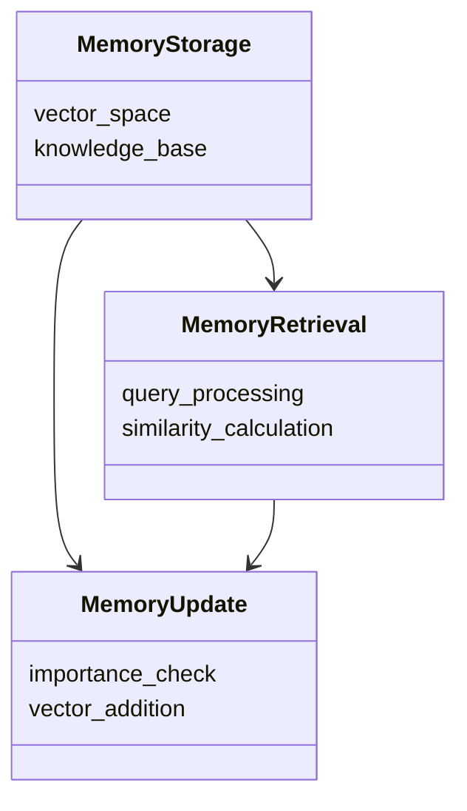
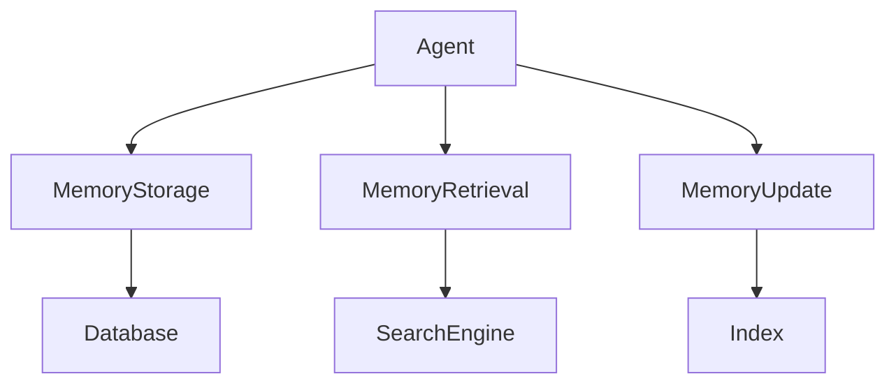
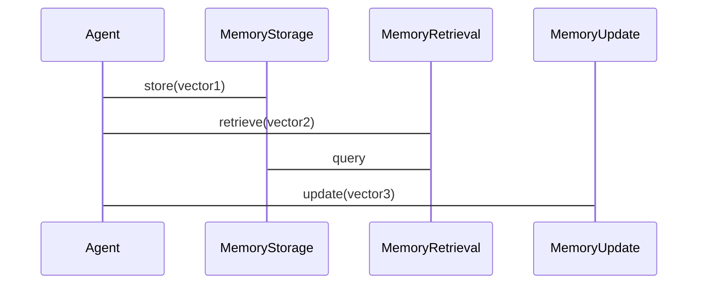

                 


# 记忆机制实现：让AI Agent具备长期记忆能力

## 关键词：
- AI Agent, 长期记忆, 记忆机制, 人工智能, 神经网络

## 摘要：
记忆机制是AI Agent实现智能决策和任务执行的关键技术。本文从记忆机制的基本概念出发，详细分析其在AI Agent中的作用，探讨其实现原理、算法模型、系统架构以及实际应用。通过对比分析和案例研究，总结记忆机制的核心要素，揭示其在提升AI Agent长期记忆能力中的重要性，并展望未来的发展方向。

---

# 第1章: 记忆机制实现的背景与问题描述

## 1.1 记忆机制的基本概念

### 1.1.1 什么是记忆机制
记忆机制是指AI系统中存储、检索和更新信息的能力，使其能够基于过去的经验和知识进行决策和推理。

### 1.1.2 AI Agent的长期记忆能力
AI Agent需要具备长期记忆能力，以便在复杂环境中持续学习和适应，处理动态变化的任务需求。

### 1.1.3 记忆机制在AI中的作用
记忆机制帮助AI Agent实现知识的积累、经验的复用和智能的提升，是实现自主决策和人机交互的核心技术。

## 1.2 问题背景与挑战

### 1.2.1 当前AI Agent的局限性
现有的AI Agent大多依赖即时数据，缺乏对过去信息的有效利用，难以处理复杂场景中的长期任务。

### 1.2.2 长期记忆能力的重要性
长期记忆能力是AI Agent实现复杂任务的关键，能够提升其决策的准确性和效率。

### 1.2.3 实现记忆机制的技术挑战
- 记忆存储的容量与效率问题
- 记忆检索的准确性和实时性
- 记忆更新的策略和机制

## 1.3 问题描述与目标

### 1.3.1 记忆机制的核心目标
构建一个高效、可靠的长期记忆系统，使AI Agent能够存储、检索和更新信息，支持其在复杂环境中的智能决策。

### 1.3.2 需要解决的关键问题
- 设计高效的记忆存储结构
- 实现准确的记忆检索机制
- 制定合理的记忆更新规则

### 1.3.3 记忆机制的边界与外延
记忆机制的边界在于存储和检索信息的范围，外延则涉及与其他AI技术（如学习、推理）的结合。

## 1.4 核心概念与联系

### 1.4.1 记忆机制的原理
记忆机制通过存储、检索和更新信息，帮助AI Agent实现对过去经验的复用和知识的积累。

### 1.4.2 记忆机制的核心要素
- **记忆存储模块**：负责信息的存储和管理
- **记忆检索模块**：根据需求检索相关信息
- **记忆更新模块**：根据新信息更新存储内容

### 1.4.3 记忆机制与AI Agent的关系
记忆机制是AI Agent实现智能决策和任务执行的基础，使其能够基于历史信息做出更明智的选择。

## 1.5 本章小结

---

# 第2章: 记忆机制的原理与实现

## 2.1 记忆机制的原理

### 2.1.1 记忆存储的结构
记忆存储可以采用向量空间模型，将信息表示为向量形式，便于检索和计算相似性。

### 2.1.2 记忆检索的机制
基于内容的检索、基于位置的检索和混合检索是常见的记忆检索方法。

### 2.1.3 记忆更新的规则
记忆更新需要根据新信息的重要性进行排序和筛选，确保存储内容的有效性和相关性。

## 2.2 记忆机制的核心要素

### 2.2.1 记忆存储模块
记忆存储模块负责将信息编码为向量，并存储在数据库或知识图谱中。

### 2.2.2 记忆检索模块
检索模块通过计算向量相似度或关键词匹配，找到最相关的存储内容。

### 2.2.3 记忆更新模块
更新模块根据新信息的重要性进行排序，动态调整存储内容，确保记忆的准确性和高效性。

## 2.3 记忆机制与AI Agent的关系

### 2.3.1 AI Agent的记忆需求
AI Agent需要记忆任务相关的知识和经验，以支持长期决策和任务执行。

### 2.3.2 记忆机制对AI Agent的提升
记忆机制帮助AI Agent实现知识复用和经验积累，提升其在复杂环境中的智能水平。

### 2.3.3 记忆机制与其他技术的结合
记忆机制可以与强化学习、自然语言处理等技术结合，进一步提升AI Agent的能力。

## 2.4 记忆机制的对比分析

### 2.4.1 显式记忆与隐式记忆的对比
- **显式记忆**：基于明确存储的信息，如数据库中的记录。
- **隐式记忆**：基于经验的模式识别，如无监督学习中的记忆。

### 2.4.2 短期记忆与长期记忆的对比
- **短期记忆**：临时存储当前任务相关的低层次信息。
- **长期记忆**：长期存储高层次的知识和经验。

### 2.4.3 不同记忆机制的优缺点
- **基于向量的存储**：高效检索，但可能缺乏语义理解。
- **基于图的知识图谱**：语义丰富，但存储和检索效率较低。

## 2.5 本章小结

---

# 第3章: 记忆机制的算法原理

## 3.1 记忆存储的算法实现

### 3.1.1 记忆存储的结构设计
记忆存储可以采用向量数据库，如使用 annoy 库实现近似最近邻检索。

### 3.1.2 记忆存储的数学模型
记忆存储可以表示为向量空间中的点，检索过程是计算向量之间的相似度。

### 3.1.3 记忆存储的实现代码
```python
import numpy as np
from annoy import AnnoyIndex

# 初始化向量索引
index = AnnoyIndex(100, 'angular')
index.add_item(1, np.random.randn(100))
index.build(100)
```

### 3.1.4 向量空间模型的优缺点
- 优点：检索速度快，支持高维数据。
- 缺点：缺乏语义理解，可能需要额外的特征工程。

## 3.2 记忆检索的算法实现

### 3.2.1 基于内容的检索
通过计算向量相似度，找到最相关的存储内容。

### 3.2.2 基于关键词的检索
通过预处理文本信息，提取关键词进行匹配。

### 3.2.3 混合检索
结合内容相似度和关键词匹配，提升检索准确率。

### 3.2.4 检索算法的实现代码
```python
def retrieve_memory(query_vector, index):
    # 计算相似度
    similarities = index.get_nns_by_vector(query_vector, 5)
    return similarities
```

## 3.3 记忆更新的算法实现

### 3.3.1 基于重要性的排序
根据新信息的重要性，动态调整存储内容的优先级。

### 3.3.2 基于遗忘曲线的更新
根据艾宾浩斯遗忘曲线，定期清理低优先级的信息。

### 3.3.3 基于强化学习的更新
通过强化学习算法，优化记忆存储和检索策略。

### 3.3.4 记忆更新的实现代码
```python
def update_memory(new_vector, importance_score, index):
    # 根据重要性排序，插入新向量
    index.add_item(index.next_id(), new_vector)
    index.build(100)
```

## 3.4 数学模型与公式

### 3.4.1 向量相似度计算公式
$$ \text{similarity} = \frac{\vec{a} \cdot \vec{b}}{|\vec{a}| \cdot |\vec{b}|} $$

### 3.4.2 基于概率的检索模型
$$ P(\text{检索正确}) = \sum_{i=1}^{n} P(\text{选择第i项}) \cdot P(\text{正确}) $$

## 3.5 本章小结

---

# 第4章: 系统分析与架构设计

## 4.1 问题场景介绍
本章以一个智能客服系统为例，介绍记忆机制在其中的应用。

## 4.2 系统功能设计

### 4.2.1 领域模型设计


### 4.2.2 系统架构设计


## 4.3 系统接口设计

### 4.3.1 核心接口定义
- `store(vector, metadata)`
- `retrieve(query)`
- `update(vector, metadata)`

### 4.3.2 交互序列图


## 4.4 本章小结

---

# 第5章: 项目实战

## 5.1 环境安装

### 5.1.1 安装Python与依赖库
```bash
pip install numpy annoy
```

## 5.2 核心代码实现

### 5.2.1 记忆存储实现
```python
import numpy as np
from annoy import AnnoyIndex

class MemoryStorage:
    def __init__(self, dimension):
        self.index = AnnoyIndex(dimension, 'angular')
        self.id = 1

    def store(self, vector):
        self.index.add_item(self.id, vector)
        self.id += 1

    def retrieve(self, query_vector, top_k=5):
        return self.index.get_nns_by_vector(query_vector, top_k)
```

### 5.2.2 记忆检索实现
```python
class MemoryRetrieval:
    def __init__(self, storage):
        self.storage = storage

    def retrieve(self, query_vector, top_k=5):
        return self.storage.retrieve(query_vector, top_k)
```

### 5.2.3 记忆更新实现
```python
class MemoryUpdate:
    def __init__(self, storage):
        self.storage = storage

    def update(self, vector, metadata):
        self.storage.store(vector)
```

## 5.3 代码解读与分析

### 5.3.1 代码功能解读
- `MemoryStorage` 类实现了向量存储和检索功能。
- `MemoryRetrieval` 类封装了检索逻辑，提供统一接口。
- `MemoryUpdate` 类负责根据新信息更新存储内容。

## 5.4 实际案例分析

### 5.4.1 案例场景
以智能客服系统为例，展示记忆机制在处理客户咨询中的应用。

### 5.4.2 代码实现与分析
展示如何通过上述代码实现客户咨询记录的存储、检索和更新。

## 5.5 本章小结

---

# 第6章: 总结与展望

## 6.1 总结
记忆机制是AI Agent实现长期记忆能力的关键技术，通过存储、检索和更新信息，帮助其在复杂环境中做出智能决策。

## 6.2 未来展望
- 更高效的存储结构
- 更智能的检索算法
- 更合理的记忆更新策略
- 记忆机制与其他AI技术的深度融合

## 6.3 本章小结

---

# 附录: 参考文献

- 引用的相关论文、书籍和技术文档。

---

通过以上章节的详细阐述，我们可以全面了解记忆机制的实现原理、算法模型、系统架构以及实际应用，为AI Agent的长期记忆能力提供理论和技术支持。

