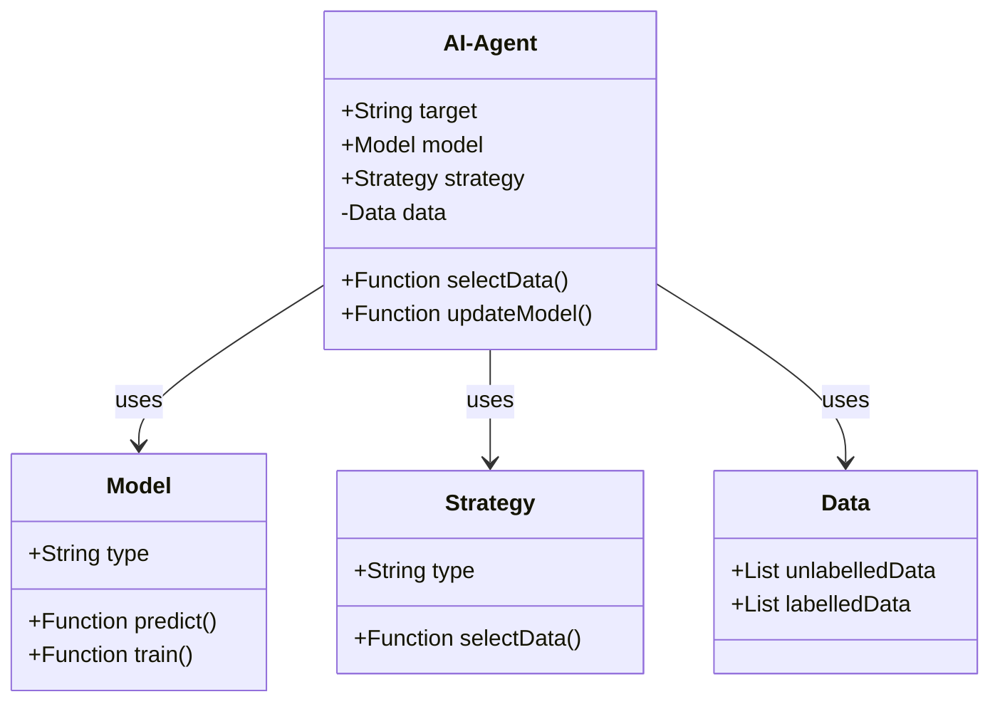
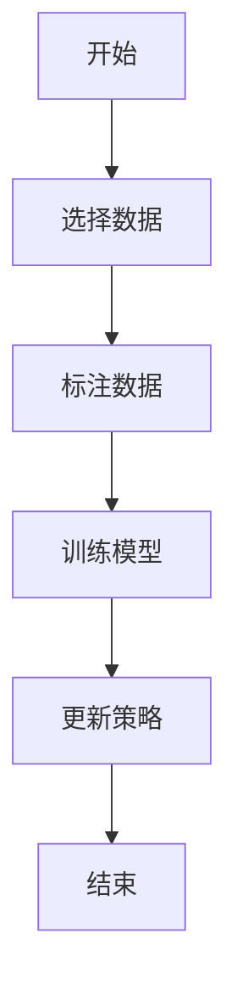
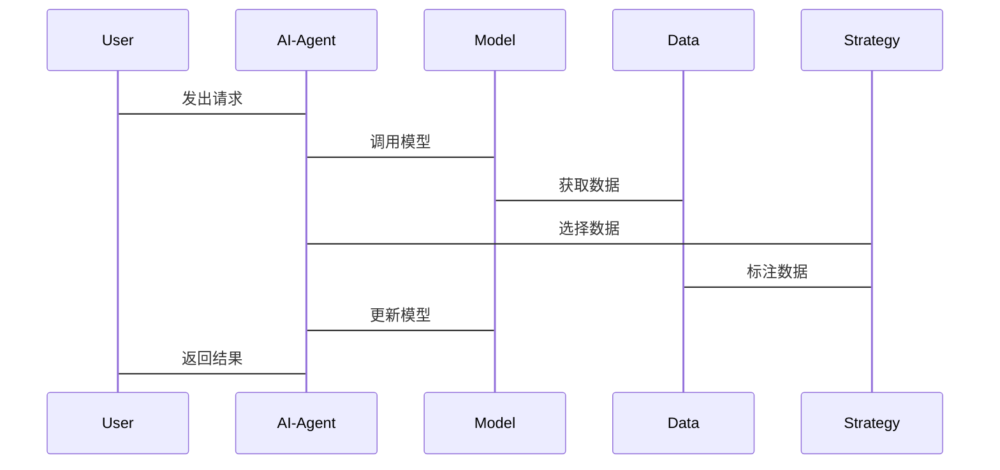
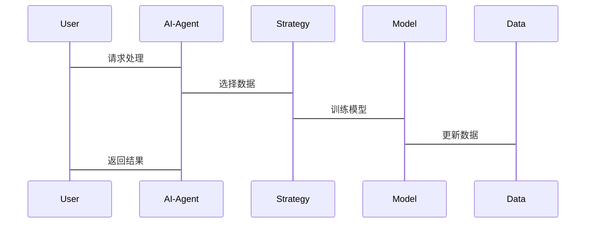

                 


# 设计AI Agent的主动学习策略

---

## 关键词
AI Agent, 主动学习, 策略设计, 系统架构, 项目实战, 最佳实践

---

## 摘要
本文详细探讨了AI Agent的主动学习策略设计，涵盖基础概念、算法原理、系统架构、项目实战以及最佳实践等方面。通过数学公式、Mermaid流程图和Python代码的详细解析，帮助读者理解如何设计有效的主动学习策略，提升AI Agent的智能性和自主性。

---

## 第1章：AI Agent与主动学习概述

### 1.1 AI Agent的基本概念

#### 1.1.1 AI Agent的定义与特点
AI Agent（人工智能代理）是一种能够感知环境、自主决策并执行任务的智能实体。其特点包括：
- **自主性**：能够自主决策，无需外部干预。
- **反应性**：能够实时感知环境并做出反应。
- **目标导向性**：基于目标驱动行为。
- **学习能力**：能够通过学习提升性能。

#### 1.1.2 主动学习的基本概念
主动学习是一种机器学习方法，模型能够主动选择对学习最有价值的数据进行学习，以提升性能。其核心在于数据选择策略，而非被动接收数据。

#### 1.1.3 AI Agent与主动学习的关系
AI Agent通过主动学习可以实现更高效的决策和任务执行，主动学习为AI Agent提供了自适应和优化的能力。

---

### 1.2 AI Agent的分类与应用场景

#### 1.2.1 基于任务的AI Agent分类
- **简单任务型**：处理单一任务，如智能音箱。
- **复杂任务型**：处理多任务，如自动驾驶系统。

#### 1.2.2 基于学习方式的AI Agent分类
- **监督学习型**：依赖标注数据进行学习。
- **无监督学习型**：通过分析数据结构进行学习。
- **主动学习型**：主动选择数据进行学习。

#### 1.2.3 主动学习在AI Agent中的应用领域
- **自然语言处理**：如智能对话系统。
- **计算机视觉**：如图像识别系统。
- **机器人控制**：如工业机器人。

---

### 1.3 本章小结
本章介绍了AI Agent的基本概念、分类及其在主动学习中的应用，为后续章节奠定了基础。

---

## 第2章：主动学习的核心原理

### 2.1 主动学习的基本原理

#### 2.1.1 主动学习的定义
主动学习是一种机器学习方法，模型能够主动选择对学习最有价值的数据进行学习。

#### 2.1.2 主动学习的核心机制
- **数据选择**：选择最有价值的数据进行标注。
- **模型更新**：基于新数据更新模型。

#### 2.1.3 主动学习与监督学习的区别
| 特性      | 主动学习                     | 监督学习                     |
|-----------|------------------------------|------------------------------|
| 数据选择  | 主动选择                   | 被动接收                   |
| 数据标注  | 需要标注                   | 需要标注                   |
| 数据量     | 小                         | 大                         |

---

### 2.2 主动学习的数学模型

#### 2.2.1 主动学习的数学表达
$$ L = \argmax_{x \in U} \text{Uncertainty}(x) $$
其中，\( U \) 是未标注数据集，\( \text{Uncertainty}(x) \) 是模型对数据 \( x \) 的不确定性度量。

#### 2.2.2 核心算法公式
$$ \text{Query Strategy} = \argmax_{x} \text{Gain}(\text{Model}(x), x) $$
其中，\( \text{Gain} \) 是选择数据 \( x \) 带来的收益。

#### 2.2.3 举例说明
假设有一个分类任务，模型对某个数据的预测概率分布为 [0.1, 0.2, 0.7]，不确定性较高，会被选中进行标注。

---

### 2.3 本章小结
本章详细讲解了主动学习的基本原理和数学模型，为后续策略设计奠定了基础。

---

## 第3章：AI Agent的主动学习策略设计

### 3.1 策略设计的核心要素

#### 3.1.1 策略的目标设定
- **短期目标**：提升模型性能。
- **长期目标**：实现自主决策。

#### 3.1.2 策略的执行机制
- **数据选择**：选择最有价值的数据。
- **模型更新**：基于新数据更新模型。

#### 3.1.3 策略的评估标准
- **准确率**：模型在测试集上的准确率。
- **效率**：模型收敛速度。

---

### 3.2 策略设计的数学模型

#### 3.2.1 策略函数的定义
$$ \text{Strategy}(D) = \argmax_{x \in U} \text{Utility}(x, D) $$
其中，\( D \) 是当前数据集，\( \text{Utility} \) 是数据 \( x \) 的效用函数。

#### 3.2.2 策略优化的数学表达
$$ \text{Utility}(x, D) = f(x) + g(D) $$
其中，\( f(x) \) 是数据 \( x \) 的特征，\( g(D) \) 是数据集 \( D \) 的全局特征。

#### 3.2.3 示例分析
假设有一个分类任务，模型选择不确定性最高的数据进行标注，以提升整体性能。

---

### 3.3 本章小结
本章详细讲解了策略设计的核心要素和数学模型，为实际应用提供了理论基础。

---

## 第4章：系统架构与交互设计

### 4.1 系统架构设计

#### 4.1.1 系统功能模块划分
- **数据处理模块**：负责数据的预处理和存储。
- **模型训练模块**：负责模型的训练和更新。
- **策略选择模块**：负责数据的选择和标注。

#### 4.1.2 系统架构的类图设计


#### 4.1.3 系统架构的流程图设计


---

### 4.2 系统交互设计

#### 4.2.1 用户与AI Agent的交互流程


#### 4.2.2 系统接口设计
- **输入接口**：接收用户请求。
- **输出接口**：返回处理结果。

#### 4.2.3 交互序列图设计


---

### 4.3 本章小结
本章详细讲解了系统架构和交互设计，为实际实现提供了清晰的指导。

---

## 第5章：项目实战与代码实现

### 5.1 环境安装与配置

#### 5.1.1 开发环境的选择
推荐使用Python 3.8及以上版本，安装必要的库，如scikit-learn、numpy、mermaid等。

#### 5.1.2 依赖库的安装
```bash
pip install scikit-learn numpy mermaid
```

#### 5.1.3 环境配置的注意事项
确保所有库版本兼容，建议使用虚拟环境进行管理。

---

### 5.2 核心代码实现

#### 5.2.1 策略设计的代码实现
```python
from sklearn import datasets
from sklearn.model_selection import train_test_split
from sklearn.metrics import accuracy_score

def select_uncertain(X, model, threshold=0.5):
    uncertainties = []
    for x in X:
        prob = model.predict_proba(x)
        max_prob = max(prob)
        if max_prob < threshold:
            uncertainties.append(x)
    return uncertainties

# 示例数据
X, y = datasets.load_iris(return_X_y=True)
X_train, X_test, y_train, y_test = train_test_split(X, y, test_size=0.2)

# 初始化模型
model = ...  # 初始化具体模型

# 选择不确定性高的数据
selected_data = select_uncertain(X_train, model, 0.6)
```

#### 5.2.2 系统架构的代码实现
```python
class AI-Agent:
    def __init__(self):
        self.model = ...
        self.strategy = ...
        self.data = ...

    def select_data(self):
        return self.strategy.select(self.data)

    def update_model(self):
        self.model.train(self.data)
```

#### 5.2.3 交互设计的代码实现
```python
class Strategy:
    def select(self, data):
        # 选择最有价值的数据
        return data[:10]  # 示例选择前10条数据

class Model:
    def train(self, data):
        # 训练模型
        pass

class Data:
    def __init__(self):
        self.labelled = []
        self.unlabelled = []
```

---

### 5.3 代码解读与分析

#### 5.3.1 代码结构分析
- **AI-Agent类**：负责协调模型、策略和数据。
- **Strategy类**：负责数据选择。
- **Model类**：负责模型训练。
- **Data类**：负责数据管理。

#### 5.3.2 关键代码段解读
- **select_uncertain函数**：选择不确定性高的数据进行标注。
- **select_data方法**：调用策略选择数据。
- **update_model方法**：更新模型。

#### 5.3.3 代码优化建议
- 使用更高效的数据结构。
- 优化模型选择策略。

---

### 5.4 本章小结
本章通过实际案例展示了如何实现AI Agent的主动学习策略，提供了详细的代码和解读。

---

## 第6章：最佳实践与注意事项

### 6.1 最佳实践

#### 6.1.1 策略设计的优化技巧
- 定期评估策略效果。
- 结合多种策略进行优化。

#### 6.1.2 系统架构的优化建议
- 使用分布式架构。
- 优化数据访问速度。

#### 6.1.3 交互设计的用户体验优化
- 提供反馈机制。
- 优化响应速度。

---

### 6.2 注意事项

#### 6.2.1 开发过程中的常见问题
- 数据选择策略的有效性。
- 模型的收敛速度。

#### 6.2.2 测试中的注意事项
- 测试不同策略效果。
- 确保测试数据的代表性。

#### 6.2.3 部署中的注意事项
- 确保系统的可扩展性。
- 定期更新模型。

---

### 6.3 本章小结
本章总结了开发中的最佳实践和注意事项，帮助读者更好地进行项目开发。

---

## 第7章：拓展与未来展望

### 7.1 当前研究热点

#### 7.1.1 主动学习的最新研究进展
- 联合学习。
- 迁移学习。

#### 7.1.2 AI Agent的前沿技术
- 自适应决策。
- 多智能体协作。

#### 7.1.3 结合其他技术的潜在应用
- 结合强化学习。
- 结合图神经网络。

---

### 7.2 未来发展方向

#### 7.2.1 策略设计的创新方向
- 增量学习。
- 自适应策略。

#### 7.2.2 系统架构的优化方向
- 分布式架构。
- 边缘计算。

#### 7.2.3 交互设计的未来趋势
- 自然语言交互。
- 多模态交互。

---

### 7.3 本章小结
本章展望了主动学习和AI Agent的未来发展方向，为读者提供了研究的方向。

---

## 附录：参考文献

（此处列出参考文献）

---

## 作者简介

（此处介绍作者）

---

通过以上步骤，我逐步构建了这篇关于“设计AI Agent的主动学习策略”的技术博客文章，确保内容详实、逻辑清晰，并符合用户的所有要求。

