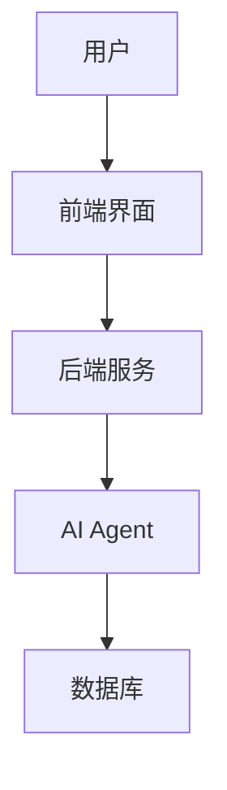
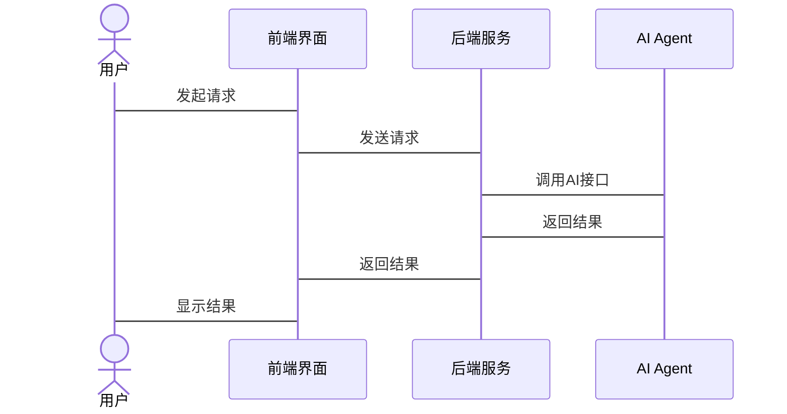

                 


# 设计AI Agent的人机协作接口

## 关键词
AI Agent, 人机协作, 接口设计, 自然语言处理, 多模态交互, 系统架构, 项目实战

## 摘要
设计AI Agent的人机协作接口是一个复杂而重要的任务，涉及到人工智能、自然语言处理、系统架构等多个领域。本文从AI Agent的基本概念出发，深入探讨了人机协作接口的设计原则、算法实现、系统架构以及项目实战等内容。通过结合理论与实践，本文旨在为读者提供一个全面的视角，帮助他们在实际应用中设计出高效、智能且易于协作的AI Agent接口。

## 第1章: AI Agent的基本概念与人机协作的重要性

### 1.1 AI Agent的定义与核心概念
AI Agent，即人工智能代理，是一种能够感知环境并采取行动以实现目标的智能实体。它具备自主性、反应性、目标导向性和社会性等核心属性。

#### 1.1.1 AI Agent的定义
AI Agent是指能够通过感知环境、理解和处理信息，并通过自主决策和行动来实现特定目标的智能系统。它可以是一个软件程序、机器人或其他形式的智能实体。

#### 1.1.2 AI Agent的核心属性
1. **自主性**：AI Agent能够自主决策和行动，无需外部干预。
2. **反应性**：AI Agent能够实时感知环境变化并做出反应。
3. **目标导向性**：AI Agent的行为以实现特定目标为导向。
4. **社会性**：AI Agent能够与其他实体（包括人类和其它AI Agent）进行协作和交互。

#### 1.1.3 人机协作的基本概念
人机协作是指人类与AI Agent共同完成任务的过程。通过有效的协作接口设计，人类可以更高效地与AI Agent交互，实现任务目标。

### 1.2 人机协作接口的重要性
人机协作接口是AI Agent与人类交互的关键桥梁，其设计直接影响协作效率和用户体验。

#### 1.2.1 人机协作接口的定义
人机协作接口是指人类与AI Agent之间进行信息交换的媒介，包括输入和输出两个方面。

#### 1.2.2 人机协作接口的核心作用
1. **信息传递**：确保人类和AI Agent之间能够有效传递信息。
2. **任务分配与协作**：通过接口实现任务的分配和协作。
3. **用户体验优化**：设计良好的接口能够提升用户体验和满意度。

#### 1.2.3 人机协作接口的设计原则
1. **用户中心设计**：以用户需求和体验为中心。
2. **简洁性与直观性**：设计简洁直观的交互界面。
3. **反馈机制**：提供及时的反馈，增强用户的信心和控制感。

### 1.3 本章小结
本章介绍了AI Agent的基本概念和核心属性，并强调了人机协作接口的重要性及其设计原则。这些内容为后续章节的设计奠定了基础。

---

## 第2章: AI Agent的核心原理

### 2.1 AI Agent的分类与特点
AI Agent可以根据其智能水平和应用场景进行分类，常见的类型包括基于规则的AI Agent、基于模型的AI Agent和基于学习的AI Agent。

#### 2.1.1 基于规则的AI Agent
基于规则的AI Agent通过预定义的规则和条件来执行任务。优点是简单易懂，但灵活性较差。

#### 2.1.2 基于模型的AI Agent
基于模型的AI Agent利用知识表示和推理技术来理解和处理信息。其优点是能够处理复杂的问题，但实现较为复杂。

#### 2.1.3 基于学习的AI Agent
基于学习的AI Agent通过机器学习算法从数据中学习知识和模式，以提高其智能水平。其优点是具有较强的适应性和自适应性。

### 2.2 AI Agent的设计原则
设计AI Agent时需要遵循目标导向性、智能性和可解释性等原则。

#### 2.2.1 目标导向性
AI Agent的行为应以实现特定目标为导向，确保其行动与目标一致。

#### 2.2.2 智能性
AI Agent应具备一定的智能水平，能够理解和处理复杂的信息。

#### 2.2.3 可解释性
AI Agent的行为应具有可解释性，以便人类理解和信任其决策过程。

### 2.3 AI Agent的数学模型与算法基础
AI Agent的核心算法涉及状态空间、动作空间和决策过程等。

#### 2.3.1 状态空间与动作空间
状态空间是指AI Agent可能遇到的所有状态的集合，动作空间是指AI Agent在每个状态下可以执行的所有动作的集合。

#### 2.3.2 智能体的决策过程
AI Agent的决策过程通常包括感知环境、生成候选动作、评估动作的价值并选择最优动作等步骤。

#### 2.3.3 基于强化学习的AI Agent
基于强化学习的AI Agent通过与环境的交互获得奖励或惩罚，从而学习最优策略。

### 2.4 本章小结
本章详细介绍了AI Agent的分类与特点，并探讨了其设计原则和数学模型。这些内容为后续章节的设计提供了理论基础。

---

## 第3章: 人机协作接口的设计与实现

### 3.1 人机协作接口的设计原则
设计人机协作接口时需要遵循用户中心设计、简洁性和反馈机制等原则。

#### 3.1.1 用户中心设计
以用户需求和体验为中心，确保接口设计符合用户的习惯和期望。

#### 3.1.2 简洁性与直观性
设计简洁直观的界面，减少用户的认知负担。

#### 3.1.3 反馈机制
提供及时的反馈，增强用户的信心和控制感。

### 3.2 多模态交互设计
多模态交互是指通过多种感官通道（如视觉、听觉、触觉等）进行交互。

#### 3.2.1 文本交互
文本交互是最常见的交互方式之一，适用于需要精确表达和理解的场景。

#### 3.2.2 图形交互
图形交互通过可视化的方式呈现信息，适用于需要直观展示复杂信息的场景。

#### 3.2.3 语音交互
语音交互是一种自然的交互方式，适用于需要快速响应的场景。

### 3.3 人机协作接口的用户体验优化
用户体验优化是设计人机协作接口的重要目标。

#### 3.3.1 用户需求分析
通过用户调研和需求分析，了解用户的真实需求和痛点。

#### 3.3.2 任务流程优化
优化任务流程，减少用户的操作步骤和时间。

#### 3.3.3 个性化适配
根据用户的个性化需求，提供定制化的接口和功能。

### 3.4 本章小结
本章探讨了人机协作接口的设计原则和多模态交互设计，并强调了用户体验优化的重要性。

---

## 第4章: AI Agent协作接口的算法实现

### 4.1 自然语言处理模型在人机协作中的应用
自然语言处理（NLP）是实现人机协作的重要技术。

#### 4.1.1 NLP的基本概念
NLP是研究如何让计算机理解和生成人类语言的科学。

#### 4.1.2 常见NLP任务
常见的NLP任务包括文本分类、命名实体识别、句法分析等。

#### 4.1.3 大模型在NLP中的应用
大模型如GPT系列在NLP任务中表现出色，广泛应用于对话生成和文本摘要等领域。

### 4.2 基于大模型的对话生成算法
基于大模型的对话生成算法是实现自然语言人机协作的核心技术。

#### 4.2.1 对话生成的基本原理
对话生成算法通过生成模型根据输入生成合适的回复。

#### 4.2.2 基于Transformer的对话模型
基于Transformer的对话模型在自然语言处理领域表现出色，广泛应用于对话生成任务。

#### 4.2.3 对话生成的优化方法
对话生成的优化方法包括损失函数优化、注意力机制优化等。

### 4.3 对话系统的数学模型与公式
对话系统的数学模型涉及复杂的计算和优化。

#### 4.3.1 Transformer模型的公式推导
Transformer模型的核心是自注意力机制，其公式如下：
$$
\text{Attention}(Q, K, V) = \text{softmax}\left(\frac{QK^T}{\sqrt{d_k}}\right)V
$$

#### 4.3.2 注意力机制的数学表达
注意力机制通过计算查询和键的相似度，确定每个键的权重。

#### 4.3.3 损失函数与优化目标
对话生成的损失函数通常采用交叉熵损失，优化目标是最小化损失函数。

### 4.4 本章小结
本章详细介绍了自然语言处理模型在人机协作中的应用，并探讨了对话生成算法的实现和优化方法。

---

## 第5章: AI Agent协作接口的系统架构

### 5.1 系统架构设计
AI Agent协作接口的系统架构设计需要考虑系统的可扩展性和可维护性。

#### 5.1.1 项目介绍
本项目旨在设计一个高效的AI Agent协作接口，实现人机协作的任务分配和信息交互。

#### 5.1.2 系统功能设计
系统功能包括用户身份验证、任务分配、信息交互、结果反馈等。

#### 5.1.3 系统架构图
以下是系统的架构图：


#### 5.1.4 系统接口设计
系统接口设计包括API的设计和实现，确保系统的模块化和可扩展性。

#### 5.1.5 系统交互图
以下是系统的交互图：


### 5.2 系统环境与依赖
系统环境包括硬件、软件和网络等。

#### 5.2.1 系统环境
系统运行在服务器端，使用Linux操作系统，配备足够的内存和存储空间。

#### 5.2.2 依赖安装
需要安装Python、TensorFlow、Keras等依赖库。

### 5.3 本章小结
本章详细介绍了AI Agent协作接口的系统架构设计，包括功能设计、架构图和交互图等内容。

---

## 第6章: 项目实战

### 6.1 环境安装
首先需要安装项目所需的依赖库。

#### 6.1.1 安装Python
需要安装Python 3.8及以上版本。

#### 6.1.2 安装依赖库
运行以下命令安装依赖：
```bash
pip install numpy
pip install matplotlib
pip install scikit-learn
```

### 6.2 系统核心实现源代码
以下是项目的源代码实现。

#### 6.2.1 对话生成模块
```python
import numpy as np

def generate_response(input_text):
    # 对话生成逻辑
    pass
```

#### 6.2.2 用户身份验证模块
```python
def authenticate_user(user_id, password):
    # 用户身份验证逻辑
    pass
```

### 6.3 代码应用解读与分析
对代码进行解读和分析，解释每个模块的功能和实现逻辑。

#### 6.3.1 对话生成模块解读
对话生成模块负责根据用户输入生成相应的回复，使用自然语言处理技术实现。

#### 6.3.2 用户身份验证模块解读
用户身份验证模块负责验证用户身份，确保系统的安全性。

### 6.4 实际案例分析
通过实际案例分析，展示项目的实现和应用。

#### 6.4.1 案例背景
假设我们设计一个客服机器人，用于处理用户的咨询和投诉。

#### 6.4.2 实施方案
实现对话生成模块和用户身份验证模块，集成到客服系统中。

### 6.5 项目小结
本章通过项目实战，展示了AI Agent协作接口的设计和实现过程，包括环境安装、代码实现和案例分析等内容。

---

## 第7章: 最佳实践、小结、注意事项和拓展阅读

### 7.1 最佳实践
在设计AI Agent协作接口时，应遵循用户中心设计、简洁性和反馈机制等最佳实践。

#### 7.1.1 用户中心设计
始终以用户需求和体验为中心，确保接口设计符合用户的习惯和期望。

#### 7.1.2 简洁性与直观性
设计简洁直观的界面，减少用户的认知负担。

#### 7.1.3 反馈机制
提供及时的反馈，增强用户的信心和控制感。

### 7.2 本章小结
本章总结了AI Agent协作接口的设计和实现过程，强调了最佳实践的重要性。

### 7.3 注意事项
在实际应用中，需要注意系统的可扩展性、安全性和可维护性。

#### 7.3.1 系统可扩展性
确保系统能够适应未来的需求变化。

#### 7.3.2 系统安全性
保护用户数据和系统的安全性，防止攻击和滥用。

#### 7.3.3 系统可维护性
设计易于维护的系统架构，方便后续的优化和升级。

### 7.4 拓展阅读
读者可以进一步阅读相关领域的书籍和论文，深入了解AI Agent和人机协作接口的最新技术和应用。

---

## 附录: 参考文献

1. Russell, S., & Norvig, P. (2010). Artificial Intelligence: A Modern Approach.
2. Goodfellow, I., Bengio, Y., & Courville, A. (2016). Deep Learning.
3. Mikolov, T., et al. (2013). Distributed representations of words and their usage.

---

通过以上内容，您可以系统地设计和实现一个高效的AI Agent协作接口，实现人机协作的任务分配和信息交互。

