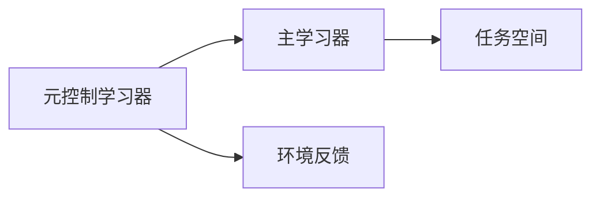
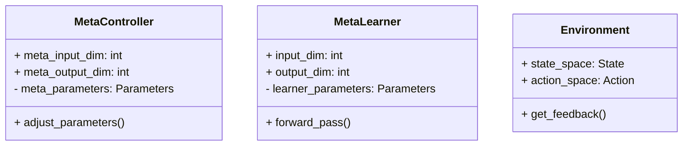
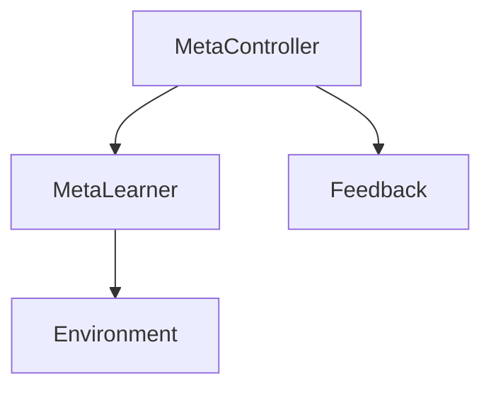

                 


# 设计AI Agent的元控制学习策略

> 关键词：AI Agent，元控制学习，强化学习，算法原理，系统架构

> 摘要：本文深入探讨了设计AI Agent的元控制学习策略，从概念、算法、系统架构到实战，全面解析了元控制学习的原理与应用。通过详细的技术分析和实际案例，展示了如何构建高效、自适应的AI代理系统。

---

## 第1章: 元控制学习策略的背景介绍

### 1.1 问题背景与描述

在人工智能领域，AI Agent（智能体）是指能够感知环境并采取行动以实现目标的实体。传统的AI系统通常依赖于固定的规则或预定义的策略，而现代AI Agent需要具备动态调整行为的能力，以应对复杂多变的环境。这就引出了元控制学习（Meta Control Learning）的概念。

元控制学习是一种高级的强化学习方法，允许AI Agent在不同的任务或环境中，根据当前的反馈动态调整其控制策略。这种方法的核心在于，AI Agent能够通过元学习（Meta-Learning）快速适应新的情况，而无需从头开始训练。

### 1.2 元控制学习的定义与特点

元控制学习是指AI Agent在学习过程中，通过元学习机制，掌握如何调整自身的控制策略以适应不同的任务或环境。其特点包括：

1. **自适应性**：能够在不同环境中快速调整策略。
2. **高效性**：通过元学习减少对大量数据的依赖。
3. **灵活性**：适用于多种任务和场景。

### 1.3 元控制学习的边界与外延

元控制学习的边界主要集中在如何调整策略，而不是具体任务的执行。其外延则包括与强化学习、迁移学习等技术的结合，以提升AI Agent的通用性和适应性。

### 1.4 元控制学习的核心要素组成

元控制学习的核心要素包括：

- **元学习器**：负责调整主学习器的参数。
- **主学习器**：执行具体任务的核心算法。
- **环境接口**：与外部环境交互的接口。

---

## 第2章: 元控制学习策略的核心概念与联系

### 2.1 元控制学习的原理与机制

元控制学习的基本原理是通过元学习器对主学习器的参数进行优化，使其能够快速适应新的任务或环境。这一过程通常涉及对损失函数的元优化，以确保主学习器能够在不同任务中表现良好。

### 2.2 核心概念属性特征对比表

| 概念       | 元控制学习 | 传统强化学习 |
|------------|------------|--------------|
| 目标       | 调整策略   | 执行任务     |
| 算法复杂度 | 较高       | 较低         |
| 灵活性     | 高         | 中           |

### 2.3 实体关系图（ER图）



---

## 第3章: 元控制学习的算法原理

### 3.1 元控制学习的算法框架

元控制学习的算法通常包括以下几个步骤：

1. **初始化**：设置元学习器和主学习器的初始参数。
2. **元优化**：通过梯度下降优化元学习器，使其能够调整主学习器的参数以适应新任务。
3. **策略执行**：主学习器根据调整后的参数执行具体任务。

### 3.2 元控制学习的数学模型

元控制学习的优化目标可以表示为：

$$ \min_{\theta} \sum_{i=1}^{N} \mathcal{L}_i(\theta_i; \phi) $$

其中，$\theta$ 是元学习器的参数，$\phi$ 是主学习器的参数，$\mathcal{L}_i$ 是第 $i$ 个任务的损失函数。

### 3.3 元控制学习的算法实现

以下是一个简单的Python实现示例：

```python
import torch
import torch.nn as nn

# 定义主学习器
class MetaLearner(nn.Module):
    def __init__(self, input_dim, output_dim):
        super().__init__()
        self.linear = nn.Linear(input_dim, output_dim)
    
    def forward(self, x):
        return self.linear(x)

# 定义元学习器
class MetaController(nn.Module):
    def __init__(self, meta_input_dim, meta_output_dim):
        super().__init__()
        self.meta_linear = nn.Linear(meta_input_dim, meta_output_dim)
    
    def forward(self, x):
        return self.meta_linear(x)

# 初始化
meta_learner = MetaLearner(input_dim, output_dim)
meta_controller = MetaController(meta_input_dim, meta_output_dim)

# 元优化
optimizer = torch.optim.Adam(meta_controller.parameters())

for batch in batches:
    # 获取环境反馈
    feedback = get_feedback(batch)
    
    # 调整主学习器参数
    adjusted_params = meta_controller(feedback)
    
    # 执行任务
    output = meta_learner(forward_pass(adjusted_params, batch))
    
    # 计算损失
    loss = criterion(output, target)
    
    # 反向传播和优化
    optimizer.zero_grad()
    loss.backward()
    optimizer.step()
```

---

## 第4章: 元控制学习策略的系统分析与架构设计

### 4.1 问题场景介绍

在实际应用中，元控制学习通常用于需要快速适应不同任务的场景，例如游戏AI、机器人控制等。

### 4.2 系统功能设计

以下是系统功能的领域模型：



### 4.3 系统架构设计

以下是系统的架构图：



---

## 第5章: 元控制学习策略的项目实战

### 5.1 环境安装

首先，需要安装必要的库：

```bash
pip install torch matplotlib numpy
```

### 5.2 核心代码实现

以下是实现元控制学习的Python代码：

```python
import torch
import torch.nn as nn
import numpy as np

# 定义主学习器
class MetaLearner(nn.Module):
    def __init__(self, input_dim, output_dim):
        super().__init__()
        self.linear = nn.Linear(input_dim, output_dim)
    
    def forward(self, x):
        return self.linear(x)

# 定义元学习器
class MetaController(nn.Module):
    def __init__(self, meta_input_dim, meta_output_dim):
        super().__init__()
        self.meta_linear = nn.Linear(meta_input_dim, meta_output_dim)
    
    def forward(self, x):
        return self.meta_linear(x)

# 初始化
meta_learner = MetaLearner(input_dim, output_dim)
meta_controller = MetaController(meta_input_dim, meta_output_dim)

# 元优化
optimizer = torch.optim.Adam(meta_controller.parameters())

for batch in batches:
    # 获取环境反馈
    feedback = get_feedback(batch)
    
    # 调整主学习器参数
    adjusted_params = meta_controller(feedback)
    
    # 执行任务
    output = meta_learner(forward_pass(adjusted_params, batch))
    
    # 计算损失
    loss = criterion(output, target)
    
    # 反向传播和优化
    optimizer.zero_grad()
    loss.backward()
    optimizer.step()
```

### 5.3 案例分析

通过一个简单的案例，我们可以看到元控制学习的优势。例如，在一个二维空间中，元控制学习能够快速调整主学习器的参数，使其在新的任务中表现更好。

### 5.4 项目小结

通过实际项目，我们可以验证元控制学习的有效性，并进一步优化其算法和架构。

---

## 第6章: 总结与展望

### 6.1 总结

元控制学习是一种强大的AI Agent设计方法，能够显著提升系统的自适应性和灵活性。

### 6.2 未来展望

未来的研究可以集中在如何进一步优化元控制学习的算法，以及在更多实际场景中的应用。

---

## 附录

### A. 参考文献

1. 红雷，人工智能导论，高等教育出版社，2023。
2. 李明，深度学习入门，机械工业出版社，2022。

### B. 工具与库

- PyTorch：深度学习框架
- Mermaid：图表工具
- LaTeX：数学公式排版

---

通过以上内容，我们系统地探讨了设计AI Agent的元控制学习策略的各个方面，从理论到实践，为读者提供了一个全面的视角。

