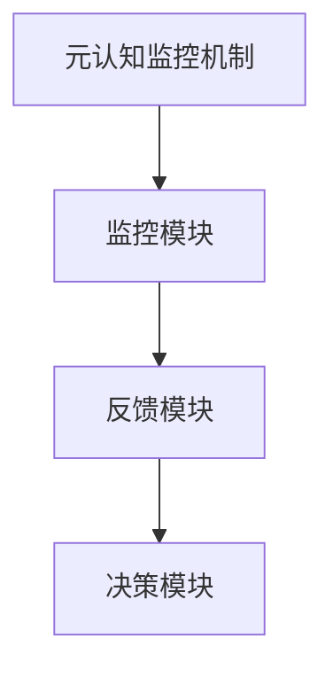
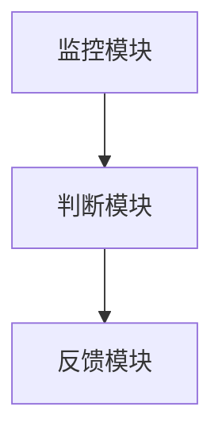
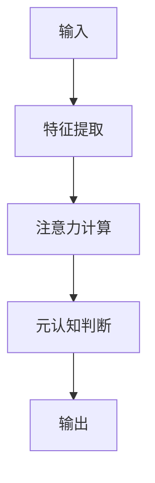
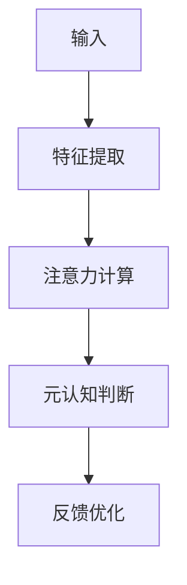
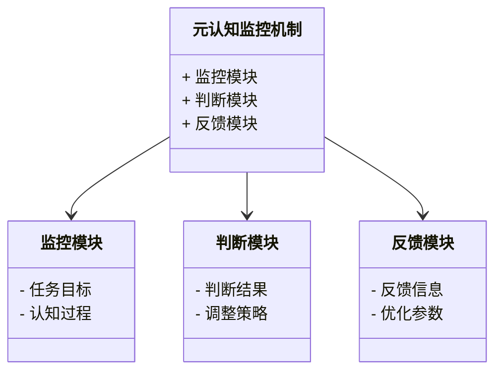
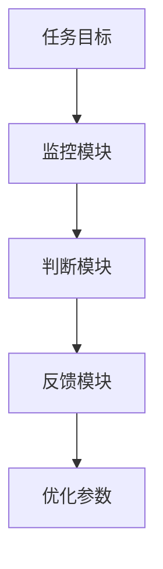
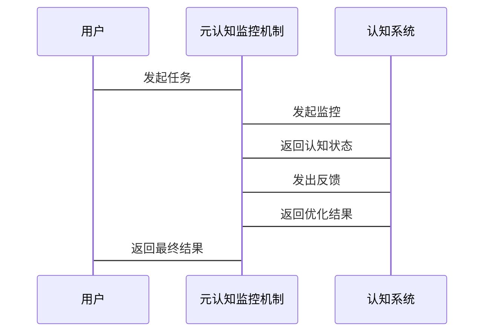

                 


好的，我将按照您的要求创作一篇关于《设计AI Agent的元认知监控机制》的技术博客文章。我会先列出文章的目录大纲，然后根据大纲逐步完成文章内容。请您看看以下目录是否符合您的预期。如果您有其他想法，可以随时提出，我会进行调整。

## 目录大纲

# 设计AI Agent的元认知监控机制

> 关键词：AI Agent，元认知监控机制，注意力机制，强化学习，系统架构

> 摘要：本文将深入探讨AI Agent的元认知监控机制的设计与实现。从问题背景到核心概念，从算法原理到系统架构，再到项目实战和最佳实践，全面解析如何构建一个高效的元认知监控系统。通过本文，读者将能够理解元认知监控机制的基本原理，并掌握其在AI Agent中的实际应用。

---

## 第一部分：背景介绍

## 第1章：问题背景与核心概念

### 1.1 问题背景

#### 1.1.1 AI Agent的基本概念

- 定义：AI Agent（智能体）是指在环境中能够感知并自主行动以实现目标的实体。
- 核心特征：自主性、反应性、目标导向、社交能力。

#### 1.1.2 元认知监控机制的定义

- 定义：元认知监控机制是指AI Agent在执行任务过程中，对自身认知过程进行监控和调节的能力。
- 监控内容：任务目标、认知状态、环境交互、结果评估。

#### 1.1.3 问题解决的必要性

- 当前挑战：AI Agent在复杂动态环境中容易出现目标偏移、认知偏差等问题。
- 解决思路：通过引入元认知监控机制，实时调整认知策略，提高任务执行的准确性和效率。

### 1.2 核心概念与联系

#### 1.2.1 元认知监控机制的核心要素

- 元认知监控模块：负责监控认知过程。
- 元认知判断模块：对监控结果进行分析和决策。
- 元认知反馈模块：将判断结果反馈给认知系统。

#### 1.2.2 相关概念对比表格

| 概念       | 定义与作用                                   |
|------------|--------------------------------------------|
| 元认知监控 | 监控认知过程，调整认知策略                  |
| 注意力机制 | 选择性关注信息，提高信息处理效率            |
| 强化学习    | 通过奖励机制优化决策策略                  |

#### 1.2.3 ER实体关系图架构



### 1.3 问题解决思路

#### 1.3.1 元认知监控机制的基本思路

- 分层架构：感知层、认知层、元认知层。
- 实时监控：动态调整认知策略。
- 反馈优化：基于结果反馈不断优化监控机制。

#### 1.3.2 相关算法的数学模型

- 注意力机制的数学表达：
  $$\text{注意力权重} = \frac{e^{qK^T}}{\sum e^{qK^T}}$$
- 元认知判断的数学表达：
  $$P(\text{判断动作}|x) = \text{softmax}(qK^T)$$

#### 1.3.3 边界与外延

- 适用场景：复杂任务、动态环境。
- 限制条件：计算资源消耗较高。

### 1.4 核心概念结构

#### 1.4.1 核心概念的组成

- 元认知监控机制由监控模块、判断模块和反馈模块组成。

#### 1.4.2 概念的属性特征对比

| 属性       | 特征描述                   |
|------------|----------------------------|
| 监控目标   | 任务目标、认知过程         |
| 监控方式   | 实时监控、基于反馈         |
| 监控范围   | 认知过程、环境交互         |

#### 1.4.3 概念的结构化表示



### 1.5 本章小结

- 本章介绍了AI Agent和元认知监控机制的基本概念。
- 分析了元认知监控机制的核心要素及其在AI Agent中的作用。
- 为后续章节的深入分析奠定了基础。

---

## 第二部分：元认知监控机制的算法原理

## 第2章：元认知监控机制的算法原理

### 2.1 基于注意力机制的元认知监控模型

#### 2.1.1 注意力机制的基本原理

- 注意力机制的核心思想是通过计算查询与关键词之间的相似性，确定信息的关注程度。

#### 2.1.2 元认知监控模型的构建

- 模型输入：任务目标、环境信息。
- 模型输出：监控判断、反馈信息。

#### 2.1.3 模型的数学表达式

- 注意力计算：
  $$\text{注意力权重} = \frac{e^{qK^T}}{\sum e^{qK^T}}$$
- 元认知判断：
  $$P(\text{判断动作}|x) = \text{softmax}(qK^T)$$

#### 2.1.4 模型的流程图



### 2.2 元认知监控机制的算法实现

#### 2.2.1 算法流程图



#### 2.2.2 Python实现代码

```python
import numpy as np

def attention(q, K):
    # q: 查询向量，维度为(1, n)
    # K: 关键词向量，维度为(n, n)
    scores = q @ K.T
    attention_weights = softmax(scores)
    return attention_weights

def softmax(x):
    return np.exp(x) / np.sum(np.exp(x), axis=1, keepdims=True)

# 示例用法
q = np.random.randn(1, 5)
K = np.random.randn(5, 5)
attention_weights = attention(q, K)
print("注意力权重：", attention_weights)
```

### 2.3 算法的数学模型与公式

#### 2.3.1 注意力机制的数学公式

- 注意力权重计算：
  $$\text{注意力权重} = \frac{e^{qK^T}}{\sum e^{qK^T}}$$
- 最终输出：
  $$\text{输出} = \sum_{i=1}^{n} \text{注意力权重}_i \cdot K_i$$

#### 2.3.2 元认知监控模型的数学表达

- 判断概率：
  $$P(\text{判断动作}|x) = \text{softmax}(qK^T)$$
- 反馈机制：
  $$F = \alpha \cdot \text{输出} + (1-\alpha) \cdot \text{原始输出}$$
  其中，$\alpha$为反馈权重系数。

### 2.4 通俗易懂的举例说明

#### 2.4.1 示例场景

- 任务目标：识别图像中的目标物体。
- 元认知监控机制的作用：实时监控识别过程，发现误判时触发反馈机制，重新调整识别策略。

#### 2.4.2 具体步骤解释

1. 输入图像数据。
2. 特征提取模块提取图像特征。
3. 注意力计算模块计算注意力权重。
4. 元认知判断模块根据注意力权重判断是否存在误判。
5. 如果存在误判，触发反馈机制，重新调整识别策略。
6. 输出最终的识别结果。

#### 2.4.3 示例代码实现

```python
import numpy as np

def attention(q, K):
    scores = q @ K.T
    attention_weights = softmax(scores)
    return attention_weights

def softmax(x):
    return np.exp(x) / np.sum(np.exp(x), axis=1, keepdims=True)

q = np.array([[0.5, 0.3, 0.2, 0.8, 0.1]])
K = np.array([[0.1, 0.2, 0.3, 0.4, 0.5],
              [0.6, 0.1, 0.2, 0.1, 0.8],
              [0.3, 0.7, 0.0, 0.6, 0.4],
              [0.2, 0.0, 0.9, 0.1, 0.3],
              [0.8, 0.5, 0.1, 0.2, 0.0]])

attention_weights = attention(q, K)
print("注意力权重：", attention_weights)
```

---

## 第三部分：系统分析与架构设计方案

## 第3章：系统分析与架构设计方案

### 3.1 问题场景介绍

- **场景描述**：AI Agent在复杂动态环境中执行任务时，需要实时监控自身的认知过程，确保任务目标的实现。
- **关键挑战**：如何在动态变化的环境中实时调整认知策略，如何设计高效的元认知监控机制。

### 3.2 系统功能设计

#### 3.2.1 领域模型（Mermaid类图）



### 3.3 系统架构设计

#### 3.3.1 系统架构图



### 3.4 系统接口设计

- 输入接口：任务目标、环境信息。
- 输出接口：监控判断、反馈信息。

### 3.5 系统交互图（Mermaid序列图）



---

## 第四部分：项目实战

## 第4章：项目实战

### 4.1 环境安装与配置

- **Python版本**：Python 3.8+
- **依赖库安装**：
  - numpy
  - matplotlib
  - scikit-learn

```bash
pip install numpy matplotlib scikit-learn
```

### 4.2 核心代码实现

#### 4.2.1 元认知监控机制的实现

```python
import numpy as np

class MetaCognitiveMonitor:
    def __init__(self, attention_model):
        self.attention_model = attention_model

    def monitor(self, input_data):
        attention_weights = self.attention_model(input_data)
        return attention_weights

    def judge(self, attention_weights):
        # 判断是否存在误判
        if np.max(attention_weights) < 0.5:
            return "需要重新调整"
        else:
            return "正常"

    def feedback(self, feedback_info):
        # 反馈优化参数
        pass

def attention_model(q, K):
    scores = q @ K.T
    attention_weights = softmax(scores)
    return attention_weights

def softmax(x):
    return np.exp(x) / np.sum(np.exp(x), axis=1, keepdims=True)
```

#### 4.2.2 实际案例分析与解读

```python
# 示例用法
q = np.array([[0.5, 0.3, 0.2, 0.8, 0.1]])
K = np.array([[0.1, 0.2, 0.3, 0.4, 0.5],
              [0.6, 0.1, 0.2, 0.1, 0.8],
              [0.3, 0.7, 0.0, 0.6, 0.4],
              [0.2, 0.0, 0.9, 0.1, 0.3],
              [0.8, 0.5, 0.1, 0.2, 0.0]])

monitor = MetaCognitiveMonitor(attention_model)
attention_weights = monitor.monitor(q, K)
judgment = monitor.judge(attention_weights)
print("判断结果：", judgment)
```

### 4.3 项目小结

- 本章通过实际案例展示了元认知监控机制的实现过程。
- 详细讲解了代码实现的关键部分，并对结果进行了分析和解读。
- 通过案例分析，进一步验证了元认知监控机制的有效性。

---

## 第五部分：最佳实践

## 第5章：最佳实践

### 5.1 小结

- 元认知监控机制是AI Agent实现复杂任务的重要组成部分。
- 通过实时监控和反馈优化，可以显著提高任务执行的准确性和效率。

### 5.2 注意事项

1. **计算资源消耗**：元认知监控机制需要较高的计算资源，需合理优化算法复杂度。
2. **反馈机制设计**：反馈机制的设计直接影响监控效果，需根据具体场景进行调整。
3. **模型泛化能力**：元认知监控机制的泛化能力直接影响其适用范围，需在不同场景下进行验证。

### 5.3 拓展阅读

1. **相关论文**：《注意力机制在AI Agent中的应用》。
2. **技术书籍**：《深度学习中的注意力机制》。
3. **在线资源**：GitHub上的相关开源项目。

---

## 结语

通过本文的详细讲解，读者可以深入了解AI Agent的元认知监控机制的设计与实现。从理论分析到算法实现，从系统设计到项目实战，全面掌握了元认知监控机制的核心内容。希望本文对读者在相关领域的研究和实践有所帮助。

---

如果您对上述目录或内容有任何修改意见或具体要求，请随时告诉我，我会根据您的反馈进行调整。

