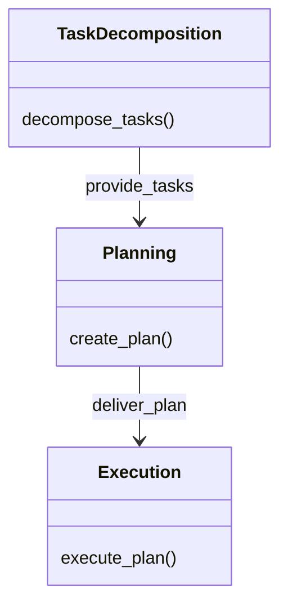
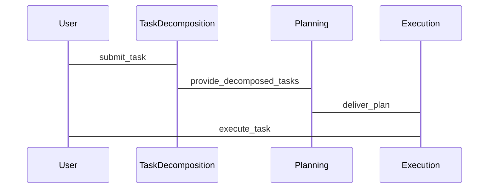

                 


# 设计AI Agent的动态任务分解与规划

## 关键词：AI Agent，动态任务分解，规划，算法，系统架构，项目实战

## 摘要：本文将详细探讨AI Agent在动态环境下的任务分解与规划问题，通过系统化的分析与设计，结合实际案例，深入讲解动态任务分解的核心算法、系统架构设计以及项目实现的最佳实践。

---

# 第1章: AI Agent的背景与概念

## 1.1 AI Agent的基本概念

### 1.1.1 什么是AI Agent
AI Agent（人工智能代理）是指能够感知环境、做出决策并执行行动的智能实体。它通过传感器获取信息，利用计算模型处理信息，并通过执行器与环境交互。

### 1.1.2 AI Agent的核心特征
AI Agent具备以下核心特征：
1. **自主性**：能够在没有外部干预的情况下独立运作。
2. **反应性**：能够实时感知环境并做出反应。
3. **目标导向**：基于目标驱动行为。
4. **学习能力**：能够通过经验优化性能。

### 1.1.3 AI Agent的分类与应用场景
AI Agent可以根据智能水平分为：
1. **反应式AI Agent**：基于当前感知做出反应，适用于实时任务。
2. **认知式AI Agent**：具备复杂推理和规划能力，适用于长期任务。
3. **混合式AI Agent**：结合反应式和认知式的特点，适用于复杂动态环境。

应用场景包括：
- 智能助手（如Siri、Alexa）
- 自动驾驶
- 智能机器人
- 游戏AI

## 1.2 动态任务分解与规划的背景

### 1.2.1 动态任务分解的定义
动态任务分解是指在动态变化的环境中，将一个复杂任务分解为多个子任务的过程。动态环境的特点是不确定性高、目标变化快。

### 1.2.2 动态任务分解的必要性
在动态环境中，任务的优先级和条件可能会变化，动态任务分解能够帮助AI Agent灵活调整任务执行顺序，确保任务目标的实现。

### 1.2.3 规划在任务分解中的作用
规划是指制定任务执行的具体步骤和策略。在动态任务分解中，规划起到桥梁作用，连接任务分解与实际执行。

## 1.3 问题背景与目标

### 1.3.1 动态任务分解的核心问题
动态任务分解的核心问题包括：
1. 如何处理环境中的不确定性。
2. 如何快速响应任务目标的变化。
3. 如何优化任务分解的效率。

### 1.3.2 规划在动态环境中的挑战
规划在动态环境中的挑战：
1. 动态变化的环境条件需要频繁调整规划。
2. 多目标冲突需要权衡优先级。

### 1.3.3 本书的研究目标
本书旨在研究和解决动态任务分解与规划中的关键问题，提供理论支持和实践指导。

## 1.4 本章小结
本章介绍了AI Agent的基本概念，动态任务分解的背景和必要性，以及规划在动态环境中的作用。

---

# 第2章: 动态任务分解与规划的核心概念

## 2.1 动态任务分解的原理

### 2.1.1 任务分解的基本原理
任务分解的基本原理是将复杂任务分解为简单子任务，通过协同完成整体目标。动态任务分解的关键在于适应环境变化。

### 2.1.2 动态环境下的任务分解特点
动态任务分解的特点包括：
1. **实时性**：快速响应环境变化。
2. **灵活性**：根据新信息调整分解方式。
3. **可扩展性**：适应任务规模的变化。

### 2.1.3 动态任务分解的数学模型
动态任务分解的数学模型可以表示为：
$$ T = \{t_1, t_2, ..., t_n\} $$
其中，$T$ 是任务集合，$t_i$ 是子任务。

## 2.2 规划的原理与方法

### 2.2.1 规划的基本概念
规划是指为实现特定目标而制定的行动步骤。在动态任务分解中，规划是连接任务分解与执行的桥梁。

### 2.2.2 动态规划的核心思想
动态规划的核心思想是将问题分解为子问题，通过递归或迭代的方式求解最优解。

### 2.2.3 基于任务分解的规划方法
基于任务分解的规划方法包括：
1. **层次化规划**：根据任务层次分解，制定分层计划。
2. **优先级规划**：根据任务优先级调整执行顺序。

## 2.3 动态任务分解与规划的关系

### 2.3.1 动态任务分解与规划的相互作用
动态任务分解为规划提供子任务，规划指导子任务的执行顺序。

### 2.3.2 动态任务分解对规划的影响
动态任务分解的灵活性直接影响规划的复杂性和效率。

### 2.3.3 规划对动态任务分解的反馈机制
规划的执行结果为动态任务分解提供反馈，帮助调整分解策略。

## 2.4 本章小结
本章分析了动态任务分解与规划的核心概念，探讨了两者之间的相互作用。

---

# 第3章: 动态任务分解与规划的算法原理

## 3.1 任务分解算法

### 3.1.1 分割式任务分解算法
分割式任务分解算法将任务分成互不重叠的子任务。

### 3.1.2 层次化任务分解算法
层次化任务分解算法将任务分解为树状结构，便于分层处理。

### 3.1.3 基于优先级的任务分解算法
基于优先级的任务分解算法根据任务优先级进行分解。

## 3.2 规划算法

### 3.2.1 基于Dijkstra算法的路径规划
使用Dijkstra算法进行路径规划，适用于静态环境。

### 3.2.2 A*算法的改进
A*算法通过启发式搜索优化路径规划。

### 3.2.3 基于动态规划的任务分解
动态规划用于优化任务分解的效率和效果。

## 3.3 算法的数学模型与代码实现

### 3.3.1 任务分解的数学模型
任务分解的数学模型可以表示为：
$$ D = \{d_1, d_2, ..., d_m\} $$
其中，$D$ 是分解后的子任务集合，$d_i$ 是子任务。

### 3.3.2 代码实现示例
以下是基于优先级的任务分解算法的Python代码示例：

```python
def dynamic_task_decomposition(tasks, priorities):
    # 根据优先级排序
    sorted_tasks = sorted(zip(tasks, priorities), key=lambda x: x[1], reverse=True)
    # 分解任务
    decomposed = []
    for task, priority in sorted_tasks:
        decomposed.append(task)
    return decomposed
```

## 3.4 本章小结
本章详细讲解了任务分解和规划的算法原理，以及其实现方式。

---

# 第4章: 系统分析与架构设计

## 4.1 项目背景介绍

### 4.1.1 项目目标
开发一个动态任务分解与规划的AI Agent系统。

### 4.1.2 项目范围
应用于智能助手、自动驾驶等领域。

## 4.2 系统功能设计

### 4.2.1 系统功能模块
系统功能模块包括：
1. **任务分解模块**：负责分解复杂任务。
2. **规划模块**：制定任务执行计划。
3. **执行模块**：执行分解后的子任务。

### 4.2.2 领域模型类图
以下是领域模型类图的Mermaid图：



## 4.3 系统架构设计

### 4.3.1 系统架构图
以下是系统架构图的Mermaid图：

```mermaid
container AI Agent {
    component TaskDecomposition {
        decompose_tasks()
    }
    component Planning {
        create_plan()
    }
    component Execution {
        execute_plan()
    }
}
```

## 4.4 系统接口设计

### 4.4.1 接口设计
系统接口包括：
1. **任务分解接口**：接收任务列表和优先级，返回分解后的子任务。
2. **规划接口**：接收子任务和环境信息，返回执行计划。
3. **执行接口**：接收执行计划，调用执行器。

## 4.5 系统交互序列图



## 4.6 本章小结
本章通过系统分析和架构设计，为动态任务分解与规划系统提供了实现框架。

---

# 第5章: 项目实战

## 5.1 环境安装

### 5.1.1 安装Python
安装Python 3.x版本。

### 5.1.2 安装依赖库
安装必要的库，如numpy、pandas、scipy。

## 5.2 核心代码实现

### 5.2.1 任务分解模块
以下是任务分解模块的代码：

```python
def decompose_task(tasks, priorities):
    # 分解任务
    return sorted(zip(tasks, priorities), key=lambda x: x[1], reverse=True)
```

### 5.2.2 规划模块
以下是规划模块的代码：

```python
def create_plan(decomposed_tasks):
    # 创建执行计划
    plan = []
    for task, priority in decomposed_tasks:
        plan.append(task)
    return plan
```

### 5.2.3 执行模块
以下是执行模块的代码：

```python
def execute_plan(plan):
    # 执行计划
    for task in plan:
        execute_task(task)
```

## 5.3 案例分析

### 5.3.1 案例背景
假设一个智能助手需要处理多个任务，包括设置提醒、发送邮件等。

### 5.3.2 案例实现
根据任务优先级进行分解和规划，优先处理高优先级任务。

### 5.3.3 案例结果
输出执行计划并执行任务。

## 5.4 本章小结
本章通过实际项目实战，展示了动态任务分解与规划的实现过程。

---

# 第6章: 最佳实践与总结

## 6.1 小结

### 6.1.1 核心内容回顾
总结动态任务分解与规划的核心概念和算法。

### 6.1.2 关键点回顾
强调动态任务分解的灵活性和规划的优化作用。

## 6.2 注意事项

### 6.2.1 系统设计中的注意事项
确保系统架构的可扩展性和可维护性。

### 6.2.2 项目实施中的注意事项
注重任务分解的优先级和规划的实时性。

## 6.3 拓展阅读

### 6.3.1 推荐书籍
推荐《人工智能：一种现代方法》。

### 6.3.2 推荐论文
推荐相关领域的最新研究论文。

## 6.4 本章小结
本章总结了本书的核心内容，提供了实施建议和拓展阅读方向。

---

# 结语

通过本书的学习，读者可以掌握动态任务分解与规划的核心原理和实践方法，为设计高效的AI Agent系统奠定基础。希望本书能为读者在AI Agent领域的研究和应用提供有价值的参考。

---

