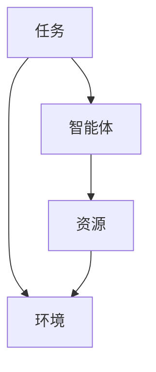
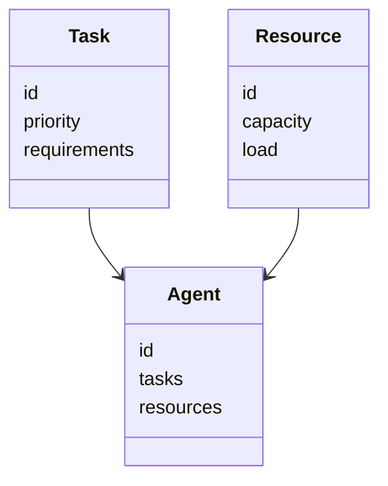
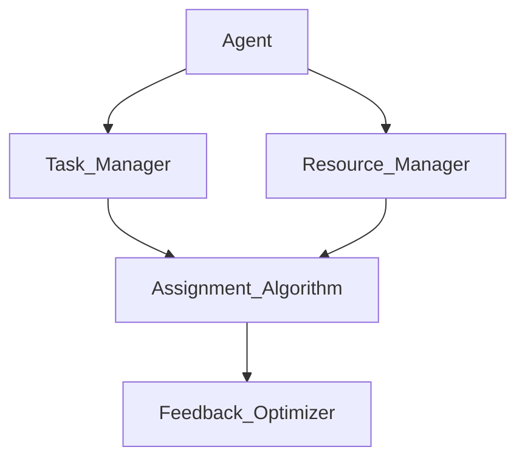
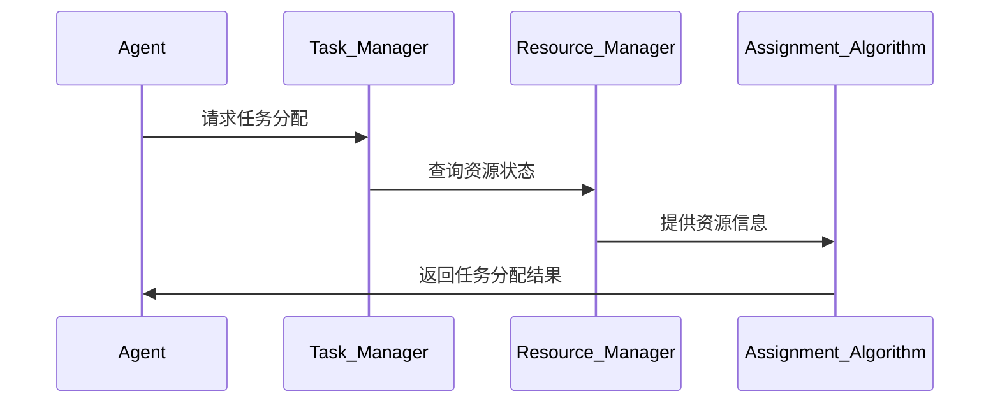
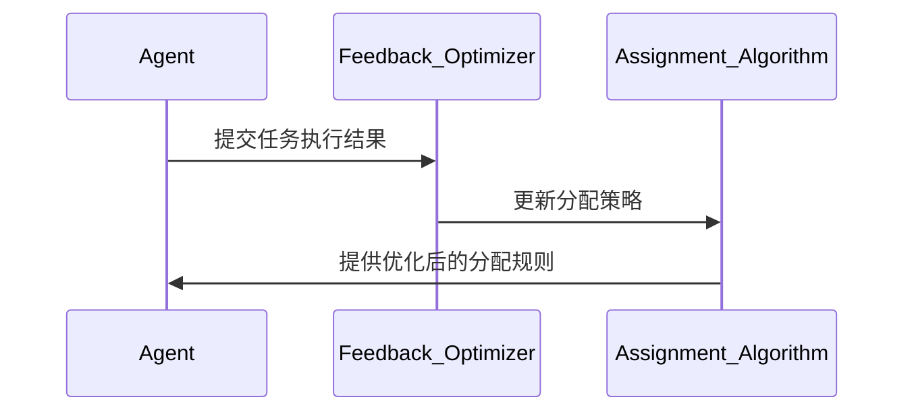

                 


# 设计AI Agent的动态任务分配策略

> 关键词：AI Agent，动态任务分配，任务分配策略，多智能体系统，分布式计算，动态环境

> 摘要：本文系统地探讨了AI Agent在动态环境中的任务分配策略设计。从问题背景到核心概念，从算法原理到系统架构，从项目实战到最佳实践，全面解析动态任务分配策略的设计思路和实现方法，结合具体案例分析和代码实现，帮助读者深入理解并掌握动态任务分配策略的核心技术和实际应用。

---

## 第一部分: AI Agent动态任务分配策略的背景与核心概念

### 第1章: 问题背景与核心概念

#### 1.1 问题背景

##### 1.1.1 动态任务分配的定义与重要性
动态任务分配（Dynamic Task Assignment）是指在动态变化的环境中，智能体根据当前环境状态和任务需求，动态调整任务分配策略的过程。其重要性体现在以下几点：
1. **环境不确定性**：动态环境中，任务需求、资源状态和环境条件可能随时变化，需要实时调整任务分配以适应变化。
2. **任务优先级**：任务可能具有不同的优先级，需要根据实时情况动态调整优先级以确保关键任务优先完成。
3. **资源约束**：任务分配需要考虑资源的可用性和分配效率，避免资源浪费或任务冲突。

##### 1.1.2 AI Agent在动态环境中的任务分配挑战
AI Agent在动态环境中面临以下任务分配挑战：
1. **动态环境中的不确定性**：环境状态和任务需求的不确定性增加了任务分配的难度。
2. **多目标冲突**：多个任务可能需要分配相同的资源或存在优先级冲突，需要协调解决。
3. **实时性要求**：动态环境通常要求任务分配具有实时性，快速响应环境变化。

##### 1.1.3 任务分配策略的核心目标与边界
任务分配策略的核心目标是：
1. **最大化资源利用率**：合理分配资源，提高系统整体效率。
2. **满足任务优先级**：确保高优先级任务优先完成。
3. **适应环境变化**：动态调整任务分配以适应环境变化。

任务分配的边界包括：
1. **资源限制**：任务分配必须在可用资源范围内进行。
2. **任务依赖性**：任务之间可能存在依赖关系，需要考虑任务顺序。
3. **时间约束**：任务分配需要在规定时间内完成。

##### 1.1.4 动态任务分配的核心要素
动态任务分配的核心要素包括：
1. **任务描述**：任务的目标、需求、优先级和约束条件。
2. **资源描述**：资源的类型、数量、状态和可用性。
3. **环境状态**：环境中的动态变化因素，如任务需求变化、资源状态变化等。
4. **分配规则**：任务分配的规则和策略，如优先级规则、负载均衡规则等。

#### 1.2 核心概念与联系

##### 1.2.1 动态任务分配策略的基本原理
动态任务分配策略的基本原理包括以下几点：
1. **实时感知**：智能体需要实时感知环境状态和任务需求的变化。
2. **动态调整**：根据实时感知的信息，动态调整任务分配策略。
3. **反馈优化**：通过反馈机制优化任务分配策略，提高系统的适应性和效率。

##### 1.2.2 动态任务分配策略的关键属性与特征对比
以下是一个对比表格，展示了动态任务分配策略的关键属性及其特征：

| 属性                | 特征                                                                 |
|---------------------|----------------------------------------------------------------------|
| **实时性**          | 高实时性，任务分配需要快速响应环境变化。                           |
| **灵活性**          | 高灵活性，能够根据环境变化动态调整任务分配。                     |
| **优先级处理**      | 支持任务优先级动态调整，确保高优先级任务优先完成。                 |
| **资源利用率**      | 优化资源分配，避免资源浪费，提高系统效率。                         |
| **适应性**          | 具备较强的环境适应性，能够应对各种动态变化。                       |

##### 1.2.3 实体关系图（ER图）与动态任务分配的关系
以下是一个简单的ER图，展示了动态任务分配中的实体及其关系：



---

## 第二部分: 动态任务分配的算法原理

### 第2章: 基于规则的动态任务分配算法

#### 2.1 基于规则的动态任务分配算法

##### 2.1.1 算法概述与工作流程
基于规则的动态任务分配算法是一种通过预定义规则进行任务分配的策略。其工作流程如下：

1. **接收任务请求**：智能体接收任务请求，提取任务需求和优先级。
2. **评估资源状态**：智能体评估当前可用资源的状态和负载。
3. **匹配规则**：根据预定义的规则，匹配任务与资源的关系。
4. **分配任务**：将任务分配给最优资源或智能体。
5. **反馈优化**：根据任务执行结果优化分配规则。

##### 2.1.2 算法实现代码
以下是一个基于规则的动态任务分配算法的Python实现示例：

```python
def dynamic_task_assignment(tasks, agents, resources):
    # 任务优先级排序
    sorted_tasks = sorted(tasks, key=lambda x: x['priority'], reverse=True)
    
    # 资源分配规则
    resource_usage = {}
    for task in sorted_tasks:
        # 寻找可用资源
        for resource in resources:
            if resource not in resource_usage or resource_usage[resource] < 0.8:
                # 分配任务到资源
                resource_usage[resource] = resource_usage.get(resource, 0) + 1
                break
    
    return resource_usage
```

##### 2.1.3 算法的数学模型与公式
基于规则的动态任务分配的数学模型可以表示为：

$$
\text{分配结果} = \argmin_{r \in R} \left( \sum_{t \in T} w_t \cdot d(r, t) \right)
$$

其中：
- \( R \) 表示可用资源集合。
- \( T \) 表示任务集合。
- \( w_t \) 表示任务 \( t \) 的权重（优先级）。
- \( d(r, t) \) 表示资源 \( r \) 与任务 \( t \) 的匹配度。

---

### 第3章: 基于优先级的动态任务分配算法

#### 3.1 基于优先级的动态任务分配算法

##### 3.1.1 算法概述与工作流程
基于优先级的动态任务分配算法是一种根据任务优先级动态调整任务分配的策略。其工作流程如下：

1. **接收任务请求**：智能体接收任务请求，提取任务优先级和需求。
2. **任务排序**：根据任务优先级对任务进行排序。
3. **资源分配**：将高优先级任务优先分配给可用资源。
4. **动态调整**：根据资源负载和环境变化动态调整任务分配。

##### 3.1.2 算法实现代码
以下是一个基于优先级的动态任务分配算法的Python实现示例：

```python
def priority_based_assignment(tasks, agents, resources):
    # 根据优先级排序任务
    sorted_tasks = sorted(tasks, key=lambda x: x['priority'], reverse=True)
    
    # 分配任务到资源
    resource_assignment = {r: [] for r in resources}
    for task in sorted_tasks:
        # 寻找可用资源
        for resource in resources:
            if len(resource_assignment[resource]) < resource['capacity']:
                resource_assignment[resource].append(task)
                break
    
    return resource_assignment
```

##### 3.1.3 算法的数学模型与公式
基于优先级的动态任务分配的数学模型可以表示为：

$$
\text{分配结果} = \argmax_{r \in R} \left( \sum_{t \in T} p_t \cdot u(r, t) \right)
$$

其中：
- \( R \) 表示可用资源集合。
- \( T \) 表示任务集合。
- \( p_t \) 表示任务 \( t \) 的优先级。
- \( u(r, t) \) 表示资源 \( r \) 分配任务 \( t \) 的效用值。

---

### 第4章: 基于学习的动态任务分配算法

#### 4.1 基于学习的动态任务分配算法

##### 4.1.1 算法概述与工作流程
基于学习的动态任务分配算法是一种通过机器学习模型动态调整任务分配的策略。其工作流程如下：

1. **数据收集**：收集历史任务分配数据和环境状态数据。
2. **模型训练**：训练机器学习模型，预测最优任务分配。
3. **动态调整**：根据实时环境变化动态调整任务分配。
4. **反馈优化**：根据任务执行结果优化模型参数。

##### 4.1.2 算法实现代码
以下是一个基于学习的动态任务分配算法的Python实现示例：

```python
import numpy as np
from sklearn.linear_model import LinearRegression

def learning_based_assignment(tasks, agents, resources):
    # 数据预处理
    X = []
    y = []
    for task in tasks:
        X.append([task['priority'], task['size']])
        y.append(task['assigned_resource'])
    
    # 训练模型
    model = LinearRegression()
    model.fit(X, y)
    
    # 动态分配任务
    new_task = {'priority': 0.9, 'size': 10}
    predicted_resource = model.predict([[new_task['priority'], new_task['size']]])[0]
    return predicted_resource
```

##### 4.1.3 算法的数学模型与公式
基于学习的动态任务分配的数学模型可以表示为：

$$
\text{分配结果} = \argmin_{r \in R} \left( \sum_{t \in T} \theta_t \cdot d(r, t) \right)
$$

其中：
- \( R \) 表示可用资源集合。
- \( T \) 表示任务集合。
- \( \theta_t \) 表示任务 \( t \) 的权重，由机器学习模型预测。
- \( d(r, t) \) 表示资源 \( r \) 与任务 \( t \) 的匹配度。

---

## 第三部分: 动态任务分配的系统分析与架构设计方案

### 第5章: 系统分析与架构设计方案

#### 5.1 问题场景介绍
动态任务分配系统需要应对以下问题场景：
1. **多智能体协作**：多个AI Agent需要协作完成任务。
2. **动态环境变化**：任务需求和环境状态随时变化。
3. **资源约束**：任务分配需要考虑资源的可用性和负载。

#### 5.2 项目介绍
动态任务分配系统是一个多智能体协作系统，旨在提高任务分配的效率和适应性。

#### 5.3 系统功能设计
系统功能设计包括以下模块：
1. **任务管理模块**：管理任务的创建、优先级和约束条件。
2. **资源管理模块**：管理资源的状态和负载。
3. **任务分配模块**：根据动态任务分配策略分配任务。
4. **反馈优化模块**：根据任务执行结果优化任务分配策略。

#### 5.4 系统架构设计
系统架构设计包括以下部分：

##### 5.4.1 领域模型


##### 5.4.2 系统架构


##### 5.4.3 系统接口设计
系统接口设计包括以下部分：
1. **任务接口**：任务创建、查询和删除。
2. **资源接口**：资源状态查询和更新。
3. **分配接口**：任务分配请求和结果反馈。

#### 5.5 系统交互设计
系统交互设计包括以下部分：

##### 5.5.1 任务分配流程


##### 5.5.2 反馈优化流程


---

## 第四部分: 动态任务分配的项目实战

### 第6章: 项目实战

#### 6.1 环境安装与配置
以下是项目实战的环境安装说明：
1. **Python 3.8+**：安装Python编程语言。
2. **Jupyter Notebook**：安装并配置Jupyter Notebook。
3. **依赖库**：安装必要的依赖库，如numpy、scikit-learn等。

#### 6.2 核心代码实现
以下是动态任务分配的核心代码实现：

##### 6.2.1 任务管理模块
```python
class TaskManager:
    def __init__(self):
        self.tasks = []
    
    def add_task(self, task):
        self.tasks.append(task)
    
    def get_tasks(self):
        return self.tasks
```

##### 6.2.2 资源管理模块
```python
class ResourceManager:
    def __init__(self):
        self.resources = []
    
    def add_resource(self, resource):
        self.resources.append(resource)
    
    def get_resources(self):
        return self.resources
```

##### 6.2.3 任务分配模块
```python
class TaskAllocator:
    def __init__(self, task_manager, resource_manager):
        self.task_manager = task_manager
        self.resource_manager = resource_manager
    
    def allocate_task(self, task):
        # 简单的基于优先级的分配策略
        tasks = self.task_manager.get_tasks()
        resources = self.resource_manager.get_resources()
        
        # 按优先级排序
        sorted_tasks = sorted(tasks, key=lambda x: x['priority'], reverse=True)
        
        # 分配任务到资源
        for task in sorted_tasks:
            for resource in resources:
                if resource['available']:
                    resource['available'] = False
                    return resource['id']
        return None
```

#### 6.3 代码解读与分析
1. **任务管理模块**：负责任务的创建和查询。
2. **资源管理模块**：负责资源的创建和查询。
3. **任务分配模块**：根据任务优先级动态分配任务到资源。

#### 6.4 实际案例分析
以下是一个实际案例分析：

##### 6.4.1 案例背景
假设我们有一个包含三个资源和五个任务的系统，任务优先级分别为0.9、0.8、0.7、0.6、0.5。

##### 6.4.2 任务分配过程
1. **任务排序**：按优先级从高到低排序。
2. **资源分配**：将高优先级任务优先分配给可用资源。

##### 6.4.3 分配结果
资源分配结果如下：
- 资源1：任务1（优先级0.9）
- 资源2：任务2（优先级0.8）
- 资源3：任务3（优先级0.7）

##### 6.4.4 分配结果分析
1. **资源利用率**：资源1、2、3分别分配了一个任务，资源利用率较高。
2. **任务优先级**：高优先级任务优先完成，符合系统设计目标。
3. **环境适应性**：动态任务分配策略能够适应环境变化，确保任务高效完成。

---

## 第五部分: 动态任务分配的最佳实践

### 第7章: 最佳实践

#### 7.1 系统性能优化
1. **负载均衡**：合理分配任务，避免资源过载。
2. **优先级调整**：动态调整任务优先级，确保关键任务优先完成。
3. **资源预留**：预留部分资源应对突发任务。

#### 7.2 算法选择与优化
1. **选择合适的算法**：根据系统需求选择基于规则、优先级或学习的动态任务分配算法。
2. **模型优化**：优化机器学习模型，提高预测准确性。
3. **规则调整**：根据系统运行情况动态调整规则，提高分配效率。

#### 7.3 系统扩展性设计
1. **模块化设计**：设计模块化的系统架构，便于扩展。
2. **分布式计算**：采用分布式计算技术，提高系统扩展性。
3. **异构资源支持**：支持多种类型资源，提高系统灵活性。

#### 7.4 系统安全与可靠性
1. **数据安全**：确保任务分配数据的安全性。
2. **故障容错**：设计容错机制，确保系统可靠性。
3. **日志记录**：记录任务分配过程中的日志，便于故障排查。

#### 7.5 小结
动态任务分配策略的设计需要综合考虑任务优先级、资源约束和环境变化，选择合适的算法和优化系统架构，确保任务分配的高效性和适应性。

---

## 第六部分: 总结与拓展阅读

### 第8章: 总结与拓展阅读

#### 8.1 总结
本文系统地探讨了AI Agent在动态环境中的任务分配策略设计。从问题背景到核心概念，从算法原理到系统架构，从项目实战到最佳实践，全面解析了动态任务分配策略的设计思路和实现方法。

#### 8.2 拓展阅读
1. **多智能体系统**：深入学习多智能体系统的理论与应用。
2. **分布式计算**：研究分布式计算技术在动态任务分配中的应用。
3. **强化学习**：探索强化学习在动态任务分配中的应用。

---

以上是《设计AI Agent的动态任务分配策略》的技术博客文章的完整目录大纲和具体内容。希望对您有所帮助！

