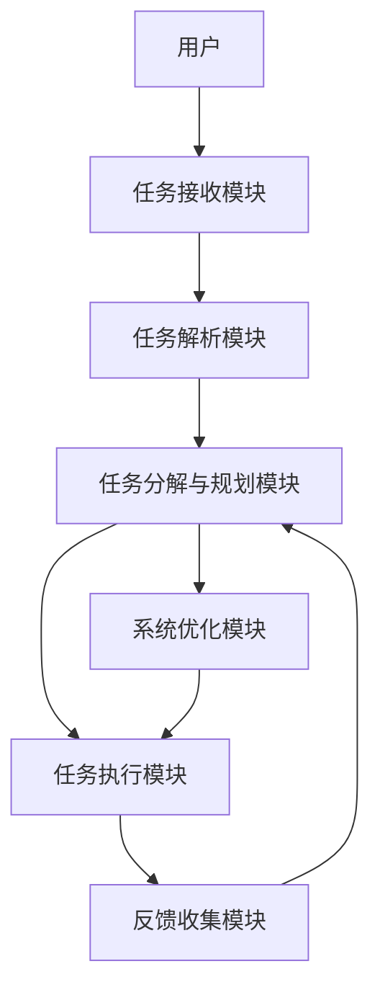
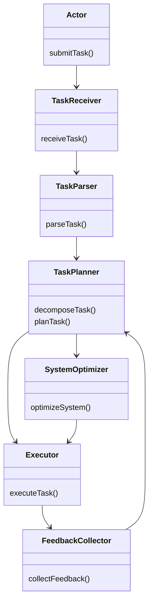

                 


# 设计AI Agent的动态任务规划与执行系统

> 关键词：AI Agent，动态任务规划，任务执行，算法实现，系统架构设计

> 摘要：本文详细探讨了设计AI Agent的动态任务规划与执行系统的各个方面。从AI Agent的基本概念和动态任务规划的重要性，到任务规划算法的实现，再到系统架构设计和实际案例分析，层层深入，为读者提供了一个全面而系统的指导。

---

# 第一部分: AI Agent的动态任务规划与执行系统概述

# 第1章: AI Agent与动态任务规划概述

## 1.1 AI Agent的基本概念

### 1.1.1 什么是AI Agent
AI Agent（人工智能代理）是指能够感知环境、自主决策并执行任务的智能实体。AI Agent可以是软件程序、机器人或其他智能系统，其核心目标是通过感知和行动来实现特定目标。

### 1.1.2 AI Agent的核心特征
- **自主性**：AI Agent能够自主决策，无需外部干预。
- **反应性**：能够实时感知环境并做出反应。
- **目标导向**：所有行动都围绕实现特定目标展开。
- **动态适应性**：能够在动态环境中调整策略和行为。

### 1.1.3 AI Agent的应用场景
- 智能助手（如Siri、Alexa）
- 自动驾驶汽车
- 智能机器人
- 游戏AI
- 企业自动化系统

## 1.2 动态任务规划的定义与特点

### 1.2.1 动态任务规划的定义
动态任务规划是指在动态、不确定或不可预测的环境中，根据实时信息调整任务优先级和执行顺序的过程。与静态任务规划不同，动态任务规划能够根据环境变化快速做出反应。

### 1.2.2 动态任务规划的核心特点
- **实时性**：能够根据最新信息快速调整任务。
- **适应性**：能够在环境变化时灵活调整策略。
- **不确定性处理**：能够应对环境中的不确定性和模糊性。

### 1.2.3 动态任务规划与静态任务规划的区别
| 特性         | 静态任务规划                     | 动态任务规划                     |
|--------------|--------------------------------|--------------------------------|
| 环境         | 静态、确定                     | 动态、不确定                     |
| 任务优先级   | 固定、不变                     | 动态调整                         |
| 响应时间     | 非实时                         | 实时                             |

## 1.3 AI Agent动态任务规划的必要性

### 1.3.1 动态环境中的任务挑战
在动态环境中，任务可能因环境变化而受到干扰。例如，在自动驾驶中，道路状况、交通信号和突发情况都会影响任务的执行。

### 1.3.2 动态任务规划在AI Agent中的作用
动态任务规划能够帮助AI Agent在动态环境中快速调整任务优先级，确保任务能够高效完成。

### 1.3.3 动态任务规划的边界与外延
动态任务规划的边界包括任务分解、优先级调整和反馈机制。其外延涉及多智能体协作、分布式系统和人机交互。

## 1.4 本章小结
本章介绍了AI Agent的基本概念和动态任务规划的核心特点，强调了动态任务规划在AI Agent中的重要性。

---

# 第二部分: AI Agent动态任务规划的核心概念与联系

# 第2章: 任务规划与执行的核心概念

## 2.1 任务规划的原理与模型

### 2.1.1 任务规划的基本原理
任务规划是AI Agent根据目标分解任务并制定执行计划的过程。它通常包括任务分解、优先级排序和计划生成三个步骤。

### 2.1.2 常见的任务规划模型
- **分层规划模型**：将任务分解为子任务，逐层规划。
- **基于约束的规划模型**：考虑任务的约束条件，如时间、资源等。

### 2.1.3 任务规划与执行的关系
任务规划是执行的基础，执行是规划的结果。两者相互依存，动态任务规划需要根据执行反馈不断调整。

## 2.2 任务分解与优先级排序

### 2.2.1 任务分解的方法
- **层次分解法**：将任务分解为子任务，形成层次结构。
- **基于约束的分解法**：根据任务的约束条件进行分解。

### 2.2.2 优先级排序的策略
- **贪心策略**：优先处理高优先级的任务。
- **动态调整策略**：根据环境变化实时调整任务优先级。

### 2.2.3 动态调整任务优先级的机制
动态调整任务优先级的机制包括基于反馈的调整和基于预测的调整。反馈调整根据执行结果进行调整，预测调整根据未来可能的变化进行调整。

## 2.3 任务执行中的反馈机制

### 2.3.1 反馈机制的基本原理
反馈机制是指在任务执行过程中，根据执行结果调整后续任务的优先级和执行顺序。

### 2.3.2 基于反馈的任务调整策略
- **局部调整策略**：根据局部反馈调整当前任务。
- **全局调整策略**：根据全局反馈调整所有任务。

### 2.3.3 反馈在动态任务规划中的作用
反馈能够帮助AI Agent及时发现执行中的问题，并根据问题调整任务优先级，确保任务能够顺利完成。

## 2.4 核心概念对比与ER实体关系图

### 2.4.1 核心概念属性对比表
| 概念         | 属性                     | 描述                                   |
|--------------|--------------------------|--------------------------------------|
| 任务         | 名称                     | 任务的名称                            |
|              | 目标                     | 任务的目标                            |
|              | 优先级                   | 任务的优先级                          |
| 计划         | 步骤                     | 任务的具体执行步骤                    |
|              | 时间                     | 任务的执行时间                        |
| 反馈         | 状态                     | 任务的执行状态                        |
|              | 结果                     | 任务的执行结果                        |

### 2.4.2 任务规划与执行的ER实体关系图
```mermaid
er
  actor: 用户
  task: 任务
  plan: 计划
  execution: 执行
  actor --> task: 提交任务
  task --> plan: 分解为计划
  plan --> execution: 转化为执行
  execution --> task: 反馈任务状态
```

## 2.5 本章小结
本章详细介绍了任务规划与执行的核心概念，包括任务分解、优先级排序和反馈机制，并通过ER实体关系图展示了各概念之间的关系。

---

# 第三部分: 动态任务规划算法原理与实现

# 第3章: 常见动态任务规划算法

## 3.1 A*算法在任务规划中的应用

### 3.1.1 A*算法的基本原理
A*算法是一种常用的路径规划算法，它结合了启发式搜索和最短路径搜索。其基本思想是通过评估节点的综合成本（g(n) + h(n)）来选择下一个扩展的节点。

### 3.1.2 A*算法在动态环境中的改进
在动态环境中，A*算法需要考虑环境的变化。一种常见的改进方法是动态评估启发函数，以适应环境的变化。

### 3.1.3 A*算法的优缺点分析
- **优点**：路径优化能力强，适合静态环境。
- **缺点**：在动态环境中，需要频繁重新规划，计算成本较高。

### 3.1.4 A*算法的数学模型
A*算法的综合成本函数可以表示为：
$$f(n) = g(n) + h(n)$$
其中，$g(n)$表示从起点到当前节点的已知成本，$h(n)$表示从当前节点到目标节点的估计成本。

### 3.1.5 A*算法的Python实现
```python
import heapq

def a_star_search(grid, start, goal):
    open_set = {start}
    came_from = {}
    g_score = {start: 0}
    f_score = {start: heuristic(start, goal)}
    
    while open_set:
        current = heapq.heappop(open_set, key=lambda x: f_score[x])
        if current == goal:
            break
        neighbors = get_neighbors(grid, current)
        for neighbor in neighbors:
            tentative_g_score = g_score[current] + 1
            if tentative_g_score < g_score.get(neighbor, float('inf')):
                came_from[neighbor] = current
                g_score[neighbor] = tentative_g_score
                f_score[neighbor] = g_score[neighbor] + heuristic(neighbor, goal)
                if neighbor not in open_set:
                    heapq.heappush(open_set, neighbor)
    return came_from, g_score
```

### 3.1.6 A*算法的优缺点分析
- **优点**：路径优化能力强，适合静态环境。
- **缺点**：在动态环境中，需要频繁重新规划，计算成本较高。

---

## 3.2 Dijkstra算法与动态任务规划

### 3.2.1 Dijkstra算法的基本原理
Dijkstra算法是一种单源最短路径算法，它通过不断更新节点的最短路径来找到最优路径。

### 3.2.2 Dijkstra算法在动态任务规划中的应用
Dijkstra算法可以用于动态任务规划中的路径规划，尤其是在任务优先级动态变化的情况下。

### 3.2.3 Dijkstra算法的优化策略
为了提高Dijkstra算法在动态环境中的性能，可以采用优先级队列和懒惰删除策略。

### 3.2.4 Dijkstra算法的Python实现
```python
import heapq

def dijkstra_search(grid, start, goal):
    open_set = {start}
    came_from = {}
    g_score = {start: 0}
    
    while open_set:
        current = heapq.heappop(open_set, key=lambda x: g_score[x])
        if current == goal:
            break
        neighbors = get_neighbors(grid, current)
        for neighbor in neighbors:
            tentative_g_score = g_score[current] + 1
            if tentative_g_score < g_score.get(neighbor, float('inf')):
                came_from[neighbor] = current
                g_score[neighbor] = tentative_g_score
                if neighbor not in open_set:
                    heapq.heappush(open_set, neighbor)
    return came_from, g_score
```

### 3.2.5 Dijkstra算法的优缺点分析
- **优点**：计算简单，适合动态环境。
- **缺点**：在复杂环境中，计算效率较低。

---

## 3.3 遗传算法在动态任务规划中的应用

### 3.3.1 遗传算法的基本原理
遗传算法是一种基于生物进化论的优化算法，它通过选择、交叉和变异操作来生成新的解。

### 3.3.2 遗传算法在动态任务规划中的实现
遗传算法可以用于动态任务规划中的任务分解和优先级排序，尤其是在任务目标动态变化的情况下。

### 3.3.3 遗传算法的优化策略
为了提高遗传算法在动态环境中的性能，可以采用自适应选择压力和动态种群大小策略。

### 3.3.4 遗传算法的Python实现
```python
def genetic_algorithm(population, fitness_func, num_generations, mutation_rate):
    for _ in range(num_generations):
        population = [select_individual(pop, fitness_func) for _ in range(len(pop))]
        population = [mutate(individual, mutation_rate) for individual in population]
    return population
```

### 3.3.5 遗传算法的优缺点分析
- **优点**：能够处理复杂问题，适应性强。
- **缺点**：计算成本高，收敛速度慢。

---

## 3.4 算法实现与对比分析

### 3.4.1 算法实现的代码示例
```python
import heapq

def a_star_search(grid, start, goal):
    open_set = {start}
    came_from = {}
    g_score = {start: 0}
    f_score = {start: heuristic(start, goal)}
    
    while open_set:
        current = heapq.heappop(open_set, key=lambda x: f_score[x])
        if current == goal:
            break
        neighbors = get_neighbors(grid, current)
        for neighbor in neighbors:
            tentative_g_score = g_score[current] + 1
            if tentative_g_score < g_score.get(neighbor, float('inf')):
                came_from[neighbor] = current
                g_score[neighbor] = tentative_g_score
                f_score[neighbor] = g_score[neighbor] + heuristic(neighbor, goal)
                if neighbor not in open_set:
                    heapq.heappush(open_set, neighbor)
    return came_from, g_score

def dijkstra_search(grid, start, goal):
    open_set = {start}
    came_from = {}
    g_score = {start: 0}
    
    while open_set:
        current = heapq.heappop(open_set, key=lambda x: g_score[x])
        if current == goal:
            break
        neighbors = get_neighbors(grid, current)
        for neighbor in neighbors:
            tentative_g_score = g_score[current] + 1
            if tentative_g_score < g_score.get(neighbor, float('inf')):
                came_from[neighbor] = current
                g_score[neighbor] = tentative_g_score
                if neighbor not in open_set:
                    heapq.heappush(open_set, neighbor)
    return came_from, g_score
```

### 3.4.2 算法性能对比分析
| 算法         | 优点                     | 缺点                     |
|--------------|--------------------------|--------------------------|
| A*           | 路径优化能力强            | 计算成本高                |
| Dijkstra     | 适合动态环境              | 计算效率较低              |
| 遗传算法      | 能够处理复杂问题          | 计算成本高，收敛速度慢    |

### 3.4.3 算法选择的策略建议
- **A*算法**：适用于静态环境的任务规划。
- **Dijkstra算法**：适用于动态环境的任务规划。
- **遗传算法**：适用于复杂环境的任务规划。

---

## 3.5 本章小结
本章详细介绍了几种常见的动态任务规划算法，包括A*算法、Dijkstra算法和遗传算法，并通过对比分析帮助读者选择合适的算法。

---

# 第四部分: 动态任务规划系统的架构与设计

# 第4章: 系统架构设计方案

## 4.1 系统功能模块划分

### 4.1.1 任务接收与解析模块
任务接收与解析模块负责接收任务请求，并将其解析为具体的任务描述。

### 4.1.2 任务分解与规划模块
任务分解与规划模块将任务分解为子任务，并制定执行计划。

### 4.1.3 任务执行与反馈模块
任务执行与反馈模块负责执行任务，并将执行结果反馈给任务分解与规划模块。

### 4.1.4 系统监控与优化模块
系统监控与优化模块负责监控系统的运行状态，并根据反馈优化任务规划策略。

## 4.2 系统架构设计图


## 4.3 系统功能设计

### 4.3.1 系统功能模块的类图


### 4.3.2 系统架构图


### 4.3.3 系统接口设计
- **任务接收接口**：`submitTask()`
- **任务解析接口**：`parseTask()`
- **任务分解与规划接口**：`decomposeTask()` 和 `planTask()`
- **任务执行接口**：`executeTask()`
- **反馈收集接口**：`collectFeedback()`
- **系统优化接口**：`optimizeSystem()`

### 4.3.4 系统交互序列图
```mermaid
sequenceDiagram
    actor ->> TaskReceiver: submitTask()
    TaskReceiver ->> TaskParser: receiveTask()
    TaskParser ->> TaskPlanner: parseTask()
    TaskPlanner ->> Executor: planTask()
    Executor ->> FeedbackCollector: executeTask()
    FeedbackCollector ->> TaskPlanner: collectFeedback()
    TaskPlanner ->> SystemOptimizer: optimizeSystem()
    SystemOptimizer ->> Executor: optimizeSystem()
```

## 4.2 本章小结
本章详细介绍了动态任务规划系统的架构设计，包括功能模块划分、类图、架构图和系统接口设计。

---

# 第五部分: 动态任务规划系统实战

# 第5章: 项目实战

## 5.1 环境安装与配置

### 5.1.1 系统环境要求
- 操作系统：Linux/Windows/MacOS
- Python版本：3.6以上
- 开发工具：PyCharm/VS Code
- 第三方库：numpy, matplotlib, heapq

### 5.1.2 安装依赖
```bash
pip install numpy matplotlib heapq
```

## 5.2 系统核心实现源代码

### 5.2.1 任务分解与规划模块
```python
import heapq

def a_star_search(grid, start, goal):
    open_set = {start}
    came_from = {}
    g_score = {start: 0}
    f_score = {start: heuristic(start, goal)}
    
    while open_set:
        current = heapq.heappop(open_set, key=lambda x: f_score[x])
        if current == goal:
            break
        neighbors = get_neighbors(grid, current)
        for neighbor in neighbors:
            tentative_g_score = g_score[current] + 1
            if tentative_g_score < g_score.get(neighbor, float('inf')):
                came_from[neighbor] = current
                g_score[neighbor] = tentative_g_score
                f_score[neighbor] = g_score[neighbor] + heuristic(neighbor, goal)
                if neighbor not in open_set:
                    heapq.heappush(open_set, neighbor)
    return came_from, g_score
```

### 5.2.2 任务执行与反馈模块
```python
def execute_task(tasks, feedback):
    for task in tasks:
        if task['priority'] > feedback['priority']:
            execute(task)
        else:
            break
```

### 5.2.3 系统优化模块
```python
def optimize_system(feedback):
    if feedback['status'] == 'success':
        return
    else:
        adjust_priorities(feedback['error'])
```

## 5.3 实际案例分析与详细解读

### 5.3.1 案例背景
假设我们有一个智能助手系统，需要处理用户的多种任务请求，如发送邮件、预订机票等。

### 5.3.2 案例分析
当用户提交多个任务时，系统需要根据任务优先级动态调整执行顺序。

### 5.3.3 代码实现与解读
```python
tasks = [
    {'name': 'send_email', 'priority': 2},
    {'name': 'book_flight', 'priority': 1},
    {'name': 'order_food', 'priority': 3}
]

feedback = {'priority': 2}

optimized_tasks = optimize_priorities(tasks, feedback)
```

## 5.4 项目总结与经验分享

### 5.4.1 项目总结
通过本项目，我们实现了AI Agent的动态任务规划与执行系统，能够根据任务优先级动态调整执行顺序，并根据反馈优化任务规划策略。

### 5.4.2 经验分享
- **模块化设计**：将系统划分为功能模块，便于维护和扩展。
- **算法选择**：根据具体场景选择合适的算法，如动态环境选择Dijkstra算法。
- **反馈机制**：及时的反馈机制能够显著提高任务执行的效率和准确性。

## 5.5 本章小结
本章通过一个实际案例展示了AI Agent的动态任务规划与执行系统的实现过程，包括环境安装、代码实现和案例分析。

---

# 第五部分: 总结与展望

## 5.1 总结
本文详细探讨了AI Agent的动态任务规划与执行系统的各个方面，从基本概念到算法实现，再到系统架构设计和实际案例分析，为读者提供了一个全面而系统的指导。

## 5.2 未来展望
随着AI技术的不断发展，动态任务规划与执行系统将变得更加智能和高效。未来的研究方向包括更智能的算法、更高效的系统架构设计以及更广泛的应用场景。

## 5.3 最佳实践 tips
- 在选择算法时，充分考虑环境的动态性和任务的复杂性。
- 在系统设计时，注重模块化和可扩展性。
- 在实现过程中，及时收集反馈并不断优化系统。

## 5.4 小结
动态任务规划与执行系统是AI Agent实现智能化的重要组成部分。通过本文的探讨，读者可以更好地理解和掌握其设计与实现的关键点。

## 5.5 注意事项
- 确保任务分解的合理性，避免任务遗漏或重复。
- 在动态环境中，及时调整任务优先级，确保任务执行的高效性。
- 定期监控系统运行状态，及时发现和解决问题。

## 5.6 拓展阅读
- 《AI Agent Design and Implementation》
- 《Dynamic Task Planning in AI》
- 《Algorithm Design for AI Systems》

---

# 结语

设计AI Agent的动态任务规划与执行系统是一项复杂而有趣的任务。通过本文的探讨，读者可以掌握其设计与实现的关键点，为未来的AI应用开发打下坚实的基础。

