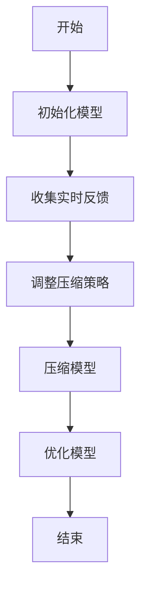

                 


# 设计AI Agent的动态模型压缩与加速

> 关键词：AI Agent，动态模型压缩，模型加速，算法优化，实时反馈

> 摘要：本文详细探讨了设计AI Agent的动态模型压缩与加速技术。首先介绍了AI Agent和动态模型压缩的基本概念，接着分析了动态模型压缩的核心原理和算法实现，随后从系统架构和项目实战的角度深入阐述了动态模型压缩的实现方法。最后总结了动态模型压缩的最佳实践和未来发展方向，为读者提供了一套完整的动态模型压缩与加速的设计思路。

---

## 第一部分：AI Agent与动态模型压缩概述

### 第1章：AI Agent的基本概念与特点

#### 1.1 AI Agent的定义
AI Agent（人工智能代理）是指能够感知环境、自主决策并采取行动以实现目标的智能实体。与传统的静态模型不同，AI Agent具备动态适应环境的能力，能够根据实时反馈调整行为策略。

#### 1.2 AI Agent的核心特点
- **自主性**：AI Agent能够独立决策，无需外部干预。
- **反应性**：能够实时感知环境变化并做出响应。
- **目标导向**：所有行为均以实现特定目标为导向。
- **学习能力**：通过经验改进自身性能。

#### 1.3 AI Agent的应用场景
- 智能助手（如Siri、Alexa）
- 自动驾驶系统
- 智能推荐系统
- 游戏AI

### 第2章：动态模型压缩的背景与意义

#### 2.1 动态模型压缩的背景
随着AI Agent应用场景的扩展，模型规模越来越大，计算资源和响应时间的限制日益显著。动态模型压缩技术应运而生，旨在在运行时根据需求动态调整模型大小，以优化性能和资源利用率。

#### 2.2 动态模型压缩的意义
- **提高效率**：通过动态调整模型复杂度，提升计算效率。
- **降低成本**：减少能源消耗和计算资源浪费。
- **增强适应性**：根据不同场景灵活调整模型规模。

---

## 第二部分：动态模型压缩的核心概念与联系

### 第3章：动态模型压缩的核心原理

#### 3.1 模型压缩的基本原理
模型压缩通过减少模型参数数量或降低参数精度，降低计算复杂度。动态模型压缩在此基础上，引入了实时反馈机制，根据当前任务需求动态调整压缩策略。

#### 3.2 动态模型压缩的独特性
- **实时性**：根据当前任务动态调整压缩策略。
- **自适应性**：能够根据不同场景自动优化模型。
- **灵活性**：支持多种压缩方法的动态组合。

#### 3.3 动态模型压缩与静态模型压缩的对比
| 对比维度 | 动态模型压缩 | 静态模型压缩 |
|----------|--------------|--------------|
| 调整时机 | 实时动态调整 | 预先固定压缩 | 
| 适应性   | 高            | 低            |
| 适用场景 | 实时任务       | 静态任务       |

### 第4章：动态模型压缩的概念结构与ER实体关系图

#### 4.1 ER实体关系图
```mermaid
erd
actor: AI Agent
model: 模型
compression: 压缩策略
feedback: 实时反馈

actor --> model: 使用
model --> compression: 应用
compression --> feedback: 根据反馈调整
```

---

## 第三部分：动态模型压缩算法原理

### 第5章：动态模型压缩算法概述

#### 5.1 动态模型压缩算法的基本流程
1. **模型初始化**：加载原始模型。
2. **实时反馈收集**：根据当前任务或环境反馈调整压缩策略。
3. **模型参数调整**：基于反馈动态调整模型参数或结构。
4. **压缩与优化**：应用压缩算法，优化模型性能。
5. **模型更新**：根据压缩结果更新模型。

### 第6章：动态模型压缩算法的数学模型

#### 6.1 压缩目标函数
$$ \text{目标函数} = \text{准确率损失} + \lambda \times \text{压缩率} $$
其中，$\lambda$为压缩惩罚系数，用于平衡准确率和压缩率。

#### 6.2 压缩策略优化
$$ \text{优化目标} = \arg \min_{\theta} \mathcal{L}(\theta) + \lambda \|\theta\|_2^2 $$

### 第7章：动态模型压缩算法的流程图



---

## 第四部分：动态模型压缩系统架构与实现

### 第8章：系统架构设计

#### 8.1 系统功能设计
- **反馈收集模块**：实时收集环境反馈。
- **压缩策略模块**：根据反馈动态调整压缩策略。
- **模型压缩模块**：应用压缩算法优化模型。

#### 8.2 系统架构图


---

## 第五部分：动态模型压缩项目实战

### 第9章：项目实战

#### 9.1 环境安装
```bash
pip install numpy torch
```

#### 9.2 核心代码实现
```python
def dynamic_compression(model, feedback):
    # 根据反馈动态调整压缩策略
    lambda_ = feedback * 0.1
    # 应用压缩算法
    compressed_model = compress(model, lambda_)
    return compressed_model
```

#### 9.3 案例分析
以图像分类任务为例，动态调整模型压缩率，验证在不同反馈下的分类准确率和计算速度。

---

## 第六部分：总结与展望

### 第10章：总结

动态模型压缩技术为AI Agent在实时场景中的应用提供了重要支持，通过动态调整模型规模，平衡了性能和资源利用率。

### 第11章：未来展望

- **自适应压缩算法**：进一步提升压缩策略的自适应性。
- **多模态压缩**：探索结合多种压缩技术的动态压缩方法。
- **边缘计算优化**：针对边缘设备优化动态压缩技术。

---

通过以上分析，我们可以看到动态模型压缩技术在AI Agent中的重要性，以及其在实际应用中的潜力。未来，随着技术的不断发展，动态模型压缩将为AI Agent带来更高效、更灵活的性能优化。

