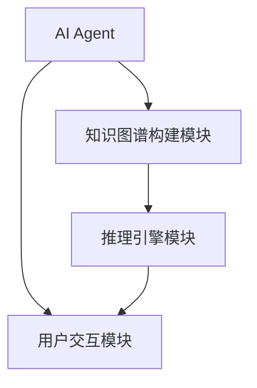
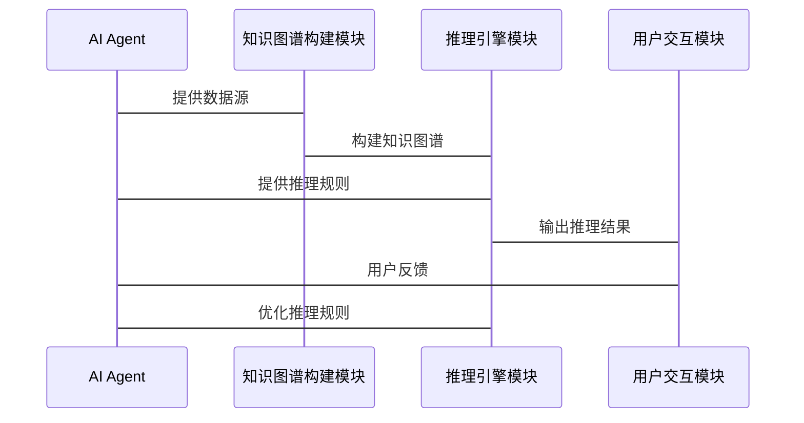

                 


---

# 设计AI Agent的动态知识图谱推理引擎

> 关键词：AI Agent，动态知识图谱，推理引擎，知识图谱构建，推理算法，系统架构

> 摘要：随着人工智能技术的快速发展，AI Agent在各个领域的应用越来越广泛。然而，传统的知识图谱推理引擎难以应对动态变化的环境。本文将详细介绍如何设计AI Agent的动态知识图谱推理引擎，涵盖动态知识图谱的构建与管理、推理引擎的设计与实现、系统架构设计、项目实战以及最佳实践等内容。通过本文，读者可以全面理解动态知识图谱推理引擎的核心原理和实现方法，为实际应用提供理论支持和技术指导。

---

## 第1章：AI Agent与知识图谱概述

### 1.1 AI Agent的基本概念
- AI Agent的定义与特点
  - 定义：AI Agent是一个能够感知环境、采取行动以实现目标的实体。
  - 特点：自主性、反应性、主动性、社会性。
- AI Agent的核心功能
  - 感知环境：通过传感器或数据源获取信息。
  - 处理信息：利用知识图谱进行推理和决策。
  - 采取行动：根据推理结果执行操作。
- AI Agent的应用场景
  - 智能客服：提供个性化的服务和建议。
  - 智能推荐：根据用户行为推荐相关内容。
  - 智能监控：实时监控并分析数据。

### 1.2 知识图谱的基本概念
- 知识图谱的定义与特点
  - 定义：知识图谱是一种以结构化形式表示知识的图数据库。
  - 特点：语义丰富、结构化、可扩展性。
- 知识图谱的表示方法
  - 实体：知识图谱中的基本单元，表示具体事物。
  - 关系：实体之间的联系，表示事物之间的关联。
  - 属性：实体的描述性信息，表示事物的特征。
- 知识图谱的应用场景
  - 智能搜索：通过知识图谱提升搜索结果的相关性。
  - 自然语言处理：利用知识图谱进行语义理解。
  - 数据分析：通过知识图谱进行数据关联和推理。

### 1.3 动态知识图谱的定义与特点
- 动态知识图谱的定义
  - 动态知识图谱是一种能够实时更新和变化的知识图谱。
  - 其特点包括实时性、动态性和自适应性。
- 动态知识图谱的构建挑战
  - 数据的实时性要求：需要快速处理和更新数据。
  - 知识的动态变化：需要处理新增、删除和修改的知识。
  - 系统的高效性要求：需要在动态变化中保持系统的高效运行。

### 1.4 推理引擎的基本原理
- 推理引擎的定义与分类
  - 定义：推理引擎是根据知识图谱中的知识进行推理和计算的工具。
  - 分类：基于规则的推理引擎、基于概率的推理引擎、基于图结构的推理引擎。
- 推理引擎的核心功能
  - 知识表示：将知识图谱中的知识转化为推理引擎可以理解的形式。
  - 推理算法：根据知识图谱中的知识进行推理和计算。
  - 推理结果：输出推理的结果，供AI Agent进行决策和行动。

---

## 第2章：动态知识图谱的构建与管理

### 2.1 知识图谱的构建过程
- 数据采集与预处理
  - 数据源：包括结构化数据、半结构化数据和非结构化数据。
  - 数据清洗：去除重复数据、填补缺失值、处理噪声数据。
  - 数据转换：将数据转换为适合知识图谱表示的形式。
- 知识抽取与表示
  - 实体识别：从文本中提取实体。
  - 关系抽取：从文本中提取实体之间的关系。
  - 属性抽取：从文本中提取实体的属性。
  - 知识表示：将抽取的知识表示为结构化的形式，如RDF或三元组。
- 知识融合与冲突处理
  - 知识融合：将多个数据源中的知识进行整合。
  - 冲突检测：检测知识融合过程中出现的冲突。
  - 冲突处理：通过协商、优先级等方式解决冲突。

### 2.2 动态知识图谱的更新机制
- 动态数据源的接入与处理
  - 数据源的接入：将新的数据源接入到知识图谱中。
  - 数据的实时处理：对实时数据进行处理，生成新的知识。
- 动态知识图谱的更新算法
  - 增量式更新：仅更新变化的部分，减少计算量。
  - 分布式更新：利用分布式系统进行并行更新，提高效率。
  - 滚动更新：定期更新知识图谱，保持知识的最新性。
- 更新后的知识图谱验证与优化
  - 知识图谱的验证：检查更新后的知识图谱是否正确。
  - 知识图谱的优化：通过优化算法提高知识图谱的性能。

### 2.3 知识图谱的存储与管理
- 知识图谱的存储技术
  - 图数据库：如Neo4j、NeoDB等，专门用于存储和查询图数据。
  - 关系型数据库：如MySQL、PostgreSQL，适合存储结构化的知识。
  - NoSQL数据库：如MongoDB、Cassandra，适合存储非结构化的知识。
- 知识图谱的查询与检索
  - SPARQL查询：一种用于查询RDF数据的查询语言。
  - 基于图结构的查询：利用图数据库的查询功能进行复杂查询。
  - 混合查询：结合多种查询方式，提高查询效率。
- 知识图谱的版本控制与管理
  - 版本控制：记录知识图谱的修改历史，方便回滚和恢复。
  - 版本管理：对不同版本的知识图谱进行管理和维护。
  - 版本同步：在分布式系统中，保持不同副本的知识图谱同步。

---

## 第3章：推理引擎的算法原理与实现

### 3.1 推理引擎的核心算法
- 基于规则的推理算法
  - 规则定义：通过预定义的规则进行推理。
  - 规则应用：将规则应用到知识图谱中，生成新的知识。
  - 规则验证：验证推理结果是否符合预期。
- 基于概率的推理算法
  - 概率计算：利用概率论进行推理，如贝叶斯推理。
  - 条件概率：计算事件发生的概率，如P(A|B)。
  - 贝叶斯网络：构建贝叶斯网络，进行概率推理。
- 基于图结构的推理算法
  - 图遍历：通过遍历图结构进行推理，如深度优先搜索、广度优先搜索。
  - 短路推理：通过图结构中的短路路径进行快速推理。
  - 路径权重：根据路径权重进行推理，如PageRank算法。

### 3.2 动态知识图谱推理的算法优化
- 动态知识图谱的实时推理需求
  - 实时性：推理引擎需要在动态变化的环境中实时推理。
  - 高效性：推理引擎需要高效处理大量数据。
  - 可扩展性：推理引擎需要能够扩展到大规模数据。
- 基于增量的推理优化方法
  - 增量推理：仅对变化的部分进行推理，减少计算量。
  - 增量更新：在知识图谱更新时，仅更新相关部分。
  - 增量验证：在推理结果变化时，仅验证变化的部分。
- 并行推理算法的设计与实现
  - 并行计算：利用多核处理器进行并行推理。
  - 分布式推理：在分布式系统中进行并行推理。
  - 并行优化：通过算法优化提高并行推理的效率。

### 3.3 推理引擎的数学模型与公式
- 基于规则的推理公式
  - 逻辑蕴含：如果A蕴含B，则B成立。
  - 规则表示：如果满足条件A，则结论B成立。
- 基于概率的推理公式
  - 条件概率公式：P(B|A) = P(A|B)P(B)/P(A)
  - 贝叶斯定理：P(B|A) = P(A|B)P(B)/P(A)
  - 贝叶斯网络：构建概率图模型，进行概率推理。
- 基于图结构的推理公式
  - 短路推理：根据图的结构，找到最短路径进行推理。
  - 路径权重：根据路径权重，计算推理结果的权重。

---

## 第4章：系统架构设计

### 4.1 系统功能设计
- 知识图谱构建模块
  - 数据采集：从多个数据源采集数据。
  - 数据处理：清洗、转换数据，提取知识。
  - 知识存储：将知识存储到知识图谱中。
- 推理引擎模块
  - 推理规则定义：定义推理规则和算法。
  - 推理执行：根据知识图谱进行推理，生成推理结果。
  - 结果验证：验证推理结果的正确性。
- 用户交互模块
  - 用户输入：接收用户的输入，如查询或命令。
  - 推理结果展示：将推理结果展示给用户。
  - 用户反馈：接收用户的反馈，优化推理过程。

### 4.2 系统架构设计
- 系统架构图（Mermaid）

- 模块间关系
  - AI Agent：负责协调各个模块的工作。
  - 知识图谱构建模块：负责知识图谱的构建和更新。
  - 推理引擎模块：负责根据知识图谱进行推理。
  - 用户交互模块：负责与用户的交互。

### 4.3 系统接口设计
- 知识图谱构建接口
  - 数据接口：接收数据源的数据。
  - 知识接口：接收知识表示的形式，如RDF或三元组。
- 推理引擎接口
  - 推理接口：接收推理规则和知识图谱，输出推理结果。
  - 结果接口：接收推理结果，进行验证和优化。
- 用户交互接口
  - 输入接口：接收用户的输入，如查询或命令。
  - 输出接口：输出推理结果，展示给用户。

### 4.4 系统交互设计
- 交互流程图（Mermaid）


---

## 第5章：项目实战

### 5.1 项目介绍
- 项目目标
  - 构建一个动态知识图谱，实时更新知识。
  - 设计一个推理引擎，能够根据动态知识图谱进行推理。
- 项目技术选型
  - 知识图谱存储：使用Neo4j图数据库。
  - 推理引擎实现：使用Python语言，结合逻辑推理库。
  - 用户交互：使用Flask框架搭建Web界面。

### 5.2 核心代码实现
- 知识图谱构建代码
```python
from neo4j import GraphDatabase
from neo4j.exceptions import ServiceUnavailable

class KnowledgeGraph:
    def __init__(self, uri, user, password):
        self.driver = GraphDatabase.driver(uri, user=user, password=password)
    
    def add_entity(self, entity_name):
        with self.driver.session() as session:
            session.run("CREATE (:Entity {name: $name})", name=entity_name)
    
    def add_relation(self, entity1, relation, entity2):
        with self.driver.session() as session:
            session.run("MATCH (a {name: $a}), (b {name: $b}) "
                        "CREATE (a)-[r:$relation]->(b)",
                        a=entity1, relation=relation, b=entity2)
```
- 推理引擎实现代码
```python
class ReasoningEngine:
    def __init__(self, knowledge_graph):
        self.knowledge_graph = knowledge_graph
    
    def infer(self, query):
        # 基于规则的推理
        if isinstance(query, str):
            result = self._rule_based_inference(query)
        # 基于概率的推理
        elif isinstance(query, dict):
            result = self._probability_inference(query)
        return result
    
    def _rule_based_inference(self, query):
        # 实现基于规则的推理逻辑
        pass
    
    def _probability_inference(self, query):
        # 实现基于概率的推理逻辑
        pass
```

### 5.3 案例分析与详细解读
- 案例分析
  - 案例1：构建一个简单的知识图谱，包含实体和关系。
  - 案例2：设计一个推理引擎，根据知识图谱进行推理。
- 代码解读
  - 知识图谱构建：使用Neo4j图数据库，添加实体和关系。
  - 推理引擎实现：基于规则和概率的推理方法，进行推理。
- 实际应用
  - 在智能客服中应用动态知识图谱推理引擎，提供个性化的服务。
  - 在智能推荐中应用动态知识图谱推理引擎，推荐相关内容。

---

## 第6章：最佳实践与小结

### 6.1 最佳实践
- 知识图谱构建
  - 数据预处理：确保数据的干净和准确。
  - 知识抽取：使用高效的抽取算法，提高抽取的准确率。
  - 知识融合：通过多种数据源进行融合，提高知识的全面性。
- 推理引擎设计
  - 规则设计：制定合理的推理规则，确保推理的正确性。
  - 概率计算：选择合适的概率模型，提高推理的准确性。
  - 算法优化：通过算法优化，提高推理的效率。

### 6.2 小结
- 动态知识图谱推理引擎的重要性
  - 动态知识图谱能够实时更新，适应环境的变化。
  - 推理引擎能够根据动态知识图谱进行推理，提供实时的决策支持。
- 未来的发展方向
  - 知识图谱的动态更新：研究更高效的动态更新算法。
  - 推理引擎的优化：研究更高效的推理算法，如深度学习推理。
  - 系统的扩展性：研究更大规模的动态知识图谱推理系统。

### 6.3 注意事项
- 数据质量：确保数据的准确性和完整性。
- 算法选择：根据具体需求选择合适的推理算法。
- 系统性能：优化系统的性能，确保实时性。

### 6.4 拓展阅读
- 推荐书籍：《知识图谱：概念、方法与应用》
- 推荐论文：《Dynamic Knowledge Graph Construction and Reasoning for Real-Time Applications》
- 推荐工具：Neo4j图数据库，Python的NetworkX库。

---

通过本文，读者可以全面了解AI Agent的动态知识图谱推理引擎的设计与实现，掌握动态知识图谱的构建与管理、推理引擎的算法原理与实现、系统架构设计以及项目实战的具体操作。希望本文能够为AI Agent的动态知识图谱推理引擎的研究和应用提供有价值的参考和指导。

