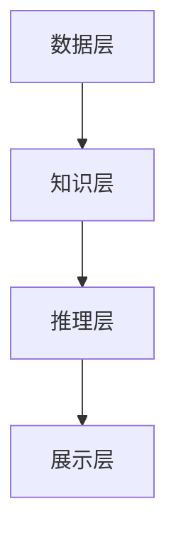
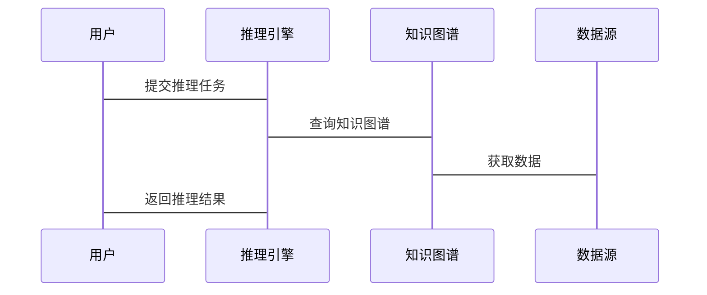

                 


# 设计AI Agent的动态知识图谱推理引擎

> 关键词：AI Agent, 知识图谱, 动态知识图谱, 推理引擎, 图嵌入, 知识推理

> 摘要：本文详细探讨了设计AI Agent的动态知识图谱推理引擎的核心概念、算法原理、系统架构及实现方案。从动态知识图谱的基本概念出发，结合推理引擎的关键技术，分析了动态知识图谱推理引擎的设计思路与实现方法，通过具体案例和代码实现，深入讲解了动态知识图谱推理引擎的构建过程，为AI Agent在复杂动态环境下的智能推理提供了理论与实践指导。

---

# 第一部分: AI Agent与知识图谱概述

# 第1章: AI Agent与知识图谱基础

## 1.1 AI Agent的基本概念

### 1.1.1 AI Agent的定义

AI Agent（人工智能代理）是指能够感知环境、自主决策并执行任务的智能实体。AI Agent通过与环境交互，利用感知信息做出决策，并通过执行器完成任务。AI Agent的核心特征包括自主性、反应性、目标导向性和社会性。

$$
\text{AI Agent的特征：自主性、反应性、目标导向性和社会性。}
$$

### 1.1.2 AI Agent的核心特征

1. **自主性**：AI Agent能够在没有外部干预的情况下自主运行。
2. **反应性**：AI Agent能够感知环境变化并实时调整行为。
3. **目标导向性**：AI Agent具有明确的目标，并能够为实现目标采取最优行动。
4. **社会性**：AI Agent能够与其他AI Agent或人类进行交互与协作。

### 1.1.3 AI Agent的应用场景

AI Agent广泛应用于智能推荐、自动驾驶、智能客服、机器人控制等领域。例如，在智能推荐系统中，AI Agent可以根据用户行为和偏好动态调整推荐策略。

---

## 1.2 知识图谱的基本概念

### 1.2.1 知识图谱的定义

知识图谱是一种以图结构形式表示知识的语义网络，其中节点表示实体或概念，边表示实体之间的关系。知识图谱能够将分散在不同数据源中的信息整合到一个统一的知识网络中。

$$
\text{知识图谱的核心组成：节点（实体/概念）、边（关系）、属性（描述）。}
$$

### 1.2.2 知识图谱的构建过程

知识图谱的构建过程包括数据抽取、实体识别、关系抽取、知识融合、知识存储和知识应用等阶段。例如，从文本中提取实体和关系，构建结构化的知识库。

### 1.2.3 知识图谱的表示方法

知识图谱的表示方法包括RDF（资源描述框架）、RDFS（RDF Schema）、OWL（Web本体语言）等。RDF使用三元组（主语-谓词-宾语）表示知识，例如：(人，name，张三)。

---

## 1.3 动态知识图谱的特性

### 1.3.1 动态知识图谱的定义

动态知识图谱是指能够实时更新和扩展的知识图谱，能够反映现实世界中实体和关系的动态变化。与静态知识图谱相比，动态知识图谱具有更强的实时性和适应性。

### 1.3.2 动态知识图谱与静态知识图谱的区别

| 特性 | 静态知识图谱 | 动态知识图谱 |
|------|--------------|--------------|
| 数据更新 | 静态，不可更新 | 动态，可实时更新 |
| 适应性 | 低 | 高 |
| 应用场景 | 离线分析 | 实时推理 |

### 1.3.3 动态知识图谱的应用优势

动态知识图谱在实时推荐、动态知识检索、在线问答系统等领域具有显著优势。例如，在在线问答系统中，动态知识图谱能够实时更新领域知识，提高回答的准确性和相关性。

---

## 1.4 推理引擎的基本原理

### 1.4.1 推理引擎的定义

推理引擎是一种通过逻辑推理技术从已知事实中推导出新事实的系统。推理引擎的核心功能包括知识表示、规则推理、逻辑推理和概率推理等。

### 1.4.2 推理引擎的分类

1. **基于规则的推理引擎**：基于预定义的规则进行推理。
2. **基于逻辑的推理引擎**：基于逻辑推理进行推理。
3. **基于概率的推理引擎**：基于概率论进行推理。
4. **基于图的推理引擎**：基于图结构进行推理。

### 1.4.3 推理引擎的核心功能

1. **知识表示**：将知识以结构化形式表示。
2. **规则推理**：根据预定义的规则进行推理。
3. **逻辑推理**：基于逻辑推理规则进行推理。
4. **概率推理**：基于概率模型进行推理。

---

## 1.5 本章小结

本章介绍了AI Agent和知识图谱的基本概念，重点分析了动态知识图谱的特性和推理引擎的核心原理。通过对比静态知识图谱和动态知识图谱，明确了动态知识图谱在实时推理中的优势。接下来将深入探讨动态知识图谱的构建方法和推理引擎的实现技术。

---

# 第二部分: 动态知识图谱推理引擎的核心概念

# 第2章: 动态知识图谱的构建与管理

## 2.1 动态知识图谱的构建方法

### 2.1.1 数据源的选择与整合

动态知识图谱的构建需要从多源数据中提取信息。数据源包括结构化数据（如数据库）、半结构化数据（如JSON）和非结构化数据（如文本）。例如，从社交媒体文本中提取实体和关系，构建动态知识图谱。

### 2.1.2 实体识别与关系抽取

实体识别是通过自然语言处理技术从文本中提取实体。关系抽取是通过模式匹配或机器学习技术从文本中提取实体之间的关系。例如，从文本“张三是李四的朋友”中提取实体“张三”和“李四”，以及关系“朋友”。

### 2.1.3 知识图谱的动态更新机制

动态知识图谱的更新机制包括增量更新和全量更新。增量更新仅更新变化的部分，适用于实时数据流；全量更新适用于周期性数据更新。

---

## 2.2 知识图谱的存储与管理

### 2.2.1 知识图谱的存储结构

知识图谱的存储结构包括关系型数据库、图数据库和分布式存储。图数据库（如Neo4j）适合存储大规模图结构数据。

### 2.2.2 知识图谱的查询语言

知识图谱的查询语言包括SPARQL、Cypher和Gremlin等。SPARQL适用于RDF数据模型，Cypher适用于Neo4j图数据库。

### 2.2.3 知识图谱的版本控制

知识图谱的版本控制通过记录每次更新的变更日志实现。版本控制有助于回溯知识图谱的历史状态。

---

## 2.3 动态知识图谱的表示模型

### 2.3.1 RDF与RDFS模型

RDF（资源描述框架）使用三元组表示知识，RDFS（RDF Schema）在RDF基础上增加了类和属性的层次结构。例如，RDFS可以表示“人是一种类，name是一个属性”。

### 2.3.2 OWL本体模型

OWL（Web本体语言）是一种基于RDF的本体语言，支持更复杂的语义表示，如类层次、属性约束和逻辑规则。例如，OWL可以表示“所有人类都是哺乳动物”。

### 2.3.3 图嵌入模型

图嵌入模型将图结构数据转换为低维向量表示，便于机器学习模型处理。例如，使用Word2Vec对知识图谱中的实体和关系进行嵌入表示。

---

## 2.4 本章小结

本章详细探讨了动态知识图谱的构建方法、存储管理与表示模型。通过对比RDF、RDFS和OWL等表示模型，明确了不同模型的适用场景。接下来将深入探讨动态知识图谱推理引擎的算法原理。

---

# 第三部分: 推理引擎的算法原理

# 第3章: 推理算法的核心原理

## 3.1 基于规则的推理算法

### 3.1.1 基于规则的推理定义

基于规则的推理是通过预定义的规则进行推理。规则通常采用“如果-那么”形式，例如：“如果A和B是朋友，且B和C是朋友，那么A和C可能是朋友。”

### 3.1.2 规则表示与匹配

规则表示包括正则表达式、谓词逻辑和产生式规则。规则匹配通过模式匹配技术实现，例如使用Rete算法优化规则匹配过程。

### 3.1.3 基于规则的推理实现

基于规则的推理实现包括规则存储、规则匹配和规则执行。例如，在动态知识图谱中，当检测到某个规则的前件满足时，触发规则的后件进行推理。

---

## 3.2 基于逻辑的推理算法

### 3.2.1 逻辑推理的基本原理

逻辑推理基于谓词逻辑进行推理。常见的逻辑推理方法包括命题逻辑推理和谓词逻辑推理。例如，通过谓词逻辑推理可以验证“所有人类都是哺乳动物”的正确性。

### 3.2.2 逻辑推理的实现方法

逻辑推理的实现方法包括解析式推理和归结式推理。解析式推理通过子句归约实现，归结式推理通过Clauses归约实现。例如，使用Prolog语言实现逻辑推理。

### 3.2.3 逻辑推理的应用场景

逻辑推理适用于需要严格逻辑验证的场景，如法律推理、数学定理证明和知识问答系统。

---

## 3.3 基于概率的推理算法

### 3.3.1 概率推理的基本原理

概率推理基于概率论进行推理，适用于不确定性推理场景。例如，通过贝叶斯网络进行概率推理，计算事件发生的概率。

### 3.3.2 概率推理的实现方法

概率推理的实现方法包括贝叶斯网络推理、马尔可夫链推理和隐马尔可夫模型推理。例如，使用贝叶斯网络推理算法计算条件概率。

### 3.3.3 概率推理的应用场景

概率推理适用于需要处理不确定性问题的场景，如医疗诊断、风险评估和智能推荐系统。

---

## 3.4 基于图的推理算法

### 3.4.1 图推理的基本原理

图推理基于图结构数据进行推理。常见的图推理方法包括广度优先搜索（BFS）和深度优先搜索（DFS）。例如，通过BFS遍历知识图谱，找到节点之间的最短路径。

### 3.4.2 图推理的实现方法

图推理的实现方法包括基于规则的图推理和基于学习的图推理。基于规则的图推理通过预定义的规则进行推理，基于学习的图推理通过机器学习模型进行推理。

### 3.4.3 图推理的应用场景

图推理适用于需要处理复杂关系的场景，如社交网络分析、推荐系统和知识问答系统。

---

## 3.5 本章小结

本章详细探讨了基于规则、逻辑、概率和图的推理算法。通过对比不同推理算法的原理和实现方法，明确了不同算法的适用场景。接下来将深入探讨动态知识图谱推理引擎的系统架构设计。

---

# 第四部分: 动态知识图谱推理引擎的系统架构

# 第4章: 系统架构设计

## 4.1 系统功能模块划分

### 4.1.1 数据采集模块

数据采集模块负责从多源数据中采集数据，包括结构化数据、半结构化数据和非结构化数据。例如，从数据库、API接口和文本文件中采集数据。

### 4.1.2 知识构建模块

知识构建模块负责将采集到的数据进行处理，包括实体识别、关系抽取和知识融合。例如，从文本中提取实体和关系，构建知识图谱。

### 4.1.3 推理引擎模块

推理引擎模块负责根据知识图谱进行推理，生成推理结果。例如，通过推理引擎模块推理出“张三是李四的朋友”的结论。

### 4.1.4 结果展示模块

结果展示模块负责将推理结果以用户友好的形式展示。例如，通过可视化界面展示推理结果。

---

## 4.2 系统架构设计

### 4.2.1 分层架构设计

动态知识图谱推理引擎采用分层架构设计，包括数据层、知识层、推理层和展示层。数据层负责数据存储，知识层负责知识构建，推理层负责推理计算，展示层负责结果展示。

### 4.2.2 系统架构图

以下是一个简化的系统架构图：



---

## 4.3 系统接口设计

### 4.3.1 数据接口

数据接口包括数据采集接口和数据存储接口。数据采集接口用于从外部数据源采集数据，数据存储接口用于将数据存储到数据库中。

### 4.3.2 知识接口

知识接口包括知识构建接口和知识查询接口。知识构建接口用于构建知识图谱，知识查询接口用于查询知识图谱。

### 4.3.3 推理接口

推理接口包括推理请求接口和推理结果接口。推理请求接口用于提交推理任务，推理结果接口用于返回推理结果。

---

## 4.4 系统交互序列图

以下是一个简化的系统交互序列图：



---

## 4.5 本章小结

本章详细探讨了动态知识图谱推理引擎的系统架构设计，包括功能模块划分、系统架构图、系统接口设计和系统交互序列图。通过分层架构设计，明确了各模块的功能和交互关系。接下来将深入探讨动态知识图谱推理引擎的项目实现。

---

# 第五部分: 项目实战

# 第5章: 动态知识图谱推理引擎的实现

## 5.1 环境安装

### 5.1.1 安装Jena

Jena是一个用于构建、查询和推理RDF数据的Java框架。安装命令如下：

```bash
mvn io.apache.jena:jena-core:3.9.0
```

### 5.1.2 安装SPARQL

SPARQL是用于查询RDF数据的标准查询语言。Jena支持SPARQL查询。

### 5.1.3 安装Python环境

安装Python和必要的库：

```bash
pip install pyjena
pip install networkx
pip install matplotlib
```

---

## 5.2 核心代码实现

### 5.2.1 知识图谱构建代码

```python
from pyjena import rdf
from pyjena import sparql

# 创建知识图谱
graph = rdf.Graph()

# 添加三元组
graph.add((rdf.BNode('a'), rdf.Symbol('name'), rdf.Literal('张三')))
graph.add((rdf.BNode('b'), rdf.Symbol('name'), rdf.Literal('李四')))
graph.add((rdf.BNode('a'), rdf.Symbol('friend'), rdf.BNode('b')))
```

### 5.2.2 推理引擎实现代码

```python
from pyjena import inf推理引擎

# 初始化推理引擎
reasoner = inf推理引擎.Reasoner()

# 推理过程
reasoner.reason(graph)

# 获取推理结果
results = reasoner.query(graph, sparqlsparqlsparqlsparqlsparqlsparqlsparqlsparqlsparqlsparqlsparqlsparqlsparqlsparqlsparqlsparqlsparqlsparqlsparqlsparqlsparqlsparqlsparqlsparqlsparqlsparqlsparqlsparqlsparqlsparqlsparqlsparqlsparqlsparqlsparqlsparqlsparqlsparqlsparqlsparqlsparqlsparqlsparqlsparqlsparqlsparqlsparqlsparqlsparqlsparqlsparqlsparqlsparqlsparqlsparqlsparqlsparqlsparqlsparqlsparqlsparqlsparqlsparqlsparqlsparqlsparqlsparqlsparqlsparqlsparqlsparqlsparqlsparqlsparqlsparqlsparqlsparqlsparqlsparqlsparqlsparqlsparqlsparqlsparqlsparqlsparqlsparqlsparqlsparqlsparqlsparqlsparqlsparqlsparqlsparqlsparqlsparqlsparqlsparqlsparqlsparqlsparqlsparqlsparqlsparqlsparqlsparqlsparqlsparqlsparqlsparqlsparqlsparqlsparqlsparqlsparqlsparqlsparqlsparqlsparqlsparqlsparqlsparqlsparqlsparqlsparqlsparqlsparqlsparqlsparqlsparqlsparqlsparqlsparqlsparqlsparqlsparqlsparqlsparqlsparqlsparqlsparqlsparqlsparqlsparqlsparqlsparqlsparqlsparqlsparqlsparqlsparqlsparqlsparqlsparqlsparqlsparqlsparqlsparqlsparqlsparqlsparqlsparqlsparqlsparqlsparqlsparqlsparqlsparqlsparqlsparqlsparqlsparqlsparqlsparqlsparqlsparqlsparqlsparqlsparqlsparqlsparqlsparqlsparqlsparqlsparqlsparqlsparqlsparqlsparqlsparqlsparqlsparqlsparqlsparqlsparqlsparqlsparqlsparqlsparqlsparqlsparqlsparqlsparqlsparqlsparqlsparqlsparqlsparqlsparqlsparqlsparqlsparqlsparqlsparqlsparqlsparqlsparqlsparqlsparqlsparqlsparqlsparqlsparqlsparqlsparqlsparqlsparqlsparqlsparqlsparqlsparqlsparqlsparqlsparqlsparqlsparqlsparqlsparqlsparqlsparqlsparqlsparqlsparqlsparqlsparqlsparqlsparqlsparqlsparqlsparqlsparqlsparqlsparqlsparqlsparqlsparqlsparqlsparqlsparqlsparqlsparqlsparqlsparqlsparqlsparqlsparqlsparqlsparqlsparqlsparqlsparqlsparqlsparqlsparqlsparqlsparqlsparqlsparqlsparqlsparqlsparqlsparqlsparqlsparqlsparqlsparqlsparqlsparqlsparqlsparqlsparqlsparqlsparqlsparqlsparqlsparqlsparqlsparqlsparqlsparqlsparqlsparqlsparqlsparqlsparqlsparqlsparqlsparqlsparqlsparqlsparqlsparqlsparqlsparqlsparqlsparqlsparqlsparqlsparqlsparqlsparqlsparqlsparqlsparqlsparqlsparqlsparqlsparqlsparqlsparqlsparqlsparqlsparqlsparqlsparqlsparqlsparqlsparqlsparqlsparqlsparqlsparqlsparqlsparqlsparqlsparqlsparqlsparqlsparqlsparqlsparqlsparqlsparqlsparqlsparqlsparqlsparqlsparqlsparqlsparqlsparqlsparqlsparqlsparqlsparqlsparqlsparqlsparqlsparqlsparqlsparqlsparqlsparqlsparqlsparqlsparqlsparqlsparqlsparqlsparqlsparqlsparqlsparqlsparqlsparqlsparqlsparqlsparqlsparqlsparqlsparqlsparqlsparqlsparqlsparqlsparqlsparqlsparqlsparqlsparqlsparqlsparqlsparqlsparqlsparqlsparqlsparqlsparqlsparqlsparqlsparqlsparqlsparqlsparqlsparqlsparqlsparqlsparqlsparqlsparqlsparqlsparqlsparqlsparqlsparqlsparqlsparqlsparqlsparqlsparqlsparqlsparqlsparqlsparqlsparqlsparqlsparqlsparqlsparqlsparqlsparqlsparqlsparqlsparqlsparqlsparqlsparqlsparqlsparqlsparqlsparqlsparqlsparqlsparqlsparqlsparqlsparqlsparqlsparqlsparqlsparqlsparqlsparqlsparqlsparqlsparqlsparqlsparqlsparqlsparqlsparqlsparqlsparqlsparqlsparqlsparqlsparqlsparqlsparqlsparqlsparqlsparqlsparqlsparqlsparqlsparqlsparqlsparqlsparqlsparqlsparqlsparqlsparqlsparqlsparqlsparqlsparqlsparqlsparqlsparqlsparqlsparqlsparqlsparqlsparqlsparqlsparqlsparqlsparqlsparqlsparqlsparqlsparqlsparqlsparqlsparqlsparqlsparqlsparqlsparqlsparqlsparqlsparqlsparqlsparqlsparqlsparqlsparqlsparqlsparqlsparqlsparqlsparqlsparqlsparqlsparqlsparqlsparqlsparqlsparqlsparqlsparqlsparqlsparqlsparqlsparqlsparqlsparqlsparqlsparqlsparqlsparqlsparqlsparqlsparqlsparqlsparqlsparqlsparqlsparqlsparqlsparqlsparqlsparqlsparqlsparqlsparqlsparqlsparqlsparqlsparqlsparqlsparqlsparqlsparqlsparqlsparqlsparqlsparqlsparqlsparqlsparqlsparqlsparqlsparqlsparqlsparqlsparqlsparqlsparqlsparqlsparqlsparqlsparqlsparqlsparqlsparqlsparqlsparqlsparqlsparqlsparqlsparqlsparqlsparqlsparqlsparqlsparqlsparqlsparqlsparqlsparqlsparqlsparqlsparqlsparqlsparqlsparqlsparqlsparqlsparqlsparqlsparqlsparqlsparqlsparqlsparqlsparqlsparqlsparqlsparqlsparqlsparqlsparqlsparqlsparqlsparqlsparqlsparqlsparqlsparqlsparqlsparqlsparqlsparqlsparqlsparqlsparqlsparqlsparqlsparqlsparqlsparqlsparqlsparqlsparqlsparqlsparqlsparqlsparqlsparqlsparqlsparqlsparqlsparqlsparqlsparqlsparqlsparqlsparqlsparqlsparqlsparqlsparqlsparqlsparqlsparqlsparqlsparqlsparqlsparqlsparqlsparqlsparqlsparqlsparqlsparqlsparqlsparqlsparqlsparqlsparqlsparqlsparqlsparqlsparqlsparqlsparqlsparqlsparqlsparqlsparqlsparqlsparqlsparqlsparqlsparqlsparqlsparqlsparqlsparqlsparqlsparqlsparqlsparqlsparqlsparqlsparqlsparqlsparqlsparqlsparqlsparqlsparqlsparqlsparqlsparqlsparqlsparqlsparqlsparqlsparqlsparqlsparqlsparqlsparqlsparqlsparqlsparqlsparqlsparqlsparqlsparqlsparqlsparqlsparqlsparqlsparqlsparqlsparqlsparqlsparqlsparqlsparqlsparqlsparqlsparqlsparqlsparqlsparqlsparqlsparqlsparqlsparqlsparqlsparqlsparqlsparqlsparqlsparqlsparqlsparqlsparqlsparqlsparqlsparqlsparqlsparqlsparqlsparqlsparqlsparqlsparqlsparqlsparqlsparqlsparqlsparqlsparqlsparqlsparqlsparqlsparqlsparqlsparqlsparqlsparqlsparqlsparqlsparqlsparqlsparqlsparqlsparqlsparqlsparqlsparqlsparqlsparqlsparqlsparqlsparqlsparqlsparqlsparqlsparqlsparqlsparqlsparqlsparqlsparqlsparqlsparqlsparqlsparqlsparqlsparqlsparqlsparqlsparqlsparqlsparqlsparqlsparqlsparqlsparqlsparqlsparqlsparqlsparqlsparqlsparqlsparqlsparqlsparqlsparqlsparqlsparqlsparqlsparqlsparqlsparqlsparqlsparqlsparqlsparqlsparqlsparqlsparqlsparqlsparqlsparqlsparqlsparqlsparqlsparqlsparqlsparqlsparqlsparqlsparqlsparqlsparqlsparqlsparqlsparqlsparqlsparqlsparqlsparqlsparqlsparqlsparqlsparqlsparqlsparqlsparqlsparqlsparqlsparqlsparqlsparqlsparqlsparqlsparqlsparqlsparqlsparqlsparqlsparqlsparqlsparqlsparqlsparqlsparqlsparqlsparqlsparqlsparqlsparqlsparqlsparqlsparqlsparqlsparqlsparqlsparqlsparqlsparqlsparqlsparqlsparqlsparqlsparqlsparqlsparqlsparqlsparqlsparqlsparqlsparqlsparqlsparqlsparqlsparqlsparqlsparqlsparqlsparqlsparqlsparqlsparqlsparqlsparqlsparqlsparqlsparqlsparqlsparqlsparqlsparqlsparqlsparqlsparqlsparqlsparqlsparqlsparqlsparqlsparqlsparqlsparqlsparqlsparqlsparqlsparqlsparqlsparqlsparqlsparqlsparqlsparqlsparqlsparqlsparqlsparqlsparqlsparqlsparqlsparqlsparqlsparqlsparqlsparqlsparqlsparqlsparqlsparqlsparqlsparqlsparqlsparqlsparqlsparqlsparqlsparqlsparqlsparqlsparqlsparqlsparqlsparqlsparqlsparqlsparqlsparqlsparqlsparqlsparqlsparqlsparqlsparqlsparqlsparqlsparqlsparqlsparqlsparqlsparqlsparqlsparqlsparqlsparqlsparqlsparqlsparqlsparqlsparqlsparqlsparqlsparqlsparqlsparqlsparqlsparqlsparqlsparqlsparqlsparqlsparqlsparqlsparqlsparqlsparqlsparqlsparqlsparqlsparqlsparqlsparqlsparqlsparqlsparqlsparqlsparqlsparqlsparqlsparqlsparqlsparqlsparqlsparqlsparqlsparqlsparqlsparqlsparqlsparqlsparqlsparqlsparqlsparqlsparqlsparqlsparqlsparqlsparqlsparqlsparqlsparqlsparqlsparqlsparqlsparqlsparqlsparqlsparqlsparqlsparqlsparqlsparqlsparqlsparqlsparqlsparqlsparqlsparqlsparqlsparqlsparqlsparqlsparqlsparqlsparqlsparqlsparqlsparqlsparqlsparqlsparqlsparqlsparqlsparqlsparqlsparqlsparqlsparqlsparqlsparqlsparqlsparqlsparqlsparqlsparqlsparqlsparqlsparqlsparqlsparqlsparqlsparqlsparqlsparqlsparqlsparqlsparqlsparqlsparqlsparqlsparqlsparqlsparqlsparqlsparqlsparqlsparqlsparqlsparqlsparqlsparqlsparqlsparqlsparqlsparqlsparqlsparqlsparqlsparqlsparqlsparqlsparqlsparqlsparqlsparqlsparqlsparqlsparqlsparqlsparqlsparqlsparqlsparqlsparqlsparqlsparqlsparqlsparqlsparqlsparqlsparqlsparqlsparqlsparqlsparqlsparqlsparqlsparqlsparqlsparqlsparqlsparqlsparqlsparqlsparqlsparqlsparqlsparqlsparqlsparqlsparqlsparqlsparqlsparqlsparqlsparqlsparqlsparqlsparqlsparqlsparqlsparqlsparqlsparqlsparqlsparqlsparqlsparqlsparqlsparqlsparqlsparqlsparqlsparqlsparqlsparqlsparqlsparqlsparqlsparqlsparqlsparqlsparqlsparqlsparqlsparqlsparqlsparqlsparqlsparqlsparqlsparqlsparqlsparqlsparqlsparqlsparqlsparqlsparqlsparqlsparqlsparqlsparqlsparqlsparqlsparqlsparqlsparqlsparqlsparqlsparqlsparqlsparqlsparqlsparqlsparqlsparqlsparqlsparqlsparqlsparqlsparqlsparqlsparqlsparqlsparqlsparqlsparqlsparqlsparqlsparqlsparqlsparqlsparqlsparqlsparqlsparqlsparqlsparqlsparqlsparqlsparqlsparqlsparqlsparqlsparqlsparqlsparqlsparqlsparqlsparqlsparqlsparqlsparqlsparqlsparqlsparqlsparqlsparqlsparqlsparqlsparqlsparqlsparqlsparqlsparqlsparqlsparqlsparqlsparqlsparqlsparqlsparqlsparqlsparqlsparqlsparqlsparqlsparqlsparqlsparqlsparqlsparqlsparqlsparqlsparqlsparqlsparqlsparqlsparqlsparqlsparqlsparqlsparqlsparqlsparqlsparqlsparqlsparqlsparqlsparqlsparqlsparqlsparqlsparqlsparqlsparqlsparqlsparqlsparqlsparqlsparqlsparqlsparqlsparqlsparqlsparqlsparqlsparqlsparqlsparqlsparqlsparqlsparqlsparqlsparqlsparqlsparqlsparqlsparqlsparqlsparqlsparqlsparqlsparqlsparqlsparqlsparqlsparqlsparqlsparqlsparqlsparqlsparqlsparqlsparqlsparqlsparqlsparqlsparqlsparqlsparqlsparqlsparqlsparqlsparqlsparqlsparqlsparqlsparqlsparqlsparqlsparqlsparqlsparqlsparqlsparqlsparqlsparqlsparqlsparqlsparqlsparqlsparqlsparqlsparqlsparqlsparqlsparqlsparqlsparqlsparqlsparqlsparqlsparqlsparqlsparqlsparqlsparqlsparqlsparqlsparqlsparqlsparqlsparqlsparqlsparqlsparqlsparqlsparqlsparqlsparqlsparqlsparqlsparqlsparqlsparqlsparqlsparqlsparqlsparqlsparqlsparqlsparqlsparqlsparqlsparqlsparqlsparqlsparqlsparqlsparqlsparqlsparqlsparqlsparqlsparqlsparqlsparqlsparqlsparqlsparqlsparqlsparqlsparqlsparqlsparqlsparqlsparqlsparqlsparqlsparqlsparqlsparqlsparqlsparqlsparqlsparqlsparqlsparqlsparqlsparqlsparqlsparqlsparqlsparqlsparqlsparqlsparqlsparqlsparqlsparqlsparqlsparqlsparqlsparqlsparqlsparqlsparqlsparqlsparqlsparqlsparqlsparqlsparqlsparqlsparqlsparqlsparqlsparqlsparqlsparqlsparqlsparqlsparqlsparqlsparqlsparqlsparqlsparqlsparqlsparqlsparqlsparqlsparqlsparqlsparqlsparqlsparqlsparqlsparqlsparqlsparqlsparqlsparqlsparqlsparqlsparqlsparqlsparqlsparqlsparqlsparqlsparqlsparqlsparqlsparqlsparqlsparqlsparqlsparqlsparqlsparqlsparqlsparqlsparqlsparqlsparqlsparqlsparqlsparqlsparqlsparqlsparqlsparqlsparqlsparqlsparqlsparqlsparqlsparqlsparqlsparqlsparqlsparqlsparqlsparqlsparqlsparqlsparqlsparqlsparqlsparqlsparqlsparqlsparqlsparqlsparqlsparqlsparqlsparqlsparqlsparqlsparqlsparqlsparqlsparqlsparqlsparqlsparqlsparqlsparqlsparqlsparqlsparqlsparqlsparqlsparqlsparqlsparqlsparqlsparqlsparqlsparqlsparqlsparqlsparqlsparqlsparqlsparqlsparqlsparqlsparqlsparqlsparqlsparqlsparqlsparqlsparqlsparqlsparqlsparqlsparqlsparqlsparqlsparqlsparqlsparqlsparqlsparqlsparqlsparqlsparqlsparqlsparqlsparqlsparqlsparqlsparqlsparqlsparqlsparqlsparqlsparqlsparqlsparqlsparqlsparqlsparqlsparqlsparqlsparqlsparqlsparqlsparqlsparqlsparqlsparqlsparqlsparqlsparqlsparqlsparqlsparqlsparqlsparqlsparqlsparqlsparqlsparqlsparqlsparqlsparqlsparqlsparqlsparqlsparqlsparqlsparqlsparqlsparqlsparqlsparqlsparqlsparqlsparqlsparqlsparqlsparqlsparqlsparqlsparqlsparqlsparqlsparqlsparqlsparqlsparqlsparqlsparqlsparqlsparqlsparqlsparqlsparqlsparqlsparqlsparqlsparqlsparqlsparqlsparqlsparqlsparqlsparqlsparqlsparqlsparqlsparqlsparqlsparqlsparqlsparqlsparqlsparqlsparqlsparqlsparqlsparqlsparqlsparqlsparqlsparqlsparqlsparqlsparqlsparqlsparqlsparqlsparqlsparqlsparqlsparqlsparqlsparqlsparqlsparqlsparqlsparqlsparqlsparqlsparqlsparqlsparqlsparqlsparqlsparqlsparqlsparqlsparqlsparqlsparqlsparqlsparqlsparqlsparqlsparqlsparqlsparqlsparqlsparqlsparqlsparqlsparqlsparqlsparqlsparqlsparqlsparqlsparqlsparqlsparqlsparqlsparqlsparqlsparqlsparqlsparqlsparqlsparqlsparqlsparqlsparqlsparqlsparqlsparqlsparqlsparqlsparqlsparqlsparqlsparqlsparqlsparqlsparqlsparqlsparqlsparqlsparqlsparqlsparqlsparqlsparqlsparqlsparqlsparqlsparqlsparqlsparqlsparqlsparqlsparqlsparqlsparqlsparqlsparqlsparqlsparqlsparqlsparqlsparqlsparqlsparqlsparqlsparqlsparqlsparqlsparqlsparqlsparqlsparqlsparqlsparqlsparqlsparqlsparqlsparqlsparqlsparqlsparqlsparqlsparqlsparqlsparqlsparqlsparqlsparqlsparqlsparqlsparqlsparqlsparqlsparqlsparqlsparqlsparqlsparqlsparqlsparqlsparqlsparqlsparqlsparqlsparqlsparqlsparqlsparqlsparqlsparqlsparqlsparqlsparqlsparqlsparqlsparqlsparqlsparqlsparqlsparqlsparqlsparqlsparqlsparqlsparqlsparqlsparqlsparqlsparqlsparqlsparqlsparqlsparqlsparqlsparqlsparqlsparqlsparqlsparqlsparqlsparqlsparqlsparqlsparqlsparqlsparqlsparqlsparqlsparqlsparqlsparqlsparqlsparqlsparqlsparqlsparqlsparqlsparqlsparqlsparqlsparqlsparqlsparqlsparqlsparqlsparqlsparqlsparqlsparqlsparqlsparqlsparqlsparqlsparqlsparqlsparqlsparqlsparqlsparqlsparqlsparqlsparqlsparqlsparqlsparqlsparqlsparqlsparqlsparqlsparqlsparqlsparqlsparqlsparqlsparqlsparqlsparqlsparqlsparqlsparqlsparqlsparqlsparqlsparqlsparqlsparqlsparqlsparqlsparqlsparqlsparqlsparqlsparqlsparqlsparqlsparqlsparqlsparqlsparqlsparqlsparqlsparqlsparqlsparqlsparqlsparqlsparqlsparqlsparqlsparqlsparqlsparqlsparqlsparqlsparqlsparqlsparqlsparqlsparqlsparqlsparqlsparqlsparqlsparqlsparqlsparqlsparqlsparqlsparqlsparqlsparqlsparqlsparqlsparqlsparqlsparqlsparqlsparqlsparqlsparqlsparqlsparqlsparqlsparqlsparqlsparqlsparqlsparqlsparqlsparqlsparqlsparqlsparqlsparqlsparqlsparqlsparqlsparqlsparqlsparqlsparqlsparqlsparqlsparqlsparqlsparqlsparqlsparqlsparqlsparqlsparqlsparqlsparqlsparqlsparqlsparqlsparqlsparqlsparqlsparqlsparqlsparqlsparqlsparqlsparqlsparqlsparqlsparqlsparqlsparqlsparqlsparqlsparqlsparqlsparqlsparqlsparqlsparqlsparqlsparqlsparqlsparqlsparqlsparqlsparqlsparqlsparqlsparqlsparqlsparqlsparqlsparqlsparqlsparqlsparqlsparqlsparqlsparqlsparqlsparqlsparqlsparqlsparqlsparqlsparqlsparqlsparqlsparqlsparqlsparqlsparqlsparqlsparqlsparqlsparqlsparqlsparqlsparqlsparqlsparqlsparqlsparqlsparqlsparqlsparqlsparqlsparqlsparqlsparqlsparqlsparqlsparqlsparqlsparqlsparqlsparqlsparqlsparqlsparqlsparqlsparqlsparqlsparqlsparqlsparqlsparqlsparqlsparqlsparqlsparqlsparqlsparqlsparqlsparqlsparqlsparqlsparqlsparqlsparqlsparqlsparqlsparqlsparqlsparqlsparqlsparqlsparqlsparqlsparqlsparqlsparqlsparqlsparqlsparqlsparqlsparqlsparqlsparqlsparqlsparqlsparqlsparqlsparqlsparqlsparqlsparqlsparqlsparqlsparqlsparqlsparqlsparqlsparqlsparqlsparqlsparqlsparqlsparqlsparqlsparqlsparqlsparqlsparqlsparqlsparqlsparqlsparqlsparqlsparqlsparqlsparqlsparqlsparqlsparqlsparqlsparqlsparqlsparqlsparqlsparqlsparqlsparqlsparqlsparqlsparqlsparqlsparqlsparqlsparqlsparqlsparqlsparqlsparqlsparqlsparqlsparqlsparqlsparqlsparqlsparqlsparqlsparqlsparqlsparqlsparqlsparqlsparqlsparqlsparqlsparqlsparqlsparqlsparqlsparqlsparqlsparqlsparqlsparqlsparqlsparqlsparqlsparqlsparqlsparqlsparqlsparqlsparqlsparqlsparqlsparqlsparqlsparqlsparqlsparqlsparqlsparqlsparqlsparqlsparqlsparqlsparqlsparqlsparqlsparqlsparqlsparqlsparqlsparqlsparqlsparqlsparqlsparqlsparqlsparqlsparqlsparqlsparqlsparqlsparqlsparqlsparqlsparqlsparqlsparqlsparqlsparqlsparqlsparqlsparqlsparqlsparqlsparqlsparqlsparqlsparqlsparqlsparqlsparqlsparqlsparqlsparqlsparqlsparqlsparqlsparqlsparqlsparqlsparqlsparqlsparqlsparqlsparqlsparqlsparqlsparqlsparqlsparqlsparqlsparqlsparqlsparqlsparqlsparqlsparqlsparqlsparqlsparqlsparqlsparqlsparqlsparqlsparqlsparqlsparqlsparqlsparqlsparqlsparqlsparqlsparqlsparqlsparqlsparqlsparqlsparqlsparqlsparqlsparqlsparqlsparqlsparqlsparqlsparqlsparqlsparqlsparqlsparqlsparqlsparqlsparqlsparqlsparqlsparqlsparqlsparqlsparqlsparqlsparqlsparqlsparqlsparqlsparqlsparqlsparqlsparqlsparqlsparqlsparqlsparqlsparqlsparqlsparqlsparqlsparqlsparqlsparqlsparqlsparqlsparqlsparqlsparqlsparqlsparqlsparqlsparqlsparqlsparqlsparqlsparqlsparqlsparqlsparqlsparqlsparqlsparqlsparqlsparqlsparqlsparqlsparqlsparqlsparqlsparqlsparqlsparqlsparqlsparqlsparqlsparqlsparqlsparqlsparqlsparqlsparqlsparqlsparqlsparqlsparqlsparqlsparqlsparqlsparqlsparqlsparqlsparqlsparqlsparqlsparqlsparqlsparqlsparqlsparqlsparqlsparqlsparqlsparqlsparqlsparqlsparqlsparqlsparqlsparqlsparqlsparqlsparqlsparqlsparqlsparqlsparqlsparqlsparqlsparqlsparqlsparqlsparqlsparqlsparqlsparqlsparqlsparqlsparqlsparqlsparqlsparqlsparqlsparqlsparqlsparqlsparqlsparqlsparqlsparqlsparqlsparqlsparqlsparqlsparqlsparqlsparqlsparqlsparqlsparqlsparqlsparqlsparqlsparqlsparqlsparqlsparqlsparqlsparqlsparqlsparqlsparqlsparqlsparqlsparqlsparqlsparqlsparqlsparqlsparqlsparqlsparqlsparqlsparqlsparqlsparqlsparqlsparqlsparqlsparqlsparqlsparqlsparqlsparqlsparqlsparqlsparqlsparqlsparqlsparqlsparqlsparqlsparqlsparqlsparqlsparqlsparqlsparqlsparqlsparqlsparqlsparqlsparqlsparqlsparqlsparqlsparqlsparqlsparqlsparqlsparqlsparqlsparqlsparqlsparqlsparqlsparqlsparqlsparqlsparqlsparqlsparqlsparqlsparqlsparqlsparqlsparqlsparqlsparqlsparqlsparqlsparqlsparqlsparqlsparqlsparqlsparqlsparqlsparqlsparqlsparqlsparqlsparqlsparqlsparqlsparqlsparqlsparqlsparqlsparqlsparqlsparqlsparqlsparqlsparqlsparqlsparqlsparqlsparqlsparqlsparqlsparqlsparqlsparqlsparqlsparqlsparqlsparqlsparqlsparqlsparqlsparqlsparqlsparqlsparqlsparqlsparqlsparqlsparqlsparqlsparqlsparqlsparqlsparqlsparqlsparqlsparqlsparqlsparqlsparqlsparqlsparqlsparqlsparqlsparqlsparqlsparqlsparqlsparqlsparqlsparqlsparqlsparqlsparqlsparqlsparqlsparqlsparqlsparqlsparqlsparqlsparqlsparqlsparqlsparqlsparqlsparqlsparqlsparqlsparqlsparqlsparqlsparqlsparqlsparqlsparqlsparqlsparqlsparqlsparqlsparqlsparqlsparqlsparqlsparqlsparqlsparqlsparqlsparqlsparqlsparqlsparqlsparqlsparqlsparqlsparqlsparqlsparqlsparqlsparqlsparqlsparqlsparqlsparqlsparqlsparqlsparqlsparqlsparqlsparqlsparqlsparqlsparqlsparqlsparqlsparqlsparqlsparqlsparqlsparqlsparqlsparqlsparqlsparqlsparqlsparqlsparqlsparqlsparqlsparqlsparqlsparqlsparqlsparqlsparqlsparqlsparqlsparqlsparqlsparqlsparqlsparqlsparqlsparqlsparqlsparqlsparqlsparqlsparqlsparqlsparqlsparqlsparqlsparqlsparqlsparqlsparqlsparqlsparqlsparqlsparqlsparqlsparqlsparqlsparqlsparqlsparqlsparqlsparqlsparqlsparqlsparqlsparqlsparqlsparqlsparqlsparqlsparqlsparqlsparqlsparqlsparqlsparqlsparqlsparqlsparqlsparqlsparqlsparqlsparqlsparqlsparqlsparqlsparqlsparqlsparqlsparqlsparqlsparqlsparqlsparqlsparqlsparqlsparqlsparqlsparqlsparqlsparqlsparqlsparqlsparqlsparqlsparqlsparqlsparqlsparqlsparqlsparqlsparqlsparqlsparqlsparqlsparqlsparqlsparqlsparqlsparqlsparqlsparqlsparqlsparqlsparqlsparqlsparqlsparqlsparqlsparqlsparqlsparqlsparqlsparqlsparqlsparqlsparqlsparqlsparqlsparqlsparqlsparqlsparqlsparqlsparqlsparqlsparqlsparqlsparqlsparqlsparqlsparqlsparqlsparqlsparqlsparqlsparqlsparqlsparqlsparqlsparqlsparqlsparqlsparqlsparqlsparqlsparqlsparqlsparqlsparqlsparqlsparqlsparqlsparqlsparqlsparqlsparqlsparqlsparqlsparqlsparqlsparqlsparqlsparqlsparqlsparqlsparqlsparqlsparqlsparqlsparqlsparqlsparqlsparqlsparqlsparqlsparqlsparqlsparqlsparqlsparqlsparqlsparqlsparqlsparqlsparqlsparqlsparqlsparqlsparqlsparqlsparqlsparqlsparqlsparqlsparqlsparqlsparqlsparqlsparqlsparqlsparqlsparqlsparqlsparqlsparqlsparqlsparqlsparqlsparqlsparqlsparqlsparqlsparqlsparqlsparqlsparqlsparqlsparqlsparqlsparqlsparqlsparqlsparqlsparqlsparqlsparqlsparqlsparqlsparqlsparqlsparqlsparqlsparqlsparqlsparqlsparqlsparqlsparqlsparqlsparqlsparqlsparqlsparqlsparqlsparqlsparqlsparqlsparqlsparqlsparqlsparqlsparqlsparqlsparqlsparqlsparqlsparqlsparqlsparqlsparqlsparqlsparqlsparqlsparqlsparqlsparqlsparqlsparqlsparqlsparqlsparqlsparqlsparqlsparqlsparqlsparqlsparqlsparqlsparqlsparqlsparqlsparqlsparqlsparqlsparqlsparqlsparqlsparqlsparqlsparqlsparqlsparqlsparqlsparqlsparqlsparqlsparqlsparqlsparqlsparqlsparqlsparqlsparqlsparqlsparqlsparqlsparqlsparqlsparqlsparqlsparqlsparqlsparqlsparqlsparqlsparqlsparqlsparqlsparqlsparqlsparqlsparqlsparqlsparqlsparqlsparqlsparqlsparqlsparqlsparqlsparqlsparqlsparqlsparqlsparqlsparqlsparqlsparqlsparqlsparqlsparqlsparqlsparqlsparqlsparqlsparqlsparqlsparqlsparqlsparqlsparqlsparqlsparqlsparqlsparqlsparqlsparqlsparqlsparqlsparqlsparqlsparqlsparqlsparqlsparqlsparqlsparqlsparqlsparqlsparqlsparqlsparqlsparqlsparqlsparqlsparqlsparqlsparqlsparqlsparqlsparqlsparqlsparqlsparqlsparqlsparqlsparqlsparqlsparqlsparqlsparqlsparqlsparqlsparqlsparqlsparqlsparqlsparqlsparqlsparqlsparqlsparqlsparqlsparqlsparqlsparqlsparqlsparqlsparqlsparqlsparqlsparqlsparqlsparqlsparqlsparqlsparqlsparqlsparqlsparqlsparqlsparqlsparqlsparqlsparqlsparqlsparqlsparqlsparqlsparqlsparqlsparqlsparqlsparqlsparqlsparqlsparqlsparqlsparqlsparqlsparqlsparqlsparqlsparqlsparqlsparqlsparqlsparqlsparqlsparqlsparqlsparqlsparqlsparqlsparqlsparqlsparqlsparqlsparqlsparqlsparqlsparqlsparqlsparqlsparqlsparqlsparqlsparqlsparqlsparqlsparqlsparqlsparqlsparqlsparqlsparqlsparqlsparqlsparqlsparqlsparqlsparqlsparqlsparqlsparqlsparqlsparqlsparqlsparqlsparqlsparqlsparqlsparqlsparqlsparqlsparqlsparqlsparqlsparqlsparqlsparqlsparqlsparqlsparqlsparqlsparqlsparqlsparqlsparqlsparqlsparqlsparqlsparqlsparqlsparqlsparqlsparqlsparqlsparqlsparqlsparqlsparqlsparqlsparqlsparqlsparqlsparqlsparqlsparqlsparqlsparqlsparqlsparqlsparqlsparqlsparqlsparqlsparqlsparqlsparqlsparqlsparqlsparqlsparqlsparqlsparqlsparqlsparqlsparqlsparqlsparqlsparqlsparqlsparqlsparqlsparqlsparqlsparqlsparqlsparqlsparqlsparqlsparqlsparqlsparqlsparqlsparqlsparqlsparqlsparqlsparqlsparqlsparqlsparqlsparqlsparqlsparqlsparqlsparqlsparqlsparqlsparqlsparqlsparqlsparqlsparqlsparqlsparqlsparqlsparqlsparqlsparqlsparqlsparqlsparqlsparqlsparqlsparqlsparqlsparqlsparqlsparqlsparqlsparqlsparqlsparqlsparqlsparqlsparqlsparqlsparqlsparqlsparqlsparqlsparqlsparqlsparqlsparqlsparqlsparqlsparqlsparqlsparqlsparqlsparqlsparqlsparqlsparqlsparqlsparqlsparqlsparqlsparqlsparqlsparqlsparqlsparqlsparqlsparqlsparqlsparqlsparqlsparqlsparqlsparqlsparqlsparqlsparqlsparqlsparqlsparqlsparqlsparqlsparqlsparqlsparqlsparqlsparqlsparqlsparqlsparqlsparqlsparqlsparqlsparqlsparqlsparqlsparqlsparqlsparqlsparqlsparqlsparqlsparqlsparqlsparqlsparqlsparqlsparqlsparqlsparqlsparqlsparqlsparqlsparqlsparqlsparqlsparqlsparqlsparqlsparqlsparqlsparqlsparqlsparqlsparqlsparqlsparqlsparqlsparqlsparqlsparqlsparqlsparqlsparqlsparqlsparqlsparqlsparqlsparqlsparqlsparqlsparqlsparqlsparqlsparqlsparqlsparqlsparqlsparqlsparqlsparqlsparqlsparqlsparqlsparqlsparqlsparqlsparqlsparqlsparqlsparqlsparqlsparqlsparqlsparqlsparqlsparqlsparqlsparqlsparqlsparqlsparqlsparqlsparqlsparqlsparqlsparqlsparqlsparqlsparqlsparqlsparqlsparqlsparqlsparqlsparqlsparqlsparqlsparqlsparqlsparqlsparqlsparqlsparqlsparqlsparqlsparqlsparqlsparqlsparqlsparqlsparqlsparqlsparqlsparqlsparqlsparqlsparqlsparqlsparqlsparqlsparqlsparqlsparqlsparqlsparqlsparqlsparqlsparqlsparqlsparqlsparqlsparqlsparqlsparqlsparqlsparqlsparqlsparqlsparqlsparqlsparqlsparqlsparqlsparqlsparqlsparqlsparqlsparqlsparqlsparqlsparqlsparqlsparqlsparqlsparqlsparqlsparqlsparqlsparqlsparqlsparqlsparqlsparqlsparqlsparqlsparqlsparqlsparqlsparqlsparqlsparqlsparqlsparqlsparqlsparqlsparqlsparqlsparqlsparqlsparqlsparqlsparqlsparqlsparqlsparqlsparqlsparqlsparqlsparqlsparqlsparqlsparqlsparqlsparqlsparqlsparqlsparqlsparqlsparqlsparqlsparqlsparqlsparqlsparqlsparqlsparqlsparqlsparqlsparqlsparqlsparqlsparqlsparqlsparqlsparqlsparqlsparqlsparqlsparqlsparqlsparqlsparqlsparqlsparqlsparqlsparqlsparqlsparqlsparqlsparqlsparqlsparqlsparqlsparqlsparqlsparqlsparqlsparqlsparqlsparqlsparqlsparqlsparqlsparqlsparqlsparqlsparqlsparqlsparqlsparqlsparqlsparqlsparqlsparqlsparqlsparqlsparqlsparqlsparqlsparqlsparqlsparqlsparqlsparqlsparqlsparqlsparqlsparqlsparqlsparqlsparqlsparqlsparqlsparqlsparqlsparqlsparqlsparqlsparqlsparqlsparqlsparqlsparqlsparqlsparqlsparqlsparqlsparqlsparqlsparqlsparqlsparqlsparqlsparqlsparqlsparqlsparqlsparqlsparqlsparqlsparqlsparqlsparqlsparqlsparqlsparqlsparqlsparqlsparqlsparqlsparqlsparqlsparqlsparqlsparqlsparqlsparqlsparqlsparqlsparqlsparqlsparqlsparqlsparqlsparqlsparqlsparqlsparqlsparqlsparqlsparqlsparqlsparqlsparqlsparqlsparqlsparqlsparqlsparqlsparqlsparqlsparqlsparqlsparqlsparqlsparqlsparqlsparqlsparqlsparqlsparqlsparqlsparqlsparqlsparqlsparqlsparqlsparqlsparqlsparqlsparqlsparqlsparqlsparqlsparqlsparqlsparqlsparqlsparqlsparqlsparqlsparqlsparqlsparqlsparqlsparqlsparqlsparqlsparqlsparqlsparqlsparqlsparqlsparqlsparqlsparqlsparqlsparqlsparqlsparqlsparqlsparqlsparqlsparqlsparqlsparqlsparqlsparqlsparqlsparqlsparqlsparqlsparqlsparqlsparqlsparqlsparqlsparqlsparqlsparqlsparqlsparqlsparqlsparqlsparqlsparqlsparqlsparqlsparqlsparqlsparqlsparqlsparqlsparqlsparqlsparqlsparqlsparqlsparqlsparqlsparqlsparqlsparqlsparqlsparqlsparqlsparqlsparqlsparqlsparqlsparqlsparqlsparqlsparqlsparqlsparqlsparqlsparqlsparqlsparqlsparqlsparqlsparqlsparqlsparqlsparqlsparqlsparqlsparqlsparqlsparqlsparqlsparqlsparqlsparqlsparqlsparqlsparqlsparqlsparqlsparqlsparqlsparqlsparqlsparqlsparqlsparqlsparqlsparqlsparqlsparqlsparqlsparqlsparqlsparqlsparqlsparqlsparqlsparqlsparqlsparqlsparqlsparqlsparqlsparqlsparqlsparqlsparqlsparqlsparqlsparqlsparqlsparqlsparqlsparqlsparqlsparqlsparqlsparqlsparqlsparqlsparqlsparqlsparqlsparqlsparqlsparqlsparqlsparqlsparqlsparqlsparqlsparqlsparqlsparqlsparqlsparqlsparqlsparqlsparqlsparqlsparqlsparqlsparqlsparqlsparqlsparqlsparqlsparqlsparqlsparqlsparqlsparqlsparqlsparqlsparqlsparqlsparqlsparqlsparqlsparqlsparqlsparqlsparqlsparqlsparqlsparqlsparqlsparqlsparqlsparqlsparqlsparqlsparqlsparqlsparqlsparqlsparqlsparqlsparqlsparqlsparqlsparqlsparqlsparqlsparqlsparqlsparqlsparqlsparqlsparqlsparqlsparqlsparqlsparqlsparqlsparqlsparqlsparqlsparqlsparqlsparqlsparqlsparqlsparqlsparqlsparqlsparqlsparqlsparqlsparqlsparqlsparqlsparqlsparqlsparqlsparqlsparqlsparqlsparqlsparqlsparqlsparqlsparqlsparqlsparqlsparqlsparqlsparqlsparqlsparqlsparqlsparqlsparqlsparqlsparqlsparqlsparqlsparqlsparqlsparqlsparqlsparqlsparqlsparqlsparqlsparqlsparqlsparqlsparqlsparqlsparqlsparqlsparqlsparqlsparqlsparqlsparqlsparqlsparqlsparqlsparqlsparqlsparqlsparqlsparqlsparqlsparqlsparqlsparqlsparqlsparqlsparqlsparqlsparqlsparqlsparqlsparqlsparqlsparqlsparqlsparqlsparqlsparqlsparqlsparqlsparqlsparqlsparqlsparqlsparqlsparqlsparqlsparqlsparqlsparqlsparqlsparqlsparqlsparqlsparqlsparqlsparqlsparqlsparqlsparqlsparqlsparqlsparqlsparqlsparqlsparqlsparqlsparqlsparqlsparqlsparqlsparqlsparqlsparqlsparqlsparqlsparqlsparqlsparqlsparqlsparqlsparqlsparqlsparqlsparqlsparqlsparqlsparqlsparqlsparqlsparqlsparqlsparqlsparqlsparqlsparqlsparqlsparqlsparqlsparqlsparqlsparqlsparqlsparqlsparqlsparqlsparqlsparqlsparqlsparqlsparqlsparqlsparqlsparqlsparqlsparqlsparqlsparqlsparqlsparqlsparqlsparqlsparqlsparqlsparqlsparqlsparqlsparqlsparqlsparqlsparqlsparqlsparqlsparqlsparqlsparqlsparqlsparqlsparqlsparqlsparqlsparqlsparqlsparqlsparqlsparqlsparqlsparqlsparqlsparqlsparqlsparqlsparqlsparqlsparqlsparqlsparqlsparqlsparqlsparqlsparqlsparqlsparqlsparqlsparqlsparqlsparqlsparqlsparqlsparqlsparqlsparqlsparqlsparqlsparqlsparqlsparqlsparqlsparqlsparqlsparqlsparqlsparqlsparqlsparqlsparqlsparqlsparqlsparqlsparqlsparqlsparqlsparqlsparqlsparqlsparqlsparqlsparqlsparqlsparqlsparqlsparqlsparqlsparqlsparqlsparqlsparqlsparqlsparqlsparqlsparqlsparqlsparqlsparqlsparqlsparqlsparqlsparqlsparqlsparqlsparqlsparqlsparqlsparqlsparqlsparqlsparqlsparqlsparqlsparqlsparqlsparqlsparqlsparqlsparqlsparqlsparqlsparqlsparqlsparqlsparqlsparqlsparqlsparqlsparqlsparqlsparqlsparqlsparqlsparqlsparqlsparqlsparqlsparqlsparqlsparqlsparqlsparqlsparqlsparqlsparqlsparqlsparqlsparqlsparqlsparqlsparqlsparqlsparqlsparqlsparqlsparqlsparqlsparqlsparqlsparqlsparqlsparqlsparqlsparqlsparqlsparqlsparqlsparqlsparqlsparqlsparqlsparqlsparqlsparqlsparqlsparqlsparqlsparqlsparqlsparqlsparqlsparqlsparqlsparqlsparqlsparqlsparqlsparqlsparqlsparqlsparqlsparqlsparqlsparqlsparqlsparqlsparqlsparqlsparqlsparqlsparqlsparqlsparqlsparqlsparqlsparqlsparqlsparqlsparqlsparqlsparqlsparqlsparqlsparqlsparqlsparqlsparqlsparqlsparqlsparqlsparqlsparqlsparqlsparqlsparqlsparqlsparqlsparqlsparqlsparqlsparqlsparqlsparqlsparqlsparqlsparqlsparqlsparqlsparqlsparqlsparqlsparqlsparqlsparqlsparqlsparqlsparqlsparqlsparqlsparqlsparqlsparqlsparqlsparqlsparqlsparqlsparqlsparqlsparqlsparqlsparqlsparqlsparqlsparqlsparqlsparqlsparqlsparqlsparqlsparqlsparqlsparqlsparqlsparqlsparqlsparqlsparqlsparqlsparqlsparqlsparqlsparqlsparqlsparqlsparqlsparqlsparqlsparqlsparqlsparqlsparqlsparqlsparqlsparqlsparqlsparqlsparqlsparqlsparqlsparqlsparqlsparqlsparqlsparqlsparqlsparqlsparqlsparqlsparqlsparqlsparqlsparqlsparqlsparqlsparqlsparqlsparqlsparqlsparqlsparqlsparqlsparqlsparqlsparqlsparqlsparqlsparqlsparqlsparqlsparqlsparqlsparqlsparqlsparqlsparqlsparqlsparqlsparqlsparqlsparqlsparqlsparqlsparqlsparqlsparqlsparqlsparqlsparqlsparqlsparqlsparqlsparqlsparqlsparqlsparqlsparqlsparqlsparqlsparqlsparqlsparqlsparqlsparqlsparqlsparqlsparqlsparqlsparqlsparqlsparqlsparqlsparqlsparqlsparqlsparqlsparqlsparqlsparqlsparqlsparqlsparqlsparqlsparqlsparqlsparqlsparqlsparqlsparqlsparqlsparqlsparqlsparqlsparqlsparqlsparqlsparqlsparqlsparqlsparqlsparqlsparqlsparqlsparqlsparqlsparqlsparqlsparqlsparqlsparqlsparqlsparqlsparqlsparqlsparqlsparqlsparqlsparqlsparqlsparqlsparqlsparqlsparqlsparqlsparqlsparqlsparqlsparqlsparqlsparqlsparqlsparqlsparqlsparqlsparqlsparqlsparqlsparqlsparqlsparqlsparqlsparqlsparqlsparqlsparqlsparqlsparqlsparqlsparqlsparqlsparqlsparqlsparqlsparqlsparqlsparqlsparqlsparqlsparqlsparqlsparqlsparqlsparqlsparqlsparqlsparqlsparqlsparqlsparqlsparqlsparqlsparqlsparqlsparqlsparqlsparqlsparqlsparqlsparqlsparqlsparqlsparqlsparqlsparqlsparqlsparqlsparqlsparqlsparqlsparqlsparqlsparqlsparqlsparqlsparqlsparqlsparqlsparqlsparqlsparqlsparqlsparqlsparqlsparqlsparqlsparqlsparqlsparqlsparqlsparqlsparqlsparqlsparqlsparqlsparqlsparqlsparqlsparqlsparqlsparqlsparqlsparqlsparqlsparqlsparqlsparqlsparqlsparqlsparqlsparqlsparqlsparqlsparqlsparqlsparqlsparqlsparqlsparqlsparqlsparqlsparqlsparqlsparqlsparqlsparqlsparqlsparqlsparqlsparqlsparqlsparqlsparqlsparqlsparqlsparqlsparqlsparqlsparqlsparqlsparqlsparqlsparqlsparqlsparqlsparqlsparqlsparqlsparqlsparqlsparqlsparqlsparqlsparqlsparqlsparqlsparqlsparqlsparqlsparqlsparqlsparqlsparqlsparqlsparqlsparqlsparqlsparqlsparqlsparqlsparqlsparqlsparqlsparqlsparqlsparqlsparqlsparqlsparqlsparqlsparqlsparqlsparqlsparqlsparqlsparqlsparqlsparqlsparqlsparqlsparqlsparqlsparqlsparqlsparqlsparqlsparqlsparqlsparqlsparqlsparqlsparqlsparqlsparqlsparqlsparqlsparqlsparqlsparqlsparqlsparqlsparqlsparqlsparqlsparqlsparqlsparqlsparqlsparqlsparqlsparqlsparqlsparqlsparqlsparqlsparqlsparqlsparqlsparqlsparqlsparqlsparqlsparqlsparqlsparqlsparqlsparqlsparqlsparqlsparqlsparqlsparqlsparqlsparqlsparqlsparqlsparqlsparqlsparqlsparqlsparqlsparqlsparqlsparqlsparqlsparqlsparqlsparqlsparqlsparqlsparqlsparqlsparqlsparqlsparqlsparqlsparqlsparqlsparqlsparqlsparqlsparqlsparqlsparqlsparqlsparqlsparqlsparqlsparqlsparqlsparqlsparqlsparqlsparqlsparqlsparqlsparqlsparqlsparqlsparqlsparqlsparqlsparqlsparqlsparqlsparqlsparqlsparqlsparqlsparqlsparqlsparqlsparqlsparqlsparqlsparqlsparqlsparqlsparqlsparqlsparqlsparqlsparqlsparqlsparqlsparqlsparqlsparqlsparqlsparqlsparqlsparqlsparqlsparqlsparqlsparqlsparqlsparqlsparqlsparqlsparqlsparqlsparqlsparqlsparqlsparqlsparqlsparqlsparqlsparqlsparqlsparqlsparqlsparqlsparqlsparqlsparqlsparqlsparqlsparqlsparqlsparqlsparqlsparqlsparqlsparqlsparqlsparqlsparqlsparqlsparqlsparqlsparqlsparqlsparqlsparqlsparqlsparqlsparqlsparqlsparqlsparqlsparqlsparqlsparqlsparqlsparqlsparqlsparqlsparqlsparqlsparqlsparqlsparqlsparqlsparqlsparqlsparqlsparqlsparqlsparqlsparqlsparqlsparqlsparqlsparqlsparqlsparqlsparqlsparqlsparqlsparqlsparqlsparqlsparqlsparqlsparqlsparqlsparqlsparqlsparqlsparqlsparqlsparqlsparqlsparqlsparqlsparqlsparqlsparqlsparqlsparqlsparqlsparqlsparqlsparqlsparqlsparqlsparqlsparqlsparqlsparqlsparqlsparqlsparqlsparqlsparqlsparqlsparqlsparqlsparqlsparqlsparqlsparqlsparqlsparqlsparqlsparqlsparqlsparqlsparqlsparqlsparqlsparqlsparqlsparqlsparqlsparqlsparqlsparqlsparqlsparqlsparqlsparqlsparqlsparqlsparqlsparqlsparqlsparqlsparqlsparqlsparqlsparqlsparqlsparqlsparqlsparqlsparqlsparqlsparqlsparqlsparqlsparqlsparqlsparqlsparqlsparqlsparqlsparqlsparqlsparqlsparqlsparqlsparqlsparqlsparqlsparqlsparqlsparqlsparqlsparqlsparqlsparqlsparqlsparqlsparqlsparqlsparqlsparqlsparqlsparqlsparqlsparqlsparqlsparqlsparqlsparqlsparqlsparqlsparqlsparqlsparqlsparqlsparqlsparqlsparqlsparqlsparqlsparqlsparqlsparqlsparqlsparqlsparqlsparqlsparqlsparqlsparqlsparqlsparqlsparqlsparqlsparqlsparqlsparqlsparqlsparqlsparqlsparqlsparqlsparqlsparqlsparqlsparqlsparqlsparqlsparqlsparqlsparqlsparqlsparqlsparqlsparqlsparqlsparqlsparqlsparqlsparqlsparqlsparqlsparqlsparqlsparqlsparqlsparqlsparqlsparqlsparqlsparqlsparqlsparqlsparqlsparqlsparqlsparqlsparqlsparqlsparqlsparqlsparqlsparqlsparqlsparqlsparqlsparqlsparqlsparqlsparqlsparqlsparqlsparqlsparqlsparqlsparqlsparqlsparqlsparqlsparqlsparqlsparqlsparqlsparqlsparqlsparqlsparqlsparqlsparqlsparqlsparqlsparqlsparqlsparqlsparqlsparqlsparqlsparqlsparqlsparqlsparqlsparqlsparqlsparqlsparqlsparqlsparqlsparqlsparqlsparqlsparqlsparqlsparqlsparqlsparqlsparqlsparqlsparqlsparqlsparqlsparqlsparqlsparqlsparqlsparqlsparqlsparqlsparqlsparqlsparqlsparqlsparqlsparqlsparqlsparqlsparqlsparqlsparqlsparqlsparqlsparqlsparqlsparqlsparqlsparqlsparqlsparqlsparqlsparqlsparqlsparqlsparqlsparqlsparqlsparqlsparqlsparqlsparqlsparqlsparqlsparqlsparqlsparqlsparqlsparqlsparqlsparqlsparqlsparqlsparqlsparqlsparqlsparqlsparqlsparqlsparqlsparqlsparqlsparqlsparqlsparqlsparqlsparqlsparqlsparqlsparqlsparqlsparqlsparqlsparqlsparqlsparqlsparqlsparqlsparqlsparqlsparqlsparqlsparqlsparqlsparqlsparqlsparqlsparqlsparqlsparqlsparqlsparqlsparqlsparqlsparqlsparqlsparqlsparqlsparqlsparqlsparqlsparqlsparqlsparqlsparqlsparqlsparqlsparqlsparqlsparqlsparqlsparqlsparqlsparqlsparqlsparqlsparqlsparqlsparqlsparqlsparqlsparqlsparqlsparqlsparqlsparqlsparqlsparqlsparqlsparqlsparqlsparqlsparqlsparqlsparqlsparqlsparqlsparqlsparqlsparqlsparqlsparqlsparqlsparqlsparqlsparqlsparqlsparqlsparqlsparqlsparqlsparqlsparqlsparqlsparqlsparqlsparqlsparqlsparqlsparqlsparqlsparqlsparqlsparqlsparqlsparqlsparqlsparqlsparqlsparqlsparqlsparqlsparqlsparqlsparqlsparqlsparqlsparqlsparqlsparqlsparqlsparqlsparqlsparqlsparqlsparqlsparqlsparqlsparqlsparqlsparqlsparqlsparqlsparqlsparqlsparqlsparqlsparqlsparqlsparqlsparqlsparqlsparqlsparqlsparqlsparqlsparqlsparqlsparqlsparqlsparqlsparqlsparqlsparqlsparqlsparqlsparqlsparqlsparqlsparqlsparqlsparqlsparqlsparqlsparqlsparqlsparqlsparqlsparqlsparqlsparqlsparqlsparqlsparqlsparqlsparqlsparqlsparqlsparqlsparqlsparqlsparqlsparqlsparqlsparqlsparqlsparqlsparqlsparqlsparqlsparqlsparqlsparqlsparqlsparqlsparqlsparqlsparqlsparqlsparqlsparqlsparqlsparqlsparqlsparqlsparqlsparqlsparqlsparqlsparl

