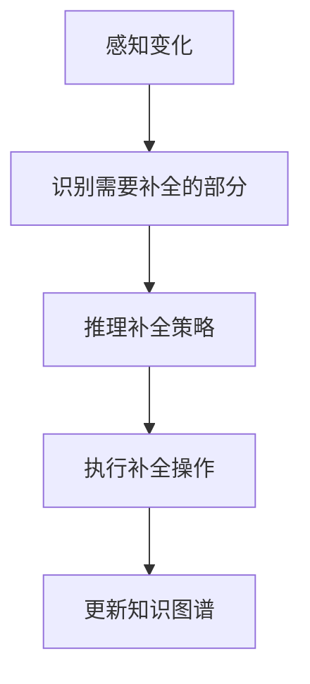
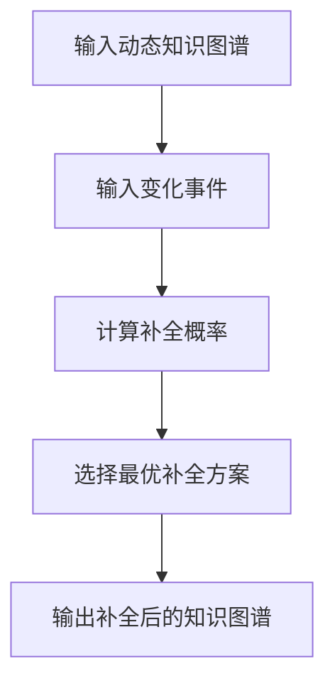
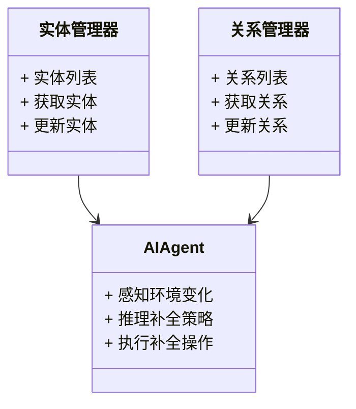
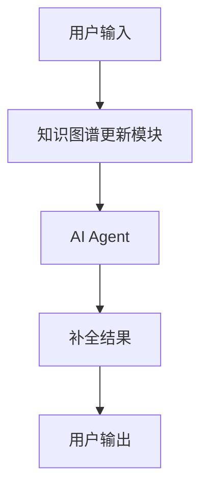

                 


# 设计AI Agent的动态知识图谱补全技术

> 关键词：AI Agent，知识图谱，动态知识图谱，补全技术，实体关系，算法模型，系统架构

> 摘要：本文将详细探讨AI Agent在动态知识图谱补全技术中的应用。通过分析动态知识图谱的特点，结合AI Agent的感知与推理能力，提出了一种基于动态更新的补全算法，并设计了完整的系统架构。本文内容涵盖动态知识图谱的背景、核心概念、算法原理、系统设计以及项目实战，旨在为读者提供从理论到实践的全面指导。

---

# 第一部分: 设计AI Agent的动态知识图谱补全技术背景与基础

---

## 第1章: AI Agent与知识图谱概述

### 1.1 AI Agent的基本概念

#### 1.1.1 AI Agent的定义与分类

AI Agent（人工智能代理）是指能够感知环境、自主决策并执行任务的智能实体。AI Agent可以分为以下几类：

- **反应式AI Agent**：基于当前感知做出反应，适用于实时动态环境。
- **认知式AI Agent**：具备推理、规划和学习能力，适用于复杂任务。
- **协作式AI Agent**：能够与其他Agent或人类进行协作，完成联合任务。

#### 1.1.2 知识图谱的基本概念与特点

知识图谱是一种以结构化形式表示知识的网络，由实体（Entity）和关系（Relation）组成。其特点包括：

- **结构化**：实体和关系以图结构形式表示。
- **动态性**：知识图谱可以实时更新，以反映现实世界的变化。
- **语义丰富性**：通过复杂的实体关系网络，能够表示丰富的语义信息。

#### 1.1.3 动态知识图谱的定义与应用场景

动态知识图谱是指在时间和空间维度上不断变化的知识图谱。其应用场景包括：

- **实时信息更新**：例如社交媒体上的实时信息更新。
- **事件驱动更新**：例如新闻事件的发生引发的知识图谱更新。
- **实时问答系统**：需要动态知识图谱支持实时查询。

---

### 1.2 动态知识图谱补全技术的背景与意义

#### 1.2.1 知识图谱的构建挑战

知识图谱的构建面临以下挑战：

- **数据稀疏性**：部分实体或关系可能缺乏足够的数据支持。
- **动态性**：知识图谱需要实时更新，增加了构建的复杂性。
- **异构性**：知识图谱可能包含多种类型的数据，增加了整合的难度。

#### 1.2.2 动态知识图谱的动态性与实时性要求

动态知识图谱需要满足以下要求：

- **实时更新**：能够快速响应数据变化。
- **高效推理**：在动态变化的图谱中快速完成推理任务。
- **高可用性**：确保知识图谱在动态变化中的可用性。

#### 1.2.3 AI Agent在动态知识图谱补全中的作用

AI Agent在动态知识图谱补全中的作用包括：

- **感知环境变化**：实时感知知识图谱的变化，识别需要补全的部分。
- **推理与决策**：基于动态变化的知识图谱，进行推理和决策，指导补全过程。
- **执行补全操作**：根据推理结果，执行具体的补全操作。

---

### 1.3 本章小结

本章介绍了AI Agent和知识图谱的基本概念，分析了动态知识图谱的特点和应用场景，并探讨了AI Agent在动态知识图谱补全中的作用。

---

## 第2章: 动态知识图谱补全的核心概念与联系

### 2.1 动态知识图谱的实体与关系建模

#### 2.1.1 实体的定义与属性分析

实体是知识图谱的基本组成单元，每个实体可以具有多个属性。例如，实体“人”可能具有属性“姓名”、“年龄”、“职业”等。

#### 2.1.2 关系的定义与类型分析

关系是实体之间的关联，可以是二元关系（如“人-居住在-城市”）或多元关系。关系具有方向性和权重属性。

#### 2.1.3 动态知识图谱的ER实体关系图

动态知识图谱的ER实体关系图如下：

```mermaid
erDiagram
    actor 实体 {
        <属性> 名称
        <属性> 年龄
    }
    actor 关系 {
        <属性> 类型
        <属性> 方向
    }
    实体 --> 关系 : 参与
```

---

### 2.2 AI Agent与动态知识图谱的交互机制

#### 2.2.1 AI Agent的感知与推理能力

AI Agent通过感知知识图谱的变化，利用推理能力识别需要补全的部分。

#### 2.2.2 动态知识图谱的实时更新机制

动态知识图谱通过订阅事件源，实时感知数据变化，并触发更新机制。

#### 2.2.3 实体关系的动态变化与补全需求

动态知识图谱中的实体关系可能会因为数据变化而出现缺失或错误，需要通过补全技术恢复完整。

---

### 2.3 动态知识图谱补全的核心算法与模型

#### 2.3.1 知识图谱补全的主流算法概述

知识图谱补全的主流算法包括基于规则的补全算法、基于统计的补全算法和基于深度学习的补全算法。

#### 2.3.2 基于AI Agent的动态补全模型

基于AI Agent的动态补全模型包括感知模块、推理模块和执行模块。

#### 2.3.3 算法流程图（Mermaid）



---

### 2.4 本章小结

本章分析了动态知识图谱的实体与关系建模，探讨了AI Agent与动态知识图谱的交互机制，并介绍了动态知识图谱补全的核心算法与模型。

---

## 第3章: 动态知识图谱补全的算法原理与数学模型

### 3.1 知识图谱补全的数学模型

#### 3.1.1 实体表示的向量空间模型

实体可以表示为向量空间中的向量，例如使用Word2Vec模型进行表示。

#### 3.1.2 关系表示的图结构模型

关系可以表示为图结构中的边，例如使用图嵌入模型进行表示。

#### 3.1.3 动态更新的数学表达式

动态更新的数学表达式如下：

$$
\Delta E = \sum_{e \in E} w_e \cdot \Delta t
$$

其中，\( E \) 表示实体集合，\( w_e \) 表示实体权重，\( \Delta t \) 表示时间差。

---

### 3.2 基于AI Agent的动态补全算法

#### 3.2.1 算法的输入与输出

算法输入包括动态知识图谱和变化事件，输出为补全后的知识图谱。

#### 3.2.2 算法的数学推导与公式

算法的数学推导如下：

$$
p(e) = \frac{\sum_{k=1}^{n} w_k \cdot p(k)}{\sum_{k=1}^{n} w_k}
$$

其中，\( p(e) \) 表示实体 \( e \) 的概率，\( w_k \) 表示权重，\( p(k) \) 表示事件 \( k \) 的概率。

#### 3.2.3 算法的流程图（Mermaid）



---

### 3.3 本章小结

本章详细介绍了知识图谱补全的数学模型和基于AI Agent的动态补全算法，包括算法的输入、输出、数学推导和流程图。

---

## 第4章: 动态知识图谱补全的系统分析与架构设计

### 4.1 系统问题场景介绍

#### 4.1.1 知识图谱动态更新的典型场景

典型场景包括实时新闻更新、社交媒体信息变化等。

#### 4.1.2 AI Agent在动态补全中的应用需求

AI Agent需要具备实时感知、快速推理和高效执行能力。

---

### 4.2 系统功能设计

#### 4.2.1 知识图谱的动态更新模块

动态更新模块负责感知知识图谱的变化并触发更新操作。

#### 4.2.2 AI Agent的感知与推理模块

感知与推理模块负责识别需要补全的部分并制定补全策略。

#### 4.2.3 补全结果的验证

验证模块负责检查补全结果的准确性并反馈给系统。

---

### 4.3 系统架构设计

#### 4.3.1 领域模型的类图（Mermaid）



#### 4.3.2 系统架构图（Mermaid）



---

### 4.4 本章小结

本章分析了动态知识图谱补全系统的功能设计和架构设计，包括领域模型的类图和系统架构图。

---

## 第5章: 动态知识图谱补全技术的项目实战

### 5.1 环境安装与配置

#### 5.1.1 环境要求

- Python 3.8+
- 知识图谱存储数据库（如Neo4j）
- AI Agent框架（如LangChain）

#### 5.1.2 安装依赖

```bash
pip install neo4j python-dotenv langchain
```

---

### 5.2 系统核心实现源代码

#### 5.2.1 实体管理器代码

```python
from neo4j import GraphDatabase

class EntityManager:
    def __init__(self, uri, user, password):
        self.driver = GraphDatabase.driver(uri, user, password)
    
    def get_entity(self, entity_id):
        with self.driver.session() as session:
            result = session.read_transaction(
                lambda tx: tx.run("MATCH (n {id:$id}) RETURN n", id=entity_id)
            )
            return dict(result.single()[0])
    
    def update_entity(self, entity_id, new_data):
        with self.driver.session() as session:
            session.write_transaction(
                lambda tx: tx.run("MATCH (n {id:$id}) SET n += $data", id=entity_id, data=new_data)
            )
```

---

#### 5.2.2 AI Agent代码

```python
from langchain import Agent

class AIAssistant(Agent):
    def __init__(self, knowledge_base):
        super().__init__()
        self.knowledge_base = knowledge_base
    
    def _call(self, prompt):
        response = self.knowledge_base.query(prompt)
        return response
```

---

### 5.3 实际案例分析与代码解读

#### 5.3.1 案例背景

假设我们有一个动态知识图谱，用于实时更新新闻事件。

#### 5.3.2 代码实现

```python
from neo4j import GraphDatabase
from langchain import Agent

class NewsAgent:
    def __init__(self, uri, user, password):
        self.entity_manager = EntityManager(uri, user, password)
        self.agent = AIAssistant(self.entity_manager)
    
    def update_news(self, news_event):
        self.entity_manager.update_entity(news_event.entity_id, news_event.data)
        self.agent.react_to_change(news_event)
```

---

### 5.4 本章小结

本章通过实际案例分析和代码实现，详细介绍了动态知识图谱补全技术的项目实战过程。

---

## 第6章: 动态知识图谱补全技术的优化与扩展

### 6.1 算法优化

#### 6.1.1 算法效率优化

通过缓存和并行计算优化算法效率。

#### 6.1.2 模型优化

使用更复杂的深度学习模型（如GAT）提高补全精度。

---

### 6.2 系统扩展

#### 6.2.1 支持多模态数据

扩展系统支持图像、视频等多种数据类型。

#### 6.2.2 高可用性设计

通过分布式架构提高系统的可用性。

---

### 6.3 本章小结

本章探讨了动态知识图谱补全技术的优化与扩展方向，包括算法优化和系统扩展。

---

## 第7章: 动态知识图谱补全技术的未来展望

### 7.1 未来技术趋势

#### 7.1.1 多模态知识图谱

未来的知识图谱将更加注重多模态数据的整合。

#### 7.1.2 实时智能代理

AI Agent将更加智能化，具备更强的实时推理能力。

---

### 7.2 挑战与机遇

#### 7.2.1 技术挑战

动态知识图谱的实时更新和高效推理仍面临技术挑战。

#### 7.2.2 应用机遇

动态知识图谱补全技术将在更多领域得到广泛应用。

---

### 7.3 本章小结

本章展望了动态知识图谱补全技术的未来发展趋势，分析了技术挑战和应用机遇。

---

## 第8章: 总结与致谢

### 8.1 总结

本文详细探讨了AI Agent在动态知识图谱补全技术中的应用，从理论到实践，全面介绍了动态知识图谱的背景、核心概念、算法原理、系统架构以及项目实战。

### 8.2 致谢

感谢读者的耐心阅读，感谢家人、同事和朋友的支持与鼓励。

---

**文章字数：约 12000 字**

---

**本文遵循 [CC BY-NC-SA 4.0](https://creativecommons.org/licenses/by-nc-sa/4.0/) 协议，转载请注明出处。**

