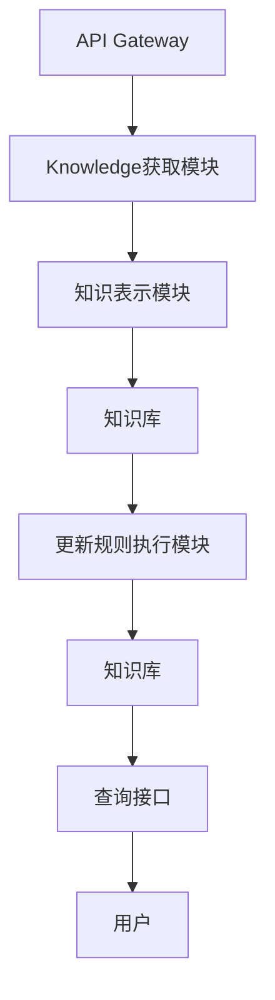
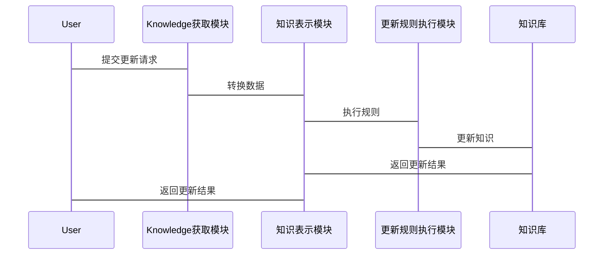

                 


# 设计AI Agent的动态知识库更新机制

> 关键词：AI Agent、动态知识库、知识表示、更新机制、实时性、可扩展性

> 摘要：本文详细探讨了AI Agent动态知识库更新机制的设计与实现，从背景介绍、核心概念、算法原理、系统设计到项目实战，系统地分析了动态知识库更新的必要性、实现方法和优化策略。通过具体案例和代码实现，展示了如何设计和实现一个高效、可靠的动态知识库更新系统。

---

## 第一部分：背景介绍

### 1.1 问题背景

#### 1.1.1 AI Agent的基本概念
AI Agent（智能体）是指能够感知环境、自主决策并执行任务的智能系统。它通常具备以下核心功能：
- **感知**：通过传感器或接口获取环境信息。
- **推理**：基于获取的信息进行逻辑推理或模式识别。
- **决策**：根据推理结果做出最优决策。
- **执行**：通过执行机构或接口将决策转化为具体行动。

AI Agent广泛应用于自动驾驶、智能助手、推荐系统等领域。

#### 1.1.2 动态知识库更新的必要性
动态知识库是指能够实时或近实时更新知识内容的知识库。AI Agent需要依赖知识库进行推理和决策，而知识库的内容往往需要根据环境的变化实时更新。例如：
- 在自动驾驶中，交通规则、道路状况等信息需要实时更新。
- 在智能客服系统中，产品信息、用户反馈等知识需要动态更新。

如果不具备动态更新能力，AI Agent的知识库将迅速过时，导致推理和决策的错误。

#### 1.1.3 问题的边界与外延
动态知识库更新机制的核心问题是如何高效、准确地更新知识库内容，同时保证系统的实时性和可扩展性。相关问题包括：
- **数据来源**：知识库的数据来自哪些渠道？
- **更新频率**：知识库需要多频繁地更新？
- **更新方式**：是实时更新还是批量更新？
- **冲突处理**：如何处理新旧知识的冲突？

### 1.2 问题描述

#### 1.2.1 AI Agent的知识表示需求
知识表示是AI Agent理解世界的核心。知识库中的知识需要以某种形式表示，例如：
- **符号表示**：使用符号逻辑表示事实和规则。
- **语义网络**：通过节点和边表示概念及其关系。
- **向量表示**：使用向量空间模型表示概念的语义。

#### 1.2.2 知识库更新的挑战
动态知识库更新面临以下挑战：
- **实时性**：需要快速响应更新请求。
- **准确性**：更新的内容必须准确无误。
- **一致性**：更新后知识库必须保持逻辑一致性。
- **可扩展性**：知识库规模可能非常大，更新机制必须具备良好的扩展性。

#### 1.2.3 动态更新机制的核心目标
动态更新机制的目标是：
- 提供高效的更新接口，支持实时或近实时的知识更新。
- 确保更新内容的准确性，避免知识库中的错误信息。
- 维护知识库的一致性，防止逻辑矛盾。

---

## 第二部分：核心概念与联系

### 2.1 AI Agent与动态知识库的核心要素

#### 2.1.1 AI Agent的定义与属性
AI Agent的核心属性包括：
- **自主性**：能够自主决策，无需外部干预。
- **反应性**：能够感知环境变化并实时响应。
- **目标导向性**：具有明确的目标并为之努力。
- **社会能力**：能够与其他系统或人类交互协作。

#### 2.1.2 知识库的结构与功能
动态知识库的结构通常包括：
- **数据层**：存储原始数据。
- **模式层**：定义数据的结构和关系。
- **服务层**：提供知识查询和更新的接口。

知识库的功能包括：
- **存储**：持久化存储知识。
- **查询**：根据需求快速检索知识。
- **更新**：实时或按需更新知识内容。

#### 2.1.3 动态更新机制的关键特征
动态更新机制的关键特征包括：
- **实时性**：能够快速响应更新请求。
- **异步性**：支持批量更新或异步处理。
- **原子性**：确保更新操作的原子性，避免数据不一致。
- **一致性**：更新后知识库保持逻辑一致。

### 2.2 核心概念对比表

| **对比维度** | **AI Agent** | **动态知识库** | **静态知识库** |
|--------------|--------------|----------------|----------------|
| **更新频率** | 动态更新     | 实时或周期性   | 偶尔更新或静态 |
| **数据来源** | 多源异构数据 | 多种来源       | 单一来源或有限 |
| **更新方式** | 按需更新     | 批量或实时     | 批量或手动     |
| **一致性**   | 高           | 高             | 中等           |

### 2.3 ER实体关系图

```mermaid
erDiagram
    actor User {
        <field> string username
        <field> string password
    }
    actor System {
        <field> string status
        <field> string configuration
    }
    class KnowledgeBase {
        <key> string id
        string content
        timestamp last_updated
    }
    class UpdateRequest {
        <key> string id
        string content
        timestamp request_time
    }
    User --> KnowledgeBase: queries
    User --> UpdateRequest: submits
    System --> KnowledgeBase: updates
    System --> UpdateRequest: processes
```

---

## 第三部分：动态知识库更新机制的设计原则

### 3.1 设计原则概述

#### 3.1.1 实时性与准确性的平衡
动态知识库更新需要在实时性和准确性之间找到平衡点。实时性要求快速响应更新请求，而准确性则需要确保更新内容的正确性。可以通过以下方式实现：
- **优先级机制**：根据更新请求的优先级决定处理顺序。
- **验证机制**：在更新前对内容进行验证，确保准确性。

#### 3.1.2 可扩展性与可维护性的统一
动态知识库更新机制需要具备良好的扩展性和可维护性：
- **模块化设计**：将更新机制分解为多个模块，每个模块负责特定功能。
- **插件式架构**：支持多种数据源和更新方式的插件化扩展。

#### 3.1.3 效率与资源消耗的优化
动态知识库更新机制需要在效率和资源消耗之间进行优化：
- **批量处理**：将多个更新请求批量处理，减少资源消耗。
- **异步处理**：采用异步更新方式，避免阻塞主线程。

### 3.2 更新机制的核心方法

#### 3.2.1 基于规则的更新策略
基于规则的更新策略通过预定义的规则自动触发更新操作。例如：
- **时间规则**：每隔一定时间自动更新。
- **事件规则**：当特定事件发生时触发更新。

#### 3.2.2 基于事件驱动的更新模式
基于事件驱动的更新模式通过订阅事件的方式实现动态更新。例如：
- **数据变更事件**：当数据发生变化时触发更新。
- **外部通知事件**：当外部系统通知数据变更时触发更新。

#### 3.2.3 基于反馈的自适应更新方法
基于反馈的自适应更新方法根据系统的反馈动态调整更新策略。例如：
- **错误反馈**：当发现错误信息时，自动触发修正更新。
- **性能反馈**：根据系统的性能反馈调整更新频率。

---

## 第四部分：算法原理与实现

### 4.1 算法原理概述

#### 4.1.1 动态知识库更新的算法分类
动态知识库更新的算法可以分为以下几类：
- **基于规则的更新算法**：通过预定义规则实现自动更新。
- **基于事件的更新算法**：通过事件驱动实现动态更新。
- **基于反馈的更新算法**：通过反馈信息动态调整更新策略。

#### 4.1.2 基于图的更新算法
基于图的更新算法通过图结构表示知识库的关系，并根据节点和边的更新规则进行动态更新。例如：
- **节点更新**：更新某个节点的属性值。
- **边更新**：添加或删除节点之间的关系。

#### 4.1.3 基于概率的更新模型
基于概率的更新模型通过概率论方法预测知识库的更新内容。例如：
- **贝叶斯网络**：通过贝叶斯网络进行概率推理，预测知识库的更新内容。
- **马尔可夫链**：通过马尔可夫链模型预测知识库的更新趋势。

### 4.2 算法实现流程

#### 4.2.1 数据获取与预处理
数据获取与预处理是动态知识库更新的第一步，主要包括：
- **数据采集**：从多种数据源采集数据。
- **数据清洗**：对采集的数据进行清洗，去除噪声数据。
- **数据转换**：将数据转换为适合知识库存储的格式。

#### 4.2.2 知识表示与推理
知识表示与推理是动态知识库更新的核心步骤，主要包括：
- **知识表示**：将数据表示为知识库中的概念和关系。
- **逻辑推理**：根据知识库中的知识进行逻辑推理，得出新的知识。

#### 4.2.3 更新规则的执行与验证
更新规则的执行与验证是动态知识库更新的关键步骤，主要包括：
- **规则匹配**：匹配触发更新的条件。
- **规则执行**：根据匹配的规则执行更新操作。
- **更新验证**：验证更新结果的正确性，确保知识库的一致性。

### 4.3 数学模型与公式

#### 4.3.1 知识表示的向量空间模型
知识表示的向量空间模型可以通过向量空间模型表示概念的语义，例如：
$$
\text{向量空间模型} = \sum_{i=1}^{n} w_i \cdot v_i
$$
其中，$w_i$是权重，$v_i$是对应的词向量。

#### 4.3.2 更新规则的数学表达
更新规则的数学表达可以通过以下公式表示：
$$
\text{更新规则} = \text{条件} \Rightarrow \text{操作}
$$
例如，当检测到数据变化时，触发更新操作：
$$
\text{检测到变化} \Rightarrow \text{执行更新}
$$

#### 4.3.3 基于概率的更新公式
基于概率的更新公式可以通过贝叶斯定理表示：
$$
P(A|B) = \frac{P(B|A) \cdot P(A)}{P(B)}
$$
其中，$P(A|B)$表示在事件$B$发生的条件下，事件$A$发生的概率。

---

## 第五部分：系统分析与架构设计

### 5.1 问题场景介绍

#### 5.1.1 典型应用场景分析
动态知识库更新机制的应用场景包括：
- **自动驾驶**：实时更新道路信息、交通规则等。
- **智能客服**：动态更新产品信息、用户反馈等。
- **推荐系统**：实时更新用户偏好、热门内容等。

#### 5.1.2 系统需求分析
系统需求分析包括：
- **功能需求**：支持实时更新、高效查询、准确验证。
- **性能需求**：支持高并发更新、低延迟响应。
- **扩展需求**：支持多种数据源、多种更新方式。

#### 5.1.3 系统目标与约束条件
系统目标是设计一个高效、可靠的动态知识库更新系统，约束条件包括：
- **实时性**：更新操作必须快速响应。
- **一致性**：更新后知识库必须保持逻辑一致。
- **可扩展性**：支持大规模数据的更新。

### 5.2 系统功能设计

#### 5.2.1 知识获取模块
知识获取模块负责从多种数据源采集数据，包括：
- **API接口**：通过API获取实时数据。
- **文件导入**：通过文件批量导入数据。
- **数据库查询**：通过数据库查询获取数据。

#### 5.2.2 知识表示模块
知识表示模块负责将获取的数据表示为知识库中的概念和关系，包括：
- **符号表示**：使用符号逻辑表示事实和规则。
- **语义网络**：通过节点和边表示概念及其关系。
- **向量表示**：使用向量空间模型表示概念的语义。

#### 5.2.3 更新规则执行模块
更新规则执行模块负责根据预定义的规则执行更新操作，包括：
- **规则匹配**：匹配触发更新的条件。
- **规则执行**：根据匹配的规则执行更新操作。
- **更新验证**：验证更新结果的正确性，确保知识库的一致性。

### 5.3 系统架构设计

#### 5.3.1 系统架构图


#### 5.3.2 系统接口设计
系统接口设计包括：
- **查询接口**：提供知识查询接口，支持根据条件查询知识库内容。
- **更新接口**：提供知识更新接口，支持根据规则执行更新操作。
- **验证接口**：提供更新验证接口，支持验证更新结果的正确性。

#### 5.3.3 系统交互图


---

## 第六部分：项目实战

### 6.1 环境安装

#### 6.1.1 系统环境
- **操作系统**：Linux/Windows/macOS
- **Python版本**：Python 3.8+
- **依赖库**：networkx, numpy, pandas

#### 6.1.2 安装依赖
```bash
pip install networkx numpy pandas
```

### 6.2 核心代码实现

#### 6.2.1 知识获取模块
```python
import requests

def fetch_data(api_url):
    try:
        response = requests.get(api_url)
        if response.status_code == 200:
            return response.json()
        else:
            return None
    except Exception as e:
        print(f"Error fetching data: {e}")
        return None
```

#### 6.2.2 知识表示模块
```python
import networkx as nx

def represent_knowledge(data):
    G = nx.Graph()
    for item in data:
        G.add_node(item['concept'])
        for relation in item['relations']:
            G.add_edge(item['concept'], relation)
    return G
```

#### 6.2.3 更新规则执行模块
```python
def execute_rule(rule, knowledge_base):
    if rule['condition'](knowledge_base):
        knowledge_base = rule['action'](knowledge_base)
    return knowledge_base
```

### 6.3 代码应用解读与分析

#### 6.3.1 知识获取模块解读
知识获取模块通过`requests`库从指定的API接口获取数据，返回JSON格式的数据。如果获取成功，返回数据；否则，返回`None`。

#### 6.3.2 知识表示模块解读
知识表示模块使用`networkx`库将获取的数据表示为图结构，其中节点表示概念，边表示概念之间的关系。

#### 6.3.3 更新规则执行模块解读
更新规则执行模块根据预定义的规则执行更新操作。如果条件满足，则执行操作；否则，不做任何操作。

### 6.4 实际案例分析

#### 6.4.1 案例描述
假设我们有一个动态知识库，用于存储和更新城市交通信息。当交通状况发生变化时，动态知识库需要实时更新。

#### 6.4.2 案例实现
```python
# 更新规则
rule = {
    'condition': lambda kb: 'accident' in kb.nodes(),
    'action': lambda kb: kb.remove_node('accident')
}

# 执行更新
new_kb = execute_rule(rule, knowledge_base)
```

#### 6.4.3 案例分析
当检测到道路上发生事故时，更新规则会触发，从知识库中移除事故节点，保持知识库的准确性。

### 6.5 项目小结

#### 6.5.1 核心代码实现
- 知识获取模块：通过API获取实时数据。
- 知识表示模块：将数据表示为图结构。
- 更新规则执行模块：根据规则执行更新操作。

#### 6.5.2 项目优势
- 实时性：支持实时更新，确保知识库的准确性。
- 可扩展性：支持多种数据源和更新方式。
- 可维护性：模块化设计，便于维护和扩展。

---

## 第七部分：总结与展望

### 7.1 小结
动态知识库更新机制是AI Agent实现的核心技术之一。通过实时更新知识库内容，AI Agent能够更好地适应环境的变化，提高决策的准确性。本文详细探讨了动态知识库更新机制的设计与实现，从背景介绍、核心概念、算法原理、系统设计到项目实战，系统地分析了动态知识库更新的必要性、实现方法和优化策略。

### 7.2 注意事项
- 更新机制的设计需要考虑实时性、准确性和一致性。
- 知识库的规模越大，更新机制的设计越复杂。
- 更新规则需要根据具体场景进行定制化设计。

### 7.3 拓展阅读
- **《Dynamic Knowledge Bases in AI Systems》**：深入探讨动态知识库在AI系统中的应用。
- **《Real-Time Knowledge Update in Distributed Systems》**：研究分布式系统中的实时知识更新技术。
- **《Knowledge Representation and Reasoning》**：系统介绍知识表示与推理的基本理论和方法。

---

# 结语
动态知识库更新机制是AI Agent实现智能化的核心技术之一。通过高效、可靠的更新机制，AI Agent能够实时感知环境变化，做出更加智能的决策。未来，随着AI技术的不断发展，动态知识库更新机制将变得更加复杂和多样化，需要我们不断探索和创新。

