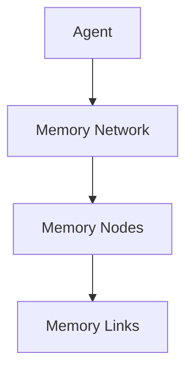
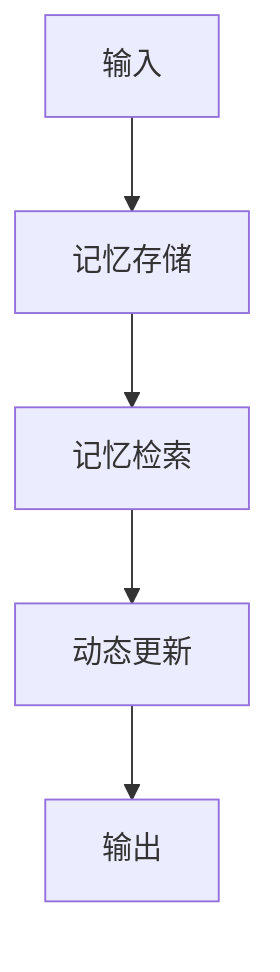
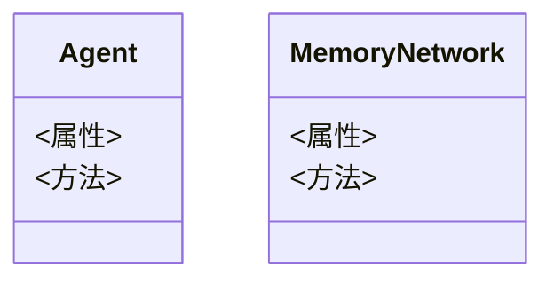
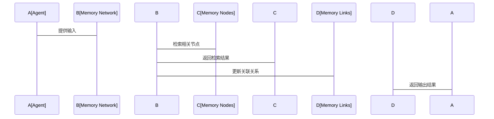

                 


# 设计AI Agent的动态记忆网络

## 关键词：
AI Agent，动态记忆网络，记忆存储，记忆检索，动态更新，系统架构，项目实战

## 摘要：
本文详细探讨了设计AI Agent的动态记忆网络的关键技术，包括其背景、核心概念、算法原理、系统架构、项目实战和最佳实践。通过逐步分析，本文为读者提供了从理论到实践的全面指导，帮助他们理解并构建高效的动态记忆网络。

---

# 第一部分: AI Agent与动态记忆网络概述

## 第1章: AI Agent与动态记忆网络的背景介绍

### 1.1 AI Agent的基本概念
#### 1.1.1 AI Agent的定义与特点
AI Agent（智能体）是指能够感知环境、自主决策并采取行动以实现目标的实体。其特点包括自主性、反应性、目标导向性和学习能力。

#### 1.1.2 AI Agent的应用场景
AI Agent广泛应用于自动驾驶、智能助手、推荐系统和机器人等领域，能够提高系统的智能化水平和决策能力。

#### 1.1.3 动态记忆网络的提出背景
传统记忆机制通常静态或更新频率低，难以应对快速变化的环境。动态记忆网络通过实时更新记忆结构，提高了AI Agent的信息处理效率和适应性。

### 1.2 动态记忆网络的核心概念
#### 1.2.1 动态记忆网络的定义
动态记忆网络是一种能够实时更新和调整记忆结构的机制，用于存储和检索相关信息，帮助AI Agent更好地处理动态环境中的任务。

#### 1.2.2 动态记忆网络的结构与功能
动态记忆网络由记忆节点和记忆链接组成，节点存储信息片段，链接表示关联关系。其功能包括记忆存储、检索和动态更新。

#### 1.2.3 动态记忆网络的边界与外延
动态记忆网络专注于存储和检索信息，边界在于不直接处理外部环境的感知和行动，外延则包括与AI Agent其他模块的交互。

---

## 第2章: 动态记忆网络的核心概念与联系

### 2.1 动态记忆网络的原理
#### 2.1.1 记忆存储机制
动态记忆网络通过图结构存储信息，节点代表信息片段，边表示关联关系，支持高效的信息组织和检索。

#### 2.1.2 记忆检索机制
基于关键词或上下文进行检索，使用图遍历算法（如DFS、BFS）找到相关节点，确保快速准确地获取所需信息。

#### 2.1.3 动态更新机制
根据新信息调整记忆网络，包括插入新节点、修改节点属性或调整边权重，保持记忆结构的准确性和相关性。

### 2.2 核心概念对比表格
表2-1: 动态记忆网络与传统记忆机制的对比

| 特性                | 动态记忆网络                | 传统记忆机制              |
|---------------------|----------------------------|---------------------------|
| 更新频率            | 实时更新                   | 定期或静态               |
| 结构复杂度          | 高度动态                   | 较低或固定               |
| 检索效率            | 高，基于关联关系           | 较低，基于关键词或位置     |

### 2.3 ER实体关系图


---

## 第3章: 动态记忆网络的算法原理

### 3.1 算法流程


### 3.2 核心算法实现
```python
def dynamic_memory_update(input, memory):
    # 记忆检索
    retrieved = memory_retrieve(input, memory)
    # 动态更新
    updated_memory = memory_update(retrieved, input)
    return updated_memory
```

### 3.3 数学模型与公式
#### 3.3.1 记忆存储公式
$$ memory = f_{\theta}(input) $$
其中，$f_{\theta}$表示记忆存储函数，$\theta$为模型参数。

#### 3.3.2 记忆检索公式
$$ retrieved = g_{\phi}(memory, input) $$
其中，$g_{\phi}$表示记忆检索函数，$\phi$为检索模型参数。

#### 3.3.3 动态更新公式
$$ updated\_memory = h_{\psi}(retrieved, input) $$
其中，$h_{\psi}$表示动态更新函数，$\psi$为更新模型参数。

---

## 第4章: 系统分析与架构设计方案

### 4.1 系统功能设计
#### 4.1.1 领域模型


### 4.2 系统架构设计


### 4.3 系统接口设计
- 输入接口：接收外部输入信息，如感知数据或用户指令。
- 输出接口：提供检索结果或更新后的记忆网络状态。

### 4.4 系统交互


---

## 第5章: 项目实战

### 5.1 环境配置
- 选择合适的工具和库，如Python、图数据库（Neo4j）和深度学习框架（TensorFlow）。

### 5.2 核心代码实现
```python
import neo4j
from neo4j import GraphDatabase

class MemoryNetwork:
    def __init__(self, uri, user, password):
        self.driver = GraphDatabase.driver(uri, user, password)
    
    def store_memory(self, input, memory):
        # 实现记忆存储逻辑
        pass
    
    def retrieve_memory(self, input):
        # 实现记忆检索逻辑
        pass
    
    def update_memory(self, retrieved, input):
        # 实现动态更新逻辑
        pass
```

### 5.3 案例分析
通过具体案例展示动态记忆网络的应用，如对话系统中的信息检索和更新，验证系统的有效性和高效性。

### 5.4 项目总结
总结项目实施过程中的经验和教训，提出改进建议和未来发展方向。

---

## 第6章: 最佳实践与小结

### 6.1 小结
总结全文，强调动态记忆网络的重要性和设计要点，为读者提供全面的理论和技术指导。

### 6.2 注意事项
在设计和实现动态记忆网络时，需注意数据安全、检索效率和系统扩展性等问题。

### 6.3 拓展阅读
推荐相关领域的书籍和论文，鼓励读者深入研究和探索动态记忆网络的前沿技术。

---

# 结语

设计AI Agent的动态记忆网络是一项复杂而富有挑战性的任务，需要综合考虑结构、算法和系统架构等多个方面。通过本文的详细讲解和实际案例分析，读者可以掌握设计动态记忆网络的核心技术，为构建高效智能的AI系统奠定坚实基础。

