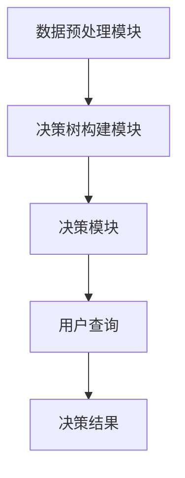

                 


# 设计AI Agent的可解释决策树

> 关键词：AI Agent, 可解释性, 决策树, 算法原理, 系统架构, 项目实战

> 摘要：本文详细探讨了设计AI Agent的可解释决策树的方法，从基本概念到算法原理，再到系统架构和实际项目实现，全面解析了如何在AI Agent中构建和优化可解释的决策树模型，以提升系统的透明度和用户信任度。

---

# 第一部分: AI Agent与可解释决策树的背景与基础

# 第1章: AI Agent与可解释决策树概述

## 1.1 AI Agent的基本概念

### 1.1.1 AI Agent的定义
AI Agent（人工智能代理）是指在特定环境中能够感知并自主行动以实现目标的智能实体。它可以是一个软件程序，也可以是物理机器人，通过感知环境信息、执行决策并采取行动来完成任务。

### 1.1.2 AI Agent的核心特点
- **自主性**：能够在没有外部干预的情况下自主决策。
- **反应性**：能够实时感知环境并做出响应。
- **目标导向**：所有行为都围绕特定目标展开。
- **可解释性**：决策过程需要透明，以便用户理解和信任。

### 1.1.3 AI Agent的分类与应用场景
AI Agent可以分为简单反射型、基于模型的反射型、目标驱动型和实用驱动型。应用场景包括推荐系统、自动驾驶、智能客服等。

## 1.2 决策树的基本概念

### 1.2.1 决策树的定义
决策树是一种树状结构，用于表示决策过程。每个内部节点代表一个决策点，叶子节点代表最终结果，边表示条件。

### 1.2.2 决策树的核心属性
- **根节点**：决策的起点。
- **内部节点**：决策点。
- **叶子节点**：决策结果。
- **分支**：条件判断路径。

### 1.2.3 决策树与AI Agent的结合
通过构建决策树，AI Agent可以根据输入条件做出决策，决策过程直观且可解释。

## 1.3 可解释性的重要性

### 1.3.1 可解释性在AI系统中的作用
可解释性是用户信任AI系统的基础，尤其是在涉及用户安全和利益的场景中。

### 1.3.2 决策树在可解释性中的优势
决策树通过树状结构直观展示决策过程，用户可以轻松理解每一步决策的依据。

### 1.3.3 可解释性与用户信任的关系
高可解释性能够提升用户对AI系统的信任，降低因“黑箱”操作带来的不信任感。

## 1.4 本章小结
本章介绍了AI Agent和决策树的基本概念，分析了可解释性在AI Agent中的重要性，并探讨了决策树在可解释性中的优势。

---

# 第2章: 决策树算法原理

## 2.1 决策树的构建过程

### 2.1.1 数据预处理
- 清洗数据，处理缺失值和异常值。
- 标准化和归一化处理。

### 2.1.2 特征选择
- 使用信息增益、信息增益率等指标选择最优特征。

### 2.1.3 决策树的分裂算法
- ID3算法：使用信息增益选择分裂特征。
- C4.5算法：使用信息增益率选择分裂特征。
- CART算法：适用于回归和分类任务，使用基尼指数选择分裂特征。

## 2.2 常见决策树算法

### 2.2.1 ID3算法
ID3算法通过计算信息增益选择最优特征，构建决策树。信息增益公式如下：
$$
\text{信息增益}(D, A) = H(D) - H(D|A)
$$
其中，$H(D)$是数据集的熵，$H(D|A)$是特征$A$下的条件熵。

### 2.2.2 C4.5算法
C4.5算法改进了ID3算法，使用信息增益率作为分裂标准：
$$
\text{信息增益率}(D, A) = \frac{\text{信息增益}(D, A)}{\text{数据熵}(D)}
$$

### 2.2.3 CART算法
CART算法使用基尼指数来选择最优分裂特征：
$$
\text{基尼指数}(D, A) = \sum_{k=1}^{n} p_k(1-p_k)
$$

## 2.3 决策树的优缺点

### 2.3.1 优点
- 可视化，易于理解。
- 适用于分类和回归任务。
- 能处理非线性关系。

### 2.3.2 缺点
- 对噪声数据敏感。
- 易过拟合，可通过剪枝优化。

### 2.3.3 改善决策树性能的方法
- **剪枝**：通过预剪枝或后剪枝减少过拟合。
- **集成方法**：如随机森林和梯度提升树。

## 2.4 本章小结
本章详细讲解了决策树的构建过程和常见算法，分析了决策树的优缺点及优化方法。

---

# 第3章: AI Agent中的决策树可解释性

## 3.1 可解释性在AI Agent中的挑战

### 3.1.1 复杂模型的不可解释性
深度学习模型通常被视为“黑箱”，难以解释其决策过程。

### 3.1.2 用户对决策过程的需求
用户希望了解AI Agent的决策依据，尤其是在关键应用中。

### 3.1.3 可解释性对系统设计的影响
可解释性要求在系统设计阶段就考虑透明性，增加设计复杂性。

## 3.2 决策树在AI Agent中的优势

### 3.2.1 决策过程的可视化
决策树通过树状结构直观展示决策路径，用户可以轻松理解。

### 3.2.2 决策规则的可解释性
决策树的每个节点和分支都对应具体的决策规则，易于解释。

### 3.2.3 可解释性对用户信任的影响
高可解释性能够提升用户对AI Agent的信任，减少误解和抵触情绪。

## 3.3 提高决策树可解释性的方法

### 3.3.1 简化决策树复杂度
通过剪枝减少决策树深度，降低复杂性。

### 3.3.2 可视化决策树结构
使用工具将决策树可视化，帮助用户理解。

### 3.3.3 解释决策树的决策规则
为每个节点添加注释，说明决策依据和逻辑。

## 3.4 本章小结
本章分析了可解释性在AI Agent中的挑战，探讨了决策树在可解释性中的优势，并提出了提高决策树可解释性的方法。

---

# 第4章: AI Agent决策树的设计与实现

## 4.1 AI Agent决策树的设计原则

### 4.1.1 目标明确性
确保决策树的目标与AI Agent的任务一致。

### 4.1.2 可解释性优先
在设计决策树时，优先考虑可解释性，避免过度复杂。

### 4.1.3 可扩展性
设计灵活的架构，便于后续功能扩展。

## 4.2 AI Agent决策树的实现步骤

### 4.2.1 数据收集与预处理
- 收集相关数据。
- 清洗数据，处理缺失值和异常值。

### 4.2.2 特征选择与模型训练
- 使用信息增益等指标选择特征。
- 训练决策树模型。

### 4.2.3 决策树的构建与优化
- 构建决策树结构。
- 使用剪枝优化模型。

## 4.3 基于决策树的AI Agent实现

### 4.3.1 系统架构设计
- **数据处理层**：负责数据预处理和特征提取。
- **决策树构建层**：构建和优化决策树模型。
- **决策层**：根据输入条件，调用决策树进行决策。

### 4.3.2 决策树的训练与部署
- 使用训练数据构建决策树模型。
- 将模型部署到AI Agent中，实时处理决策请求。

### 4.3.3 系统的可解释性验证
- 通过可视化工具展示决策树结构。
- 为每个决策节点添加注释，解释决策逻辑。

## 4.4 本章小结
本章详细讲解了AI Agent决策树的设计原则和实现步骤，分析了系统架构设计和可解释性验证方法。

---

# 第5章: 系统架构

## 5.1 系统架构设计

### 5.1.1 系统功能设计
- 数据预处理模块：负责数据清洗和特征提取。
- 决策树构建模块：构建和优化决策树模型。
- 决策模块：根据输入条件，调用决策树进行决策。

### 5.1.2 系统架构图


### 5.1.3 系统交互流程
1. 用户提交查询请求。
2. 数据预处理模块处理数据。
3. 决策树构建模块构建模型。
4. 决策模块根据模型进行决策。
5. 返回决策结果。

## 5.2 系统接口设计

### 5.2.1 API接口设计
- `/api/train`：训练决策树模型。
- `/api/predict`：根据输入条件进行预测。

### 5.2.2 接口交互流程
1. 用户调用训练接口，传入训练数据。
2. 系统构建决策树模型。
3. 用户调用预测接口，传入输入条件。
4. 系统返回决策结果。

## 5.3 本章小结
本章设计了AI Agent的系统架构，包括功能模块、系统架构图和交互流程。

---

# 第6章: 项目实战

## 6.1 环境安装

### 6.1.1 安装Python
确保安装Python 3.6以上版本。

### 6.1.2 安装依赖库
安装numpy、pandas、scikit-learn等依赖库。

## 6.2 核心实现源代码

### 6.2.1 数据预处理
```python
import pandas as pd
from sklearn.tree import DecisionTreeClassifier
from sklearn.model_selection import train_test_split
from sklearn.metrics import accuracy_score

# 加载数据
data = pd.read_csv('data.csv')

# 分离特征与标签
X = data.drop('target', axis=1)
y = data['target']

# 划分训练集和测试集
X_train, X_test, y_train, y_test = train_test_split(X, y, test_size=0.2)

# 构建决策树模型
model = DecisionTreeClassifier()
model.fit(X_train, y_train)

# 预测结果
y_pred = model.predict(X_test)
print("准确率:", accuracy_score(y_test, y_pred))
```

### 6.2.2 可视化决策树结构
```python
from sklearn.tree import export_graphviz
import graphviz

# 可视化决策树
export_graphviz(model, out_file='tree.dot', feature_names=X.columns)
with open('tree.dot', 'r') as f:
    dot_data = f.read()
graph = graphviz.Source(dot_data)
graph.render('tree.pdf')
```

## 6.3 实际案例分析

### 6.3.1 案例背景
以一个客服机器人为例，根据用户输入的问题类型进行分类。

### 6.3.2 数据分析
分析用户输入的问题类型，构建分类模型。

### 6.3.3 决策树应用
构建决策树模型，分类用户问题类型，提高分类准确率和可解释性。

## 6.4 本章小结
本章通过实际案例展示了如何在项目中设计和实现可解释的决策树模型，分析了项目的实现过程和关键点。

---

# 第7章: 最佳实践与总结

## 7.1 最佳实践 tips
- 在设计决策树时，优先考虑可解释性。
- 使用可视化工具展示决策树结构，帮助用户理解。
- 定期优化决策树模型，提高准确率和性能。

## 7.2 小结
本文详细探讨了设计AI Agent的可解释决策树的方法，从基本概念到算法原理，再到系统架构和实际项目实现，全面解析了如何在AI Agent中构建和优化可解释的决策树模型。

## 7.3 注意事项
- 确保数据质量和完整性。
- 选择合适的决策树算法，根据任务需求调整参数。
- 定期监控模型性能，及时优化。

## 7.4 拓展阅读
推荐阅读《集体智慧编程》和《机器学习实战》，深入理解可解释性在AI系统中的重要性。

---

# 附录: 决策树相关工具与库

## 1. 常见工具
- **scikit-learn**：Python机器学习库，支持多种决策树算法。
- **graphviz**：用于可视化决策树结构。
- **pydotplus**：扩展graphviz的功能，支持更多格式的图形输出。

## 2. 其他资源
- [决策树算法资料](https://scikit-learn.org/stable/modules/tree.html)
- [可解释性AI资源](https://explained.ai/)

---

通过以上结构，您可以撰写一篇详细的技术博客文章，涵盖从理论到实践的各个方面，帮助读者理解如何设计AI Agent的可解释决策树。

