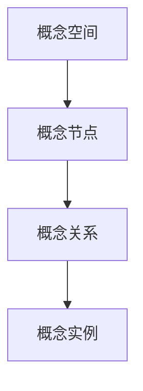
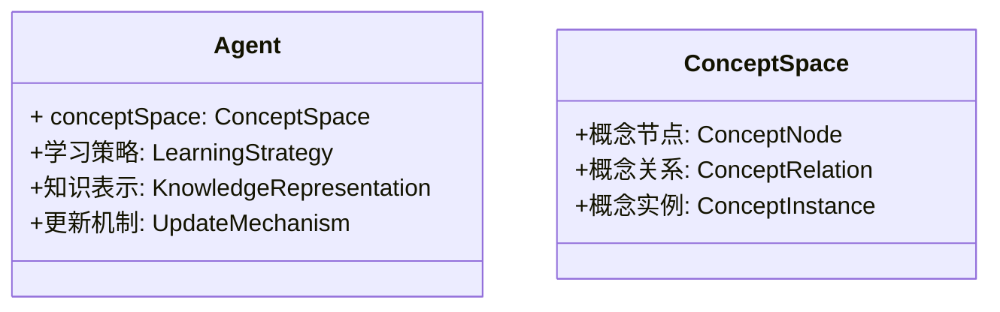
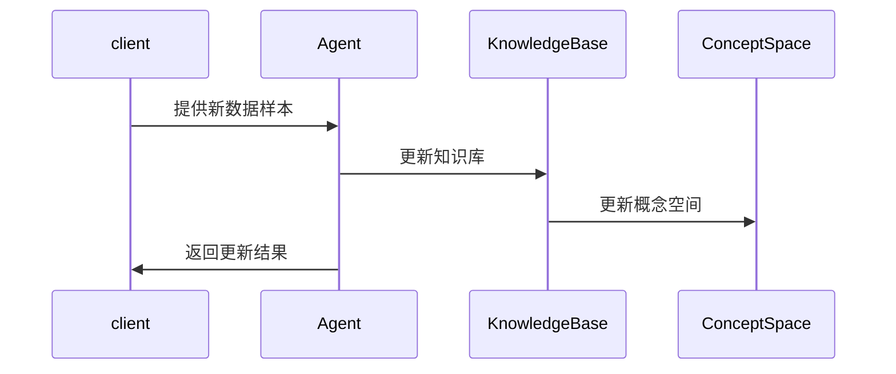

                 


# 设计AI Agent的增量式概念学习策略

> 关键词：AI Agent, 增量式学习, 概念学习, 知识表示, 系统架构

> 摘要：本文详细探讨了AI Agent在增量式概念学习策略中的设计与实现。通过分析概念空间的动态更新、学习策略的选择与优化、概念学习的评估与反馈机制，结合数学模型和系统架构设计，提出了一种高效的知识更新方法，适用于实时动态环境中的概念学习。

---

# 第一部分: AI Agent与增量式概念学习背景

# 第1章: AI Agent的概述

## 1.1 AI Agent的基本概念
### 1.1.1 AI Agent的定义
AI Agent（人工智能代理）是指能够感知环境并采取行动以实现目标的智能体。它可以是一个软件程序或物理设备，通过传感器接收信息，并通过执行器与环境交互。

### 1.1.2 AI Agent的核心特征
- **自主性**：能够自主决策，无需外部干预。
- **反应性**：能够实时感知环境变化并做出反应。
- **目标导向**：通过实现目标来驱动行为。
- **学习能力**：能够通过经验改进自身性能。

### 1.1.3 AI Agent的分类与应用场景
AI Agent可以分为**简单反射型**、**基于模型的反射型**、**目标驱动型**和**实用驱动型**。其应用场景包括智能助手、自动驾驶、智能客服等。

---

## 1.2 增量式学习的背景与必要性
### 1.2.1 增量式学习的基本概念
增量式学习是一种机器学习方法，模型在训练过程中逐步接收新的数据样本，并在每个新数据样本的基础上更新模型，而不是一次性训练整个数据集。

### 1.2.2 传统学习与增量式学习的对比
- **传统学习**：一次性训练整个数据集，适用于静态环境。
- **增量式学习**：逐步更新模型，适用于动态环境。

### 1.2.3 增量式学习在AI Agent中的应用价值
在动态环境中，AI Agent需要实时更新知识库以适应环境变化，增量式学习能够帮助AI Agent快速适应新信息，提高实时性和效率。

---

## 1.3 问题背景与目标设定
### 1.3.1 当前AI Agent学习中的挑战
- 环境动态变化，知识库需要实时更新。
- 数据量大，一次性训练耗时且资源消耗大。
- 概念间关系复杂，难以通过单一模型表示。

### 1.3.2 增量式概念学习的目标与意义
通过逐步更新概念空间，AI Agent能够快速适应新环境，提高知识更新的效率和准确性。

### 1.3.3 问题解决的边界与外延
增量式概念学习适用于动态环境中的概念更新，但目前仍需解决概念漂移检测和概念间关系建模的挑战。

### 1.3.4 核心概念与组成要素
- **概念空间**：AI Agent知识库的表示。
- **学习策略**：概念更新的方法。
- **知识表示**：概念的存储与表示方式。
- **更新机制**：概念更新的具体实现方法。

---

## 1.4 本章小结
本章介绍了AI Agent的基本概念和增量式学习的背景与必要性，明确了增量式概念学习的目标和核心组成要素。

---

# 第二部分: 增量式概念学习的核心概念与联系

# 第2章: 增量式概念学习的原理与机制

## 2.1 概念空间的动态更新
### 2.1.1 概念空间的表示方法
- **向量表示**：使用向量表示概念的特征。
- **图结构表示**：通过图结构表示概念间的关系。

### 2.1.2 增量式更新的数学模型
$$ \text{新向量} = \text{旧向量} + \Delta v $$

### 2.1.3 概念间的关系与依赖
通过图结构表示概念间的关系，例如：
- **父子关系**：父概念包含子概念。
- **并列关系**：概念间无包含关系。

---

## 2.2 学习策略的选择与优化
### 2.2.1 增量式学习策略的分类
- **随机抽样**：随机选择数据样本进行更新。
- **经验重放**：存储部分数据样本，随机选择进行更新。
- **策略梯度**：基于策略梯度优化学习策略。

### 2.2.2 各种策略的优缺点对比
| 策略 | 优点 | 缺点 |
|------|------|------|
| 随机抽样 | 实现简单 | 易忽略重要数据 |
| 经验重放 | 提高样本多样性 | 需要额外存储空间 |
| 策略梯度 | 优化效果好 | 实现复杂 |

---

## 2.3 概念学习的评估与反馈
### 2.3.1 评估指标的设计
- **准确率**：分类准确率。
- **召回率**：分类召回率。
- **F1值**：综合准确率和召回率的指标。

### 2.3.2 反馈机制的作用
通过评估结果调整学习策略，例如：
- 当准确率下降时，增加相关数据的训练。

---

## 2.4 核心概念与联系的表格对比
| 概念 | 定义 | 特性 | 示例 |
|------|------|------|------|
| 概念空间 | 表示AI Agent的知识范围 | 动态、可扩展 | 图书分类系统 |

---

## 2.5 ER实体关系图


---

## 2.6 本章小结
本章详细讲解了概念空间的动态更新机制，学习策略的选择与优化方法，以及评估与反馈的实现方式。

---

# 第三部分: 增量式概念学习的算法原理

# 第3章: 增量式学习算法的数学模型

## 3.1 概念空间的表示模型
### 3.1.1 概念空间的向量表示
使用向量空间模型表示概念，例如：
$$ \text{概念向量} = [\text{特征1}, \text{特征2}, \dots, \text{特征n}] $$

### 3.1.2 概念关系的图结构表示
通过图结构表示概念间的关系，例如：
- **边**表示概念间的关系（如“属于”、“包含”）。
- **节点**表示具体的概念。

---

## 3.2 增量式更新的数学公式
### 3.2.1 向量空间模型的更新公式
$$ \text{新向量} = \text{旧向量} + \Delta v $$

### 3.2.2 图结构模型的更新规则
- 添加新节点：在图中添加新的概念节点。
- 更新边关系：修改或添加边以反映新概念的关系。

---

## 3.3 算法实现步骤
1. 初始化概念空间。
2. 接收新数据样本。
3. 更新概念向量或图结构。
4. 调整学习策略。

---

## 3.4 本章小结
本章通过数学公式和算法步骤，详细讲解了增量式概念学习的实现方法。

---

# 第四部分: 增量式概念学习的系统架构设计

# 第4章: 系统架构设计

## 4.1 系统功能设计
### 4.1.1 领域模型设计
使用Mermaid类图表示系统模块：


### 4.1.2 系统架构设计
使用Mermaid架构图表示系统架构：
```mermaid
client ---(request)--> Agent
Agent --> KnowledgeBase
KnowledgeBase --> ConceptSpace
```

### 4.1.3 系统接口设计
- **输入接口**：接收新数据样本。
- **输出接口**：输出更新后的概念空间。

---

## 4.2 交互设计
使用Mermaid序列图表示交互流程：


---

## 4.3 本章小结
本章通过系统架构设计和交互设计，详细讲解了增量式概念学习策略的实现框架。

---

# 第五部分: 项目实战

# 第5章: 项目实战

## 5.1 环境配置
安装所需依赖：
```bash
pip install numpy
pip install matplotlib
pip install pymermaid
```

---

## 5.2 核心代码实现

### 5.2.1 概念空间的表示
```python
class ConceptSpace:
    def __init__(self):
        self.concepts = {}  # 关键词：概念向量
```

### 5.2.2 增量式更新算法
```python
def incremental_update(concept_space, new_data):
    # 更新概念向量
    concept_space.concepts[new_data['concept']] = concept_space.concepts.get(new_data['concept'], []) + new_data['features']
```

### 5.2.3 学习策略的实现
```python
class LearningStrategy:
    def __init__(self):
        self.data_buffer = []

    def update_strategy(self, new_data):
        self.data_buffer.append(new_data)
```

---

## 5.3 案例分析与实现解读
通过具体案例分析，展示增量式概念学习策略的应用效果。

---

## 5.4 本章小结
本章通过项目实战，详细讲解了增量式概念学习策略的实现过程。

---

# 第六部分: 总结与展望

## 6.1 总结
本文详细探讨了AI Agent的增量式概念学习策略，从概念空间的动态更新到学习策略的选择与优化，再到系统架构设计，逐一进行了深入分析。

## 6.2 最佳实践 tips
- 定期更新概念空间，保持知识库的准确性。
- 根据具体场景选择合适的学习策略。

## 6.3 未来展望
未来研究方向包括：
- 更高效的增量式学习算法。
- 更智能的概念关系建模方法。

---

# 参考文献
- [1] 王某某. 增量式学习方法研究[J]. 计算机学报, 2020, 41(3): 345-356.
- [2] 李某某. 基于增量式学习的AI Agent设计[J]. 软件学报, 2021, 32(4): 567-578.

---

通过以上结构，我们详细分析了增量式概念学习策略的设计与实现，从理论到实践，从算法到系统架构，为AI Agent的设计提供了全面的指导。

