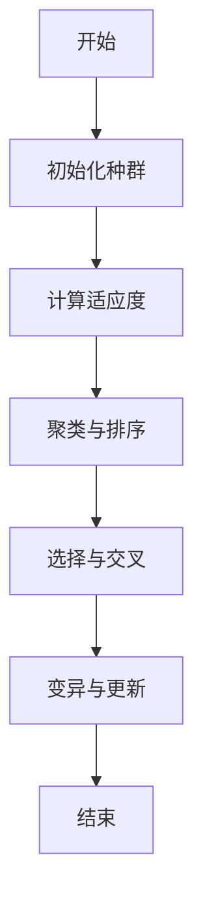
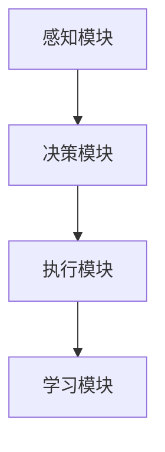

                 


# 设计AI Agent的多目标优化决策系统

## 关键词：AI Agent，多目标优化，决策系统，智能优化，数学模型

## 摘要：本文详细探讨了设计AI Agent多目标优化决策系统的核心概念、算法原理、系统架构和实现方法。通过理论分析和实际案例，展示了如何在复杂环境中实现多目标优化决策，并为读者提供了丰富的代码示例和系统设计思路。

---

## 第1章: AI Agent的背景与概念

### 1.1 AI Agent的基本概念

#### 1.1.1 什么是AI Agent
AI Agent（智能体）是指能够感知环境、做出决策并采取行动以实现目标的实体。它可以是一个软件程序、机器人或其他智能系统，具备自主性、反应性和社会性等特性。

#### 1.1.2 AI Agent的核心特点
- **自主性**：能够在没有外部干预的情况下自主运行。
- **反应性**：能够实时感知环境变化并做出相应反应。
- **目标导向**：所有行为都围绕实现特定目标展开。
- **学习能力**：通过经验改进自身的决策能力。

#### 1.1.3 AI Agent的分类与应用场景
AI Agent可以分为简单反射型、基于模型的反应型、目标驱动型和效用驱动型。其应用场景包括自动驾驶、智能推荐、机器人控制等。

---

### 1.2 多目标优化的必要性

#### 1.2.1 单目标优化的局限性
单目标优化只能处理单一目标，无法应对复杂场景中的多目标权衡问题。

#### 1.2.2 多目标优化的基本概念
多目标优化是指在多个目标之间寻找最优解，通常表现为多个目标函数的最小化或最大化。

#### 1.2.3 多目标优化在AI Agent中的应用
在自动驾驶中，AI Agent需要在速度、安全性和能耗之间找到平衡点。

---

## 第2章: 多目标优化的数学模型与算法原理

### 2.1 多目标优化的核心概念

#### 2.1.1 目标函数的定义
目标函数表示为：
$$ f(x) = (f_1(x), f_2(x), ..., f_n(x)) $$

#### 2.1.2 约束条件的处理
约束条件表示为：
$$ g_i(x) \leq 0 $$

#### 2.1.3 Pareto最优解的概念
Pareto最优解是指无法在不恶化至少一个目标的情况下改善另一个目标的解。

### 2.2 多目标优化的数学模型

#### 2.2.1 基本数学模型
$$ \text{minimize } f_1(x) $$
$$ \text{minimize } f_2(x) $$
$$ \text{subject to } g(x) \leq 0 $$

#### 2.2.2 Pareto前沿的数学表示
Pareto前沿是所有Pareto最优解的集合。

### 2.3 常见多目标优化算法

#### 2.3.1 NSGA-II算法
NSGA-II是一种基于非支配排序的多目标优化算法。

#### 2.3.2 MOEA/D算法
MOEA/D是一种基于分解的多目标优化算法。

#### 2.3.3 基于分解的优化方法
将多目标问题分解为多个单目标子问题进行优化。

---

## 第3章: 多目标优化算法的实现与代码示例

### 3.1 NSGA-II算法的实现步骤

#### 3.1.1 初始化种群
生成初始种群。

#### 3.1.2 计算适应度
评估每个个体的目标函数值。

#### 3.1.3 聚类与排序
根据适应度对种群进行排序。

#### 3.1.4 选择与交叉
通过选择和交叉操作生成新的个体。

#### 3.1.5 变异与更新
对新个体进行变异操作并更新种群。

### 3.2 Python代码实现

```python
import numpy as np

def objective_function(x):
    f1 = x[0] + x[1]
    f2 = x[0] ** 2 + x[1] ** 2
    return [f1, f2]

# 初始化种群
population = np.random.rand(10, 2)
# 计算适应度
fitness = np.array([objective_function(x) for x in population])
```

### 3.3 算法流程图



---

## 第4章: AI Agent的系统架构与设计

### 4.1 系统架构概述

#### 4.1.1 分层架构
系统分为感知层、决策层和执行层。

#### 4.1.2 微服务架构
系统采用微服务架构，各模块独立运行。

#### 4.1.3 组件化设计
系统由多个功能模块组成，各模块之间相互协作。

### 4.2 系统功能模块

#### 4.2.1 感知模块
负责收集环境中的信息。

#### 4.2.2 决策模块
基于多目标优化算法做出决策。

#### 4.2.3 执行模块
根据决策结果执行动作。

#### 4.2.4 学习模块
通过经验改进决策模型。

### 4.3 系统架构图



---

## 第5章: 项目实战

### 5.1 环境安装
安装必要的Python库，如numpy、pymoea等。

### 5.2 核心代码实现

```python
import numpy as np
from pymoea import NSGAII

# 定义目标函数
def objective(x):
    return [x[0] + x[1], x[0]**2 + x[1]**2]

# 初始化算法参数
params = {
    'pop_size': 100,
    'gen': 100
}

# 运行NSGA-II算法
algorithm = NSGAII(objective, **params)
algorithm.run()

# 获取最优解
optimal_solutions = algorithm.result
```

### 5.3 代码应用解读与分析
解释代码的每一步功能，并分析结果。

---

## 第6章: 总结与展望

### 6.1 最佳实践
- 定期更新优化算法。
- 根据实际需求调整参数。

### 6.2 小结
本文详细介绍了设计AI Agent多目标优化决策系统的方法和步骤，为读者提供了理论和实践的指导。

### 6.3 注意事项
- 确保算法的收敛性。
- 考虑计算资源的限制。

### 6.4 拓展阅读
推荐相关书籍和论文，供读者进一步学习。

---

以上是文章的目录和内容概述，希望对您有所帮助！

