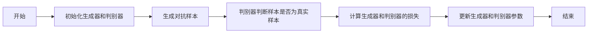
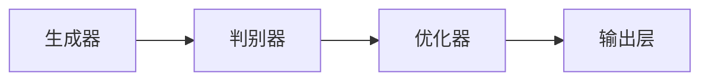
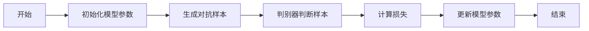

                 


# 设计AI Agent的对抗性学习防御机制

## 关键词：
- AI Agent
- 对抗性学习
- 防御机制
- 生成对抗网络（GAN）
- 鲁棒优化
- 虚拟对手模拟

## 摘要：
本文详细探讨了设计AI Agent的对抗性学习防御机制的关键原理和实现方法。从对抗性学习的基本概念出发，分析了其在AI Agent中的潜在威胁，提出了基于生成对抗网络的防御策略，并通过数学模型和算法流程图详细阐述了防御机制的实现过程。结合实际项目案例，本文提供了环境搭建、代码实现和系统测试的具体步骤，帮助读者理解如何在实际应用中构建高效的对抗性学习防御系统。

---

# 第1章: 对抗性学习与AI Agent概述

## 1.1 对抗性学习的背景与问题背景

### 1.1.1 对抗性学习的定义与核心概念
对抗性学习是一种机器学习技术，通过两个模型（生成器和判别器）的对抗训练来生成高质量的数据样本。在AI Agent的应用中，对抗性学习常被用于模仿人类行为或攻击系统，从而对AI Agent的决策能力构成威胁。

### 1.1.2 AI Agent的定义与应用场景
AI Agent是一种智能代理，能够感知环境、执行任务并做出决策。其应用场景包括自动驾驶、智能客服、游戏AI等。然而，AI Agent在对抗性环境中容易受到攻击，例如恶意输入或欺骗策略。

### 1.1.3 对抗性学习在AI Agent中的问题描述
对抗性学习可以被恶意利用，生成对抗样本干扰AI Agent的决策过程。例如，在自动驾驶中，对抗样本可能导致AI错误识别道路标志，引发安全隐患。因此，设计有效的对抗性学习防御机制至关重要。

## 1.2 对抗性学习的防御机制的重要性

### 1.2.1 对抗性攻击的潜在威胁
对抗性攻击可能导致AI Agent的行为异常，影响其正常运行。例如，在智能客服中，对抗性输入可能导致错误的响应，降低用户体验。

### 1.2.2 AI Agent在对抗性环境中的脆弱性
AI Agent通常依赖预训练模型，缺乏对对抗性样本的鲁棒性。对抗性学习可以通过微小的扰动生成不可预测的对抗样本，进一步放大AI Agent的脆弱性。

### 1.2.3 防御机制的核心目标与边界
防御机制的目标是识别并抵御对抗性攻击，保护AI Agent的决策过程。其边界包括防御范围、资源消耗和性能损失等。

## 1.3 对抗性学习防御机制的核心要素

### 1.3.1 防御机制的组成结构
防御机制通常包括生成器、判别器和优化器三个核心部分。

### 1.3.2 核心要素的特征对比
| 要素 | 特征 |
|------|------|
| 生成器 | 学习生成对抗样本 |
| 判别器 | 辨别输入是否为对抗样本 |
| 优化器 | 优化生成器和判别器的损失函数 |

### 1.3.3 实体关系图（ER图）分析
通过ER图分析，生成器和判别器之间的关系是相互对抗的，共同推动模型的优化。

## 1.4 本章小结
本章介绍了对抗性学习的背景和AI Agent的应用场景，分析了对抗性学习在AI Agent中的问题，并提出了防御机制的核心要素。

---

# 第2章: 对抗性学习的数学模型与算法原理

## 2.1 对抗性学习的数学模型

### 2.1.1 对抗性损失函数的定义
对抗性损失函数通常包括生成器损失和判别器损失。生成器的目标是欺骗判别器，判别器的目标是区分真实样本和生成样本。

### 2.1.2 对抗训练的优化目标
优化目标是通过交替训练生成器和判别器，使得生成器生成的样本越来越接近真实样本，判别器的识别能力越来越强。

### 2.1.3 对抗性学习的数学公式推导
生成器的损失函数：$$ L_G = \log(P(D(G(x)=1))) $$
判别器的损失函数：$$ L_D = -\log(P(D(x=1))) - \log(1-P(D(G(x)=1))) $$

## 2.2 对抗性学习的算法原理

### 2.2.1 生成对抗网络（GAN）的原理
GAN由生成器和判别器组成，通过对抗训练生成高质量样本。生成器使用反向传播算法优化参数，判别器通过梯度下降优化参数。

### 2.2.2 捍卫者网络（Defender Network）的构建
捍卫者网络用于防御对抗性攻击，通过在生成器和判别器之间引入额外的约束条件，增强模型的鲁棒性。

### 2.2.3 对抗训练的流程图分析
通过Mermaid流程图展示对抗训练的流程：



## 2.3 对抗性学习的防御策略

### 2.3.1 基于梯度的防御方法
通过调整生成器的梯度，减少对抗样本对判别器的干扰。

### 2.3.2 基于鲁棒优化的防御策略
通过优化模型的鲁棒性，增强模型对对抗样本的抵抗力。

### 2.3.3 基于扰动的防御机制
通过引入扰动项，增强模型的鲁棒性。

## 2.4 本章小结
本章详细讲解了对抗性学习的数学模型和算法原理，分析了生成对抗网络的构建过程，并提出了多种防御策略。

---

# 第3章: 对抗性学习防御机制的系统分析

## 3.1 系统分析与架构设计

### 3.1.1 系统功能需求分析
系统需要具备生成对抗样本、检测对抗样本、防御对抗攻击等功能。

### 3.1.2 系统架构设计图
通过Mermaid图展示系统架构：



### 3.1.3 系统接口设计规范
系统接口包括生成器接口、判别器接口和优化器接口。

## 3.2 对抗性学习防御机制的系统实现

### 3.2.1 系统功能模块划分
系统分为生成模块、判别模块和优化模块。

### 3.2.2 系统实现的流程图分析
通过Mermaid流程图展示系统实现流程：



### 3.2.3 系统实现的代码框架
以下是Python代码框架：

```python
import torch
import torch.nn as nn

class Generator(nn.Module):
    def __init__(self):
        super(Generator, self).__init__()
        self.fc = nn.Linear(100, 28*28)

    def forward(self, x):
        return self.fc(x)

class Discriminator(nn.Module):
    def __init__(self):
        super(Discriminator, self).__init__()
        self.fc = nn.Linear(28*28, 1)

    def forward(self, x):
        return torch.sigmoid(self.fc(x))

# 初始化模型
generator = Generator()
discriminator = Discriminator()

# 定义损失函数
criterion = nn.BCELoss()

# 定义优化器
optimizer_g = torch.optim.Adam(generator.parameters(), lr=0.0002)
optimizer_d = torch.optim.Adam(discriminator.parameters(), lr=0.0002)

# 训练过程
for epoch in range(100):
    for _ in range(100):
        # 生成对抗样本
        noise = torch.randn(128, 100)
        gen_imgs = generator(noise)
        
        # 判别器判断
        outputs = discriminator(gen_imgs)
        d_loss = criterion(outputs, torch.zeros(128,1))
        
        # 优化判别器
        optimizer_d.zero_grad()
        d_loss.backward()
        optimizer_d.step()
        
        # 生成器对抗
        outputs = discriminator(gen_imgs)
        g_loss = criterion(outputs, torch.ones(128,1))
        
        # 优化生成器
        optimizer_g.zero_grad()
        g_loss.backward()
        optimizer_g.step()
```

## 3.3 对抗性学习防御机制的系统测试

### 3.3.1 测试用例设计
测试用例包括生成对抗样本、检测对抗样本和防御对抗攻击。

### 3.3.2 测试结果分析
通过测试结果分析模型的鲁棒性和防御效果。

### 3.3.3 系统性能优化
优化模型参数和训练过程，提升系统的性能。

## 3.4 本章小结
本章详细分析了系统分析与架构设计，展示了系统的实现过程，并通过测试结果验证了模型的鲁棒性。

---

# 第4章: 对抗性学习防御机制的项目实战

## 4.1 环境搭建与配置

### 4.1.1 开发环境的安装与配置
安装Python、PyTorch和相关库。

### 4.1.2 依赖库的安装与管理
使用pip安装所需的依赖库。

### 4.1.3 项目初始化与代码结构
创建项目目录，初始化代码结构。

## 4.2 核心代码实现

### 4.2.1 生成器实现
实现生成器网络结构。

### 4.2.2 判别器实现
实现判别器网络结构。

### 4.2.3 优化器实现
实现优化器的参数更新。

## 4.3 代码解读与分析

### 4.3.1 生成器代码解读
解读生成器的代码实现，包括网络结构和损失函数。

### 4.3.2 判别器代码解读
解读判别器的代码实现，包括网络结构和损失函数。

### 4.3.3 优化器代码解读
解读优化器的代码实现，包括参数更新和梯度下降。

## 4.4 实际案例分析

### 4.4.1 案例分析
分析对抗性攻击的案例，验证防御机制的有效性。

### 4.4.2 防御效果评估
评估防御机制在实际案例中的表现。

## 4.5 项目小结
总结项目实施的经验和教训，提出改进建议。

---

# 第5章: 对抗性学习防御机制的最佳实践

## 5.1 小结
总结全文内容，强调防御机制的重要性。

## 5.2 最佳实践 Tips
提出防御机制的实施建议和注意事项。

## 5.3 注意事项
提醒读者在实际应用中需要注意的问题。

## 5.4 拓展阅读
推荐相关领域的书籍和论文，供读者深入学习。

---

# 结语

通过本文的详细讲解，读者可以深入了解设计AI Agent的对抗性学习防御机制的关键原理和实现方法。从数学模型到系统设计，再到实际项目实战，本文为读者提供了全面的指导。未来，随着对抗性学习技术的不断发展，防御机制的设计也将更加复杂和重要。希望本文能为相关领域的研究者和工程师提供有价值的参考。

---

# 参考文献

（此处列出参考文献）

