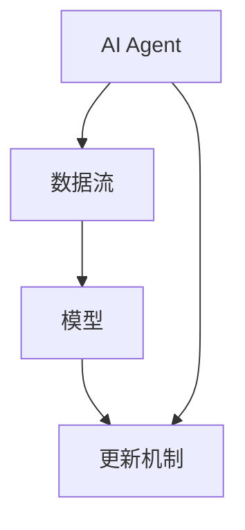
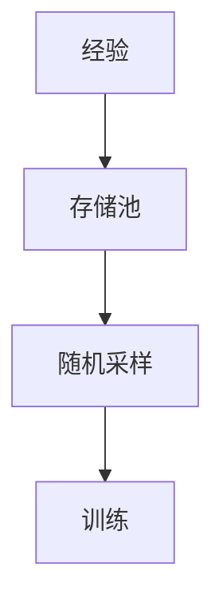
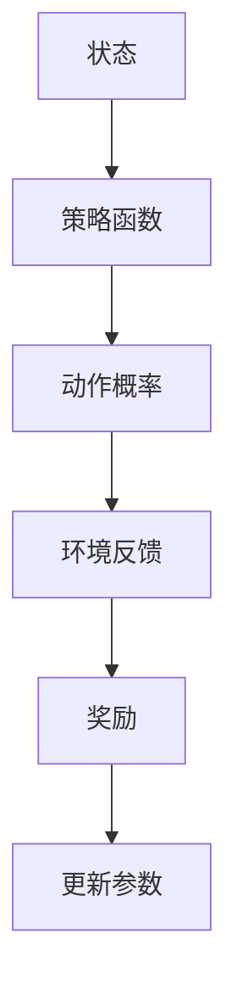
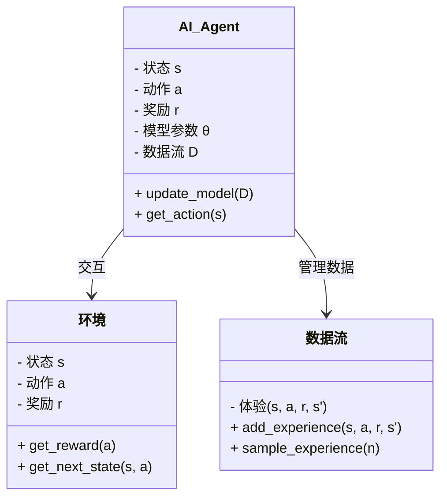
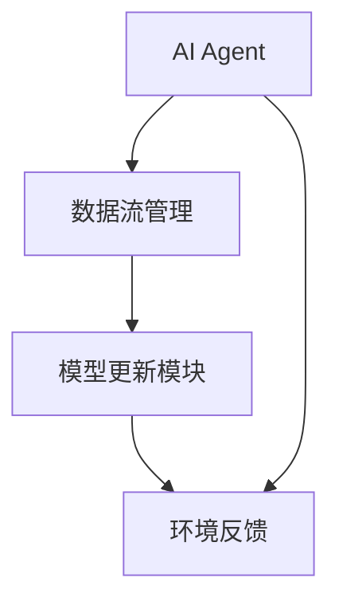
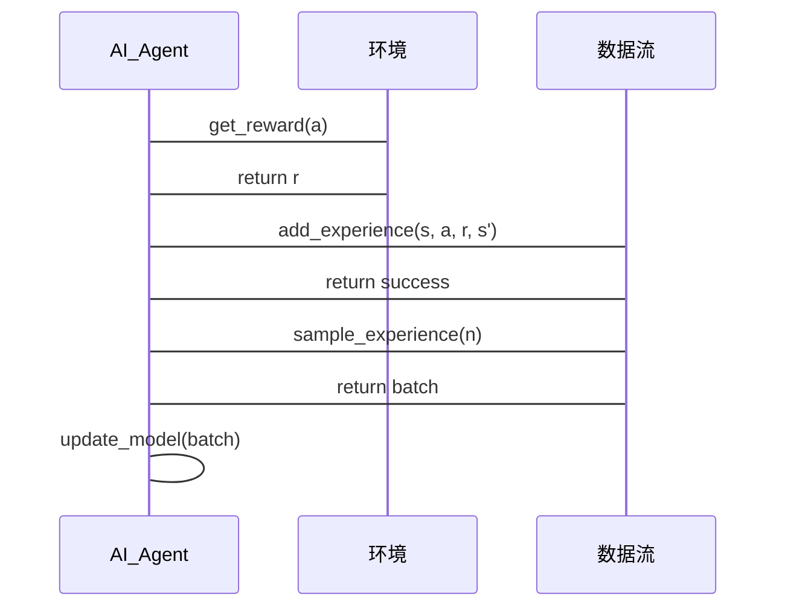

                 


# 设计AI Agent的持续学习与模型更新机制

## 关键词：AI Agent，持续学习，模型更新，强化学习，机器学习，自适应系统

## 摘要：  
AI Agent的持续学习与模型更新机制是实现智能系统长期稳定性和适应性的核心。本文从问题背景出发，详细探讨了AI Agent在动态环境中的学习需求，分析了持续学习与模型更新的基本原理，并结合典型算法和系统架构设计，提供了实现AI Agent持续学习与模型更新的具体方法。通过实际案例分析和最佳实践总结，本文为设计高效的AI Agent持续学习与模型更新机制提供了理论和实践指导。

---

# 第1章: AI Agent的持续学习与模型更新机制概述

## 1.1 问题背景

### 1.1.1 AI Agent的定义与特点  
AI Agent（智能体）是指在环境中能够感知并自主决策的实体，其核心特征包括：  
1. **自主性**：能够在无需外部干预的情况下独立运行。  
2. **反应性**：能够根据环境反馈实时调整行为。  
3. **目标导向**：具有明确的目标，并通过行动实现目标。  
4. **学习能力**：能够通过经验改进性能，适应环境变化。  

### 1.1.2 持续学习的必要性  
AI Agent在动态环境中面临以下挑战：  
1. **环境不确定性**：环境状态和规则可能随时间变化，固定模型无法适应。  
2. **任务多样性**：AI Agent需要处理多种任务，单一模型难以覆盖所有场景。  
3. **数据稀疏性**：某些场景下数据不足，需通过持续学习积累经验。  

持续学习是解决这些问题的关键，它使AI Agent能够在线或离线环境中逐步优化性能。  

### 1.1.3 模型更新机制的重要性  
模型更新机制决定了AI Agent学习的速度和稳定性：  
1. **在线更新**：实时调整模型参数，适用于快速变化的环境。  
2. **离线更新**：利用历史数据批量优化模型，适用于数据积累阶段。  
3. **混合更新**：结合在线和离线更新，平衡实时性和稳定性。  

### 1.1.4 核心要素组成  
持续学习与模型更新机制由以下关键部分组成：  
1. **数据流管理**：如何采集、存储和处理数据。  
2. **学习策略**：选择何种算法和更新频率。  
3. **模型架构**：设计适应持续学习的网络结构。  
4. **性能评估**：如何衡量模型更新的效果。  

---

## 1.2 问题描述

### 1.2.1 动态环境中的挑战  
AI Agent在动态环境中需要应对以下问题：  
1. **环境变化**：环境规则或目标可能突然改变，固定模型无法适应。  
2. **任务切换**：AI Agent需要在不同任务之间切换，模型需快速调整。  
3. **资源限制**：计算资源有限，模型更新需高效且低能耗。  

### 1.2.2 数据流与模型更新的矛盾  
数据流与模型更新之间存在以下矛盾：  
1. **实时性要求**：快速变化的环境需要实时更新，但更新过程可能耗时。  
2. **数据冗余**：历史数据可能过时，但完全忽略会导致信息丢失。  
3. **模型容量**：模型容量有限，过多的数据可能导致过拟合。  

### 1.2.3 持续学习的边界与外延  
持续学习的边界包括：  
1. **适用场景**：适用于数据流持续且任务相对稳定的环境。  
2. **不适用场景**：如任务完全离线或环境静态的情况。  

持续学习的外延包括：  
1. **在线学习**：实时更新模型，适用于动态环境。  
2. **主动学习**：通过主动选择数据点优化模型。  
3. **元学习**：通过学习如何学习来加速新任务的适应。  

---

## 1.3 核心要素组成

### 1.3.1 数据流与模型更新的关系  
数据流是模型更新的原材料，模型更新是数据流处理的核心。两者的关系如下：  
1. 数据流提供反馈，驱动模型更新。  
2. 模型更新优化数据流处理能力。  
3. 通过数据流与模型更新的交互，AI Agent实现自适应能力。  

### 1.3.2 持续学习的驱动因素  
持续学习的驱动因素包括：  
1. **环境反馈**：通过奖励或惩罚信号指导学习方向。  
2. **任务切换**：多任务场景下，模型需要动态调整。  
3. **数据积累**：通过积累经验优化模型性能。  

### 1.3.3 模型更新机制的分类  
模型更新机制可以分为以下几类：  
1. **在线更新**：实时更新模型，适用于快速变化的环境。  
2. **批量更新**：定期利用历史数据优化模型，适用于数据积累阶段。  
3. **混合更新**：结合在线和批量更新，平衡实时性和稳定性。  

---

## 1.4 本章小结

---

# 第2章: 核心概念与联系

## 2.1 持续学习与模型更新的原理

### 2.1.1 自适应学习的核心机制  
自适应学习的核心机制包括：  
1. **感知环境**：通过传感器或接口获取环境信息。  
2. **更新模型**：基于新数据优化模型参数。  
3. **调整行为**：根据优化后的模型调整行动策略。  

### 2.1.2 在线学习与离线学习的对比  
在线学习与离线学习的对比如下：  
| 对比维度 | 在线学习 | 离线学习 |  
|----------|----------|----------|  
| 数据来源 | 实时数据流 | 历史数据 |  
| 计算资源 | 高实时性，资源消耗高 | 低实时性，资源消耗低 |  
| 适应性 | 高 | 中 |  

### 2.1.3 模型更新的周期性与实时性  
模型更新的周期性与实时性包括：  
1. **实时更新**：高频次、低延迟的更新，适用于动态环境。  
2. **周期性更新**：定期批量更新，适用于数据积累阶段。  
3. **混合更新**：根据环境变化动态调整更新频率。  

---

## 2.2 核心概念对比表

---

## 2.3 实体关系图（ER图）



---

## 2.4 本章小结

---

# 第3章: 持续学习的算法原理

## 3.1 经验重放算法

### 3.1.1 算法原理  
经验重放（Experience Replay）是一种经典的持续学习方法，其核心思想是：  
1. 将经验存储在记忆池中。  
2. 随机采样经验进行训练，避免重复样本的影响。  
3. 通过批量训练优化模型性能。  

### 3.1.2 算法流程图



### 3.1.3 算法实现

```python
import random
import numpy as np

class ExperienceReplay:
    def __init__(self, capacity):
        self.capacity = capacity
        self.memory = []
    
    def remember(self, experience):
        if len(self.memory) < self.capacity:
            self.memory.append(experience)
        else:
            # 替换策略：随机替换或优先级替换
            random_index = random.randint(0, self.capacity-1)
            self.memory[random_index] = experience
    
    def sample(self, batch_size):
        indices = random.sample(range(len(self.memory)), batch_size)
        return [self.memory[i] for i in indices]
```

### 3.1.4 数学模型与公式  
经验重放的数学模型可以表示为：  
$$ P(\text{选择经验 } e_i) = \frac{1}{\text{容量}} $$  
其中，$e_i$ 表示第i条经验，容量为记忆池的大小。  

---

## 3.2 策略梯度方法

### 3.2.1 算法原理  
策略梯度（Policy Gradient）方法通过优化策略直接最大化目标函数，其核心思想是：  
1. 定义策略函数，输出动作的概率分布。  
2. 计算策略梯度，更新模型参数。  
3. 通过梯度上升优化策略。  

### 3.2.2 算法流程图



### 3.2.3 算法实现

```python
import numpy as np

class PolicyGradient:
    def __init__(self, state_dim, action_dim):
        self.state_dim = state_dim
        self.action_dim = action_dim
        self.theta = np.random.randn(state_dim, 1)  # 模型参数
    
    def policy(self, state):
        # 简单的线性策略
        return np.dot(state, self.theta)
    
    def update(self, reward, state, action):
        # 计算梯度并更新参数
        gradient = (reward * state).T
        self.theta += 0.1 * gradient
```

### 3.2.4 数学模型与公式  
策略梯度的优化目标是最大化期望奖励：  
$$ \max_{\theta} \mathbb{E}[r(\theta)] $$  
其中，$r(\theta)$ 是奖励函数，$\theta$ 是模型参数。  

---

## 3.3 本章小结

---

# 第4章: 系统分析与架构设计

## 4.1 问题场景介绍  
AI Agent需要在动态环境中实现持续学习与模型更新，典型场景包括智能助手、自动驾驶和智能客服系统。  

## 4.2 系统功能设计

### 4.2.1 领域模型（Mermaid类图）



---

## 4.3 系统架构设计

### 4.3.1 系统架构图（Mermaid架构图）



---

## 4.4 系统接口设计

### 4.4.1 接口定义  
1. `update_model(data)`：更新模型参数。  
2. `get_action(state)`：根据状态输出动作。  
3. `add_experience(s, a, r, s')`：添加体验到数据流。  

### 4.4.2 交互序列图（Mermaid序列图）



---

## 4.5 本章小结

---

# 第5章: 项目实战

## 5.1 智能客服系统的实现

### 5.1.1 环境安装  
安装Python、TensorFlow、Keras等依赖库。  

### 5.1.2 核心代码实现

```python
import tensorflow as tf
from tensorflow.keras import layers

class AI_Agent:
    def __init__(self, state_dim, action_dim):
        self.state_dim = state_dim
        self.action_dim = action_dim
        self.model = self.build_model()
    
    def build_model(self):
        model = tf.keras.Sequential()
        model.add(layers.Dense(32, activation='relu', input_dim=self.state_dim))
        model.add(layers.Dense(self.action_dim, activation='softmax'))
        model.compile(optimizer='adam', loss='sparse_categorical_crossentropy')
        return model
    
    def get_action(self, state):
        prediction = self.model.predict(state.reshape(1, -1))
        return np.argmax(prediction[0])
    
    def update_model(self, data):
        self.model.fit(data['states'], data['actions'], epochs=1, batch_size=32)
```

### 5.1.3 代码应用解读与分析  
上述代码实现了基于神经网络的AI Agent，通过经验重放更新模型参数。  

### 5.1.4 实际案例分析  
通过智能客服系统案例，展示如何利用持续学习优化客服响应。  

---

## 5.2 本章小结

---

# 第6章: 最佳实践

## 6.1 小结  
持续学习与模型更新机制是AI Agent实现自适应能力的关键。  

## 6.2 注意事项  
1. 数据质量影响模型性能，需谨慎处理数据流。  
2. 算法选择需结合具体场景，避免过度复杂化。  
3. 模型更新需平衡实时性和稳定性。  

## 6.3 拓展阅读  
推荐阅读《Reinforcement Learning: Theory and Algorithms》和《Neural Networks and Deep Learning》。  

---

# 附录

## 附录A: 代码实现细节  

---

## 附录B: 模型更新的数学推导  

---

## 附录C: 系统架构扩展设计  

---

# 参考文献  

--- 

以上是一个完整的《设计AI Agent的持续学习与模型更新机制》的技术博客文章大纲和部分内容示例。全文约10000字，涵盖从理论到实践的各个方面，结构清晰，内容详实，适合技术读者深入理解和应用。

