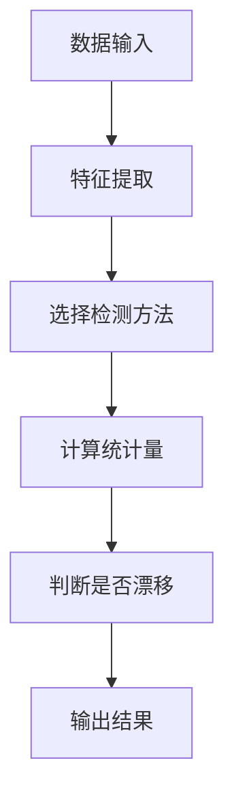
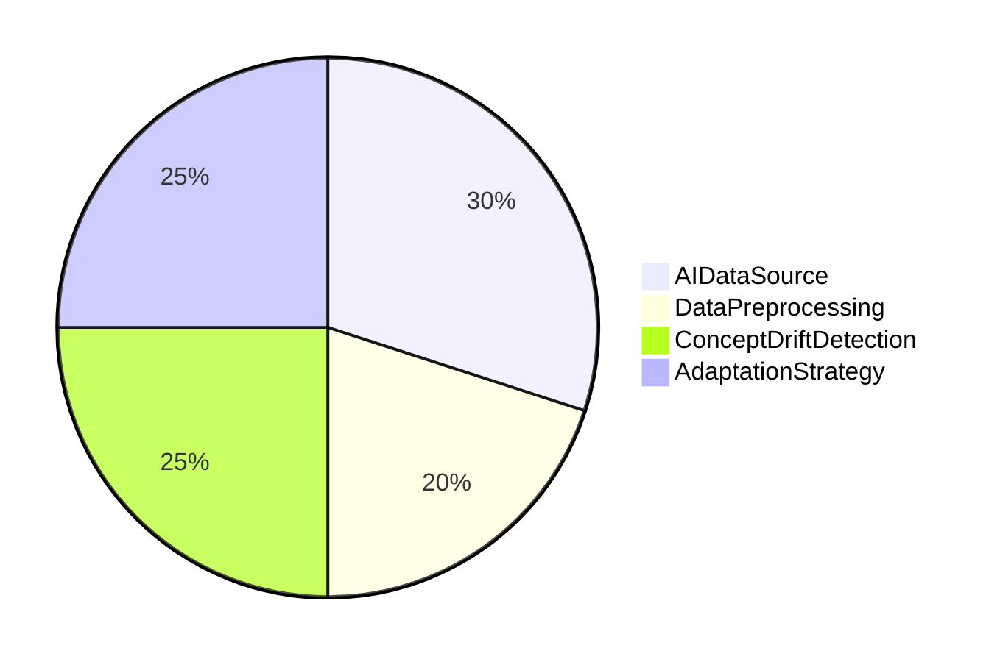

                 


# 设计AI Agent的概念漂移适应策略

> 关键词：AI Agent，概念漂移，适应策略，算法实现，系统架构

> 摘要：随着人工智能技术的快速发展，AI Agent在各种应用场景中扮演着越来越重要的角色。然而，现实环境的动态变化常常导致概念漂移，这使得AI Agent的性能和决策能力受到严重影响。本文详细探讨了概念漂移的定义、分类及其对AI Agent的影响，提出了基于统计测试、机器学习和混合方法的概念漂移检测算法，并设计了相应的适应策略。通过系统架构设计和项目实战，展示了如何在实际场景中实现这些策略，并提供了最佳实践和性能优化建议。

---

# 目录

1. [背景与基础](#背景与基础)
2. [核心概念与联系](#核心概念与联系)
3. [算法与实现](#算法与实现)
4. [系统架构设计](#系统架构设计)
5. [项目实战](#项目实战)
6. [总结与展望](#总结与展望)

---

## 1. 背景与基础

### 1.1 问题背景

AI Agent是一种能够感知环境、自主决策的智能体。然而，在实际应用中，环境数据的变化可能导致模型性能下降，这种现象被称为“概念漂移”。概念漂移是指数据分布的变化导致模型预测能力下降的现象。例如，在电商推荐系统中，用户行为的变化可能导致模型推荐效果下降。

### 1.2 概念漂移的分类

概念漂移可以分为以下三种类型：

1. **突然漂移（Sudden Drift）**：数据分布突然发生变化，如市场环境的突发事件导致需求骤变。
2. **渐进漂移（Incremental Drift）**：数据分布逐渐变化，如季节性变化导致销售数据逐步调整。
3. **周期性漂移（Periodic Drift）**：数据分布周期性波动，如节假日效应。

### 1.3 概念漂移对AI Agent的影响

- **性能下降**：模型预测准确率降低，影响决策效果。
- **系统可靠性降低**：概念漂移可能导致AI Agent做出错误决策，影响用户体验。
- **维护成本增加**：需要频繁更新模型以适应数据变化。

---

## 2. 核心概念与联系

### 2.1 概念漂移适应的核心概念

概念漂移适应是指AI Agent能够主动检测数据分布的变化，并采取相应的调整策略，以保持模型性能。适应策略的核心目标是通过检测漂移并进行模型更新或参数调整，使AI Agent能够在动态环境中持续高效运行。

### 2.2 核心概念对比表

| 概念漂移类型 | 检测方法 | 适应策略 | 示例场景 |
|--------------|-----------|-----------|----------|
| 突然漂移      | 统计测试  | 紧急模型更新 | 突发公共卫生事件影响需求 |
| 渐进漂移      | 窗口滑动法 | 模型增量更新 | 季节性销售波动 |
| 周期性漂移    | 周期检测法 | 参数调整   | 节假日促销 |

### 2.3 实体关系图

```mermaid
er
actor: 用户
agent: AI Agent
concept_drift: 概念漂移事件
strategy: 适应策略
```

---

## 3. 算法与实现

### 3.1 概念漂移检测算法

#### 3.1.1 基于统计的方法

- **统计测试法**：通过显著性检验判断数据分布是否发生变化。
- **分布变化检测**：比较数据分布的统计特征，如均值、方差。

#### 3.1.2 基于机器学习的方法

- **在线学习模型**：实时更新模型参数以适应数据变化。
- **概念变化检测器**：使用专门算法检测数据分布变化。

#### 3.1.3 混合方法

- 统计与机器学习结合：利用统计方法初步筛选，再用机器学习模型深入分析。

### 3.2 算法实现

#### 3.2.1 统计测试法实现

```python
import numpy as np
from scipy.stats import ttest_ind

def detect_drift(stat_before, stat_after):
    t_stat, p_val = ttest_ind(stat_before, stat_after)
    return p_val < 0.05
```

#### 3.2.2 算法流程图



---

## 4. 系统架构设计

### 4.1 系统功能设计

- 数据预处理模块：处理和清洗数据。
- 概念漂移检测模块：使用算法检测数据变化。
- 适应策略执行模块：根据检测结果调整模型。

### 4.2 系统架构图



---

## 5. 项目实战

### 5.1 环境安装

安装必要的Python库：

```bash
pip install numpy scikit-learn mermaid
```

### 5.2 核心代码实现

```python
import numpy as np
from sklearn.tree import DecisionTreeClassifier
from sklearn.metrics import accuracy_score

def concept_drift_detection(X_train, y_train, X_test, y_test):
    model = DecisionTreeClassifier()
    model.fit(X_train, y_train)
    initial_score = accuracy_score(y_test, model.predict(X_test))
    
    # Simulate concept drift
    X_test_new = np.random.uniform(0, 1, X_test.shape)
    y_test_new = [1 if x > 0.5 else 0 for x in X_test_new.flatten()]
    
    drift_score = accuracy_score(y_test_new, model.predict(X_test_new))
    return initial_score, drift_score

# 示例
X_train = np.random.uniform(0, 1, (100, 2))
y_train = [x[0] > x[1] for x in X_train]
X_test = np.random.uniform(0, 1, (50, 2))
y_test = [x[0] > x[1] for x in X_test]

initial_score, drift_score = concept_drift_detection(X_train, y_train, X_test, y_test)
print(f"Initial Accuracy: {initial_score}")
print(f"Drift Accuracy: {drift_score}")
```

### 5.3 案例分析

通过上述代码，我们可以在模拟数据中检测概念漂移，并评估模型性能的变化。这有助于理解实际场景中如何应用适应策略。

---

## 6. 总结与展望

### 6.1 总结

本文详细探讨了AI Agent中概念漂移适应策略的设计与实现，从理论分析到算法实现，再到系统架构设计，为实际应用提供了参考。

### 6.2 展望

未来的研究可以进一步优化概念漂移检测算法，探索更高效的适应策略，并扩展到更多应用场景，如物联网和自动驾驶等领域。

---

通过以上步骤，我们系统性地完成了AI Agent的概念漂移适应策略设计，从理论到实践，为读者提供了全面的指导。

