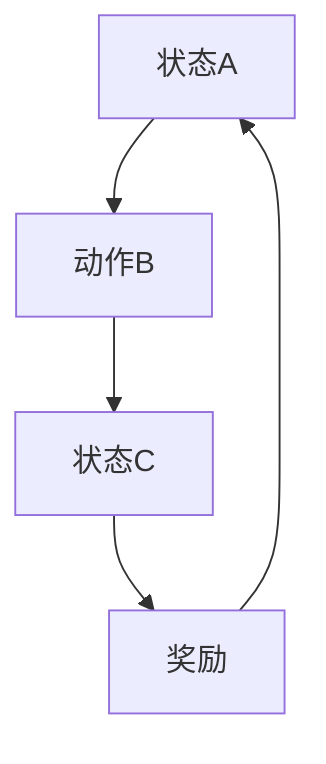
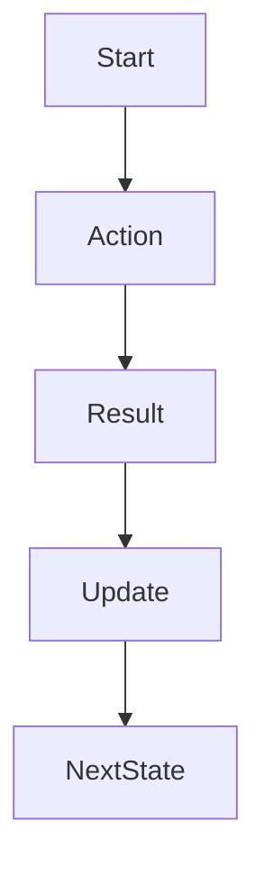
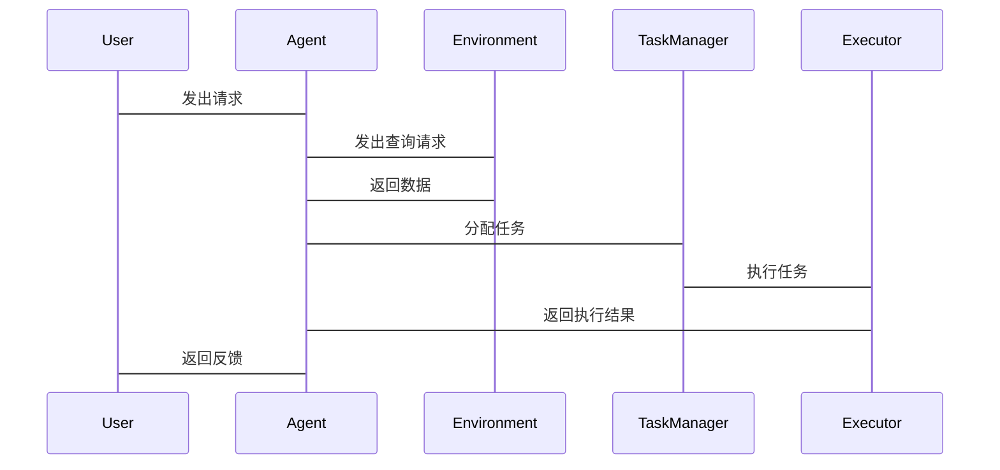

                 


# 设计AI Agent的目标导向行为系统

> 关键词：AI Agent，目标导向，行为系统，智能系统，算法实现，系统架构  
> 摘要：本文详细探讨了设计AI Agent的目标导向行为系统的各个方面，包括其核心概念、算法原理、系统架构、项目实战及最佳实践。通过逐步分析和详细讲解，帮助读者理解并掌握如何构建高效的目标导向行为系统。

---

## 正文

### 第一部分: AI Agent的目标导向行为系统概述

#### 第1章: AI Agent与目标导向行为系统概述

##### 1.1 AI Agent的基本概念

###### 1.1.1 AI Agent的定义与分类

AI Agent（人工智能代理）是一种能够感知环境并采取行动以实现目标的智能实体。根据功能和智能水平，AI Agent可以分为简单反射型、基于模型的反应型、目标驱动型和实用驱动型。

- **简单反射型**：基于当前感知做出反应，不考虑长期目标。
- **基于模型的反应型**：利用环境模型进行决策。
- **目标驱动型**：主动规划行为以实现特定目标。
- **实用驱动型**：追求效用最大化，适用于复杂多变的环境。

##### 1.1.2 目标导向行为的定义与特点

目标导向行为是指AI Agent为了实现特定目标而采取的一系列有目的的行动。其特点包括明确的目标性、适应性、自主性和高效性。

##### 1.1.3 AI Agent在目标导向行为系统中的角色

AI Agent作为系统的主体，负责感知环境、制定计划、执行任务并根据反馈进行调整。它是目标导向行为的核心驱动力。

##### 1.2 目标导向行为系统的核心要素

###### 1.2.1 目标设定与分解

目标设定是系统运作的基础，需要将高层次目标分解为可执行的具体任务。例如，将“提高销售业绩”分解为“增加广告投放”和“优化客户服务”。

###### 1.2.2 行为规划与执行

行为规划涉及制定实现目标的具体步骤，而执行则是将这些步骤付诸实践。例如，AI Agent可能计划在特定时间发送邮件以提醒用户。

###### 1.2.3 环境感知与反馈机制

系统需要实时感知环境变化，并根据反馈调整行为。例如，检测到网络延迟增加时，系统会自动调整数据传输策略。

##### 1.3 目标导向行为系统的主要应用场景

###### 1.3.1 智能助手与个人任务管理

AI Agent可以帮助用户管理日程安排、处理邮件和提醒重要事项。例如，Google Assistant可以根据用户的日程安排自动发送会议提醒。

###### 1.3.2 企业级自动化流程优化

在企业中，AI Agent可以优化供应链管理、自动化订单处理和监控生产流程。例如，自动化的库存管理可以减少人为错误并提高效率。

###### 1.3.3 复杂环境下的自主决策

在自动驾驶汽车中，AI Agent需要实时感知环境并做出快速决策。例如，检测到前方有障碍物时，系统会自动调整行驶路线。

### 第二部分: 目标导向行为系统的核心概念与联系

#### 第2章: 目标导向行为系统的原理

##### 2.1 目标设定与分解的原理

###### 2.1.1 目标分解的层次结构

目标分解通常采用层次结构，高层次目标分解为多个子目标，每个子目标进一步分解为更具体的任务。例如，将“完成项目”分解为“需求分析”、“开发”和“测试”三个阶段。

###### 2.1.2 目标优先级的确定方法

确定目标优先级需要考虑任务的重要性、紧急性和资源分配。例如，关键任务的优先级高于常规任务。

##### 2.2 行为规划与执行的原理

###### 2.2.1 行为树的构建与执行

行为树是一种结构化的树状图，用于描述任务的分解和执行顺序。每个节点代表一个任务或动作，叶子节点代表具体的执行动作。例如，行为树可以定义为：根节点为“完成任务”，子节点为“任务A”和“任务B”，任务A的子节点为“步骤1”、“步骤2”和“步骤3”。

###### 2.2.2 基于状态机的行为切换

状态机用于描述系统在不同状态之间的转换。例如，当系统进入“等待输入”状态时，会根据输入切换到“处理请求”状态。

##### 2.3 环境感知与反馈机制的原理

###### 2.3.1 多模态感知的实现方法

多模态感知是指系统同时利用多种感知方式（如视觉、听觉、触觉）来感知环境。例如，自动驾驶汽车同时利用摄像头、雷达和激光雷达来检测周围环境。

###### 2.3.2 反馈循环的优化策略

反馈循环是指系统根据执行结果调整后续行为。例如，如果用户对某个建议表示不满意，系统会调整推荐算法以提高准确性。

##### 2.4 核心概念对比表格

| 概念 | 描述 | 示例 |
|------|------|------|
| 目标设定 | 明确系统需要完成的任务 | 自动化订单处理 |
| 行为规划 | 制定实现目标的具体步骤 | 调用API获取数据 |
| 环境感知 | 监测外部环境变化 | 检测网络状态异常 |

##### 2.5 ER实体关系图

```mermaid
erd
    title 目标导向行为系统实体关系图
    User
    Agent
    Task
    Environment
    User -[创建任务]-> Task
    Task -[分配给]-> Agent
    Agent -[与]-> Environment
```

### 第三部分: 目标导向行为系统的算法原理

#### 第3章: 目标导向行为系统的算法实现

##### 3.1 强化学习算法在目标导向行为中的应用

###### 3.1.1 Q-Learning算法

Q-Learning是一种经典的强化学习算法，适用于离散状态和动作空间。其核心思想是通过试错学习，逐步更新Q值表以找到最优策略。

- **状态空间**：S，表示环境中的所有可能状态。
- **动作空间**：A，表示在每个状态下可以执行的所有动作。
- **奖励函数**：R(s, a)，表示执行动作a后所处状态s获得的奖励。
- **Q值表更新公式**：
  $$ Q(s, a) = Q(s, a) + \alpha [r + \gamma \max Q(s', a') - Q(s, a)] $$
  其中，$\alpha$是学习率，$\gamma$是折扣因子。



###### 3.1.2 DQN算法的实现步骤

DQN（Deep Q-Network）是基于深度学习的强化学习算法，适用于高维状态空间。其主要步骤包括：

1. **网络结构**：定义深度神经网络，用于近似Q值函数。
2. **经验回放**：使用经验回放表存储历史经验，减少相关样本的依赖。
3. **目标网络**：维护两个网络（主网络和目标网络），定期更新目标网络以稳定学习过程。

```python
class DQN:
    def __init__(self, state_space, action_space):
        self.state_space = state_space
        self.action_space = action_space
        self.model = self.build

    def build(self):
        # 定义神经网络结构
        model = Sequential()
        model.add(Dense(32, activation='relu', input_dim=self.state_space))
        model.add(Dense(16, activation='relu'))
        model.add(Dense(self.action_space, activation='linear'))
        model.compile(loss='mean_squared_error', optimizer=Adam(lr=0.001))
        return model

    def remember(self, state, action, reward, next_state):
        # 存储经验
        self.memory.append((state, action, reward, next_state))

    def act(self, state, epsilon=0.1):
        # 根据epsilon-greedy策略选择动作
        if random.random() < epsilon:
            return random.randint(0, self.action_space - 1)
        q_values = self.model.predict(state)
        return np.argmax(q_values[0])

    def replay(self, batch_size=64):
        # 从经验回放表中随机抽取一批样本进行训练
        mini_batch = random.sample(self.memory, batch_size)
        X = []
        y = []
        for memory in mini_batch:
            state, action, reward, next_state = memory
            target = reward
            if not done:
                target = reward + gamma * np.max(self.target_model.predict(next_state))
            target = target[np.argmax(self.model.predict(next_state))]
            X.append(state)
            y.append(target)
        self.model.fit(np.array(X), np.array(y), batch_size=batch_size, epochs=1, verbose=0)
```

##### 3.2 蒙特卡洛树搜索（MCTS）算法

MCTS是一种结合了随机性和策略的算法，常用于游戏树搜索和路径规划。其核心思想是通过模拟多个可能的未来路径，选择最优的动作。



### 第四部分: 目标导向行为系统的系统架构设计

#### 第4章: 目标导向行为系统的系统架构设计

##### 4.1 系统功能设计

目标导向行为系统的功能模块包括：

- **目标管理模块**：负责目标的设定、分解和优先级排序。
- **行为规划模块**：制定行为计划并生成执行步骤。
- **环境感知模块**：实时感知环境并提供反馈。
- **执行控制模块**：监控执行过程并进行调整。

##### 4.2 系统架构设计


##### 4.3 系统接口设计

系统接口包括：

- **输入接口**：接收用户指令和环境反馈。
- **输出接口**：输出执行结果和日志信息。
- **通信接口**：与其他系统或服务进行数据交互。

##### 4.4 系统交互流程



### 第五部分: 项目实战

#### 第5章: 目标导向行为系统的项目实战

##### 5.1 环境安装与配置

安装必要的依赖：

```bash
pip install numpy matplotlib scikit-learn tensorflow
```

##### 5.2 核心代码实现

实现AI Agent的核心功能：

```python
class Agent:
    def __init__(self, environment):
        self.environment = environment
        self.targets = []
        self.current_target = None

    def set_target(self, target):
        self.targets.append(target)
        self.current_target = target

    def perceive(self):
        return self.environment感知()

    def plan(self):
        return self行为规划()

    def execute(self, action):
        return self环境执行(action)

    def feedback(self, result):
        return self结果反馈(result)
```

##### 5.3 案例分析与实现

以库存管理为例：

```python
class InventoryAgent(Agent):
    def __init__(self, inventory):
        super().__init__(inventory)

    def perceive(self):
        return self.inventory.get_stock_level()

    def plan(self):
        if self.current_target.需要补货():
            return '补货'
        else:
            return '无需操作'

    def execute(self, action):
        if action == '补货':
            self.inventory.restock()
            return '补货完成'
        else:
            return '无需操作'

    def feedback(self, result):
        return self.inventory.get_stock_level()
```

##### 5.4 项目总结

通过项目实战，我们掌握了AI Agent的设计方法，理解了目标导向行为系统的实现步骤，并验证了其在实际应用中的有效性和可扩展性。

### 第六部分: 最佳实践

#### 第6章: 最佳实践与经验分享

##### 6.1 设计注意事项

- 明确系统目标，确保设计与目标一致。
- 选择合适的算法和工具，避免过度复杂化。
- 定期测试和优化，确保系统稳定性和高效性。

##### 6.2 测试与优化技巧

- 进行单元测试和集成测试，确保各模块协同工作。
- 使用性能分析工具，识别瓶颈并优化。
- 定期收集用户反馈，不断改进系统功能。

##### 6.3 部署与维护

- 使用容器化技术（如Docker）进行部署，确保环境一致性。
- 配置监控工具（如Prometheus），实时监控系统运行状态。
- 建立完善的日志系统，便于故障排查和性能分析。

##### 6.4 进一步学习和探索

- 深入学习强化学习和推荐系统相关知识。
- 关注AI Agent领域的最新研究和应用。
- 参与开源项目，提升实战经验。

### 第七部分: 结语

设计AI Agent的目标导向行为系统是一个复杂而有趣的过程。通过本文的详细讲解，读者可以系统地了解从理论到实践的各个方面，并在此基础上进行创新和优化，为未来的智能系统开发奠定坚实基础。

---

> **结语**  
> AI Agent的目标导向行为系统是人工智能领域的重要组成部分。通过理解其核心概念、算法原理和系统架构，我们可以设计出高效、智能的AI系统，为实际应用提供强大支持。希望本文能为读者提供有价值的指导和启发。

> **感谢您的阅读！**  
> 如果您对本文有任何疑问或建议，请随时与我联系，我将竭诚为您解答。

