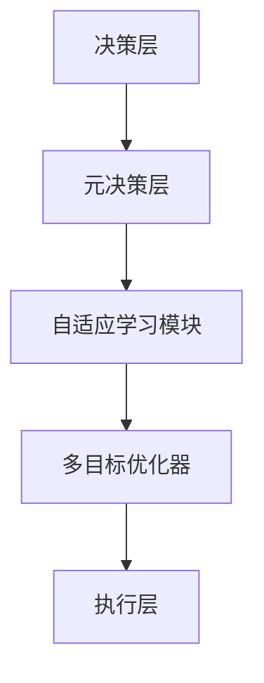
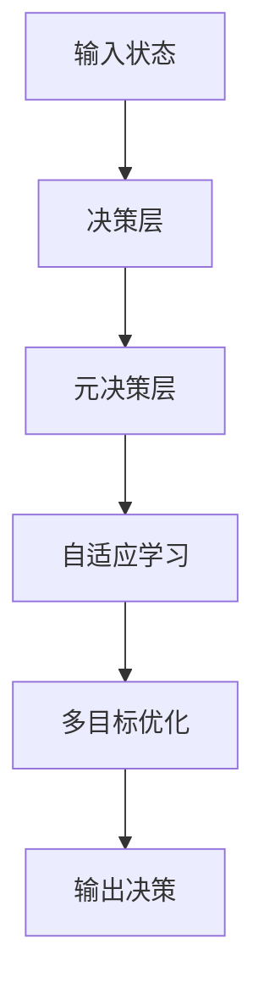
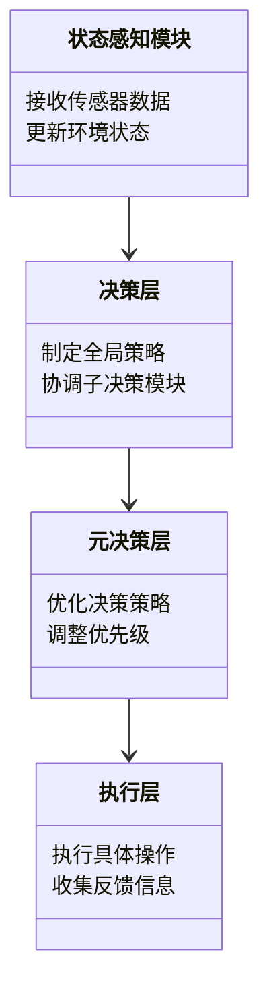
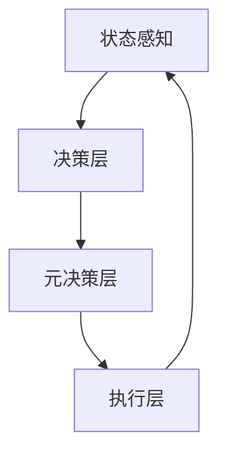
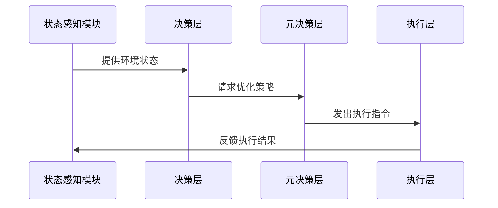

                 


# 设计AI Agent的自适应元决策框架

> 关键词：AI Agent, 自适应元决策, 多目标优化, 自主决策系统, 智能算法

> 摘要：本文系统地介绍了AI Agent的自适应元决策框架的设计与实现，涵盖从背景到系统架构的各个方面，结合理论与实践，深入分析了框架的核心原理与应用场景。通过详细的算法推导与代码实现，帮助读者全面理解自适应元决策框架的构建过程。

---

# 第一部分: 设计AI Agent的自适应元决策框架概述

## 第1章: AI Agent与自适应元决策框架的背景介绍

### 1.1 问题背景与问题描述

#### 1.1.1 AI Agent的基本概念与分类

AI Agent（人工智能代理）是指能够感知环境、自主决策并执行任务的智能实体。根据功能和应用场景，AI Agent可以分为以下几类：

- **反应式Agent**：基于当前感知做出实时反应，适用于简单的环境交互。
- **认知式Agent**：具备复杂推理和规划能力，适用于动态和不确定性较高的环境。
- **学习式Agent**：能够通过经验改进性能，适用于需要持续优化的任务。

#### 1.1.2 元决策框架的定义与作用

元决策框架是一种高层次的决策机制，用于协调和优化多个子决策模块的行为。其主要作用包括：

- **协调多目标决策**：在复杂任务中，平衡不同目标的优先级。
- **动态调整策略**：根据环境变化实时优化决策策略。
- **提高决策效率**：通过元决策层的规划，减少子决策层的试错成本。

#### 1.1.3 自适应元决策框架的核心目标

自适应元决策框架的核心目标是实现AI Agent在动态复杂环境中的自主决策能力，具体表现为：

- **自适应性**：根据环境变化自动调整决策策略。
- **高效性**：通过元决策层的优化，提升整体决策效率。
- **鲁棒性**：在不确定性较高的环境中保持稳定性能。

### 1.2 问题解决与边界外延

#### 1.2.1 自适应元决策框架的解决方案

自适应元决策框架通过以下方式实现AI Agent的自主决策：

1. **多层次决策结构**：元决策层负责全局规划，子决策层负责具体执行。
2. **自适应学习机制**：利用强化学习等方法动态优化决策策略。
3. **多目标优化**：在多个目标之间找到平衡点，确保整体最优。

#### 1.2.2 问题的边界与适用范围

自适应元决策框架主要适用于以下场景：

- **动态环境**：环境条件不断变化，需要快速调整策略。
- **多目标优化**：任务涉及多个目标，需要权衡取舍。
- **复杂决策**：决策过程涉及多个子任务，需要协调执行。

#### 1.2.3 框架的核心要素与组成结构

自适应元决策框架的核心要素包括：

1. **决策层**：负责制定全局决策策略。
2. **元决策层**：负责优化和协调多个子决策模块。
3. **自适应学习模块**：通过学习算法动态优化决策策略。
4. **执行层**：负责具体任务的执行与反馈收集。

---

## 第2章: 自适应元决策框架的核心概念与联系

### 2.1 核心概念原理

#### 2.1.1 元决策机制的原理

元决策机制通过高层次的决策层对多个子决策模块进行协调和优化。其实现过程包括以下几个步骤：

1. **感知环境**：通过传感器或数据输入感知当前环境状态。
2. **制定全局策略**：基于当前状态，制定全局决策策略。
3. **协调子决策**：将全局策略分解为具体执行步骤，协调各个子决策模块的行动。
4. **动态优化**：根据执行反馈，不断优化决策策略。

#### 2.1.2 自适应学习的实现方法

自适应学习是通过强化学习等方法，动态优化决策策略。常用的自适应学习方法包括：

1. **Q-Learning算法**：通过状态-动作-奖励模型，学习最优决策策略。
2. **深度强化学习**：利用深度神经网络，处理高维复杂状态空间。
3. **元学习**：通过元学习算法，快速适应新任务。

#### 2.1.3 多目标优化策略

多目标优化策略通过优化多个目标的组合，实现整体最优。常用的多目标优化方法包括：

1. **线性加权法**：将多个目标按权重相加，求得综合目标函数。
2. **Pareto优化**：寻找多个目标之间的最优折中方案。
3. **进化策略**：通过遗传算法优化多个目标的组合。

### 2.2 概念属性特征对比表

表2.1: 元决策与传统决策的特征对比

| 特征维度       | 元决策                          | 传统决策                          |
|----------------|---------------------------------|------------------------------------|
| 决策层级       | 高层次、全局性                 | 低层次、局部性                     |
| 环境适应性     | 高度动态、复杂                 | 静态、简单                        |
| 决策效率       | 高效、快速                     | 低效、延迟                        |
| 可扩展性       | 强，支持多任务                 | 弱，难以扩展                      |

### 2.3 ER实体关系图



---

## 第3章: 自适应元决策框架的算法原理

### 3.1 算法流程图



### 3.2 算法数学模型

#### 3.2.1 Q-Learning算法

Q-Learning是一种经典的强化学习算法，其数学模型如下：

$$ Q(s, a) = Q(s, a) + \alpha \left( r + \gamma \max_{a'} Q(s', a') - Q(s, a) \right) $$

其中：
- \( s \) 表示状态
- \( a \) 表示动作
- \( r \) 表示奖励
- \( \gamma \) 表示折扣因子
- \( \alpha \) 表示学习率

#### 3.2.2 多目标优化模型

多目标优化模型通常采用以下公式：

$$ f(x) = \sum_{i=1}^{n} w_i f_i(x) $$

其中：
- \( f_i(x) \) 表示第i个目标函数
- \( w_i \) 表示第i个目标的权重

---

## 第4章: 系统分析与架构设计

### 4.1 问题场景介绍

以智能交通系统为例，AI Agent需要在复杂的城市交通环境中，实时调整行驶路线，以实现最优的导航决策。

### 4.2 系统功能设计

#### 4.2.1 领域模型类图



### 4.3 系统架构设计

#### 4.3.1 系统架构图



#### 4.3.2 接口与交互设计



---

## 第5章: 项目实战

### 5.1 环境安装

安装Python和必要的库：

```bash
pip install numpy
pip install gym
pip install tensorflow
```

### 5.2 核心代码实现

#### 5.2.1 Q-Learning算法实现

```python
import numpy as np

class QLearning:
    def __init__(self, state_space, action_space, alpha=0.1, gamma=0.99):
        self.q_table = np.zeros(state_space + action_space)
        self.alpha = alpha
        self.gamma = gamma

    def choose_action(self, state, epsilon=0.1):
        if np.random.random() < epsilon:
            return np.random.randint(0, action_space)
        return np.argmax(self.q_table[state])

    def update_q_table(self, state, action, reward, next_state):
        self.q_table[state][action] = self.q_table[state][action] + self.alpha * (reward + self.gamma * np.max(self.q_table[next_state]) - self.q_table[state][action])
```

#### 5.2.2 多目标优化实现

```python
def multi_objective_optimization(objectives, weights):
    total = 0
    for i in range(len(objectives)):
        total += weights[i] * objectives[i]
    return total
```

### 5.3 代码解读与分析

1. **Q-Learning算法实现**：
   - 初始化Q表，存储状态-动作值。
   - 根据ε-greedy策略选择动作。
   - 更新Q表，通过强化学习算法优化决策策略。

2. **多目标优化实现**：
   - 根据权重组合多个目标函数，求得综合目标值。
   - 适用于多个目标的优化问题，提供全局最优解。

### 5.4 案例分析

以智能交通系统为例，通过Q-Learning算法优化行驶路线，实现最优路径选择。

---

## 第6章: 总结与展望

### 6.1 最佳实践

- 在实际应用中，建议结合具体场景选择合适的算法。
- 定期更新模型参数，保持框架的适应性。
- 通过实验验证算法性能，确保框架的有效性。

### 6.2 小结

自适应元决策框架通过多层次的决策机制和自适应学习算法，实现了AI Agent在复杂环境中的自主决策能力。本文从理论到实践，详细介绍了框架的设计与实现过程，为实际应用提供了参考。

### 6.3 注意事项

- 确保数据质量和实时性，避免决策错误。
- 定期维护和优化框架，确保系统稳定运行。
- 注意算法的可解释性，便于问题排查。

### 6.4 拓展阅读

- 阅读相关论文，了解最新的研究进展。
- 学习其他类似的决策框架，拓宽知识面。
- 实践更多案例，提升实际应用能力。

---

# 结语

通过本文的系统介绍，读者可以全面理解自适应元决策框架的设计与实现过程。从理论到实践，从算法到系统架构，本文为读者提供了详尽的指导。希望本文能够为AI Agent的自主决策研究和应用提供有价值的参考。

