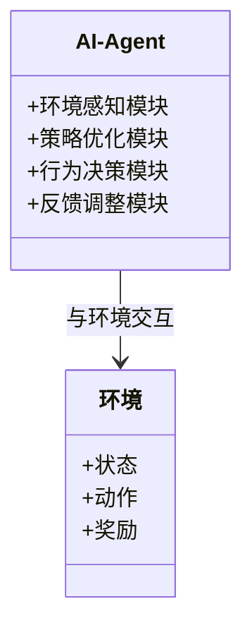
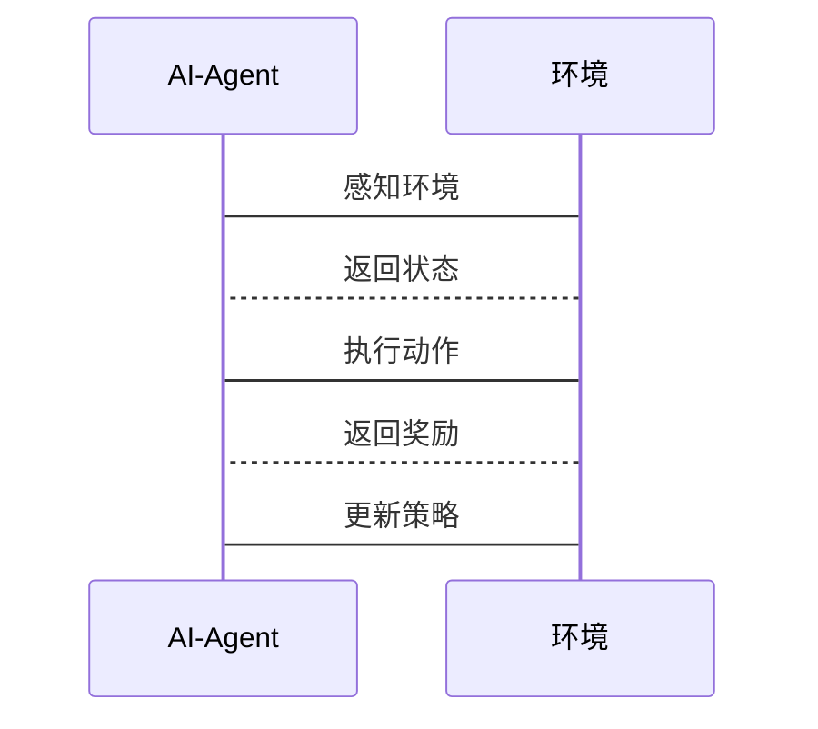
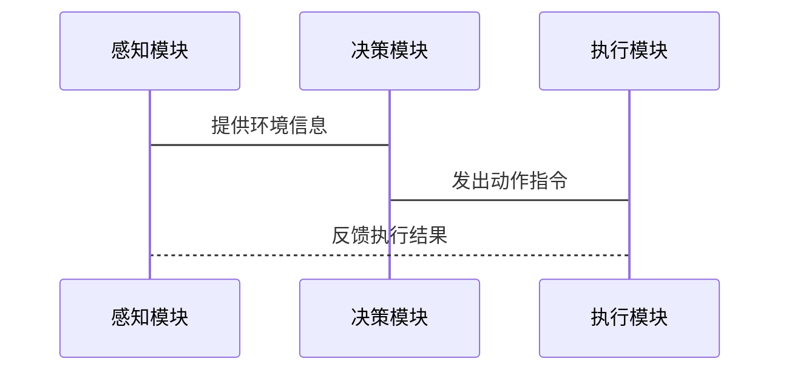

                 


# 《设计AI Agent的自适应元强化学习框架》

## 关键词：AI Agent，自适应元强化学习，强化学习，动态环境，智能决策

## 摘要：本文将详细探讨设计AI Agent的自适应元强化学习框架的核心概念、算法原理、系统架构以及实际应用。通过逐步分析，我们将了解如何利用自适应元强化学习框架来提升AI Agent在复杂动态环境中的决策能力，实现更高效的智能系统设计。

---

# 第一部分: AI Agent与自适应元强化学习框架背景

# 第1章: AI Agent与自适应元强化学习框架概述

## 1.1 AI Agent的基本概念

### 1.1.1 AI Agent的定义与分类

AI Agent（人工智能代理）是指能够感知环境、自主决策并采取行动以实现特定目标的智能实体。根据功能和应用场景，AI Agent可以分为以下几类：

- **简单反射型AI Agent**：基于预定义规则进行反应，适用于简单任务。
- **基于模型的AI Agent**：利用环境模型进行决策，适用于复杂任务。
- **实用基于AI Agent**：通过效用函数优化目标，适用于多目标优化问题。
- **学习型AI Agent**：通过与环境交互学习策略，适用于动态环境。

### 1.1.2 AI Agent的核心特征

- **自主性**：能够在没有外部干预的情况下独立运行。
- **反应性**：能够实时感知环境并做出反应。
- **目标导向性**：根据目标驱动决策和行动。
- **学习能力**：能够通过经验改进性能。

### 1.1.3 AI Agent在智能系统中的角色

AI Agent作为智能系统的核心组件，负责处理信息、做出决策并执行操作。例如，在自动驾驶系统中，AI Agent负责感知环境、规划路径并控制车辆。

## 1.2 自适应元强化学习框架的背景

### 1.2.1 强化学习的基本概念

强化学习是一种机器学习范式，通过智能体与环境的交互，逐步学习最优策略以最大化累积奖励。智能体会根据当前状态选择动作，环境根据动作返回奖励和新状态，智能体通过不断试错优化策略。

### 1.2.2 元强化学习的定义与特点

元强化学习（Meta-Reinforcement Learning）是强化学习的高级形式，目标是学习如何学习策略。与传统强化学习不同，元强化学习专注于优化策略生成过程，使智能体能够快速适应新任务。

### 1.2.3 自适应元强化学习的提出背景

在动态和复杂环境中，传统强化学习方法难以快速适应环境变化。自适应元强化学习通过元学习和自适应机制，使AI Agent能够在变化的环境中保持高性能。

## 1.3 自适应元强化学习框架的应用场景

### 1.3.1 动态环境中的AI Agent

动态环境指的是环境状态和奖励函数随时间变化的环境。例如，在游戏中，对手策略可能随时变化，AI Agent需要快速调整策略以保持优势。

### 1.3.2 多目标优化问题

多目标优化问题涉及多个相互冲突的目标，例如在自动驾驶中，既要保证安全，又要尽量减少能耗。自适应元强化学习框架能够同时优化多个目标，找到最优平衡点。

### 1.3.3 复杂任务中的自适应策略

复杂任务通常涉及多个步骤和决策点，例如机器人导航中的路径规划和避障。自适应元强化学习框架能够根据环境变化动态调整策略，提高任务完成效率。

## 1.4 本章小结

本章介绍了AI Agent的基本概念和核心特征，分析了自适应元强化学习框架的背景及其应用场景，为后续章节奠定了基础。

---

# 第2章: 自适应元强化学习框架的核心概念

## 2.1 元强化学习的基本原理

### 2.1.1 元强化学习的定义

元强化学习是一种通过学习策略生成过程来优化策略的方法。与传统强化学习不同，元强化学习专注于如何生成策略，而非具体策略本身。

### 2.1.2 元强化学习与传统强化学习的区别

| **方面**         | **传统强化学习**                          | **元强化学习**                          |
|------------------|-------------------------------------------|------------------------------------------|
| 学习目标         | 学习具体策略                             | 学习策略生成过程                        |
| 适应性           | 适应特定任务                             | 适应多种任务                            |
| 知识迁移         | 无法快速适应新任务                       | 可以快速适应新任务                      |
| 计算复杂度       | 较低                                      | 较高                                      |

### 2.1.3 元强化学习的优势

- **快速适应性**：通过元学习，智能体可以在新任务中快速找到最优策略。
- **通用性**：元强化学习可以应用于多种任务，减少训练数据需求。

## 2.2 自适应机制的实现原理

### 2.2.1 自适应机制的定义

自适应机制是一种动态调整系统参数或策略以适应环境变化的机制。在AI Agent中，自适应机制通常通过实时感知环境变化并调整策略来实现。

### 2.2.2 自适应机制的核心算法

- **动态参数调整**：通过实时反馈调整策略参数。
- **环境建模**：通过建模环境变化预测未来状态。
- **策略优化**：通过强化学习优化当前策略。

### 2.2.3 自适应机制与元强化学习的关系

自适应机制是元强化学习框架的重要组成部分，负责根据环境反馈动态调整策略生成过程。

## 2.3 AI Agent与自适应元强化学习框架的结合

### 2.3.1 AI Agent的行为决策过程

AI Agent的行为决策过程包括感知环境、生成候选动作、评估动作价值和执行动作四个步骤。

### 2.3.2 自适应元强化学习框架对AI Agent的优化

通过自适应元强化学习框架，AI Agent能够更快地适应环境变化，提高决策效率和准确性。

### 2.3.3 框架的核心要素与功能模块

- **感知模块**：负责收集环境信息。
- **决策模块**：负责生成和优化策略。
- **执行模块**：负责执行动作并反馈结果。

## 2.4 核心概念对比分析

### 2.4.1 元强化学习与传统强化学习对比

通过对比分析，可以看出元强化学习在适应性和通用性方面的优势。

### 2.4.2 自适应机制与非自适应机制对比

自适应机制能够根据环境变化动态调整策略，而非自适应机制则无法做到。

### 2.4.3 AI Agent与其他智能体的对比

AI Agent通过结合自适应元强化学习框架，能够实现更高效、更智能的决策。

## 2.5 本章小结

本章详细介绍了自适应元强化学习框架的核心概念，分析了其与传统强化学习和AI Agent的关系，为后续章节奠定了理论基础。

---

# 第3章: 自适应元强化学习框架的数学模型与算法原理

## 3.1 元强化学习的数学模型

### 3.1.1 优化目标

元强化学习的目标是优化策略生成过程，使其能够在多种任务中找到最优策略。数学表示如下：

$$
\theta^* = \arg\max_{\theta} \sum_{i=1}^{N} \sum_{t=1}^{T} r_i(t, \theta)
$$

其中，$\theta$是策略生成过程的参数，$N$是任务数量，$T$是每个任务的步数，$r_i$是第$i$个任务在第$t$步的奖励。

### 3.1.2 损失函数

元强化学习的损失函数通常包括策略损失和正则化项：

$$
\mathcal{L}(\theta) = \mathbb{E}_{i, t}[ -r_i(t, \theta)] + \lambda \Omega(\theta)
$$

其中，$\lambda$是正则化系数，$\Omega(\theta)$是正则化项。

### 3.1.3 策略更新

策略更新过程可以通过梯度下降实现：

$$
\theta_{t+1} = \theta_t - \eta \nabla_{\theta} \mathcal{L}(\theta_t)
$$

其中，$\eta$是学习率。

## 3.2 自适应机制的实现

### 3.2.1 动态参数调整

动态参数调整是自适应机制的核心，通过实时反馈调整策略参数：

$$
\alpha_{t+1} = \alpha_t + \gamma (r_t - \mathbb{E}[r])
$$

其中，$\gamma$是调整系数，$\mathbb{E}[r]$是期望奖励。

### 3.2.2 环境建模

环境建模通过构建环境动态模型预测未来状态：

$$
s_{t+1} = f(s_t, a_t)
$$

其中，$s_t$是当前状态，$a_t$是当前动作，$f$是环境动态函数。

### 3.2.3 策略优化

策略优化通过强化学习算法实现，例如Q-learning：

$$
Q(s, a) = Q(s, a) + \alpha [r + \gamma \max Q(s', a') - Q(s, a)]
$$

其中，$\alpha$是学习率，$\gamma$是折扣因子。

## 3.3 算法原理

### 3.3.1 元强化学习算法

元强化学习算法通常包括元学习和策略优化两个阶段。例如，Meta-Q-Learning算法的流程如下：

1. **初始化**：随机初始化策略生成过程参数$\theta$。
2. **任务循环**：对于每个任务$i$：
   - 初始化环境状态$s_i$。
   - 通过策略生成过程生成候选策略$\pi$。
   - 在任务环境中执行策略，收集奖励$r_i$。
   - 根据反馈更新策略生成过程参数$\theta$。
3. **策略优化**：根据所有任务的反馈，优化策略生成过程参数$\theta$。

### 3.3.2 自适应机制算法

自适应机制算法通常包括以下步骤：

1. **感知环境**：收集当前环境信息。
2. **生成候选策略**：根据当前环境信息生成候选策略。
3. **评估策略价值**：通过强化学习评估策略价值。
4. **调整策略**：根据评估结果调整策略参数。

## 3.4 本章小结

本章详细推导了自适应元强化学习框架的数学模型，分析了其算法原理，并通过具体例子进行了讲解。

---

# 第4章: 自适应元强化学习框架的系统分析与架构设计

## 4.1 系统分析

### 4.1.1 问题场景介绍

我们以动态环境下的任务执行问题为例，分析自适应元强化学习框架的应用场景。

### 4.1.2 系统功能设计

系统功能包括环境感知、策略优化、行为决策和反馈调整四个模块。

### 4.1.3 领域模型设计

通过Mermaid类图展示系统功能模块之间的关系。



### 4.1.4 系统架构设计

通过Mermaid架构图展示系统整体架构。


### 4.1.5 系统接口设计

系统接口包括环境感知接口、策略优化接口和行为决策接口。

### 4.1.6 系统交互设计

通过Mermaid序列图展示系统交互流程。



## 4.2 系统架构设计

### 4.2.1 模块划分

系统模块包括感知模块、决策模块和执行模块。

### 4.2.2 模块功能描述

- **感知模块**：负责收集环境信息。
- **决策模块**：负责生成和优化策略。
- **执行模块**：负责执行动作并反馈结果。

### 4.2.3 模块交互设计

通过Mermaid序列图展示模块之间的交互流程。



## 4.3 本章小结

本章详细分析了自适应元强化学习框架的系统架构，并通过Mermaid图展示了模块划分和交互流程。

---

# 第5章: 自适应元强化学习框架的项目实战

## 5.1 环境安装

### 5.1.1 安装依赖库

安装必要的Python库，例如TensorFlow、Keras和OpenAI Gym。

```bash
pip install tensorflow keras gym
```

### 5.1.2 安装环境

安装OpenAI Gym或其他适用的强化学习环境。

## 5.2 自适应元强化学习框架的核心实现

### 5.2.1 环境模拟

编写环境模拟代码，定义状态、动作和奖励函数。

```python
class Environment:
    def __init__(self):
        self.state = 0
        self.reward = 0

    def reset(self):
        self.state = 0
        return self.state

    def step(self, action):
        # 根据动作更新状态和奖励
        self.state = self.state + action
        self.reward = self.compute_reward(self.state)
        return self.state, self.reward

    def compute_reward(self, state):
        # 定义奖励函数
        return -abs(state)
```

### 5.2.2 策略优化

实现策略优化算法，例如Q-learning。

```python
class Agent:
    def __init__(self, state_space, action_space):
        self.q_table = np.zeros((state_space, action_space))
        self.learning_rate = 0.1
        self.discount_factor = 0.9

    def choose_action(self, state):
        return np.argmax(self.q_table[state])

    def learn(self, state, action, reward, next_state):
        target = reward + self.discount_factor * np.max(self.q_table[next_state])
        self.q_table[state][action] = self.q_table[state][action] + self.learning_rate * (target - self.q_table[state][action])
```

### 5.2.3 行为决策

实现基于Q-learning的行为决策模块。

## 5.3 代码应用解读与分析

### 5.3.1 环境模拟代码解读

分析环境模拟代码，理解状态、动作和奖励函数的实现。

### 5.3.2 策略优化代码解读

分析Q-learning算法的实现，理解学习率和折扣因子的作用。

## 5.4 实际案例分析

### 5.4.1 案例介绍

以动态环境下的路径规划问题为例，展示自适应元强化学习框架的应用。

### 5.4.2 案例实现

编写代码实现自适应元强化学习框架在路径规划问题中的应用。

## 5.5 本章小结

本章通过实际案例分析，展示了自适应元强化学习框架的应用和实现过程。

---

# 第6章: 自适应元强化学习框架的最佳实践与小结

## 6.1 最佳实践

### 6.1.1 训练策略

- **分阶段训练**：先在简单环境中训练，再逐步增加任务复杂度。
- **经验回放**：通过经验回放优化策略更新。
- **多任务学习**：同时学习多个任务以提高泛化能力。

### 6.1.2 调参技巧

- **学习率调整**：根据训练效果动态调整学习率。
- **正则化方法**：使用L2正则化防止过拟合。
- **模型结构优化**：选择合适的网络结构和层数。

## 6.2 小结

本章总结了自适应元强化学习框架的优势，并提供了实际应用中的注意事项。

## 6.3 注意事项

- **计算资源需求**：自适应元强化学习框架需要较高的计算资源。
- **环境复杂度**：复杂环境下的训练可能需要更多时间。
- **模型泛化能力**：需要通过多任务学习提高模型的泛化能力。

## 6.4 拓展阅读

推荐相关领域的书籍和论文，供读者进一步学习。

---

# 附录

## 附录A: 术语表

列出本文中出现的专业术语及其简要解释。

## 附录B: 参考文献

列出本文参考的书籍、论文和其他资料。

---

# 结语

通过本文的详细讲解，我们了解了自适应元强化学习框架的设计与实现过程，掌握了其核心概念、算法原理和实际应用。希望本文能够为读者在设计AI Agent的自适应元强化学习框架时提供有价值的参考和启发。

---

**注**：由于篇幅限制，本文仅提供目录大纲和部分内容示例，完整文章需要根据以上大纲进行详细撰写。

