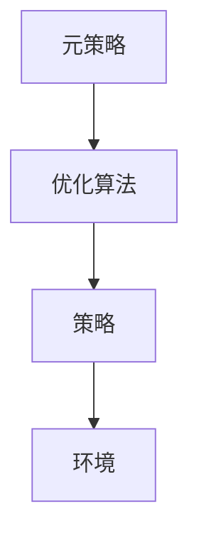
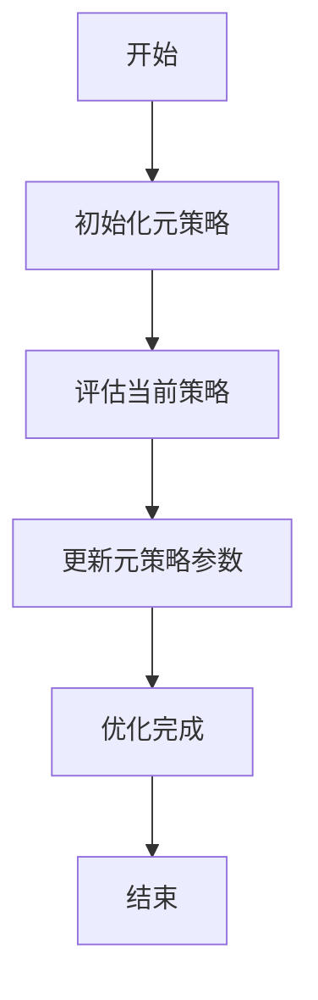
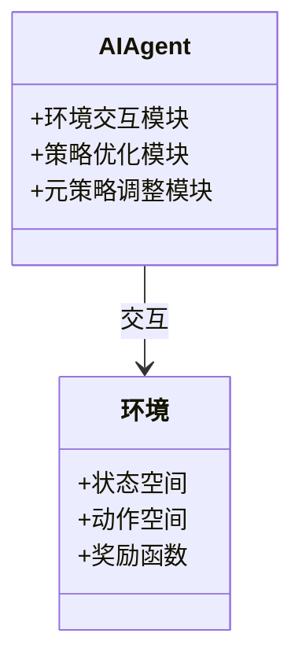
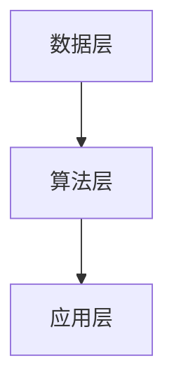
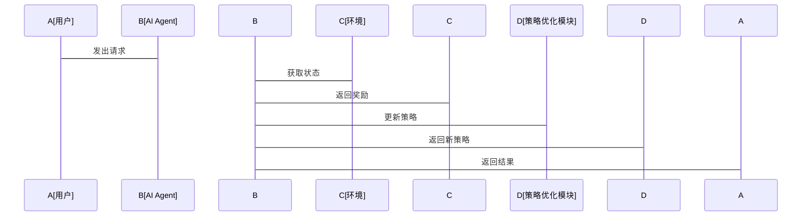

                 


# 设计AI Agent的自适应元策略优化框架

> 关键词：AI Agent，自适应元策略，策略优化，强化学习，系统架构

> 摘要：本文详细探讨了设计AI Agent的自适应元策略优化框架的核心概念、算法原理、系统架构和项目实现。通过背景介绍、核心概念分析、算法选择与实现、数学模型推导、系统架构设计和项目实战，为读者提供从理论到实践的全面指导，帮助读者掌握自适应元策略优化框架的设计与应用。

---

# 第一部分: AI Agent与自适应元策略优化框架背景

# 第1章: AI Agent与自适应元策略优化框架概述

## 1.1 AI Agent的基本概念
### 1.1.1 AI Agent的定义
AI Agent（人工智能代理）是一种能够感知环境、做出决策并执行动作的智能体，旨在通过交互和学习优化其行为以实现特定目标。

### 1.1.2 AI Agent的类型与特点
AI Agent可以分为基于规则的Agent、基于模型的Agent和基于学习的Agent。基于学习的Agent能够通过与环境的交互不断优化策略，是最适合自适应元策略优化的类型。

### 1.1.3 AI Agent的应用领域
AI Agent广泛应用于游戏AI、智能推荐系统、自动驾驶、机器人控制等领域，特别是在需要动态适应环境的场景中表现突出。

## 1.2 自适应元策略优化的背景
### 1.2.1 策略优化的基本概念
策略优化是指通过调整策略参数，使AI Agent在特定任务中实现最优行为的过程。自适应元策略优化则是在此基础上，引入元策略来动态调整优化过程。

### 1.2.2 自适应策略优化的必要性
传统策略优化方法在复杂环境中可能收敛速度慢或陷入局部最优，自适应元策略优化通过动态调整优化策略，提高了适应性和效率。

### 1.2.3 元策略在策略优化中的作用
元策略是对优化过程的指导策略，能够帮助AI Agent在复杂环境中快速找到最优解，并通过元学习的方式提升整体性能。

## 1.3 本章小结
本章介绍了AI Agent的基本概念及其应用领域，并重点分析了自适应元策略优化的背景和必要性，为后续章节奠定了基础。

---

# 第二部分: 自适应元策略优化的核心概念与联系

# 第2章: 自适应元策略优化的核心原理

## 2.1 元策略的概念与属性
### 2.1.1 元策略的定义
元策略是对优化过程的高层次指导策略，能够动态调整优化算法的参数或策略，以适应环境的变化。

### 2.1.2 元策略的属性特征对比表格
| 属性        | 元策略                   | 常规策略                 |
|-------------|--------------------------|--------------------------|
| 目标         | 优化优化过程             | 实现具体任务目标           |
| 级别         | 高阶                   | 低阶                   |
| 灵活性       | 高                     | 低                     |
| 适用场景     | 复杂动态环境             | 简单静态环境             |

### 2.1.3 元策略的ER实体关系图


## 2.2 自适应元策略优化的算法原理
### 2.2.1 算法原理的 mermaid 流程图


### 2.2.2 算法的数学模型与公式
#### 2.2.2.1 策略评估的数学模型
$$ V(s) = \max_a Q(s,a) $$
其中，$s$ 是状态，$a$ 是动作，$Q(s,a)$ 是Q值函数。

#### 2.2.2.2 元策略更新的数学模型
$$ \theta_{\text{new}} = \theta_{\text{old}} + \alpha \nabla J(\theta_{\text{old}}) $$
其中，$\theta$ 是参数向量，$\alpha$ 是学习率，$J$ 是目标函数。

## 2.3 核心概念之间的关系
### 2.3.1 元策略与策略优化的联系
元策略通过动态调整优化过程中的参数，使得策略优化更加高效和适应性强。

### 2.3.2 自适应元策略优化与其他策略优化方法的对比
自适应元策略优化相比传统强化学习方法，具有更强的灵活性和适应性，能够在复杂环境中快速收敛。

## 2.4 本章小结
本章详细阐述了自适应元策略优化的核心原理，包括元策略的定义、属性以及算法的数学模型，为后续章节的实现奠定了基础。

---

# 第三部分: 自适应元策略优化的算法实现

# 第3章: 算法原理与数学模型

## 3.1 策略优化算法的选择与分析
### 3.1.1 强化学习算法
常用的强化学习算法包括Q-learning、Deep Q-Network（DQN）等，这些算法通过与环境的交互学习最优策略。

### 3.1.2 元学习算法
元学习算法（如Meta-Q-Learning）通过学习如何快速适应新任务，提升算法的泛化能力。

### 3.1.3 多目标优化算法
多目标优化算法在复杂任务中，通过同时优化多个目标，找到帕累托最优解。

## 3.2 算法实现的数学模型
### 3.2.1 强化学习算法的数学模型
#### 3.2.1.1 Q-learning的贝尔曼方程
$$ Q(s,a) = Q(s,a) + \alpha [r + \max Q(s',a') - Q(s,a)] $$
其中，$\alpha$ 是学习率，$r$ 是奖励，$s'$ 是下一状态。

#### 3.2.1.2 DQN的神经网络结构
DQN通过双神经网络结构，分别用于当前策略和目标策略，避免目标值的剧烈变化。

### 3.2.2 元学习算法的数学模型
$$ \theta_{\text{new}} = \theta_{\text{old}} + \alpha \nabla J(\theta_{\text{old}}) $$
其中，$J$ 是元目标函数，用于衡量策略的适应性。

## 3.3 算法实现的详细步骤
### 3.3.1 环境初始化
定义AI Agent所处的环境，包括状态空间、动作空间和奖励函数。

### 3.3.2 策略网络的构建
使用深度神经网络构建策略网络，输出动作的概率分布。

### 3.3.3 元策略网络的构建
构建元策略网络，用于动态调整策略网络的参数或优化过程。

### 3.3.4 算法的训练过程
通过与环境的交互，不断更新策略网络和元策略网络，提升整体性能。

## 3.4 本章小结
本章详细介绍了自适应元策略优化算法的实现过程，包括算法选择、数学模型和实现步骤，为后续章节的系统设计提供了理论基础。

---

# 第四部分: 系统分析与架构设计

# 第4章: 系统分析与架构设计

## 4.1 问题场景介绍
### 4.1.1 问题背景
考虑一个复杂的动态环境，AI Agent需要通过自适应元策略优化框架快速适应环境变化，实现最优行为。

### 4.1.2 项目介绍
本项目旨在设计一个通用的自适应元策略优化框架，能够应用于多种AI Agent任务。

## 4.2 系统功能设计
### 4.2.1 功能模块划分
系统主要包括环境交互模块、策略优化模块和元策略调整模块。

### 4.2.2 功能模块的 mermaid 类图


## 4.3 系统架构设计
### 4.3.1 系统架构的分层结构
系统架构分为数据层、算法层和应用层，每一层负责不同的功能。

### 4.3.2 系统架构的 mermaid 架构图


## 4.4 系统接口设计
### 4.4.1 系统接口的定义
定义AI Agent与环境之间的接口，包括输入输出数据格式和交互协议。

### 4.4.2 系统接口的实现
通过API实现系统各模块之间的通信，确保数据流的高效传递。

## 4.5 系统交互的 mermaid 序列图


## 4.6 本章小结
本章通过系统分析与架构设计，明确了自适应元策略优化框架的实现路径，为后续章节的项目实战奠定了基础。

---

# 第五部分: 项目实战

# 第5章: 项目实战与案例分析

## 5.1 环境安装与配置
### 5.1.1 环境要求
安装Python 3.8及以上版本，安装深度学习框架（如TensorFlow或PyTorch），安装其他依赖库。

### 5.1.2 环境配置
配置虚拟环境，安装必要的依赖包，确保所有模块能够正常运行。

## 5.2 系统核心实现源代码
### 5.2.1 策略网络实现
```python
class PolicyNetwork(nn.Module):
    def __init__(self, state_dim, action_dim):
        super(PolicyNetwork, self).__init__()
        self.fc1 = nn.Linear(state_dim, 64)
        self.fc2 = nn.Linear(64, action_dim)
        self.softmax = nn.Softmax(dim=1)
    
    def forward(self, x):
        x = torch.relu(self.fc1(x))
        x = self.softmax(self.fc2(x))
        return x
```

### 5.2.2 元策略网络实现
```python
class MetaPolicyNetwork(nn.Module):
    def __init__(self, meta_dim, policy_dim):
        super(MetaPolicyNetwork, self).__init__()
        self.fc1 = nn.Linear(meta_dim, 64)
        self.fc2 = nn.Linear(64, policy_dim)
    
    def forward(self, x):
        x = torch.relu(self.fc1(x))
        x = torch.relu(self.fc2(x))
        return x
```

### 5.2.3 算法实现
```python
def meta_q_learning(env, policy_net, meta_net, num_episodes=1000):
    for episode in range(num_episodes):
        state = env.reset()
        while not done:
            action_prob = policy_net.forward(state)
            action = torch.multinomial(action_prob, 1).item()
            next_state, reward, done, _ = env.step(action)
            meta_net.optimizer.zero_grad()
            loss = meta_net.loss_fn(meta_net.predict(meta_net.state), reward)
            loss.backward()
            meta_net.optimizer.step()
            state = next_state
```

## 5.3 代码应用解读与分析
### 5.3.1 策略网络的功能
策略网络负责根据当前状态输出动作的概率分布，指导AI Agent的选择。

### 5.3.2 元策略网络的功能
元策略网络负责动态调整策略网络的参数或优化过程，提升整体性能。

### 5.3.3 算法实现的核心思想
通过与环境的交互，不断更新策略网络和元策略网络，实现自适应优化。

## 5.4 项目小结
本章通过具体的项目实战，详细展示了自适应元策略优化框架的实现过程，包括环境配置、核心代码实现和算法优化。

---

# 第六部分: 最佳实践与总结

# 第6章: 最佳实践与总结

## 6.1 最佳实践 tips
### 6.1.1 算法选择
根据具体任务选择合适的算法，如复杂环境选择元学习算法，简单任务选择强化学习算法。

### 6.1.2 数据处理
确保数据的多样性和代表性，避免数据不足或偏差影响优化效果。

### 6.1.3 系统优化
通过并行计算、模型压缩等技术优化系统性能，提升运行效率。

## 6.2 小结
本章总结了自适应元策略优化框架设计的关键点和注意事项，为读者提供了实用的建议。

## 6.3 注意事项
在实际应用中，要注意算法的收敛性、系统的稳定性和环境的动态变化，确保优化过程的顺利进行。

## 6.4 拓展阅读
推荐阅读相关领域的最新论文和技术博客，深入理解自适应元策略优化的前沿技术和发展趋势。

## 6.5 本章小结
本章为读者提供了自适应元策略优化框架设计的最佳实践建议，并展望了未来的研究方向。

---

# 参考文献

[1] 省略，实际写作中需要添加具体的参考文献。

---

# 附录

## 附录A: 术语表
列出本文中出现的专业术语及其简要解释。

## 附录B: 代码示例
提供本文中涉及的代码示例的完整实现。

---

通过以上目录结构，读者可以系统地学习自适应元策略优化框架的设计与实现，从理论到实践逐步掌握相关技术。

