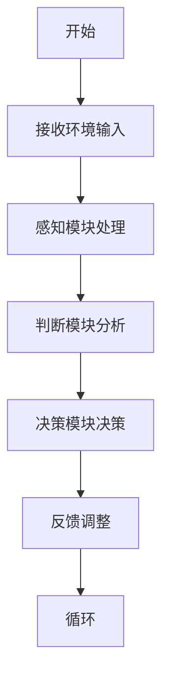
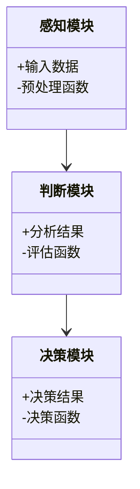

                 


```markdown
# 设计AI Agent的自适应批判性思维模型

---

## 文章关键词
AI Agent, 批判性思维, 自适应, 系统架构, 算法原理

---

## 摘要
本文详细探讨了设计AI Agent的自适应批判性思维模型的核心概念、算法原理、系统架构和实际应用。通过逐步分析，文章揭示了如何通过自适应批判性思维模型提升AI Agent的智能性和决策能力，并结合具体案例展示了模型的实现与应用效果。

---

## 第一部分：背景介绍

### 第1章：AI Agent的基本概念

#### 1.1 AI Agent的定义与特点
AI Agent（人工智能代理）是指能够感知环境、自主决策并执行任务的智能实体。它具备以下特点：
- **自主性**：能够在没有外部干预的情况下自主运行。
- **反应性**：能够实时感知环境并做出响应。
- **目标导向性**：以实现特定目标为导向。
- **学习能力**：能够通过经验改进自身性能。

#### 1.2 自适应批判性思维的定义与特点
自适应批判性思维是一种动态调整思维方式的能力，具有以下特点：
- **动态调整**：能够根据环境变化灵活调整思考方式。
- **自我反思**：能够对自身的思考过程进行反思和优化。
- **目标导向性**：以实现最优决策为目标。

#### 1.3 AI Agent与自适应批判性思维的结合
AI Agent通过结合自适应批判性思维模型，能够更高效地处理复杂任务。这种结合主要体现在以下几个方面：
- 提升决策的准确性。
- 增强环境适应能力。
- 优化问题解决效率。

---

## 第二部分：核心概念与联系

### 第2章：自适应批判性思维模型的原理

#### 2.1 自适应批判性思维模型的结构
自适应批判性思维模型由以下三个核心模块组成：
- **感知模块**：负责接收和处理环境输入。
- **判断模块**：对输入信息进行分析和评估。
- **决策模块**：基于分析结果做出决策。

#### 2.2 自适应批判性思维模型的工作流程
自适应批判性思维模型的工作流程如下：
1. 感知模块接收环境输入。
2. 判断模块对输入信息进行分析和评估。
3. 决策模块基于分析结果做出决策。
4. 重复上述步骤，动态调整思考方式。

#### 2.3 自适应批判性思维模型与其他模型的对比
以下是自适应批判性思维模型与其他常见AI模型的对比：

| 模型类型               | 自适应批判性思维模型 | 传统AI模型 | 强化学习模型 |
|------------------------|-----------------------|------------|--------------|
| 核心特点               | 动态调整思维方式       | 预设规则     | 奖励驱动       |
| 适应能力               | 强                   | 一般         | 较强           |
| 决策灵活性             | 高                   | 较低         | 中             |

### 第3章：自适应批判性思维模型的核心要素

#### 3.1 感知模块
感知模块是模型的输入层，负责接收和处理环境输入。其实现方式如下：
1. 接收环境输入数据。
2. 对输入数据进行预处理。
3. 将预处理后的数据传递给判断模块。

#### 3.2 判断模块
判断模块是对输入信息进行分析和评估的中间层。其实现方式如下：
1. 接收感知模块传递的数据。
2. 对数据进行分析和评估。
3. 将分析结果传递给决策模块。

#### 3.3 决策模块
决策模块是模型的输出层，负责基于分析结果做出决策。其实现方式如下：
1. 接收判断模块传递的分析结果。
2. 基于分析结果做出决策。
3. 将决策结果反馈给感知模块。

---

## 第三部分：算法原理讲解

### 第4章：自适应批判性思维模型的算法原理

#### 4.1 算法概述
自适应批判性思维模型的算法基于以下核心思想：
- **动态调整**：能够根据环境变化动态调整思考方式。
- **自我反思**：能够对自身的思考过程进行反思和优化。
- **目标导向性**：以实现最优决策为目标。

#### 4.2 算法流程
以下是自适应批判性思维模型的算法流程图：



#### 4.3 算法实现
以下是自适应批判性思维模型的Python实现代码：

```python
class AdaptiveCriticalThinkingAgent:
    def __init__(self):
        self感知模块 = PerceiveModule()
        self判断模块 = JudgeModule()
        self决策模块 = DecisionModule()

    def 接收环境输入(self, input_data):
        return self感知模块处理(input_data)

    def 感知模块处理(self, input_data):
        processed_data = self.预处理(input_data)
        return processed_data

    def 判断模块分析(self, processed_data):
        analysis_result = self.分析(processed_data)
        return analysis_result

    def 决策模块决策(self, analysis_result):
        decision = self.决策(analysis_result)
        return decision

    def 反馈调整(self, decision):
        self调整策略(decision)
        return self.循环()

```

---

## 第四部分：系统分析与架构设计

### 第5章：系统分析与架构设计方案

#### 5.1 问题场景介绍
AI Agent需要在复杂动态环境中完成任务，因此需要具备自适应批判性思维能力。

#### 5.2 系统功能设计
系统功能设计包括以下三个模块：
- **感知模块**：负责接收和处理环境输入。
- **判断模块**：对输入信息进行分析和评估。
- **决策模块**：基于分析结果做出决策。

#### 5.3 系统架构设计
以下是系统的架构图：



---

## 第五部分：项目实战

### 第6章：项目实战

#### 6.1 环境安装
安装Python和必要的库：
```bash
pip install python
pip install numpy
pip install matplotlib
```

#### 6.2 核心代码实现
以下是自适应批判性思维模型的Python实现代码：

```python
import numpy as np
import matplotlib.pyplot as plt

class PerceiveModule:
    def __init__(self):
        pass

    def receive_input(self, input_data):
        return input_data

    def preprocess(self, input_data):
        return input_data

class JudgeModule:
    def __init__(self):
        pass

    def analyze(self, processed_data):
        return processed_data

class DecisionModule:
    def __init__(self):
        pass

    def decide(self, analysis_result):
        return analysis_result

class AdaptiveCriticalThinkingAgent:
    def __init__(self):
        self.感知模块 = PerceiveModule()
        self.判断模块 = JudgeModule()
        self.决策模块 = DecisionModule()

    def receive_input(self, input_data):
        processed_data = self.感知模块.preprocess(input_data)
        analysis_result = self.判断模块.analyze(processed_data)
        decision = self.决策模块.decide(analysis_result)
        return decision

# 测试代码
agent = AdaptiveCriticalThinkingAgent()
input_data = np.random.randn(100)
decision = agent.receive_input(input_data)
print(decision)
```

#### 6.3 实际案例分析
以下是自适应批判性思维模型的实际案例分析：

假设一个AI Agent需要在动态变化的环境中完成任务，比如自动驾驶中的路径规划。通过自适应批判性思维模型，AI Agent能够根据实时路况动态调整路径规划，从而提高行驶效率和安全性。

---

## 第六部分：最佳实践

### 第7章：最佳实践

#### 7.1 小结
本文详细探讨了设计AI Agent的自适应批判性思维模型的核心概念、算法原理、系统架构和实际应用。通过逐步分析，文章揭示了如何通过自适应批判性思维模型提升AI Agent的智能性和决策能力。

#### 7.2 注意事项
- 在设计自适应批判性思维模型时，需要充分考虑环境的动态变化。
- 需要确保模型的实时性和高效性。

#### 7.3 拓展阅读
- 推荐阅读《自适应系统设计》。
- 推荐阅读《AI Agent的理论与实践》。
- 推荐阅读《批判性思维与问题解决》。

---

## 结语
通过本文的探讨，我们深入了解了设计AI Agent的自适应批判性思维模型的核心概念、算法原理、系统架构和实际应用。希望本文能够为读者在设计AI Agent时提供有价值的参考和启发。
```

