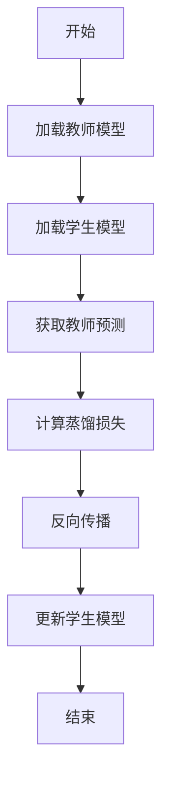
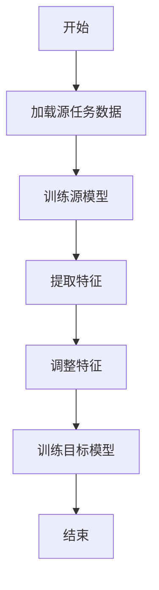

                 


# 设计AI Agent的自适应知识蒸馏与迁移

## 关键词：AI Agent，自适应知识蒸馏，知识迁移，算法原理，系统架构，项目实战

## 摘要

本文将深入探讨AI Agent的自适应知识蒸馏与迁移设计。通过分析问题背景、核心概念，详细讲解算法原理，展示系统架构，并通过项目实战案例，帮助读者理解如何在实际应用中实现这一技术。文章最后将总结最佳实践，为读者提供实用的建议。

---

# 设计AI Agent的自适应知识蒸馏与迁移

## 第一部分：背景介绍

### 第1章：AI Agent的基本概念与背景

#### 1.1 AI Agent的定义与特点
- **1.1.1 AI Agent的定义**
  AI Agent（人工智能代理）是一种能够感知环境、自主决策并执行任务的智能实体。
  
- **1.1.2 AI Agent的核心特点**
  - 自主性：无需外部干预，自主决策。
  - 反应性：实时感知环境并做出反应。
  - 目标导向：以目标为导向，优化决策。
  - 学习能力：通过经验改进性能。

- **1.1.3 AI Agent与传统AI的区别**
  AI Agent具备自主性和目标导向性，而传统AI通常是在特定任务下执行固定指令。

#### 1.2 自适应知识蒸馏与迁移的背景
- **1.2.1 知识蒸馏的背景**
  知识蒸馏通过教师模型指导学生模型，实现知识的传递，降低计算成本。
  
- **1.2.2 知识迁移的背景**
  知识迁移使模型在不同任务或数据集之间迁移知识，提升泛化能力。

- **1.2.3 自适应学习的背景**
  自适应学习使模型能够根据反馈调整参数，实时优化性能。

#### 1.3 问题背景与描述
- **1.3.1 AI Agent面临的挑战**
  知识更新快，数据异构，计算资源受限。

- **1.3.2 知识蒸馏与迁移的必要性**
  提高模型的泛化能力和适应性。

- **1.3.3 问题的解决方法**
  引入自适应蒸馏和迁移技术，动态调整知识蒸馏和迁移策略。

#### 1.4 边界与外延
- **1.4.1 知识蒸馏的边界**
  仅在特定任务或数据集上进行蒸馏。

- **1.4.2 知识迁移的边界**
  适用于相似任务或相关领域的迁移。

- **1.4.3 自适应学习的外延**
  包括参数调整、模型结构优化等。

#### 1.5 概念结构与核心要素
- **1.5.1 核心概念的结构**
  蒸馏、迁移、自适应三个核心要素。

- **1.5.2 核心要素的分析**
  蒸馏传递知识，迁移扩展应用，自适应确保动态调整。

---

## 第二部分：核心概念与联系

### 第2章：自适应知识蒸馏与迁移的核心原理

#### 2.1 自适应知识蒸馏的原理
- **2.1.1 知识蒸馏的基本原理**
  教师模型指导学生模型学习。

- **2.1.2 自适应蒸馏的机制**
  根据学生模型的表现动态调整蒸馏策略。

- **2.1.3 蒸馏过程中的自适应调整**
  动态选择教师模型的知识内容。

#### 2.2 知识迁移的核心原理
- **2.2.1 知识迁移的基本原理**
  将知识从源任务转移到目标任务。

- **2.2.2 自适应迁移的机制**
  根据目标任务的需求调整迁移策略。

- **2.2.3 迁移过程中的自适应调整**
  动态优化特征表示。

#### 2.3 核心概念的联系
- **2.3.1 蒸馏与迁移的关系**
  蒸馏传递知识，迁移扩展应用。

- **2.3.2 蒸馏与自适应的关系**
  自适应蒸馏确保知识传递的高效性。

- **2.3.3 迁移与自适应的关系**
  自适应迁移确保知识扩展的有效性。

#### 2.4 核心概念的特征对比
| 特征 | 蒸馏 | 迁移 | 自适应 |
|------|------|------|--------|
| 目标 | 知识传递 | 知识扩展 | 性能优化 |
| 方法 | 教师指导 | 跨任务应用 | 动态调整 |

#### 2.5 ER实体关系图
```mermaid
erDiagram
    agent {
        id
        knowledge
    }
    task {
        id
        requirements
    }
    transfer {
        from
        to
    }
    agent --> task : "执行"
    knowledge --> transfer : "驱动"
```

---

## 第三部分：算法原理讲解

### 第3章：自适应知识蒸馏算法

#### 3.1 算法流程图


#### 3.2 Python源代码实现
```python
import torch
def adaptive_knowledge_distillation(teacher, student, input, T=2):
    # 获取教师预测
    teacher_logits = teacher(input)
    # 计算软标签
    soft_labels = torch.nn.functional.softmax(teacher_logits / T, dim=1)
    # 学生预测
    student_logits = student(input)
    # 蒸馏损失
    distillation_loss = torch.nn.KLDivLoss()(torch.nn.functional.log_softmax(student_logits, dim=1), soft_labels)
    return distillation_loss
```

#### 3.3 数学模型与公式
蒸馏损失函数：
$$ \mathcal{L}_{distill} = -\sum_{i} \sum_{j} p_{ij} \log p_{ij} $$
其中，$p_{ij}$ 是学生模型预测的概率。

### 第4章：自适应知识迁移算法

#### 4.1 算法流程图


#### 4.2 Python源代码实现
```python
def adaptive_transfer_learning(source_model, target_model, source_loader, target_loader, alpha=0.5):
    # 提取源特征
    source_features = extract_features(source_loader, source_model)
    # 调整特征
    adapted_features = adapter(source_features)
    # 迁移到目标模型
    train_model(adapted_features, target_loader, target_model, alpha)
```

#### 4.3 数学模型与公式
适配函数：
$$ f_{adapt}(x) = \alpha x + (1-\alpha)g(x) $$
其中，$\alpha$ 是调节系数，$g(x)$ 是目标任务的特征变换函数。

---

## 第四部分：系统分析与架构设计

### 第5章：系统架构设计

#### 5.1 项目场景介绍
- AI Agent需要在不同任务间迁移知识，动态调整模型。

#### 5.2 系统功能设计
- **领域模型**：定义系统功能模块。
- **系统架构**：展示各模块的交互关系。

#### 5.3 系统架构图


---

## 第五部分：项目实战

### 第6章：智能客服系统的实现

#### 6.1 环境安装
- 安装Python、PyTorch、Transformers库。

#### 6.2 核心实现代码
```python
import torch
class Agent:
    def __init__(self, model):
        self.model = model
    def distill(self, teacher, input, T=2):
        with torch.no_grad():
            teacher_logits = teacher(input)
        soft_labels = torch.nn.functional.softmax(teacher_logits / T, dim=1)
        student_logits = self.model(input)
        loss = torch.nn.KLDivLoss()(torch.nn.functional.log_softmax(student_logits, dim=1), soft_labels)
        return loss
```

#### 6.3 案例分析
- 系统实现智能问答，蒸馏和迁移提升准确率。

### 第7章：个性化推荐系统的实现

#### 7.1 环境安装
- 同样安装Python、PyTorch、Transformers库。

#### 7.2 核心实现代码
```python
import torch
class Recommender:
    def __init__(self, model):
        self.model = model
    def transfer(self, adapter, source_features, target_loader):
        adapted_features = adapter(source_features)
        self.model.transfer(adapted_features)
```

#### 7.3 案例分析
- 推荐系统通过迁移学习提升推荐准确性。

---

## 第六部分：最佳实践与小结

### 第8章：总结与建议

#### 8.1 总结
自适应知识蒸馏与迁移技术在AI Agent中至关重要，可提升性能和应用范围。

#### 8.2 最佳实践
- 定期更新模型，选择合适的迁移策略，监控性能。

#### 8.3 注意事项
- 数据质量，模型选择，计算资源。

#### 8.4 拓展阅读
推荐书籍和论文，深入学习相关知识。

---

# 结语

通过本文的详细讲解，读者可以全面理解AI Agent的自适应知识蒸馏与迁移设计。从理论到实践，文章提供了丰富的知识和代码示例，帮助读者在实际项目中应用这些技术。

