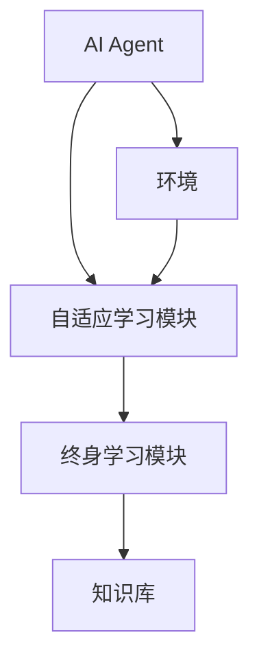
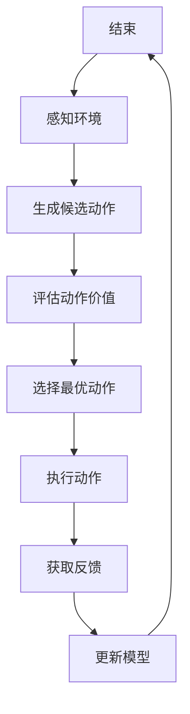
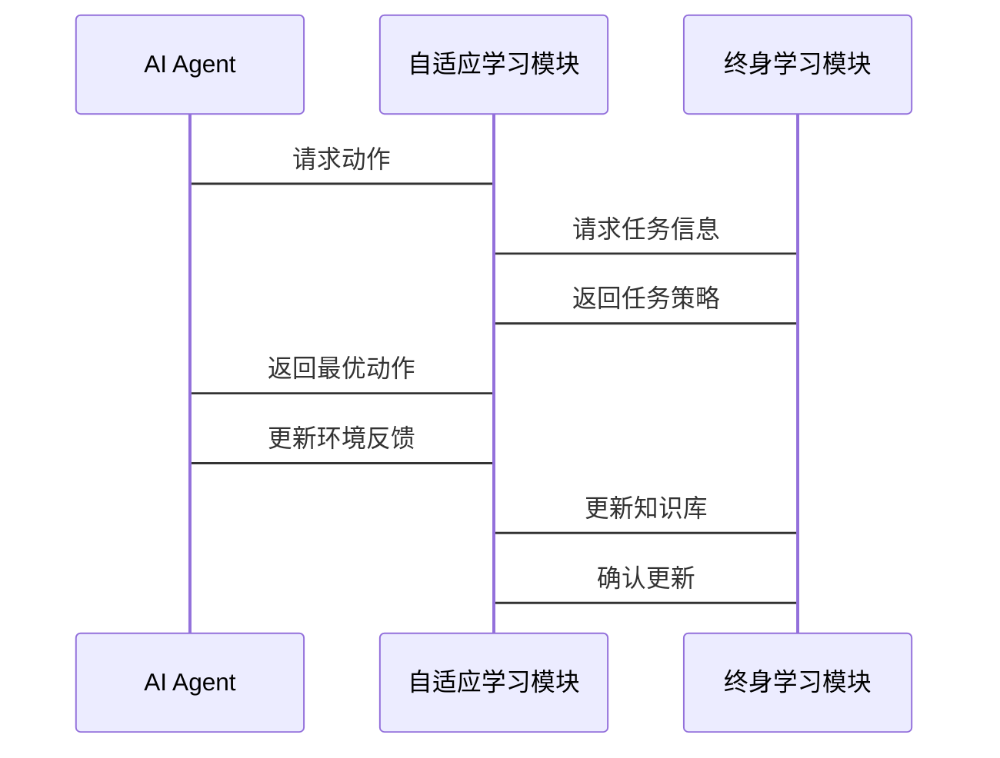

                 


好的，我将按照您的要求逐步思考并撰写《设计AI Agent的自适应终身学习策略》的文章。首先，我们先来看看文章的基本结构和内容安排。

# 设计AI Agent的自适应终身学习策略

## 关键词
AI Agent, 自适应学习, 终身学习, 强化学习, 迁移学习, 元学习, 系统架构

## 摘要
本文深入探讨了设计AI Agent的自适应终身学习策略的核心问题，从理论基础到算法实现，再到系统架构设计，全面分析了如何构建一个能够持续学习和适应复杂环境的AI系统。文章首先介绍了AI Agent和自适应学习的基本概念，然后详细讲解了终身学习的理论基础和实现机制，接着从算法原理、数学模型、系统架构等多个维度展开分析，最后通过实际项目案例展示了如何实现AI Agent的自适应终身学习策略。

---

## 第1章: AI Agent与自适应学习概述

### 1.1 问题背景与问题描述
#### 1.1.1 AI Agent的基本概念
AI Agent（智能体）是指在环境中能够感知并自主行动以实现目标的实体。自适应学习能力是AI Agent的核心特征之一，使其能够在动态变化的环境中不断优化自身行为。

#### 1.1.2 自适应学习的核心问题
自适应学习的核心问题是如何根据环境反馈调整模型参数或策略，以实现更优的决策或行为。终身学习则强调在不断变化的任务中持续提升学习能力。

#### 1.1.3 终身学习的必要性与挑战
随着环境的复杂化，AI Agent需要应对的任务种类越来越多，单一的训练模型难以满足需求。终身学习能够帮助AI Agent在新任务中快速适应，但同时也面临数据稀疏性、任务干扰和计算效率等挑战。

### 1.2 问题解决与边界定义
#### 1.2.1 自适应学习的实现路径
自适应学习的实现路径包括强化学习、迁移学习和元学习等方法。这些方法各有优缺点，需要根据具体场景选择合适的策略。

#### 1.2.2 终身学习的边界与外延
终身学习的边界在于如何平衡新旧任务之间的资源分配，外延则涉及多模态数据、多智能体协作等扩展方向。

#### 1.2.3 AI Agent与自适应学习的关联
AI Agent通过自适应学习能力，能够在复杂环境中实现目标，而自适应学习则通过AI Agent的反馈机制不断优化自身算法。

### 1.3 核心概念结构与要素
#### 1.3.1 自适应学习的系统模型
自适应学习的系统模型包括感知模块、决策模块和学习模块。感知模块负责收集环境信息，决策模块基于当前状态做出决策，学习模块根据反馈调整模型参数。

#### 1.3.2 终身学习的框架结构
终身学习的框架结构包括任务识别模块、知识表示模块和学习策略模块。任务识别模块用于区分不同任务，知识表示模块负责将知识编码，学习策略模块根据任务需求动态调整学习策略。

#### 1.3.3 AI Agent的核心要素
AI Agent的核心要素包括感知能力、决策能力、学习能力和执行能力。这些能力相互作用，共同实现自适应终身学习的目标。

---

## 第2章: 自适应与终身学习的核心概念

### 2.1 自适应学习的原理与机制
#### 2.1.1 自适应学习的定义与特征
自适应学习是一种动态调整学习策略的能力，其特征包括实时性、数据驱动性和目标导向性。

#### 2.1.2 自适应学习的实现机制
自适应学习的实现机制包括基于强化学习的策略优化、基于迁移学习的知识迁移和基于元学习的快速适应。每种机制都有其独特的优势和适用场景。

#### 2.1.3 自适应学习的核心算法
自适应学习的核心算法包括Q-learning、Deep Q-Network（DQN）和Actor-Critic算法。这些算法通过不同的方式实现策略优化。

### 2.2 终身学习的理论基础
#### 2.2.1 终身学习的基本概念
终身学习是指AI Agent在面对新任务时，能够利用之前学习的知识和经验，快速适应新任务的能力。

#### 2.2.2 终身学习的理论模型
终身学习的理论模型包括经验重放、策略迁移和任务分解。这些模型为终身学习的实现提供了理论支持。

#### 2.2.3 终身学习的关键技术
终身学习的关键技术包括多任务学习、知识蒸馏和在线学习。这些技术帮助AI Agent在新任务中快速找到最优解。

### 2.3 AI Agent的自适应学习能力
#### 2.3.1 AI Agent的自适应学习能力
AI Agent的自适应学习能力体现在其能够根据环境反馈动态调整行为策略。

#### 2.3.2 自适应学习与终身学习的关系
自适应学习是终身学习的核心机制，终身学习则是自适应学习的扩展应用。

#### 2.3.3 自适应学习的实现路径
自适应学习的实现路径包括基于强化学习的实时调整、基于迁移学习的知识复用和基于元学习的快速适应。

---

## 第3章: 自适应学习的算法原理

### 3.1 基于强化学习的自适应算法
#### 3.1.1 强化学习的基本原理
强化学习通过智能体与环境的交互，学习最优策略。智能体通过试错的方式，逐步逼近最优行为。

#### 3.1.2 自适应学习的强化学习框架
自适应学习的强化学习框架包括状态空间、动作空间和奖励函数的设计。通过这些设计，智能体能够根据环境反馈动态调整策略。

#### 3.1.3 算法实现与优化
DQN算法通过经验重放和双网络结构，实现了稳定的学习过程。Actor-Critic算法则通过同时学习策略和价值函数，实现了更高效的策略优化。

### 3.2 基于元学习的自适应算法
#### 3.2.1 元学习的定义与特点
元学习是指学习如何学习，其核心在于快速适应新任务。元学习的特点包括任务多样性、快速适应性和知识复用性。

#### 3.2.2 自适应学习中的元学习框架
自适应学习中的元学习框架包括元任务分解、元策略优化和元知识整合。这些框架帮助智能体在新任务中快速找到最优解。

#### 3.2.3 元学习算法的实现与优化
元学习算法的实现包括Meta-SGD和Reptile算法。这些算法通过参数共享和梯度优化，实现了快速的适应能力。

### 3.3 基于迁移学习的自适应算法
#### 3.3.1 迁移学习的基本原理
迁移学习是指将一个领域中学到的知识应用到另一个领域中。迁移学习的核心在于找到源任务和目标任务之间的共同特征。

#### 3.3.2 自适应学习中的迁移策略
自适应学习中的迁移策略包括直接迁移、领域适配和对抗迁移。这些策略帮助智能体在新任务中快速找到最优解。

#### 3.3.3 迁移学习算法的实现与优化
迁移学习算法的实现包括CycleGAN和DA（Domain Adaptation）算法。这些算法通过特征对齐和对抗训练，实现了跨领域的知识迁移。

---

## 第4章: 终身学习的数学模型与公式

### 4.1 自适应学习的数学模型
#### 4.1.1 自适应学习的基本模型
自适应学习的基本模型包括Q-learning模型和DQN模型。Q-learning模型通过状态和动作的值函数，实现策略优化。DQN模型通过深度网络，实现更高效的策略优化。

#### 4.1.2 自适应学习的优化目标
自适应学习的优化目标是最大化累积奖励。通过优化目标函数，智能体能够在环境中找到最优策略。

#### 4.1.3 自适应学习的数学公式
自适应学习的数学公式包括Q-learning的更新公式：
$$ Q(s, a) = Q(s, a) + \alpha (r + \gamma \max Q(s', a') - Q(s, a)) $$
和DQN的双网络更新公式：
$$ \theta_2' = \theta_2 + \alpha (y - y') $$

### 4.2 终身学习的数学框架
#### 4.2.1 终身学习的基本框架
终身学习的基本框架包括经验重放、策略迁移和任务分解。这些框架为终身学习的实现提供了数学支持。

#### 4.2.2 终身学习的数学表达
终身学习的数学表达包括多任务学习的共享参数模型和知识蒸馏的教师-学生框架。

#### 4.2.3 终身学习的优化算法
终身学习的优化算法包括基于梯度的优化和基于强化学习的优化。这些算法帮助智能体在新任务中快速找到最优解。

### 4.3 算法实现与代码示例
#### 4.3.1 强化学习算法的实现代码
```python
class DQN:
    def __init__(self, state_space, action_space):
        self.state_space = state_space
        self.action_space = action_space
        # 省略网络定义和优化器代码
    def perceive(self, state, action, reward, next_state):
        # 省略经验重放和网络更新代码
```

#### 4.3.2 元学习算法的实现代码
```python
class MetaLearner:
    def __init__(self, meta_params):
        self.meta_params = meta_params
        # 省略元学习网络定义代码
    def meta_optimize(self, tasks):
        # 省略元优化代码
```

#### 4.3.3 迁移学习算法的实现代码
```python
class TransferLearner:
    def __init__(self, source_model):
        self.source_model = source_model
        # 省略迁移学习网络定义代码
    def adapt(self, target_data):
        # 省略领域适配代码
```

---

## 第5章: 自适应终身学习策略的系统架构与设计

### 5.1 系统功能模块设计
#### 5.1.1 自适应学习模块
自适应学习模块负责根据环境反馈动态调整策略。模块包括感知、决策和学习三个子模块。

#### 5.1.2 终身学习模块
终身学习模块负责管理多任务之间的知识共享和迁移。模块包括任务识别、知识表示和学习策略三个子模块。

#### 5.1.3 AI Agent控制模块
AI Agent控制模块负责协调各模块的运行，实现整体的最优控制。模块包括状态管理、任务调度和资源分配三个子模块。

### 5.2 系统架构设计
#### 5.2.1 系统架构图
使用Mermaid绘制系统架构图，展示各模块之间的交互关系。



#### 5.2.2 系统功能流程图
使用Mermaid绘制系统功能流程图，展示系统运行的流程。



### 5.3 系统接口设计
#### 5.3.1 自适应学习模块接口
自适应学习模块提供以下接口：
- `perceive(state, action, reward, next_state)`: 处理环境反馈，更新模型参数。
- `get_action(state)`: 根据当前状态，返回最优动作。

#### 5.3.2 终身学习模块接口
终身学习模块提供以下接口：
- `transfer(source_task, target_task)`: 迁移知识，适应新任务。
- `adapt(task)`: 根据任务需求，调整学习策略。

#### 5.3.3 AI Agent控制模块接口
AI Agent控制模块提供以下接口：
- `start()`: 初始化系统，开始运行。
- `stop()`: 结束运行，释放资源。
- `add_task(task)`: 添加新任务，更新任务列表。

### 5.4 系统交互序列图
使用Mermaid绘制系统交互序列图，展示系统运行时的交互流程。



---

## 第6章: 项目实战

### 6.1 环境安装与配置
#### 6.1.1 安装依赖
安装必要的Python库，包括TensorFlow、Keras和OpenAI Gym。

#### 6.1.2 环境配置
配置运行环境，包括GPU支持和多线程优化。

### 6.2 系统核心实现
#### 6.2.1 自适应学习模块实现
实现DQN算法，包括感知、决策和学习三个部分。

#### 6.2.2 终身学习模块实现
实现任务迁移和知识蒸馏，实现跨任务的知识共享。

#### 6.2.3 AI Agent控制模块实现
实现任务调度和资源管理，协调各模块的运行。

### 6.3 代码实现与解读
#### 6.3.1 自适应学习模块代码
```python
class DQN:
    def __init__(self, state_space, action_space):
        self.state_space = state_space
        self.action_space = action_space
        # 省略网络定义和优化器代码
    def perceive(self, state, action, reward, next_state):
        # 省略经验重放和网络更新代码
    def get_action(self, state):
        # 省略动作选择代码
```

#### 6.3.2 终身学习模块代码
```python
class MetaLearner:
    def __init__(self, meta_params):
        self.meta_params = meta_params
        # 省略元学习网络定义代码
    def meta_optimize(self, tasks):
        # 省略元优化代码
```

#### 6.3.3 AI Agent控制模块代码
```python
class AgentController:
    def __init__(self):
        self.tasks = []
        # 省略任务管理代码
    def start(self):
        # 省略初始化代码
    def stop(self):
        # 省略结束代码
    def add_task(self, task):
        # 省略任务添加代码
```

### 6.4 实际案例分析
#### 6.4.1 案例背景
假设我们设计一个AI Agent，在一个多任务环境中，需要同时完成路径规划和目标识别两个任务。

#### 6.4.2 系统实现
通过自适应学习模块和终身学习模块的协作，AI Agent能够根据任务需求动态调整策略。

#### 6.4.3 案例分析
分析系统在不同任务中的表现，评估自适应学习和终身学习的效果。

### 6.5 项目小结
总结项目实现的关键点和经验教训，为后续优化提供参考。

---

## 第7章: 总结与展望

### 7.1 核心内容回顾
回顾本文的核心内容，总结AI Agent自适应终身学习策略的设计与实现的关键点。

### 7.2 最佳实践 tips
给出在实际项目中应用自适应终身学习策略的最佳实践建议，包括算法选择、系统设计和任务管理等方面。

### 7.3 注意事项与局限性
分析自适应终身学习策略的局限性，包括计算效率、数据稀疏性和任务干扰等问题。

### 7.4 未来研究方向
展望未来的研究方向，包括多模态学习、人机协作和自适应强化学习等方面。

---

## 参考文献
列出本文参考的相关文献和资料，包括书籍、论文和网络资源等。

---

以上是《设计AI Agent的自适应终身学习策略》的文章结构和内容安排。希望这篇结构清晰、内容详实的技术博客能够为您提供有价值的参考和启发。

