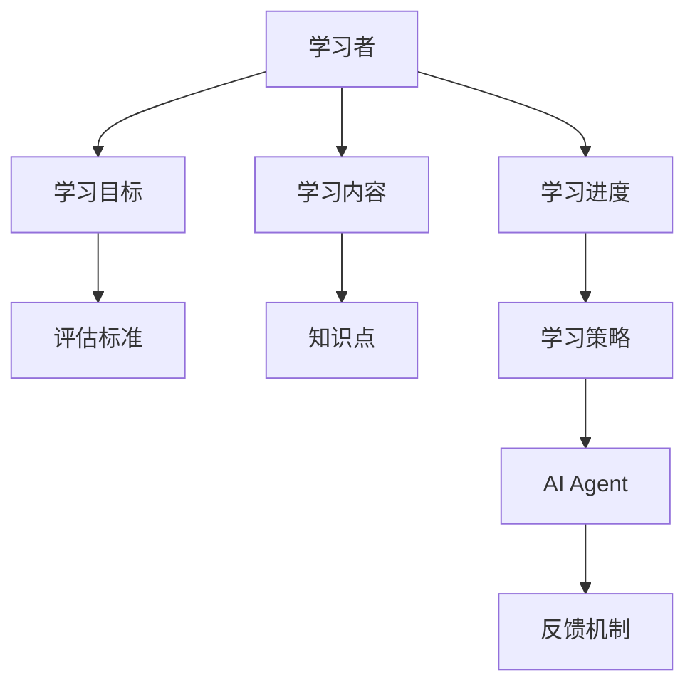
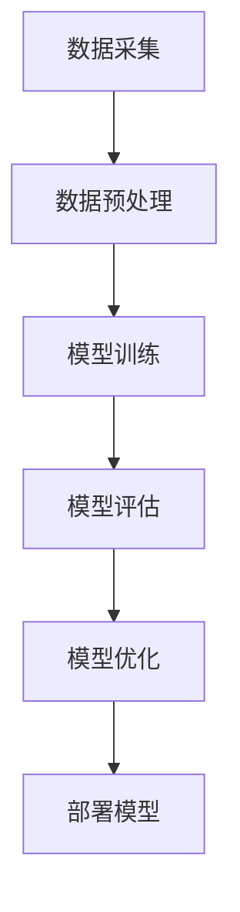
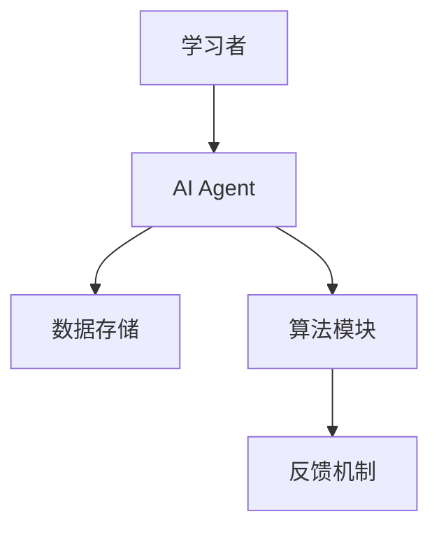
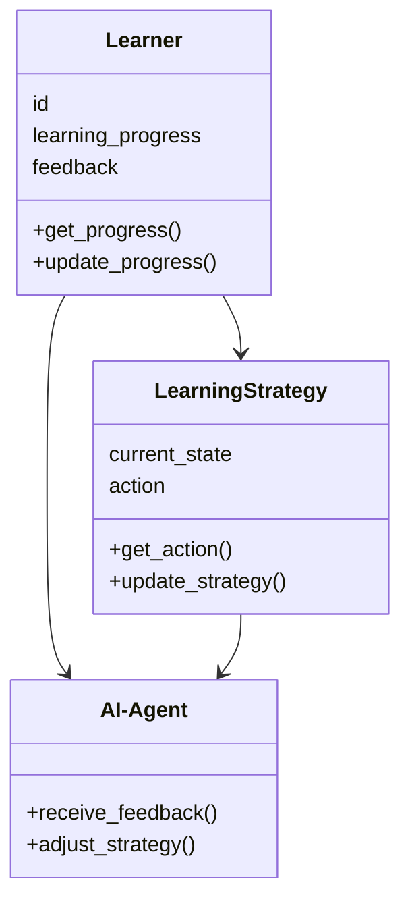
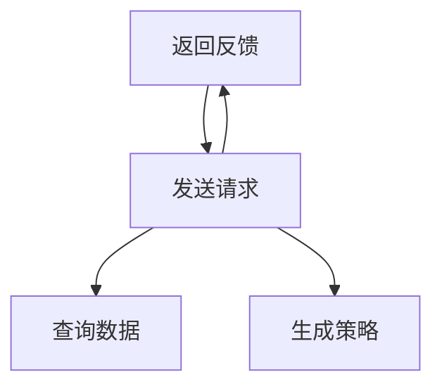

                 


# 设计AI Agent的自适应课程学习策略

## 关键词：AI Agent，自适应学习，课程设计，学习策略，机器学习，自然语言处理，人机交互

## 摘要：  
本文探讨了设计AI Agent的自适应课程学习策略的关键问题，从背景分析、核心概念、算法原理、系统架构到项目实现，层层深入，结合理论与实践，为AI Agent在教育领域的应用提供了全面的解决方案。本文不仅介绍了自适应学习策略的核心理论，还通过具体的算法实现和系统设计，展示了如何构建一个高效、个性化的AI教育系统。

---

# 第一部分: 背景与问题分析

## 第1章: 自适应课程学习策略的背景与问题背景

### 1.1 问题背景
- 1.1.1 传统课程学习的局限性  
  - 传统教学模式缺乏个性化，难以满足不同学习者的差异化需求。  
  - 学习者在不同阶段的学习进度差异大，统一的教学策略效果有限。  

- 1.1.2 AI Agent在教育中的应用潜力  
  - AI Agent能够通过数据分析和机器学习技术，实时调整教学策略。  
  - 自然语言处理技术使AI Agent能够理解并解析学习者的需求和反馈。  

- 1.1.3 自适应学习的必要性与挑战  
  - 自适应学习能够根据学习者的知识水平和学习风格，动态调整教学内容和进度。  
  - 实现自适应学习需要解决数据采集、算法优化和系统架构等多方面的挑战。  

### 1.2 问题描述
- 1.2.1 AI Agent在课程学习中的角色定位  
  - AI Agent作为学习辅助工具，能够提供个性化的学习建议和资源推荐。  
  - AI Agent能够通过实时反馈优化学习路径，帮助学习者提高学习效率。  

- 1.2.2 自适应学习策略的核心问题  
  - 如何根据学习者的行为数据和反馈信息，动态调整教学内容和进度。  
  - 如何设计高效的算法和模型，实现自适应学习的实时性和准确性。  

- 1.2.3 用户需求与系统目标的匹配  
  - 学习者需要个性化、高效的学习体验。  
  - 系统需要在有限的资源和时间内，最大化学习者的学习效果。  

### 1.3 问题解决
- 1.3.1 自适应学习策略的设计目标  
  - 提供个性化的学习路径，满足不同学习者的需求。  
  - 实时调整教学策略，优化学习效果。  

- 1.3.2 AI Agent如何实现个性化学习  
  - 通过数据采集和分析，了解学习者的学习风格和知识水平。  
  - 根据分析结果，动态调整教学内容和进度。  

- 1.3.3 系统架构与功能模块的初步设计  
  - 需要设计数据采集模块、算法模块、反馈模块等核心功能模块。  
  - 系统架构需要考虑模块之间的交互和数据流的传输。  

### 1.4 边界与外延
- 1.4.1 自适应学习的边界条件  
  - 自适应学习策略适用于个性化学习场景，不适用于需要严格固定教学内容的情况。  
  - 系统需要在特定的学习目标和时间内实现自适应调整。  

- 1.4.2 相关领域的联系与区别  
  - 自适应学习与传统教学的区别在于个性化和实时性。  
  - 自适应学习与智能推荐系统的联系在于都需要根据数据动态调整策略。  

- 1.4.3 系统的可扩展性与灵活性  
  - 系统需要具备扩展性，能够适应不同学习者和不同课程的需求。  
  - 系统需要具备灵活性，能够根据反馈快速调整策略。  

### 1.5 概念结构与核心要素组成
- 1.5.1 自适应学习策略的核心要素  
  - 数据采集：学习者的行为数据、反馈数据等。  
  - 算法：用于分析数据并生成调整策略的算法。  
  - 系统架构：实现数据采集、算法运行和策略调整的系统结构。  

- 1.5.2 AI Agent与课程学习的关系  
  - AI Agent作为中介，连接学习者和课程内容。  
  - AI Agent通过分析学习者的行为数据，优化课程内容的呈现方式。  

- 1.5.3 系统的核心功能模块与交互流程  
  - 功能模块包括数据采集模块、算法模块、反馈模块等。  
  - 交互流程涉及数据采集、策略生成、策略执行和反馈调整等步骤。  

### 1.6 本章小结
- 本章分析了自适应课程学习策略的背景和问题背景，明确了问题的核心和解决方向。  
- 通过对比传统教学和自适应学习，强调了AI Agent在实现个性化学习中的重要作用。  
- 提出了系统架构和功能模块的初步设计，为后续章节的深入分析奠定了基础。  

---

# 第二部分: 核心概念与联系

## 第2章: 自适应课程学习策略的核心概念

### 2.1 自适应学习策略的理论基础
- 2.1.1 基于数据的自适应学习  
  - 通过分析学习者的行为数据，了解其学习风格和知识水平。  
  - 根据数据动态调整教学内容和进度。  

- 2.1.2 基于模型的自适应学习  
  - 构建学习者的知识模型，预测其学习效果。  
  - 根据模型输出结果，调整教学策略。  

- 2.1.3 基于反馈的自适应学习  
  - 通过实时反馈优化学习路径。  
  - 根据反馈调整教学内容和进度。  

### 2.2 AI Agent的核心能力
- 2.2.1 自然语言处理能力  
  - 理解学习者的反馈和需求。  
  - 提供个性化的学习建议和资源推荐。  

- 2.2.2 个性化推荐能力  
  - 根据学习者的兴趣和能力，推荐合适的课程内容。  
  - 通过推荐算法优化学习资源的分配。  

- 2.2.3 动态调整能力  
  - 实时监控学习者的学习进度和反馈。  
  - 根据监控结果动态调整教学策略。  

### 2.3 核心概念的对比分析
- 2.3.1 自适应学习策略与传统学习策略的对比  
  - 传统策略：固定教学内容和进度，适用于标准化教学。  
  - 自适应策略：个性化、动态调整，适用于差异化教学。  

- 2.3.2 AI Agent与传统教学工具的对比  
  - 传统工具：功能单一，缺乏智能化。  
  - AI Agent：具备智能化和个性化能力，能够实时调整教学策略。  

- 2.3.3 不同自适应学习算法的对比  
  - 基于规则的算法：简单易实现，但缺乏灵活性。  
  - 基于机器学习的算法：能够根据数据动态调整，但需要大量数据支持。  
  - 基于强化学习的算法：通过反馈优化策略，适合复杂场景。  

### 2.4 实体关系图


### 2.5 本章小结
- 本章详细介绍了自适应课程学习策略的核心概念，包括理论基础和AI Agent的核心能力。  
- 通过对比分析，明确了自适应学习策略与传统策略的区别，以及不同算法的优缺点。  
- 实体关系图展示了系统各实体之间的关系，为后续系统架构设计奠定了基础。  

---

# 第三部分: 算法原理讲解

## 第3章: 自适应学习算法的数学模型

### 3.1 基于强化学习的自适应算法
- 3.1.1 强化学习的基本原理  
  - 强化学习通过试错机制，学习最优策略。  
  - 系统通过与环境的交互，获得奖励或惩罚信号，调整动作以最大化累积奖励。  

- 3.1.2 Q-learning算法的数学模型  
  $$ Q(s, a) = r + \gamma \max Q(s', a') $$  
  其中：  
  - $Q(s, a)$ 表示在状态$s$下采取动作$a$的期望奖励。  
  - $r$ 是即时奖励。  
  - $\gamma$ 是折扣因子，取值在0到1之间，表示未来奖励的权重。  
  - $s'$ 是下一个状态。  
  - $a'$ 是下一个动作。  

- 3.1.3 算法流程图  
```mermaid
graph TD
    Start --> Initialize Q表
    Initialize Q表 --> 循环开始
    循环开始 --> 选择动作
    选择动作 --> 执行动作
    执行动作 --> 获取奖励和下一个状态
    获取奖励和下一个状态 --> 更新Q表
    更新Q表 --> 循环结束
    循环结束 --> 结束
```

### 3.2 基于机器学习的自适应算法
- 3.2.1 算法选择与模型构建  
  - 使用随机森林、支持向量机等算法进行分类或回归预测。  
  - 模型输入为学习者的行为数据，输出为学习策略。  

- 3.2.2 算法流程图  


### 3.3 算法实现与代码示例
- 3.3.1 强化学习算法的Python代码示例  
```python
import numpy as np

class QLearning:
    def __init__(self, state_space, action_space, gamma=0.99, epsilon=0.1):
        self.state_space = state_space
        self.action_space = action_space
        self.gamma = gamma
        self.epsilon = epsilon
        self.q_table = np.zeros((state_space, action_space))
    
    def choose_action(self, state):
        if np.random.random() < self.epsilon:
            return np.random.randint(self.action_space)
        else:
            return np.argmax(self.q_table[state])
    
    def learn(self, state, action, reward, next_state):
        self.q_table[state, action] = reward + self.gamma * np.max(self.q_table[next_state])
```

- 3.3.2 基于机器学习的算法代码示例  
```python
from sklearn.ensemble import RandomForestClassifier

class AdaptiveLearning:
    def __init__(self, features, target):
        self.clf = RandomForestClassifier()
        self.features = features
        self.target = target
    
    def train(self, X, y):
        self.clf.fit(X, y)
    
    def predict(self, X):
        return self.clf.predict(X)
```

### 3.4 本章小结
- 本章介绍了基于强化学习和机器学习的自适应学习算法，重点讲解了Q-learning算法的数学模型和Python代码实现。  
- 通过算法流程图和代码示例，展示了如何将理论应用于实际系统设计中。  
- 强化学习适用于复杂场景，而机器学习算法则适用于数据驱动的场景。  

---

# 第四部分: 系统分析与架构设计

## 第4章: 系统分析与架构设计方案

### 4.1 问题场景介绍
- 学习者通过AI Agent进行在线学习，系统根据学习者的反馈实时调整课程内容和进度。  
- 系统需要支持多种课程类型，包括视频、文档、练习题等。  

### 4.2 系统功能设计
- 4.2.1 数据采集模块  
  - 收集学习者的行为数据，包括点击、浏览、答题等。  
  - 采集学习者的学习进度和反馈信息。  

- 4.2.2 算法模块  
  - 根据数据生成学习策略，动态调整课程内容。  
  - 通过反馈机制优化学习路径。  

- 4.2.3 反馈模块  
  - 提供实时反馈，帮助学习者了解学习效果。  
  - 根据反馈调整教学策略。  

### 4.3 系统架构设计
- 4.3.1 系统架构图  


- 4.3.2 领域模型类图  


### 4.4 系统接口设计
- 4.4.1 API接口设计  
  - 提供RESTful API，供学习者和系统交互。  
  - 接口包括数据采集、策略生成、反馈调整等功能。  

- 4.4.2 接口交互流程图  


### 4.5 本章小结
- 本章通过系统分析和架构设计，明确了AI Agent自适应课程学习策略的实现方案。  
- 系统架构图和领域模型类图展示了系统各模块之间的关系。  
- API接口设计为系统的实际实现提供了指导。  

---

# 第五部分: 项目实战

## 第5章: 项目实战

### 5.1 环境安装与配置
- 安装Python、机器学习库（如scikit-learn、TensorFlow）和数据可视化工具（如Matplotlib）。  
- 配置开发环境，包括IDE和版本控制工具（如Git）。  

### 5.2 系统核心实现
- 5.2.1 数据采集模块的实现  
  - 使用爬虫技术采集学习者的行为数据。  
  - 数据预处理，包括清洗和特征提取。  

- 5.2.2 算法模块的实现  
  - 实现Q-learning算法，动态调整学习策略。  
  - 使用随机森林算法进行分类或回归预测。  

- 5.2.3 反馈模块的实现  
  - 根据学习者的反馈调整教学策略。  
  - 提供实时反馈，帮助学习者了解学习效果。  

### 5.3 代码实现与解读
- 5.3.1 强化学习算法的实现  
```python
class QLearning:
    def __init__(self, state_space, action_space, gamma=0.99, epsilon=0.1):
        self.state_space = state_space
        self.action_space = action_space
        self.gamma = gamma
        self.epsilon = epsilon
        self.q_table = np.zeros((state_space, action_space))
    
    def choose_action(self, state):
        if np.random.random() < self.epsilon:
            return np.random.randint(self.action_space)
        else:
            return np.argmax(self.q_table[state])
    
    def learn(self, state, action, reward, next_state):
        self.q_table[state, action] = reward + self.gamma * np.max(self.q_table[next_state])
```

- 5.3.2 机器学习算法的实现  
```python
from sklearn.ensemble import RandomForestClassifier

class AdaptiveLearning:
    def __init__(self, features, target):
        self.clf = RandomForestClassifier()
        self.features = features
        self.target = target
    
    def train(self, X, y):
        self.clf.fit(X, y)
    
    def predict(self, X):
        return self.clf.predict(X)
```

### 5.4 实际案例分析
- 5.4.1 案例背景  
  - 某在线教育平台，希望优化课程推荐算法。  
  - 系统需要根据学习者的行为数据，动态调整课程内容。  

- 5.4.2 算法实现与分析  
  - 使用Q-learning算法进行课程推荐。  
  - 系统根据学习者的学习进度和反馈，动态调整课程内容。  

### 5.5 本章小结
- 本章通过项目实战，展示了如何将理论应用于实际系统设计中。  
- 代码实现部分详细讲解了强化学习和机器学习算法的实现细节。  
- 案例分析帮助读者更好地理解算法的应用场景和效果。  

---

# 第六部分: 最佳实践与小结

## 第6章: 最佳实践与小结

### 6.1 最佳实践
- 6.1.1 数据采集与处理  
  - 确保数据的完整性和准确性。  
  - 数据预处理是关键，需要仔细清洗和特征提取。  

- 6.1.2 算法选择与优化  
  - 根据实际场景选择合适的算法。  
  - 通过实验和测试优化算法性能。  

- 6.1.3 系统架构设计  
  - 系统架构需要考虑可扩展性和灵活性。  
  - 合理设计接口和模块，确保系统易于维护和优化。  

### 6.2 小结
- 本文系统地探讨了设计AI Agent的自适应课程学习策略的关键问题，从背景分析、核心概念、算法原理、系统架构到项目实现，层层深入，结合理论与实践，为AI Agent在教育领域的应用提供了全面的解决方案。  

### 6.3 注意事项
- 系统设计时需要考虑数据安全和隐私保护。  
- 算法实现时需要确保计算效率和资源利用率。  
- 系统上线后需要持续监控和优化，根据用户反馈不断调整策略。  

### 6.4 拓展阅读
- 推荐阅读《机器学习实战》和《深度学习入门：基于Python》等书籍，深入了解机器学习和深度学习的理论与实践。  
- 关注教育领域的最新技术动态，探索AI技术在教育中的更多应用场景。  

### 6.5 本章小结
- 本文通过最佳实践和小结，总结了设计AI Agent的自适应课程学习策略的关键点。  
- 提出了数据采集、算法选择和系统架构设计的具体注意事项。  
- 为读者提供了进一步学习和研究的方向。  

---

# 结语

设计AI Agent的自适应课程学习策略是一项复杂但极具挑战性的任务，需要结合理论与实践，不断优化和调整。通过本文的系统分析和详细讲解，读者可以深入了解自适应学习策略的核心原理和实现方法。未来，随着AI技术的不断发展，自适应学习策略将在教育领域发挥越来越重要的作用，为学习者提供更加个性化和高效的学习体验。

