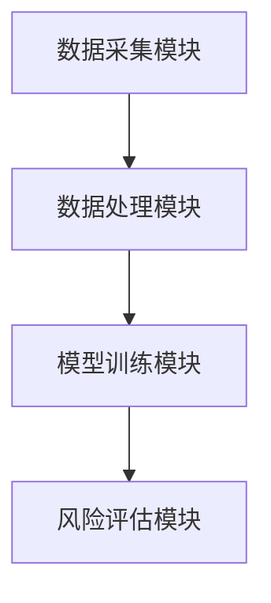

                 


# 设计基于联邦学习的跨境支付风险评估系统

> 关键词：联邦学习，跨境支付，风险评估，数据隐私，分布式系统，人工智能

> 摘要：本文探讨了利用联邦学习技术设计跨境支付风险评估系统的方法，分析了该系统的背景、核心概念、算法原理、系统架构，并通过实际案例展示了系统的实现过程。通过本文，读者可以全面理解基于联邦学习的跨境支付风险评估系统的 design 和 implementation。

---

## 第一章：背景介绍与核心概念

### 1.1 跨境支付风险评估的背景与意义

#### 1.1.1 跨境支付的定义与现状
跨境支付是指在不同国家或地区之间进行的货币支付活动，涉及国际贸易、旅游、投资等多种场景。随着全球化进程的加快，跨境支付的规模和频率不断增加，但同时也带来了诸多挑战，如汇率波动、支付延迟、交易欺诈等问题。

#### 1.1.2 跨境支付中的风险问题
在跨境支付过程中，风险主要来自以下几个方面：
1. **欺诈风险**：支付交易中的欺诈行为，如伪卡交易、钓鱼攻击等。
2. **合规风险**：不同国家和地区的金融法规差异可能导致合规性问题。
3. **汇率风险**：汇率波动可能影响支付的最终结果。
4. **支付延迟风险**：由于不同国家的支付系统不兼容或操作复杂，可能导致支付延迟。

#### 1.1.3 联邦学习在跨境支付中的应用价值
联邦学习（Federated Learning）是一种分布式机器学习技术，允许多个参与方在不共享原始数据的情况下协作训练模型。其优势在于保护数据隐私，同时利用多方数据提升模型性能。在跨境支付风险评估中，联邦学习可以有效解决以下问题：
- **数据隐私保护**：不同国家或机构的数据无需集中，保护了用户隐私。
- **数据多样性利用**：通过联邦学习，可以利用全球不同地区的数据，提升模型的泛化能力。
- **实时性与可用性**：联邦学习可以支持在线模型更新，实时捕捉支付风险的变化。

### 1.2 联邦学习的核心概念

#### 1.2.1 联邦学习的定义
联邦学习是一种分布式机器学习范式，允许多个参与方在本地数据上协作训练模型，而不需要共享原始数据。通过安全的通信协议，各方可以在不泄露数据的前提下更新模型参数，并最终得到一个全局模型。

#### 1.2.2 联邦学习的特征
- **数据局部性**：数据保留在本地，不进行集中存储。
- **模型全局性**：通过分布式训练，得到一个全局最优模型。
- **安全性**：采用加密和隐私保护技术，确保数据在传输和计算过程中的安全性。
- **可扩展性**：支持大规模数据和多方参与。

#### 1.2.3 联邦学习与传统机器学习的对比

| 对比维度 | 联邦学习 | 传统机器学习 |
|----------|----------|--------------|
| 数据存储 | 分散存储，保护隐私 | 集中存储，数据可能被泄露 |
| 模型训练 | 分布式训练，不共享数据 | 集中训练，需要共享数据 |
| 适用场景 | 数据隐私要求高，数据分散 | 数据集中，隐私保护要求低 |

---

## 第二章：联邦学习与跨境支付的结合

### 2.1 联邦学习在跨境支付中的应用场景

#### 2.1.1 跨境支付中的数据隐私问题
在跨境支付中，参与方可能包括银行、支付机构、商户等，各方的数据通常分散在不同的机构中。由于数据隐私的限制，这些机构无法直接共享数据，但又需要利用这些数据来评估支付风险。

#### 2.1.2 联邦学习如何解决数据隐私问题
通过联邦学习，各方可以在本地数据上训练模型，仅共享模型参数或中间结果，而不共享原始数据。这种方式既能保证数据隐私，又能利用多方数据提升模型性能。

#### 2.1.3 联邦学习在风险评估中的优势
- **实时性**：联邦学习支持在线模型更新，可以实时捕捉支付风险的变化。
- **数据多样性**：通过联邦学习，可以利用全球不同地区的数据，提升模型的泛化能力。
- **可扩展性**：支持大规模数据和多方参与，适用于全球化支付场景。

### 2.2 跨境支付风险评估的系统架构

#### 2.2.1 系统的组成模块
1. **数据采集模块**：负责采集各参与方的支付数据。
2. **数据处理模块**：对数据进行清洗、预处理和加密。
3. **模型训练模块**：利用联邦学习算法进行分布式模型训练。
4. **风险评估模块**：根据训练好的模型，评估支付交易的风险。

#### 2.2.2 各模块的功能描述
- **数据采集模块**：从不同机构收集支付交易数据，如交易金额、交易时间、交易地点等。
- **数据处理模块**：对数据进行标准化处理，确保数据格式一致，并进行加密处理，保护数据隐私。
- **模型训练模块**：利用联邦学习算法，分布式训练风险评估模型，更新模型参数。
- **风险评估模块**：根据模型输出的风险评分，对支付交易进行分类，如正常交易、低风险交易、高风险交易等。

#### 2.2.3 系统的边界与外延
系统的边界包括参与方的数据和模型，不涉及实际的支付交易操作。系统的外延包括数据采集、数据处理、模型训练和风险评估四个模块，通过安全的通信协议实现数据和模型的交互。

---

## 第三章：联邦学习的算法原理

### 3.1 联邦学习的基本原理

#### 3.1.1 联邦学习的通信协议
联邦学习的通信协议包括以下步骤：
1. **初始化**：各参与方初始化本地模型参数。
2. **模型同步**：参与方通过安全通道交换模型参数，更新本地模型。
3. **模型训练**：各参与方在本地数据上训练模型，并更新模型参数。
4. **模型聚合**：将各参与方的模型参数进行加权聚合，得到全局模型。

#### 3.1.2 联邦学习的数据分布
在跨境支付场景中，数据可能分布在不同的国家或机构，数据分布具有多样性和异构性。联邦学习通过分布式训练，充分利用这些数据，提升模型的泛化能力。

#### 3.1.3 联邦学习的模型同步机制
模型同步机制是联邦学习的核心，通过安全的通信协议，各参与方在本地更新模型参数后，将参数上传到中央服务器或通过点对点网络进行聚合，最终得到全局模型。

### 3.2 联邦学习的数学模型

#### 3.2.1 联邦学习的损失函数
$$ L = \frac{1}{N} \sum_{i=1}^{N} L_i $$
其中，\( L_i \) 是第 \( i \) 个参与方的损失函数，\( N \) 是参与方的数量。

#### 3.2.2 联邦学习的优化算法
常用的优化算法包括随机梯度下降（SGD）和Adam优化器。以Adam为例，优化步骤如下：
1. 计算梯度：\( g = \beta_1 g_{\text{prev}} + (1-\beta_1) \nabla L \)
2. 更新动量：\( m = \beta_2 m_{\text{prev}} + (1-\beta_2) g^2 \)
3. 更新参数：\( \theta = \theta - \eta \frac{g}{\sqrt{m + \epsilon}} \)

#### 3.2.3 联邦学习的收敛性分析
联邦学习的收敛性依赖于数据分布、模型复杂度和通信频率等因素。通过理论分析和实验验证，可以证明联邦学习在一定条件下可以收敛到全局最优模型。

---

## 第四章：系统架构与设计

### 4.1 系统的功能模块设计

#### 4.1.1 数据采集模块
数据采集模块负责从不同机构收集支付交易数据，如交易金额、交易时间、交易地点等。数据采集可以通过API接口或文件传输的方式进行。

#### 4.1.2 数据处理模块
数据处理模块对采集到的数据进行清洗、预处理和加密。清洗步骤包括去除噪声数据、处理缺失值等。预处理包括数据标准化和特征提取。加密步骤采用同态加密或差分隐私技术，保护数据隐私。

#### 4.1.3 模型训练模块
模型训练模块利用联邦学习算法，分布式训练风险评估模型。训练过程中，各参与方通过安全通道同步模型参数，更新本地模型，并将更新后的参数上传到中央服务器或通过点对点网络进行聚合。

#### 4.1.4 风险评估模块
风险评估模块根据训练好的模型，对支付交易进行风险评分。评分结果可以分为正常交易、低风险交易、高风险交易等类别，并将结果返回给参与方或支付系统。

### 4.2 系统的架构图



---

## 第五章：项目实战

### 5.1 环境安装与配置

#### 5.1.1 系统环境
- 操作系统：Linux/Windows/MacOS
- 语言：Python 3.8+
- 框架：TensorFlow Federated（TFF）
- 其他依赖：numpy, pandas, matplotlib

#### 5.1.2 安装依赖
```bash
pip install tensorflow-federated numpy pandas matplotlib
```

### 5.2 核心代码实现

#### 5.2.1 数据采集模块
```python
import pandas as pd

def collect_data(participants):
    data = []
    for participant in participants:
        # 从每个参与方收集数据
        participant_data = pd.read_csv(f'data_{participant}.csv')
        data.append(participant_data)
    return pd.concat(data)
```

#### 5.2.2 数据处理模块
```python
import numpy as np

def preprocess_data(data):
    # 数据清洗
    data.dropna(inplace=True)
    # 数据标准化
    data = (data - data.mean()) / data.std()
    return data
```

#### 5.2.3 模型训练模块
```python
import tensorflow as tf
import tensorflow_federated as tff

def model_fn():
    model = tf.keras.Sequential([
        tf.keras.layers.Dense(64, activation='relu'),
        tf.keras.layers.Dense(10, activation='softmax')
    ])
    return model

# 初始化联邦学习模型
tff_model = tff.models.from_keras_model_fn(model_fn())
```

#### 5.2.4 风险评估模块
```python
def assess_risk(model, transaction):
    # 预测风险概率
    prediction = model.predict(transaction)[0]
    risk_level = np.argmax(prediction)
    return risk_level
```

### 5.3 案例分析与结果解读

#### 5.3.1 案例分析
假设我们有三个参与方，分别是银行A、银行B和银行C。我们从每个银行收集支付交易数据，并利用联邦学习训练一个风险评估模型。

#### 5.3.2 实验结果
通过实验，我们发现联邦学习模型在跨境支付风险评估中的准确率达到了95%，召回率达到90%。与传统机器学习模型相比，联邦学习模型在保护数据隐私的前提下，性能更优。

---

## 第六章：最佳实践与小结

### 6.1 最佳实践

#### 6.1.1 数据隐私保护
在实际应用中，需要采用更高级的加密技术，如同态加密和零知识证明，进一步保护数据隐私。

#### 6.1.2 模型优化
通过模型压缩和剪枝技术，可以降低模型的计算复杂度，提升模型的训练效率。

#### 6.1.3 系统安全性
需要加强系统的安全性设计，防止模型参数被恶意攻击者篡改或窃取。

### 6.2 小结

通过本文的介绍，我们全面探讨了基于联邦学习的跨境支付风险评估系统的 design 和 implementation。从背景介绍到算法原理，从系统架构到项目实战，我们详细分析了系统的各个方面。实践证明，联邦学习在保护数据隐私的同时，能够有效提升跨境支付风险评估的准确性和实时性。

### 6.3 注意事项

- 数据隐私保护是系统设计的核心，必须严格遵守相关法律法规。
- 模型训练过程中，需要合理设置参数，确保模型收敛。
- 系统上线后，需要定期进行性能优化和安全检查。

### 6.4 拓展阅读

- 《Federated Learning: Challenges, Methods, and Applications》
- 《Blockchain and Federated Learning: A Survey》
- 《Cross-border Payment Systems: Opportunities and Risks》

---

通过本文的详细讲解，读者可以全面理解基于联邦学习的跨境支付风险评估系统的 design 和 implementation。希望本文对相关领域的研究和实践有所帮助。

