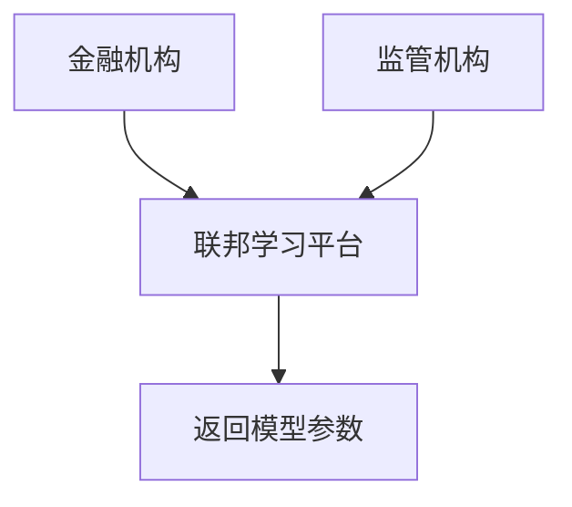
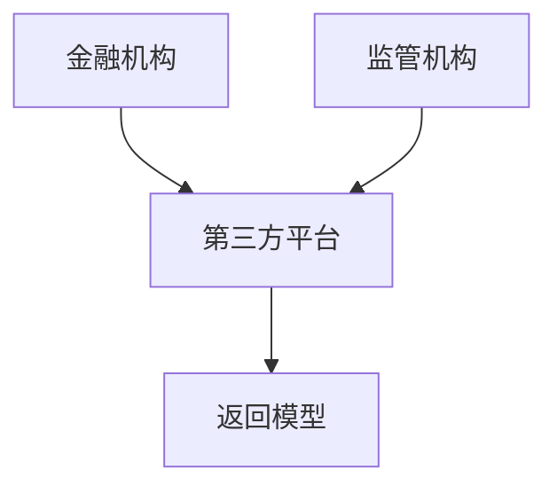

                 


好的，我会按照您的要求，设计一个详细且符合要求的目录大纲。这个大纲将涵盖您提到的所有关键点，并确保内容全面、结构清晰。

# 设计基于联邦学习的跨境金融风险评估系统

## 关键词：联邦学习、跨境金融、风险评估、数据隐私、分布式计算、人工智能

## 摘要：本文将详细探讨如何利用联邦学习技术设计跨境金融风险评估系统。文章首先介绍背景，分析问题，提出解决方案，然后深入讲解联邦学习的核心概念、算法原理、系统架构，最后通过项目实战和最佳实践提供具体指导。

---

# 第一部分: 背景介绍

## 第1章: 联邦学习与跨境金融风险评估概述

### 1.1 问题背景
#### 1.1.1 跨境金融风险评估的重要性
- 全球化背景下，跨境金融活动日益频繁，风险评估至关重要。
- 数据隐私保护的需求与金融监管的高效性之间存在矛盾。

#### 1.1.2 数据隐私保护的挑战
- 不同国家和地区的数据隐私法规差异大。
- 金融机构之间数据共享的限制。

#### 1.1.3 联邦学习的提出与意义
- 联邦学习作为一种新兴技术，能够在保护数据隐私的前提下实现多方协作。

### 1.2 问题描述
#### 1.2.1 跨境金融数据的特点
- 数据来源多样化，包括银行、支付机构、监管机构等。
- 数据类型多样，包括交易数据、信用数据、市场数据等。

#### 1.2.2 数据孤岛问题的现状
- 金融机构之间数据共享困难，导致模型训练数据不足。
- 监管机构与金融机构之间信息不对称。

#### 1.2.3 联邦学习在跨境金融中的应用需求
- 提高风险评估的准确性。
- 实现跨机构协作，降低数据隐私风险。

### 1.3 问题解决
#### 1.3.1 联邦学习的核心思想
- 分布式机器学习，数据不出域，模型共建共享。
- 利用加密技术确保数据隐私。

#### 1.3.2 联邦学习如何解决数据隐私问题
- 使用同态加密、秘密共享等技术保护数据隐私。
- 通过差分隐私技术防止模型泄露。

#### 1.3.3 联邦学习在跨境金融中的具体应用
- 跨境交易风险评估。
- 信用评估与欺诈检测。

### 1.4 边界与外延
#### 1.4.1 联邦学习的适用场景
- 数据分布在同一特征空间内。
- 参与方数据量较大，能够支持模型训练。

#### 1.4.2 联邦学习的限制与不足
- 通信成本较高，可能影响模型训练效率。
- 需要依赖可信的第三方平台进行协调。

#### 1.4.3 跨境金融风险评估的边界条件
- 数据隐私保护的法律合规性。
- 模型的可解释性与透明性。

### 1.5 概念结构与核心要素
#### 1.5.1 联邦学习的组成部分
- 数据提供方：金融机构、监管机构等。
- 模型训练方：联邦学习平台。
- 模型使用方：金融机构、监管机构。

#### 1.5.2 跨境金融风险评估的核心要素
- 数据特征：交易金额、频率、地点等。
- 风险指标：信用评分、欺诈概率、市场风险。

#### 1.5.3 联邦学习与跨境金融的结合点
- 数据特征提取。
- 模型训练与优化。

---

# 第二部分: 核心概念与联系

## 第2章: 联邦学习的核心概念与联系

### 2.1 联邦学习的原理
#### 2.1.1 联邦学习的基本原理
- 分布式数据源。
- 联邦模型的共建共享。

#### 2.1.2 联邦学习的数学模型
- 联邦平均：每个参与者独立训练本地模型，然后将模型参数上传到中心服务器进行平均。
- 联邦聚合：使用安全多方计算技术进行模型参数的聚合。

#### 2.1.3 联邦学习的通信机制
- 使用加密通道进行通信。
- 采用差分隐私技术保护数据隐私。

### 2.2 联邦学习的属性特征对比
| 特性               | 联邦学习                          | 传统机器学习                     |
|--------------------|-----------------------------------|----------------------------------|
| 数据共享           | 数据不出域，仅共享模型参数       | 数据集中到一个地方进行训练       |
| 数据隐私           | 保护数据隐私，防止数据泄露       | 数据可能被集中存储，存在泄露风险 |
| 计算效率           | 分布式计算，可能效率较低          | 集中计算，效率较高               |
| 适用场景           | 数据分布广泛，隐私要求高          | 数据集中，隐私要求低             |

### 2.3 ER实体关系图
```mermaid
erDiagram
    participant A : 金融机构
    participant B : 监管机构
    participant C : 第三方联邦学习平台
    A --> C : 提供数据
    B --> C : 提供监管数据
    C --> A,B : 提供联邦模型
```

---

# 第三部分: 算法原理讲解

## 第3章: 联邦学习的算法原理

### 3.1 联邦平均算法
#### 3.1.1 算法流程


#### 3.1.2 数学模型
$$
\theta_{new} = \frac{1}{N} \sum_{i=1}^{N} \theta_i
$$
其中，$\theta_i$ 是第 $i$ 个参与者的模型参数，$N$ 是参与者的总数。

### 3.2 联邦平均算法的实现
```python
import numpy as np

def federated_avg(client_parameters):
    # 将所有客户端的参数求平均
    avg_parameters = np.mean(client_parameters, axis=0)
    return avg_parameters
```

### 3.3 联邦平均算法的优缺点
#### 优点
- 实现简单，易于部署。
- 数据隐私保护较好。

#### 缺点
- 通信成本较高。
- 模型收敛速度较慢。

---

# 第四部分: 系统分析与架构设计

## 第4章: 跨境金融风险评估系统的架构设计

### 4.1 系统应用场景
- 跨境交易监控。
- 信用风险评估。

### 4.2 系统功能设计
#### 4.2.1 领域模型
```mermaid
classDiagram
    class 金融机构 {
        用户信息
        交易记录
        账户余额
    }
    class 监管机构 {
        监管数据
        风险指标
    }
    class 第三方平台 {
        联邦模型
        通信接口
    }
    金融机构 --> 第三方平台 : 提供数据
    监管机构 --> 第三方平台 : 提供数据
    第三方平台 --> 金融机构, 监管机构 : 提供模型
```

### 4.3 系统架构设计


### 4.4 系统接口设计
- 数据上传接口。
- 模型训练接口。
- 模型查询接口。

### 4.5 系统交互设计
```mermaid
sequenceDiagram
    participant A : 金融机构
    participant B : 监管机构
    participant C : 第三方平台
    A -> C : 提供数据
    B -> C : 提供数据
    C -> A,B : 返回模型
```

---

# 第五部分: 项目实战

## 第5章: 联邦学习在跨境金融中的应用

### 5.1 环境安装
- 安装必要的Python库：`numpy`, `pandas`, `flaml`。

### 5.2 系统核心实现
```python
import flaml

# 初始化联邦学习平台
flaml.init()

# 数据预处理
data = preprocess_data()

# 模型训练
model = train_federated_model(data)

# 模型评估
evaluate_model(model)
```

### 5.3 案例分析
- 数据来源：金融机构和监管机构。
- 模型训练：使用联邦平均算法。
- 模型评估：准确率、召回率、F1分数。

### 5.4 项目小结
- 联邦学习在跨境金融中的应用效果显著。
- 需要进一步优化算法和系统架构。

---

# 第六部分: 最佳实践

## 第6章: 联邦学习的注意事项

### 6.1 小结
- 联邦学习是一种有效的数据协作技术。
- 在跨境金融中具有广泛的应用前景。

### 6.2 注意事项
- 确保数据隐私合规。
- 优化通信效率。
- 提高模型可解释性。

### 6.3 拓展阅读
- 《联邦学习入门》。
- 《人工智能与金融》。

---

通过以上内容，我们可以看到，基于联邦学习的跨境金融风险评估系统的设计需要综合考虑数据隐私、系统架构、算法优化等多个方面。希望这篇文章能够为您提供有价值的参考和启发。

