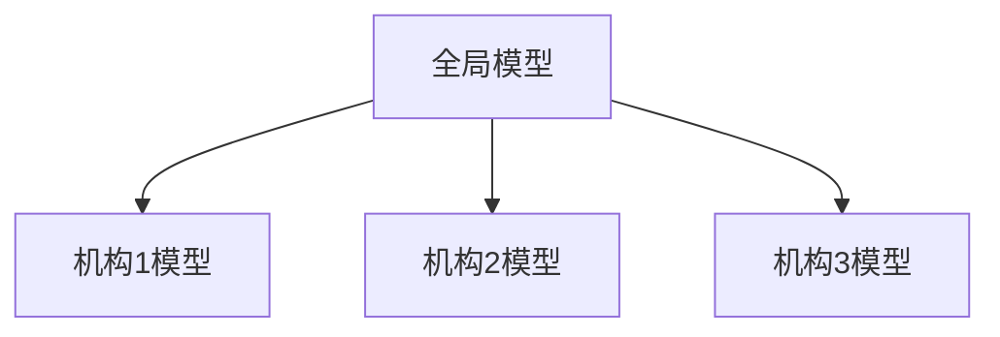

                 


# 设计基于联邦学习的跨机构风险评估模型

## 关键词：联邦学习，跨机构，风险评估，数据隐私，模型协作

## 摘要：随着数据孤岛问题的日益严重，跨机构协作成为提升风险评估能力的重要手段。联邦学习作为一种新兴的技术，能够在保护数据隐私的前提下，实现跨机构的数据协作与模型训练。本文将详细探讨基于联邦学习的跨机构风险评估模型的设计与实现，包括核心概念、算法原理、系统架构及项目实战等。

---

## 第1章：跨机构风险评估模型的背景与挑战

### 1.1 背景介绍

#### 1.1.1 数据孤岛问题的现状
在当今社会，数据被视为最重要的资源之一。然而，由于数据孤岛现象的存在，许多机构无法充分利用数据的价值。例如，银行、保险公司和其他金融机构可能拥有大量客户数据，但由于隐私和安全的考虑，这些数据无法直接共享。这种数据孤岛问题限制了跨机构的风险评估能力，使得风险评估的准确性和全面性受到限制。

#### 1.1.2 跨机构协作的重要性
跨机构协作能够有效解决数据孤岛问题，提高风险评估的准确性和全面性。例如，在信用风险评估中，多个金融机构可以通过共享数据，共同识别和评估客户的信用风险。然而，传统的数据共享方式往往涉及数据的完全共享，这可能导致数据泄露和隐私问题。因此，需要一种既能保护数据隐私，又能实现数据协作的技术。

#### 1.1.3 联邦学习的提出与应用
联邦学习（Federated Learning）是一种新兴的人工智能技术，能够在保护数据隐私的前提下，实现跨机构的数据协作与模型训练。通过联邦学习，多个机构可以在不共享原始数据的情况下，共同训练一个全局模型。这种技术在金融、医疗、社交网络等领域具有广泛的应用潜力。

### 1.2 联邦学习的核心概念

#### 1.2.1 联邦学习的定义与特点
联邦学习是一种分布式机器学习技术，允许多个机构在本地数据上进行模型训练，并通过通信协议将模型参数更新同步到一个全局模型中。其核心特点包括：
- 数据隐私保护：数据不出本地，仅传输模型参数。
- 跨机构协作：多个机构共同参与模型训练。
- 模型可扩展性：支持大规模数据和模型。

#### 1.2.2 联邦学习与传统数据共享的区别
传统的数据共享方式需要将数据集中到一个地方进行统一处理，这种方式容易导致数据泄露和隐私问题。而联邦学习通过在本地进行模型训练，并仅传输模型参数，避免了数据的直接共享，从而保护了数据隐私。

#### 1.2.3 联邦学习的数学模型与算法基础
联邦学习的核心是通过分布式优化算法，将多个机构的局部模型参数进行聚合，得到一个全局模型。常用的算法包括联邦平均（Federated Averaging）和联邦加权平均（Federated Weighted Averaging）等。

### 1.3 跨机构风险评估模型的边界与外延

#### 1.3.1 风险评估的定义与范围
风险评估是指通过分析可能影响目标的不确定性因素，预测其可能带来的损失或影响。在金融领域，风险评估通常包括信用风险、市场风险、操作风险等。

#### 1.3.2 跨机构协作的边界条件
在跨机构协作中，需要明确数据的使用范围、模型的更新频率以及各方的责任和义务。例如，在信用风险评估中，各机构需要明确数据的共享范围和模型的更新周期。

#### 1.3.3 模型的可扩展性与适用性
联邦学习模型需要具备良好的可扩展性，能够支持大规模数据和模型的训练。同时，模型的适用性也需要考虑不同机构的数据分布和业务需求。

### 1.4 核心概念与联系

#### 1.4.1 联邦学习的核心原理
联邦学习通过在多个机构的本地数据上进行模型训练，并将各机构的模型参数更新聚合到一个全局模型中。这种方式能够在不共享原始数据的情况下，实现模型的共同优化。

#### 1.4.2 联邦学习与数据隐私保护的关系
联邦学习的核心目标之一是保护数据隐私。通过在本地进行模型训练，联邦学习避免了原始数据的直接共享，从而保护了数据的隐私和安全。

#### 1.4.3 联邦学习的数学模型与公式
以下是联邦学习中常用的数学模型示例：
- 局部模型更新：$w_i^{new} = w_i + \eta \nabla L_i(w_i)$
- 全局模型聚合：$w_{global} = \frac{1}{N} \sum_{i=1}^{N} w_i^{new}$

## 1.5 数据隐私保护机制

#### 1.5.1 同态加密与差分隐私
同态加密允许在加密数据上进行计算，而差分隐私则通过添加噪声来保护数据的隐私。这两种技术都可以用于联邦学习中的数据隐私保护。

#### 1.5.2 数据脱敏与匿名化
数据脱敏和匿名化技术可以进一步保护数据的隐私，例如通过删除敏感信息或替换数据。

---

## 第2章：联邦学习的核心概念与技术

### 2.1 数据联邦与模型联邦

#### 2.1.1 数据联邦的实现机制
数据联邦是指在不共享原始数据的情况下，通过数据联邦技术实现数据的协作使用。例如，通过联邦查询（Federated Query）技术，可以在多个机构的数据上进行联合查询，而无需传输原始数据。

#### 2.1.2 模型联邦的实现机制
模型联邦是指在多个机构的本地数据上进行模型训练，并将各机构的模型参数更新聚合到一个全局模型中。这种方式能够实现跨机构的模型协作，同时保护数据隐私。

### 2.2 数据隐私保护技术

#### 2.2.1 同态加密与差分隐私的对比
以下是同态加密与差分隐私的对比表格：

| 技术          | 同态加密          | 差分隐私          |
|---------------|-------------------|-------------------|
| 定义          | 允许在加密数据上进行计算的技术 | 通过添加噪声保护数据隐私的技术 |
| 适用场景      | 数据查询与计算     | 数据统计与分析     |
| 优缺点        | 保护数据隐私，但计算效率较低 | 数据隐私保护较强，但可能引入数据偏差 |

#### 2.2.2 数据隐私保护的实现步骤
以下是数据隐私保护的实现步骤：
1. 数据预处理：对数据进行匿名化处理。
2. 数据加密：使用同态加密或差分隐私技术保护数据。
3. 数据共享：通过联邦查询或联邦学习技术实现数据的协作使用。

### 2.3 联邦学习的通信协议

#### 2.3.1 联邦学习的通信机制
联邦学习通过通信协议实现各机构之间的模型参数同步。常用的通信机制包括：
- 基于HTTP的通信：通过API接口进行模型参数的传输。
- 基于P2P的通信：通过点对点网络实现模型参数的直接传输。

#### 2.3.2 联邦学习的安全性保障
为了保障联邦学习的安全性，需要采取以下措施：
- 数据加密：在传输过程中对模型参数进行加密。
- 身份验证：通过身份认证确保通信双方的身份合法性。
- 访问控制：限制只有授权机构能够参与模型训练。

---

## 第3章：跨机构风险评估模型的算法原理

### 3.1 算法原理概述

#### 3.1.1 联邦学习的数学模型
以下是联邦学习的数学模型示例：
- 局部模型更新：$w_i^{new} = w_i + \eta \nabla L_i(w_i)$
- 全局模型聚合：$w_{global} = \frac{1}{N} \sum_{i=1}^{N} w_i^{new}$

#### 3.1.2 联邦学习的优化算法
常用的优化算法包括：
- 联邦平均（Federated Averaging）
- 联邦加权平均（Federated Weighted Averaging）
- 联邦 SGD（Federated Stochastic Gradient Descent）

### 3.2 算法实现步骤

#### 3.2.1 数据预处理
- 数据清洗：去除噪声数据和异常值。
- 数据分割：将数据划分为训练集和测试集。

#### 3.2.2 模型初始化
- 初始化全局模型参数：$w_{global} = w_0$
- 初始化局部模型参数：$w_i = w_0$，其中 $i = 1, 2, ..., N$

#### 3.2.3 模型训练
- 各机构在本地数据上进行模型训练：$w_i^{new} = w_i + \eta \nabla L_i(w_i)$
- 各机构将模型参数更新同步到全局模型：$w_{global} = \frac{1}{N} \sum_{i=1}^{N} w_i^{new}$

#### 3.2.4 模型评估
- 使用测试数据评估全局模型的性能：$accuracy = \frac{1}{M} \sum_{j=1}^{M} \mathbb{I}(y_j = \hat{y}_j)$

### 3.3 代码实现

#### 3.3.1 环境搭建
```python
# 安装必要的库
pip install tensorflow
pip install keras
pip install requests
pip install flask
```

#### 3.3.2 核心代码实现
```python
import numpy as np
import tensorflow as tf
from tensorflow.keras import layers
import requests
import json
import os

# 初始化全局模型
global_model = tf.keras.Sequential([
    layers.Dense(64, activation='relu'),
    layers.Dense(1, activation='sigmoid')
])
global_model.compile(optimizer='adam', loss='binary_crossentropy', metrics=['accuracy'])

# 初始化局部模型
local_models = [global_model.copy() for _ in range(N)]

# 联邦学习训练过程
for round in range(num_rounds):
    # 各机构进行本地训练
    for i in range(N):
        local_models[i].fit(train_data[i], train_labels[i], epochs=1, batch_size=32)
    
    # 各机构将模型参数同步到全局模型
    global_weights = global_model.get_weights()
    for i in range(N):
        local_weights = local_models[i].get_weights()
        global_weights = [global_weights[j] + local_weights[j] for j in range(len(global_weights))]
    
    # 更新全局模型参数
    global_model.set_weights(global_weights)

# 模型评估
global_model.evaluate(test_data, test_labels)
```

#### 3.3.3 代码解读
- 初始化全局模型：定义一个简单的神经网络模型，并编译。
- 初始化局部模型：将全局模型复制到各机构，作为各机构的局部模型。
- 联邦学习训练过程：各机构在本地数据上进行训练，并将模型参数同步到全局模型。
- 模型评估：使用测试数据评估全局模型的性能。

---

## 第4章：系统分析与架构设计方案

### 4.1 问题场景介绍

#### 4.1.1 项目背景
以信用风险评估为例，多个金融机构希望通过联邦学习技术，共同评估客户的信用风险，同时保护各方的客户数据隐私。

#### 4.1.2 项目目标
- 实现跨机构的信用风险评估模型。
- 保护各机构的客户数据隐私。
- 提高风险评估的准确性和全面性。

### 4.2 系统功能设计

#### 4.2.1 功能模块
- 数据预处理模块：负责数据的清洗和分割。
- 模型训练模块：负责各机构的本地模型训练和全局模型聚合。
- 模型评估模块：负责模型的性能评估和结果展示。

#### 4.2.2 功能流程
1. 数据预处理：清洗和分割数据。
2. 模型训练：各机构在本地数据上进行训练，并将模型参数同步到全局模型。
3. 模型评估：使用测试数据评估全局模型的性能。

### 4.3 系统架构设计

#### 4.3.1 系统架构图


#### 4.3.2 微服务架构设计
- 全局模型服务：负责管理全局模型的训练和评估。
- 机构模型服务：负责各机构的本地模型训练和参数同步。

### 4.4 系统接口设计

#### 4.4.1 API接口定义
- POST /train：触发模型训练。
- GET /evaluate：获取模型评估结果。

#### 4.4.2 接口交互流程
1. 机构1调用 POST /train API，开始本地模型训练。
2. 机构1将模型参数更新通过 API 传输到全局模型服务。
3. 全局模型服务聚合各机构的模型参数，更新全局模型。
4. 机构2调用 POST /train API，重复上述过程。
5. 最后，调用 GET /evaluate API，获取全局模型的评估结果。

---

## 第5章：项目实战与实现

### 5.1 项目环境搭建

#### 5.1.1 环境要求
- Python 3.6+
- TensorFlow 2.0+
- Keras 2.4+
- requests库
- Flask库

#### 5.1.2 安装依赖
```bash
pip install tensorflow
pip install keras
pip install requests
pip install flask
```

### 5.2 核心代码实现

#### 5.2.1 数据预处理
```python
import numpy as np
import pandas as pd

# 加载数据
data = pd.read_csv('credit_risk.csv')

# 数据分割
train_data, test_data = train_test_split(data, test_size=0.2)
```

#### 5.2.2 模型训练
```python
import tensorflow as tf
from tensorflow.keras import layers

# 初始化全局模型
global_model = tf.keras.Sequential([
    layers.Dense(64, activation='relu'),
    layers.Dense(1, activation='sigmoid')
])
global_model.compile(optimizer='adam', loss='binary_crossentropy', metrics=['accuracy'])

# 初始化局部模型
local_models = [global_model.copy() for _ in range(N)]

# 联邦学习训练过程
for round in range(num_rounds):
    # 各机构进行本地训练
    for i in range(N):
        local_models[i].fit(train_data[i], train_labels[i], epochs=1, batch_size=32)
    
    # 各机构将模型参数同步到全局模型
    global_weights = global_model.get_weights()
    for i in range(N):
        local_weights = local_models[i].get_weights()
        global_weights = [global_weights[j] + local_weights[j] for j in range(len(global_weights))]
    
    # 更新全局模型参数
    global_model.set_weights(global_weights)
```

#### 5.2.3 模型评估
```python
# 模型评估
loss, accuracy = global_model.evaluate(test_data, test_labels)
print(f"损失函数: {loss}, 准确率: {accuracy}")
```

### 5.3 项目小结

#### 5.3.1 项目总结
通过联邦学习技术，我们成功实现了跨机构的信用风险评估模型，同时保护了各方的客户数据隐私。

#### 5.3.2 实践经验
- 数据预处理是关键，需要确保数据的匿名化和一致性。
- 模型训练过程中，需要合理设置训练轮数和批次大小。
- 模型评估时，需要关注准确率和损失函数的变化趋势。

---

## 第6章：最佳实践与未来展望

### 6.1 最佳实践

#### 6.1.1 数据隐私保护
- 使用同态加密或差分隐私技术保护数据隐私。
- 定期进行数据匿名化处理。

#### 6.1.2 模型优化
- 根据实际需求，选择合适的优化算法和模型结构。
- 定期进行模型更新和优化。

### 6.2 未来展望

#### 6.2.1 联邦学习的优化方向
- 提高联邦学习的计算效率。
- 增强联邦学习的安全性。

#### 6.2.2 应用场景的扩展
- 将联邦学习技术应用于更多领域，如医疗、教育等。
- 探索联邦学习与其他技术的结合，如区块链、边缘计算等。

### 6.3 小结与注意事项

#### 6.3.1 小结
联邦学习是一种极具潜力的技术，能够在保护数据隐私的前提下，实现跨机构的数据协作与模型训练。

#### 6.3.2 注意事项
- 数据隐私保护是联邦学习的核心，需要引起高度重视。
- 模型优化和计算效率的提升是未来的重要研究方向。

### 6.4 拓展阅读

#### 6.4.1 推荐论文
- "Federated Learning: Challenges, Methods, and Future Directions"（《联邦学习：挑战、方法与未来方向》）
- "Differential Privacy and Its Use in Federated Learning"（《差分隐私及其在联邦学习中的应用》）

#### 6.4.2 推荐书籍
- 《Federated Learning: A Deep Dive》（《联邦学习：深入探索》）
- 《Privacy-Preserving Machine Learning: Theory and Practice》（《隐私保护机器学习：理论与实践》）

---

## 结语

通过本文的详细讲解，我们深入了解了基于联邦学习的跨机构风险评估模型的设计与实现。从背景介绍到算法原理，从系统架构到项目实战，我们全面探讨了联邦学习的核心概念和技术。未来，随着联邦学习技术的不断发展，跨机构风险评估模型将发挥越来越重要的作用，为各行业带来更多的创新和价值。

---

**感谢您的耐心阅读，希望本文对您有所帮助！**

