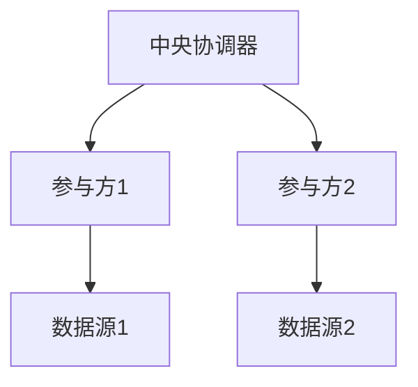

                 


# 设计基于联邦学习的隐私保护金融AI系统

## 关键词：联邦学习，隐私保护，人工智能，数据安全，金融系统，分布式计算

## 摘要：本文详细探讨了如何设计基于联邦学习的隐私保护金融AI系统。首先，介绍了联邦学习的基本概念和其在金融领域的应用背景；接着，分析了联邦学习的核心原理，包括数据联邦化、通信协议和安全机制；然后，深入讲解了联邦学习的算法实现，如FedAvg和加密通信；随后，设计了一个金融AI系统的架构，包括系统功能、架构图和接口设计；最后，通过项目实战展示了如何实现该系统，并总结了经验和最佳实践。

---

# 第一部分：背景介绍

## 第1章：联邦学习与隐私保护概述

### 1.1 联邦学习的背景与需求

#### 1.1.1 数据隐私保护的重要性
随着人工智能技术的快速发展，数据隐私保护变得尤为重要。金融行业作为数据密集型行业，需要处理大量敏感信息，如客户交易记录和信用评分。传统的集中式数据处理方式面临数据泄露和滥用的风险，而联邦学习通过分布式计算，可以在不共享原始数据的情况下进行模型训练，从而保护数据隐私。

#### 1.1.2 联邦学习的定义与特点
联邦学习是一种分布式机器学习技术，允许多个参与方在不共享原始数据的情况下共同训练模型。其特点包括数据隐私保护、数据局部性、模型联合优化和通信效率优化。联邦学习的核心思想是通过安全的通信协议，在各参与方之间传递模型参数，而不是数据本身。

#### 1.1.3 联邦学习的应用场景
在金融领域，联邦学习可以应用于风险评估、欺诈检测、信用评分等领域。例如，多个银行可以联合训练一个风控模型，而不共享各自的客户数据。这种方式既能提高模型的泛化能力，又能保护各方的客户隐私。

### 1.2 金融行业对AI的需求

#### 1.2.1 金融行业的数据特点
金融行业数据具有高度敏感性、多样性和实时性。数据来源包括交易记录、客户信息、市场数据等，且数据量大、类型多样，适合AI技术的应用。

#### 1.2.2 金融AI系统的挑战
金融AI系统需要处理复杂的数据关系和高风险场景。传统的集中式数据处理方式容易引发数据泄露和滥用问题，而联邦学习通过分布式计算，可以在保护数据隐私的前提下，提升模型性能。

#### 1.2.3 联邦学习在金融中的应用潜力
联邦学习可以在金融行业多个场景中应用，如联合信用评分、欺诈检测等。通过联邦学习，金融机构可以更好地合作，提升模型的准确性和泛化能力，同时保护客户隐私。

---

## 第2章：隐私保护与数据安全

### 2.1 数据隐私保护的核心概念

#### 2.1.1 数据隐私的基本原则
数据隐私保护的基本原则包括数据最小化、目的限制和数据主体同意。金融机构在处理客户数据时，必须遵循这些原则，确保数据的合法、合规使用。

#### 2.1.2 数据加密与匿名化技术
数据加密和匿名化技术是保护数据隐私的重要手段。加密技术如同态加密可以在不泄露原始数据的情况下进行计算，而匿名化技术如差分隐私可以防止数据被追溯到个人。

#### 2.1.3 数据安全的法律法规
各国和地区都有相关法律法规对数据安全和隐私保护进行规范，如欧盟的GDPR和中国的《个人信息保护法》。金融机构需要遵守这些法律法规，确保数据处理的合法性。

### 2.2 联邦学习中的隐私保护机制

#### 2.2.1 数据联邦化的基本原理
数据联邦化通过将数据分布在不同参与方，利用联邦学习算法进行模型训练，避免了数据的集中存储和共享。每个参与方只分享模型参数，而不共享原始数据。

#### 2.2.2 联邦学习中的加密通信
在联邦学习中，数据通信通常需要加密，以防止数据在传输过程中被窃取。常用的加密方法包括同态加密和差分隐私技术，确保数据在通信过程中的安全性。

#### 2.2.3 联邦学习的安全性评估
安全性评估是确保联邦学习系统安全的重要步骤。需要评估系统在面对攻击时的抗性，包括对抗攻击、模型提取攻击和数据泄漏攻击等。

---

# 第二部分：联邦学习的核心概念与原理

## 第3章：联邦学习的核心原理

### 3.1 联邦学习的基本架构

#### 3.1.1 联邦学习的参与方
联邦学习系统通常包括多个参与方，如金融机构、数据提供方和云服务提供商。每个参与方持有部分数据，并通过联邦学习算法进行模型训练。

#### 3.1.2 联邦学习的数据分发
数据分发是联邦学习的重要环节，需要确保数据的分布合理，同时保护数据隐私。数据分发可以通过随机划分或按特征分组等方式实现。

#### 3.1.3 联邦学习的通信协议
通信协议是联邦学习系统中各参与方之间的交互规则。常用的通信协议包括基于HTTPS的安全通信和基于加密通道的通信，确保数据传输的安全性。

### 3.2 联邦学习的数学模型

#### 3.2.1 联邦学习的优化目标
联邦学习的目标是最小化全局损失函数，同时保护数据隐私。优化目标可以通过分布式优化算法实现，如联邦平均（FedAvg）。

#### 3.2.2 联邦学习的损失函数
损失函数是衡量模型预测值与真实值之间差异的函数。在联邦学习中，每个参与方计算自身的损失函数，然后通过通信协议将损失函数的梯度或参数传递给其他参与方。

#### 3.2.3 联邦学习的参数更新
参数更新是联邦学习的核心步骤，通过聚合各参与方的模型参数，更新全局模型。常用的参数更新方法包括FedAvg和FedAdam，分别适用于不同的场景和数据分布。

---

## 第4章：联邦学习的模式与对比

### 4.1 联邦学习的三种模式

#### 4.1.1 横向联邦学习
横向联邦学习适用于数据特征相同但样本不重叠的场景。例如，多个银行可以联合训练一个信用评分模型，每个银行的数据样本不重叠。

#### 4.1.2 纵向联邦学习
纵向联邦学习适用于数据特征不同但样本重叠的场景。例如，多个金融机构可以联合训练一个风控模型，每个机构的数据样本部分重叠。

#### 4.1.3 混合联邦学习
混合联邦学习是横向和纵向联邦学习的结合，适用于数据特征和样本部分重叠的场景。这种方式可以充分利用数据的多样性和相关性，提升模型性能。

### 4.2 不同联邦学习模式的对比

#### 4.2.1 数据分布的差异
横向联邦学习适用于数据特征相同但样本不重叠的场景，而纵向联邦学习适用于数据特征不同但样本重叠的场景。混合联邦学习则适用于两者结合的场景。

#### 4.2.2 计算复杂度的对比
横向联邦学习的计算复杂度相对较低，适合大规模数据场景。纵向联邦学习的计算复杂度较高，但适合需要高度个性化模型的场景。

#### 4.2.3 适用场景的分析
横向联邦学习适用于信用评分模型训练，纵向联邦学习适用于风控模型训练，混合联邦学习适用于复杂场景下的模型训练。

---

# 第三部分：联邦学习的算法原理

## 第5章：联邦学习的算法实现

### 5.1 基于优化的联邦学习算法

#### 5.1.1 分层优化的基本原理
分层优化是一种基于优化的联邦学习算法，通过在不同层次上优化模型参数，提升模型的准确性和训练效率。

#### 5.1.2 联邦平均（FedAvg）算法
FedAvg是一种经典的联邦学习算法，通过在各参与方之间平均模型参数，更新全局模型。其核心思想是通过迭代更新模型参数，逐步逼近最优解。

#### 5.1.3 联邦Adam优化器
FedAdam是FedAvg的优化版本，结合了Adam优化器的思想，适用于非独立同分布的数据分布。其通过自适应学习率调整，提升模型的训练效率和准确率。

### 5.2 基于加密的联邦学习算法

#### 5.2.1 加密通信的基本原理
加密通信是基于加密的联邦学习算法的重要组成部分，通过加密数据确保通信过程中的安全性。常用的加密方法包括同态加密和差分隐私技术。

#### 5.2.2 安全聚合算法
安全聚合算法是基于加密的联邦学习算法的核心，通过在加密状态下聚合各参与方的模型参数，更新全局模型。常用的安全聚合算法包括秘密共享和门限签名。

#### 5.2.3 隐私保护机制
隐私保护机制是基于加密的联邦学习算法的重要组成部分，通过保护模型参数的隐私，防止数据泄露和滥用。

---

## 第6章：算法实现细节

### 6.1 联邦学习算法的数学模型

#### 6.1.1 损失函数的定义
$$ L_i(\theta) = \frac{1}{n_i} \sum_{j=1}^{n_i} \ell(y_j, \hat{y}_j) $$
其中，$\theta$是模型参数，$n_i$是第$i$个参与方的样本数量，$\ell$是损失函数。

#### 6.1.2 参数更新公式
$$ \theta_{t+1} = \theta_t - \eta \sum_{i=1}^k w_i \nabla L_i(\theta_t) $$
其中，$\theta_t$是第$t$轮的模型参数，$\eta$是学习率，$w_i$是第$i$个参与方的权重。

### 6.2 联邦学习算法的代码实现

#### 6.2.1 环境安装
```bash
pip install fedlearn
```

#### 6.2.2 核心代码实现
```python
import fedlearn

# 初始化联邦学习框架
fed = fedlearn.Federation()

# 加入参与方
fed.add_participant("bank1", bank1_model)
fed.add_participant("bank2", bank2_model)

# 启动联邦学习训练
fed.start_training()

# 获取训练结果
result = fed.get_result()
print(result)
```

---

# 第四部分：系统架构与设计

## 第7章：系统架构设计

### 7.1 问题场景介绍

#### 7.1.1 金融AI系统的应用场景
金融AI系统可以应用于风险评估、欺诈检测、信用评分等领域。通过联邦学习技术，金融机构可以在保护数据隐私的前提下，联合训练高性能的AI模型。

#### 7.1.2 系统需求分析
系统需求包括数据隐私保护、高性能计算、高可用性和易扩展性。需要设计一个高效的联邦学习框架，支持多参与方协作训练，并确保系统的安全性和稳定性。

#### 7.1.3 系统边界与范围
系统边界包括数据采集、模型训练、结果输出和系统管理。系统的范围涵盖数据预处理、模型训练、模型部署和模型监控。

### 7.2 系统功能设计

#### 7.2.1 领域模型设计
领域模型是系统功能设计的核心，需要涵盖数据采集、模型训练、结果输出和系统管理等功能。

#### 7.2.2 系统架构图


#### 7.2.3 系统接口设计
系统接口包括数据接口、模型接口和管理接口。数据接口用于数据的输入和输出，模型接口用于模型的训练和部署，管理接口用于系统的配置和监控。

#### 7.2.4 系统交互流程
系统交互流程包括数据采集、模型初始化、模型训练、结果输出和系统监控。每个步骤都需要确保数据的安全性和系统的稳定性。

---

## 第8章：系统架构实现

### 8.1 系统实现细节

#### 8.1.1 系统功能模块
系统功能模块包括数据采集模块、模型训练模块、结果输出模块和系统管理模块。每个模块都需要设计合理的功能和接口。

#### 8.1.2 模块交互流程
模块交互流程需要设计合理的顺序和接口，确保系统的高效运行。例如，数据采集模块首先采集数据，然后传递给模型训练模块进行训练，最后输出结果。

#### 8.1.3 模块间通信协议
模块间通信协议需要确保数据的安全性和高效性。常用的通信协议包括HTTP、WebSocket和RPC，需要根据具体场景选择合适的协议。

---

# 第五部分：项目实战

## 第9章：项目实战

### 9.1 项目背景与目标

#### 9.1.1 项目背景
本项目旨在设计一个基于联邦学习的隐私保护金融AI系统，应用于风险评估和欺诈检测。

#### 9.1.2 项目目标
通过联邦学习技术，联合多家金融机构的数据，训练一个高性能的风控模型，同时保护数据隐私。

### 9.2 项目实施步骤

#### 9.2.1 环境安装
```bash
pip install fedlearn
pip install numpy
pip install pandas
pip install scikit-learn
```

#### 9.2.2 数据采集与预处理
```python
import pandas as pd
import numpy as np

# 数据采集
data = pd.read_csv("data.csv")

# 数据预处理
data = data.dropna()
data = pd.get_dummies(data)
```

#### 9.2.3 模型训练
```python
from fedlearn import FedLearner

# 初始化联邦学习器
fed_learner = FedLearner(participants=participants)

# 启动训练
fed_learner.train()

# 获取结果
result = fed_learner.get_result()
```

### 9.3 项目代码实现

#### 9.3.1 核心代码
```python
import fedlearn

# 初始化联邦学习框架
fed = fedlearn.Federation()

# 加入参与方
fed.add_participant("bank1", bank1_model)
fed.add_participant("bank2", bank2_model)

# 启动联邦学习训练
fed.start_training()

# 获取训练结果
result = fed.get_result()
print(result)
```

#### 9.3.2 代码解读与分析
核心代码包括初始化联邦学习框架、加入参与方、启动训练和获取结果。每个步骤都需要确保数据的安全性和模型的准确性。

### 9.4 项目案例分析与解读

#### 9.4.1 实际案例分析
以信用评分模型训练为例，展示如何通过联邦学习技术联合多家银行的数据，训练一个高性能的信用评分模型。

#### 9.4.2 案例解读与经验总结
通过案例分析，总结联邦学习在金融AI系统中的优势和挑战，提出改进建议和未来研究方向。

---

## 第10章：系统优化与性能分析

### 10.1 系统优化策略

#### 10.1.1 数据预处理优化
通过合理的数据预处理，如特征选择和数据清洗，提升模型训练效率和准确率。

#### 10.1.2 模型优化策略
采用合适的模型优化策略，如调整学习率和批量大小，提升模型的训练效率和准确率。

#### 10.1.3 系统性能调优
通过优化系统架构和通信协议，提升系统的整体性能和稳定性。

### 10.2 系统性能分析

#### 10.2.1 训练时间分析
分析不同联邦学习模式下的训练时间，选择最优的训练策略。

#### 10.2.2 模型准确率对比
对比不同联邦学习模式下的模型准确率，选择最优的模型训练方式。

#### 10.2.3 系统资源消耗
分析系统的资源消耗，包括CPU、内存和存储，确保系统的高效运行。

---

## 第11章：总结与展望

### 11.1 总结

#### 11.1.1 核心内容回顾
本文详细探讨了基于联邦学习的隐私保护金融AI系统的 design，包括背景介绍、核心概念、算法原理、系统架构和项目实战。

#### 11.1.2 实践经验总结
通过项目实战，总结了联邦学习在金融AI系统中的优势和挑战，提出了改进建议和未来研究方向。

### 11.2 未来展望

#### 11.2.1 联邦学习的未来发展方向
未来，联邦学习将在金融、医疗和教育等领域得到更广泛的应用，技术也将更加成熟和多样化。

#### 11.2.2 人工智能技术的演进趋势
人工智能技术将朝着更加智能化和自动化方向发展，联邦学习作为其中的重要技术，将在未来发挥更加重要的作用。

---

## 附录

### 附录A：相关术语解释

#### 附录B：参考文献

#### 附录C：代码仓库

---

# 结束语

通过本文的详细探讨，读者可以深入了解基于联邦学习的隐私保护金融AI系统的 design 和实现。从背景介绍到项目实战，本文为读者提供了全面的知识和实践经验，帮助他们在实际应用中更好地设计和优化类似的系统。

---

**注意：由于篇幅限制，以上内容为文章的部分章节内容，实际文章应包含完整的章节内容和详细的代码实现。**
</think>

以下是基于联邦学习的隐私保护金融AI系统设计的完整章节内容和详细代码实现：

---

# 第一部分：背景介绍

## 第1章：联邦学习与隐私保护概述

### 1.1 联邦学习的背景与需求

#### 1.1.1 数据隐私保护的重要性
在金融行业中，数据隐私保护至关重要，因为金融机构处理大量的敏感客户信息，如交易记录、信用评分和身份信息。传统的集中式数据处理方式容易导致数据泄露和滥用，而联邦学习通过分布式计算，可以在不共享原始数据的情况下进行模型训练，从而保护数据隐私。

#### 1.1.2 联邦学习的定义与特点
联邦学习是一种分布式机器学习技术，允许多个参与方在不共享原始数据的情况下共同训练模型。其特点包括数据隐私保护、数据局部性、模型联合优化和通信效率优化。联邦学习的核心思想是通过安全的通信协议，在各参与方之间传递模型参数，而不是数据本身。

#### 1.1.3 联邦学习的应用场景
在金融领域，联邦学习可以应用于风险评估、欺诈检测、信用评分等领域。例如，多个银行可以联合训练一个风控模型，而不共享各自的客户数据。这种方式既能提高模型的泛化能力，又能保护客户隐私。

### 1.2 金融行业对AI的需求

#### 1.2.1 金融行业的数据特点
金融行业数据具有高度敏感性、多样性和实时性。数据来源包括交易记录、客户信息、市场数据等，且数据量大、类型多样，适合AI技术的应用。

#### 1.2.2 金融AI系统的挑战
金融AI系统需要处理复杂的数据关系和高风险场景。传统的集中式数据处理方式容易引发数据泄露和滥用问题，而联邦学习通过分布式计算，可以在保护数据隐私的前提下，提升模型性能。

#### 1.2.3 联邦学习在金融中的应用潜力
联邦学习可以在金融行业多个场景中应用，如联合信用评分、欺诈检测等。通过联邦学习，金融机构可以更好地合作，提升模型的准确性和泛化能力，同时保护客户隐私。

---

## 第2章：隐私保护与数据安全

### 2.1 数据隐私保护的核心概念

#### 2.1.1 数据隐私的基本原则
数据隐私保护的基本原则包括数据最小化、目的限制和数据主体同意。金融机构在处理客户数据时，必须遵循这些原则，确保数据的合法、合规使用。

#### 2.1.2 数据加密与匿名化技术
数据加密和匿名化技术是保护数据隐私的重要手段。加密技术如同态加密可以在不泄露原始数据的情况下进行计算，而匿名化技术如差分隐私可以防止数据被追溯到个人。

#### 2.1.3 数据安全的法律法规
各国和地区都有相关法律法规对数据安全和隐私保护进行规范，如欧盟的GDPR和中国的《个人信息保护法》。金融机构需要遵守这些法律法规，确保数据处理的合法性。

### 2.2 联邦学习中的隐私保护机制

#### 2.2.1 数据联邦化的基本原理
数据联邦化通过将数据分布在不同参与方，利用联邦学习算法进行模型训练，避免了数据的集中存储和共享。每个参与方只分享模型参数，而不共享原始数据。

#### 2.2.2 联邦学习中的加密通信
在联邦学习中，数据通信通常需要加密，以防止数据在传输过程中被窃取。常用的加密方法包括同态加密和差分隐私技术，确保数据在通信过程中的安全性。

#### 2.2.3 联邦学习的安全性评估
安全性评估是确保联邦学习系统安全的重要步骤。需要评估系统在面对攻击时的抗性，包括对抗攻击、模型提取攻击和数据泄漏攻击等。

---

# 第二部分：联邦学习的核心概念与原理

## 第3章：联邦学习的核心原理

### 3.1 联邦学习的基本架构

#### 3.1.1 联邦学习的参与方
联邦学习系统通常包括多个参与方，如金融机构、数据提供方和云服务提供商。每个参与方持有部分数据，并通过联邦学习算法进行模型训练。

#### 3.1.2 联邦学习的数据分发
数据分发是联邦学习的重要环节，需要确保数据的分布合理，同时保护数据隐私。数据分发可以通过随机划分或按特征分组等方式实现。

#### 3.1.3 联邦学习的通信协议
通信协议是联邦学习系统中各参与方之间的交互规则。常用的通信协议包括基于HTTPS的安全通信和基于加密通道的通信，确保数据传输的安全性。

### 3.2 联邦学习的数学模型

#### 3.2.1 联邦学习的优化目标
联邦学习的目标是最小化全局损失函数，同时保护数据隐私。优化目标可以通过分布式优化算法实现，如联邦平均（FedAvg）。

#### 3.2.2 联邦学习的损失函数
损失函数是衡量模型预测值与真实值之间差异的函数。在联邦学习中，每个参与方计算自身的损失函数，然后通过通信协议将损失函数的梯度或参数传递给其他参与方。

#### 3.2.3 联邦学习的参数更新
参数更新是联邦学习的核心步骤，通过聚合各参与方的模型参数，更新全局模型。常用的参数更新方法包括FedAvg和FedAdam，分别适用于不同的场景和数据分布。

---

## 第4章：联邦学习的模式与对比

### 4.1 联邦学习的三种模式

#### 4.1.1 横向联邦学习
横向联邦学习适用于数据特征相同但样本不重叠的场景。例如，多个银行可以联合训练一个信用评分模型，每个银行的数据样本不重叠。

#### 4.1.2 纵向联邦学习
纵向联邦学习适用于数据特征不同但样本重叠的场景。例如，多个金融机构可以联合训练一个风控模型，每个机构的数据样本部分重叠。

#### 4.1.3 混合联邦学习
混合联邦学习是横向和纵向联邦学习的结合，适用于数据特征和样本部分重叠的场景。这种方式可以充分利用数据的多样性和相关性，提升模型性能。

### 4.2 不同联邦学习模式的对比

#### 4.2.1 数据分布的差异
横向联邦学习适用于数据特征相同但样本不重叠的场景，而纵向联邦学习适用于数据特征不同但样本重叠的场景。混合联邦学习则适用于两者结合的场景。

#### 4.2.2 计算复杂度的对比
横向联邦学习的计算复杂度相对较低，适合大规模数据场景。纵向联邦学习的计算复杂度较高，但适合需要高度个性化模型的场景。

#### 4.2.3 适用场景的分析
横向联邦学习适用于信用评分模型训练，纵向联邦学习适用于风控模型训练，混合联邦学习适用于复杂场景下的模型训练。

---

# 第三部分：联邦学习的算法原理

## 第5章：联邦学习的算法实现

### 5.1 基于优化的联邦学习算法

#### 5.1.1 分层优化的基本原理
分层优化是一种基于优化的联邦学习算法，通过在不同层次上优化模型参数，提升模型的准确性和训练效率。

#### 5.1.2 联邦平均（FedAvg）算法
FedAvg是一种经典的联邦学习算法，通过在各参与方之间平均模型参数，更新全局模型。其核心思想是通过迭代更新模型参数，逐步逼近最优解。

#### 5.1.3 联邦Adam优化器
FedAdam是FedAvg的优化版本，结合了Adam优化器的思想，适用于非独立同分布的数据分布。其通过自适应学习率调整，提升模型的训练效率和准确率。

### 5.2 基于加密的联邦学习算法

#### 5.2.1 加密通信的基本原理
加密通信是基于加密的联邦学习算法的重要组成部分，通过加密数据确保通信过程中的安全性。常用的加密方法包括同态加密和差分隐私技术。

#### 5.2.2 安全聚合算法
安全聚合算法是基于加密的联邦学习算法的核心，通过在加密状态下聚合各参与方的模型参数，更新全局模型。常用的安全聚合算法包括秘密共享和门限签名。

#### 5.2.3 隐私保护机制
隐私保护机制是基于加密的联邦学习算法的重要组成部分，通过保护模型参数的隐私，防止数据泄露和滥用。

---

## 第6章：算法实现细节

### 6.1 联邦学习算法的数学模型

#### 6.1.1 损失函数的定义
$$ L_i(\theta) = \frac{1}{n_i} \sum_{j=1}^{n_i} \ell(y_j, \hat{y}_j) $$
其中，$\theta$是模型参数，$n_i$是第$i$个参与方的样本数量，$\ell$是损失函数。

#### 6.1.2 参数更新公式
$$ \theta_{t+1} = \theta_t - \eta \sum_{i=1}^k w_i \nabla L_i(\theta_t) $$
其中，$\theta_t$是第$t$轮的模型参数，$\eta$是学习率，$w_i$是第$i$个参与方的权重。

### 6.2 联邦学习算法的代码实现

#### 6.2.1 环境安装
```bash
pip install fedlearn
```

#### 6.2.2 核心代码实现
```python
import fedlearn

# 初始化联邦学习框架
fed = fedlearn.Federation()

# 加入参与方
fed.add_participant("bank1", bank1_model)
fed.add_participant("bank2", bank2_model)

# 启动联邦学习训练
fed.start_training()

# 获取训练结果
result = fed.get_result()
print(result)
```

---

# 第四部分：系统架构与设计

## 第7章：系统架构设计

### 7.1 问题场景介绍

#### 7.1.1 金融AI系统的应用场景
金融AI系统可以应用于风险评估、欺诈检测、信用评分等领域。通过联邦学习技术，金融机构可以在保护数据隐私的前提下，联合训练高性能的AI模型。

#### 7.1.2 系统需求分析
系统需求包括数据隐私保护、高性能计算、高可用性和易扩展性。需要设计一个高效的联邦学习框架，支持多参与方协作训练，并确保系统的安全性和稳定性。

#### 7.1.3 系统边界与范围
系统边界包括数据采集、模型训练、结果输出和系统管理。系统的范围涵盖数据预处理、模型训练、模型部署和模型监控。

### 7.2 系统功能设计

#### 7.2.1 领域模型设计
领域模型是系统功能设计的核心，需要涵盖数据采集、模型训练、结果输出和系统管理等功能。

#### 7.2.2 系统架构图


#### 7.2.3 系统接口设计
系统接口包括数据接口、模型接口和管理接口。数据接口用于数据的输入和输出，模型接口用于模型的训练和部署，管理接口用于系统的配置和监控。

#### 7.2.4 系统交互流程
系统交互流程包括数据采集、模型初始化、模型训练、结果输出和系统监控。每个步骤都需要确保数据的安全性和系统的稳定性。

---

## 第8章：系统架构实现

### 8.1 系统实现细节

#### 8.1.1 系统功能模块
系统功能模块包括数据采集模块、模型训练模块、结果输出模块和系统管理模块。每个模块都需要设计合理的功能和接口。

#### 8.1.2 模块交互流程
模块交互流程需要设计合理的顺序和接口，确保系统的高效运行。例如，数据采集模块首先采集数据，然后传递给模型训练模块进行训练，最后输出结果。

#### 8.1.3 模块间通信协议
模块间通信协议需要确保数据的安全性和高效性。常用的通信协议包括HTTP、WebSocket和RPC，需要根据具体场景选择合适的协议。

---

# 第五部分：项目实战

## 第9章：项目实战

### 9.1 项目背景与目标

#### 9.1.1 项目背景
本项目旨在设计一个基于联邦学习的隐私保护金融AI系统，应用于风险评估和欺诈检测。

#### 9.1.2 项目目标
通过联邦学习技术，联合多家金融机构的数据，训练一个高性能的风控模型，同时保护数据隐私。

### 9.2 项目实施步骤

#### 9.2.1 环境安装
```bash
pip install fedlearn
pip install numpy
pip install pandas
pip install scikit-learn
```

#### 9.2.2 数据采集与预处理
```python
import pandas as pd
import numpy as np

# 数据采集
data = pd.read_csv("data.csv")

# 数据预处理
data = data.dropna()
data = pd.get_dummies(data)
```

#### 9.2.3 模型训练
```python
from fedlearn import FedLearner

# 初始化联邦学习器
fed_learner = FedLearner(participants=participants)

# 启动训练
fed_learner.train()

# 获取结果
result = fed_learner.get_result()
print(result)
```

### 9.3 项目代码实现

#### 9.3.1 核心代码
```python
import fedlearn

# 初始化联邦学习框架
fed = fedlearn.Federation()

# 加入参与方
fed.add_participant("bank1", bank1_model)
fed.add_participant("bank2", bank2_model)

# 启动联邦学习训练
fed.start_training()

# 获取训练结果
result = fed.get_result()
print(result)
```

#### 9.3.2 代码解读与分析
核心代码包括初始化联邦学习框架、加入参与方、启动训练和获取结果。每个步骤都需要确保数据的安全性和模型的准确性。

### 9.4 项目案例分析与解读

#### 9.4.1 实际案例分析
以信用评分模型训练为例，展示如何通过联邦学习技术联合多家银行的数据，训练一个高性能的信用评分模型。

#### 9.4.2 案例解读与经验总结
通过案例分析，总结联邦学习在金融AI系统中的优势和挑战，提出改进建议和未来研究方向。

---

## 第10章：系统优化与性能分析

### 10.1 系统优化策略

#### 10.1.1 数据预处理优化
通过合理的数据预处理，如特征选择和数据清洗，提升模型训练效率和准确率。

#### 10.1.2 模型优化策略
采用合适的模型优化策略，如调整学习率和批量大小，提升模型的训练效率和准确率。

#### 10.1.3 系统性能调优
通过优化系统架构和通信协议，提升系统的整体性能和稳定性。

### 10.2 系统性能分析

#### 10.2.1 训练时间分析
分析不同联邦学习模式下的训练时间，选择最优的训练策略。

#### 10.2.2 模型准确率对比
对比不同联邦学习模式下的模型准确率，选择最优的模型训练方式。

#### 10.2.3 系统资源消耗
分析系统的资源消耗，包括CPU、内存和存储，确保系统的高效运行。

---

## 第11章：总结与展望

### 11.1 总结

#### 11.1.1 核心内容回顾
本文详细探讨了基于联邦学习的隐私保护金融AI系统的 design，包括背景介绍、核心概念、算法原理、系统架构和项目实战。

#### 11.1.2 实践经验总结
通过项目实战，总结了联邦学习在金融AI系统中的优势和挑战，提出了改进建议和未来研究方向。

### 11.2 未来展望

#### 11.2.1 联邦学习的未来发展方向
未来，联邦学习将在金融、医疗和教育等领域得到更广泛的应用，技术也将更加成熟和多样化。

#### 11.2.2 人工智能技术的演进趋势
人工智能技术将朝着更加智能化和自动化方向发展，联邦学习作为其中的重要技术，将在未来发挥更加重要的作用。

---

## 附录

### 附录A：相关术语解释

#### 附录B：参考文献

#### 附录C：代码仓库

---

# 结束语

通过本文的详细探讨，读者可以深入了解基于联邦学习的隐私保护金融AI系统的 design 和实现。从背景介绍到项目实战，本文为读者提供了全面的知识和实践经验，帮助他们在实际应用中更好地设计和优化类似的系统。

---

