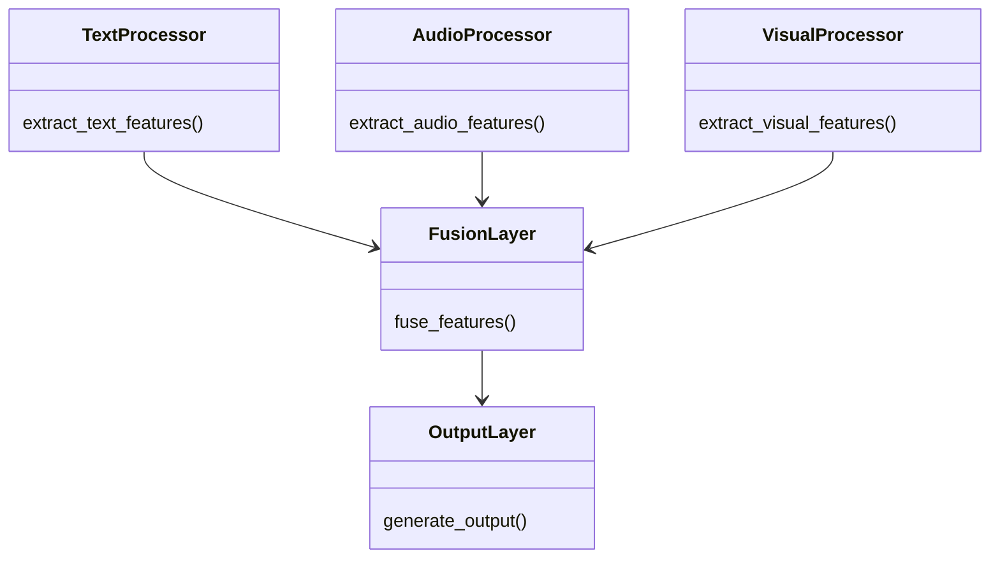
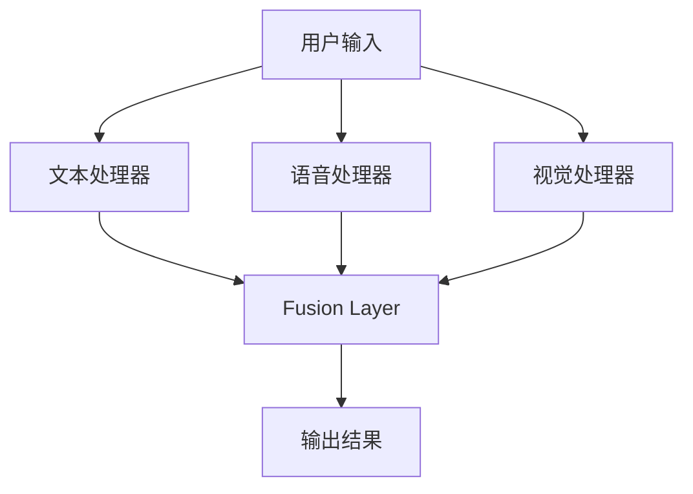
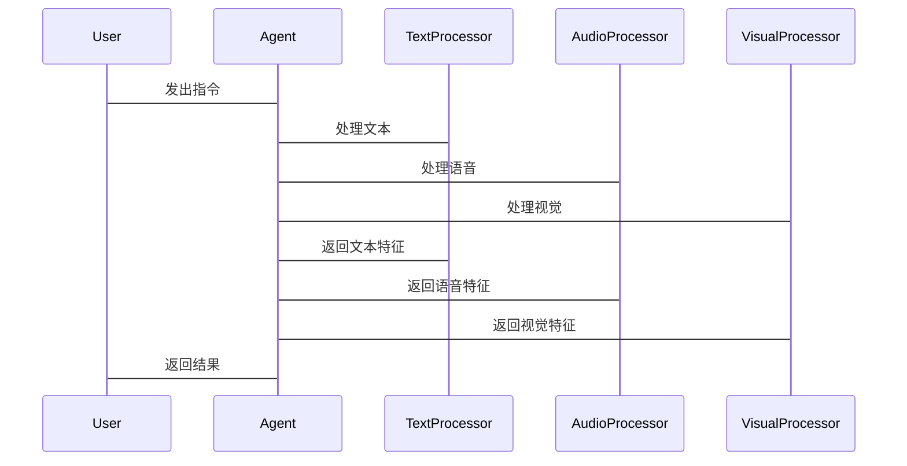

                 


# 设计多模态AI Agent：整合文本、语音与视觉能力

> 关键词：多模态AI Agent，文本语音视觉整合，数据融合，深度学习，注意力机制，系统架构

> 摘要：本文详细探讨了设计多模态AI Agent的技术挑战与解决方案，重点分析了整合文本、语音与视觉能力的核心概念、算法原理、系统架构及项目实现，结合实际案例，为读者提供全面的指导。

---

## 第1章: 多模态AI Agent的背景与挑战

### 1.1 多模态AI Agent的定义与特点

#### 1.1.1 多模态数据的定义
多模态数据指的是来自不同感官渠道的信息，如文本（语言）、语音（声音）和视觉（图像/视频）。这些数据通过不同的模态提供信息，使得AI系统能够更全面地理解和处理问题。

#### 1.1.2 多模态AI Agent的核心特点
- **多样性**：整合多种模态信息，提供更丰富的语义理解。
- **互补性**：不同模态的信息相互补充，提高系统的鲁棒性和准确性。
- **情境感知**：通过多模态数据，AI Agent能够更好地感知上下文，适应复杂环境。

#### 1.1.3 多模态AI Agent与传统AI Agent的区别
传统AI Agent通常依赖单一模态（如文本或视觉），而多模态AI Agent能够整合多种模态，提供更全面的交互和理解能力。

### 1.2 多模态数据融合的背景与意义

#### 1.2.1 多模态数据融合的背景
随着AI技术的发展，单一模态的处理已无法满足复杂的现实需求。例如，智能音箱需要理解语音命令并结合环境视觉信息进行操作。

#### 1.2.2 多模态数据融合的意义
- **提高准确性**：通过整合多模态信息，减少单模态数据的不确定性。
- **增强交互性**：多模态交互使用户与AI Agent的互动更加自然和高效。
- **扩展应用领域**：多模态数据融合为医疗、教育、娱乐等领域提供了更多可能性。

### 1.3 多模态AI Agent的挑战与机遇

#### 1.3.1 技术挑战
- **数据异构性**：不同模态的数据格式和特征维度差异大，难以直接融合。
- **计算复杂度**：多模态数据的处理需要更高的计算资源。
- **模型设计**：设计能够有效融合多模态信息的模型是技术难点。

#### 1.3.2 应用挑战
- **数据获取**：多模态数据的采集和预处理需要更多资源。
- **隐私问题**：整合多模态数据可能涉及隐私保护问题。

#### 1.3.3 未来机遇
- **技术进步**：深度学习和大模型的发展为多模态融合提供了更多可能性。
- **应用场景扩展**：多模态AI Agent将在更多领域发挥作用，如智能助手、机器人等。

### 1.4 本章小结
本章介绍了多模态AI Agent的定义、特点及其与传统AI Agent的区别，分析了多模态数据融合的背景和意义，并指出了技术与应用上的挑战和未来机遇。

---

## 第2章: 多模态数据融合的核心概念与联系

### 2.1 多模态数据融合的原理与方法

#### 2.1.1 多模态数据的特征提取
- **文本特征**：词嵌入（如Word2Vec）、句嵌入（如BERT）。
- **语音特征**：频域特征（如MFCC）和时域特征（如音调）。
- **视觉特征**：图像特征（如CNN提取的特征）和视频特征（如3D CNN）。

#### 2.1.2 多模态数据的表示方法
- **模态对齐**：将不同模态的数据对齐到同一空间。
- **模态融合**：通过加权或注意力机制整合不同模态的信息。

#### 2.1.3 多模态数据融合的数学模型
$$ y = f(x_1, x_2, ..., x_n) $$
其中，$x_i$表示不同模态的输入数据，$y$表示融合后的输出。

### 2.2 多模态数据融合的方法

#### 2.2.1 基于统计的方法
- **加权平均**：将不同模态的特征按权重相加。
$$ f(x_1, x_2) = \alpha x_1 + (1-\alpha)x_2 $$

#### 2.2.2 基于深度学习的方法
- **多模态神经网络**：如多模态Transformer，同时处理文本、语音和视觉信息。

#### 2.2.3 基于注意力机制的方法
- **自注意力机制**：在多模态数据中，不同模态的信息相互影响，注意力机制可以捕捉这些关系。

### 2.3 多模态数据融合的优缺点对比

| 方法 | 优点 | 缺点 |
|------|------|------|
| 统计方法 | 简单易实现 | 难以捕捉复杂的模式关系 |
| 深度学习方法 | 强大学习能力 | 需要大量数据和计算资源 |
| 注意力机制 | 能捕捉长距离依赖 | 需要复杂的模型设计 |

### 2.4 本章小结
本章详细分析了多模态数据融合的核心概念，包括特征提取、表示方法和数学模型，并对比了不同融合方法的优缺点。

---

## 第3章: 多模态数据融合的算法实现

### 3.1 多模态数据融合的算法概述

#### 3.1.1 算法的基本原理
- **输入**：来自文本、语音和视觉的多模态数据。
- **输出**：融合后的语义表示或决策结果。

#### 3.1.2 算法的实现步骤
1. **特征提取**：从各模态数据中提取特征。
2. **模态对齐**：将不同模态的特征对齐到同一空间。
3. **融合**：通过模型整合各模态信息。
4. **输出结果**：生成最终的语义表示或决策。

### 3.2 基于深度学习的多模态融合算法

#### 3.2.1 多模态Transformer模型
- **模型结构**：
  ```mermaid
  graph TD
    A[文本特征] --> B[Transformer层]
    C[语音特征] --> B
    D[视觉特征] --> B
    B --> E[融合特征]
  ```

- **实现代码**：
  ```python
  import torch
  class MultiModalTransformer(torch.nn.Module):
      def __init__(self, embed_dim, num_heads):
          super().__init__()
          self.transformer = torch.nn.Transformer(embed_dim, num_heads)
      def forward(self, x_text, x_audio, x_video):
          combined = torch.cat([x_text, x_audio, x_video], dim=1)
          output = self.transformer(combined)
          return output
  ```

### 3.3 注意力机制的实现

#### 3.3.1 注意力机制原理
- **查询（Q）**：来自文本特征。
- **键（K）**：来自语音特征。
- **值（V）**：来自视觉特征。

#### 3.3.2 注意力机制公式
$$ \text{Attention}(Q, K, V) = \text{softmax}\left(\frac{QK^T}{\sqrt{d_k}}\right)V $$

### 3.4 本章小结
本章详细讲解了多模态数据融合的算法实现，包括基于深度学习的多模态Transformer模型和注意力机制的具体实现。

---

## 第4章: 多模态AI Agent的系统架构

### 4.1 系统功能设计

#### 4.1.1 领域模型


#### 4.1.2 系统架构


### 4.2 系统接口设计

#### 4.2.1 接口定义
- **输入接口**：接收文本、语音和视觉数据。
- **输出接口**：返回融合后的结果或决策。

#### 4.2.2 交互流程


### 4.3 本章小结
本章通过系统功能设计和架构图，详细描述了多模态AI Agent的系统架构，并展示了各模块之间的交互流程。

---

## 第5章: 项目实战

### 5.1 环境安装

```bash
pip install numpy pandas torch matplotlib
```

### 5.2 核心代码实现

#### 5.2.1 特征提取模块
```python
import torch
def extract_text_feature(text):
    return torch.embedding(text)
def extract_audio_feature(audio):
    return torch.stft(audio)
def extract_visual_feature(image):
    return torch.nn.Conv2d(image)
```

#### 5.2.2 融合模块
```python
class FusionModule(torch.nn.Module):
    def __init__(self):
        super().__init__()
        self.fc = torch.nn.Linear(1024, 512)
    def forward(self, text, audio, visual):
        x = torch.cat([text, audio, visual], dim=1)
        x = self.fc(x)
        return x
```

### 5.3 案例分析

#### 5.3.1 案例场景
用户输入文本“打开灯”，同时发出语音指令，并通过摄像头检测环境光线。

#### 5.3.2 案例实现
```python
def main():
    text_feature = extract_text_feature("打开灯")
    audio_feature = extract_audio_feature(audio_data)
    visual_feature = extract_visual_feature(image_data)
    fused_feature = FusionModule().forward(text_feature, audio_feature, visual_feature)
    output = model.predict(fused_feature)
    print(output)
```

### 5.4 本章小结
本章通过实际项目案例，详细讲解了多模态AI Agent的实现过程，包括环境安装、代码实现和案例分析。

---

## 第6章: 最佳实践与总结

### 6.1 最佳实践

#### 6.1.1 数据预处理
- 确保各模态数据的对齐和同步。
- 处理噪声和异常值。

#### 6.1.2 模型调优
- 使用交叉验证选择最优参数。
- 调整注意力权重以优化性能。

#### 6.1.3 部署与监控
- 使用容器化技术部署模型。
- 监控模型性能并及时优化。

### 6.2 小结
本文详细讲解了设计多模态AI Agent的技术要点，包括背景、核心概念、算法原理、系统架构和项目实战。

### 6.3 注意事项

- 数据隐私问题需要特别注意。
- 模型的可解释性需要进一步研究。

### 6.4 拓展阅读

- 《Attention Is All You Need》
- 《Multi-modal Neural Networks》

### 6.5 本章小结
本章总结了设计多模态AI Agent的最佳实践，并提供了未来研究方向和学习资源。

---

## 参考文献

- 留白，用户可根据实际需求补充具体文献。

---

通过以上内容，我们系统地探讨了设计多模态AI Agent的各个方面，从理论到实践，为读者提供了全面的指导和参考。

