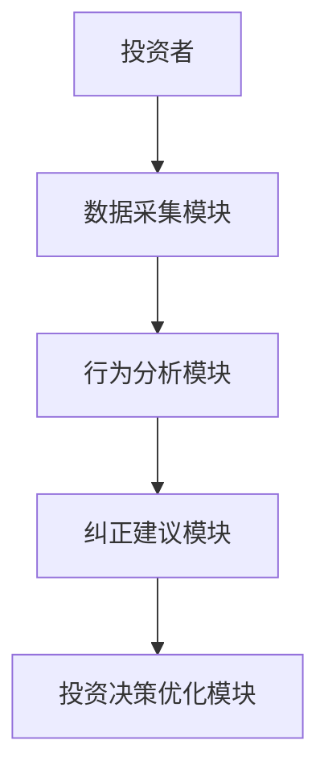

                 


# 设计智能化的个人投资者行为偏差纠正工具

> 关键词：个人投资者，行为偏差，机器学习，自然语言处理，智能化工具，投资决策

> 摘要：本文旨在设计一种智能化的个人投资者行为偏差纠正工具，通过分析投资者在投资决策中常见的行为偏差类型，结合心理学和行为科学的理论，提出基于机器学习、自然语言处理和数据挖掘等技术的纠正策略。工具的核心功能包括行为偏差识别、纠正建议生成和投资决策优化。通过系统化的分析和设计，构建一个能够帮助投资者识别和纠正行为偏差的智能化系统，从而提高投资决策的科学性和有效性。

---

# 第1章: 个人投资者行为偏差概述

## 1.1 行为偏差的定义与分类

### 1.1.1 行为偏差的定义
个人投资者在投资决策过程中，由于心理、情感和认知的局限性，常常会出现偏离理性决策的行为偏差。这些偏差可能导致投资者做出错误的投资决策，进而影响投资收益。

### 1.1.2 常见的行为偏差类型
1. **过度自信偏差**：投资者对自己判断的过度自信，导致高估自己的能力，忽略市场变化。
2. **从众心理偏差**：投资者盲目跟随市场趋势或他人的决策，缺乏独立思考。
3. **情绪化决策偏差**：投资者因市场波动产生情绪化反应，如贪婪或恐惧。
4. **确认偏差**：投资者倾向于寻找支持自己已有观点的信息，忽视相反的证据。
5. **锚定效应**：投资者过度依赖初始信息，导致决策僵化。

### 1.1.3 行为偏差对投资决策的影响
行为偏差会导致投资者在市场波动中做出非理性决策，如高位追涨、低位恐慌性抛售等，最终影响投资收益。

---

## 1.2 个人投资者行为偏差的背景与现状

### 1.2.1 当前投资市场的行为偏差问题
随着金融市场的复杂化和信息的碎片化，投资者面临的决策压力越来越大，行为偏差问题日益突出。

### 1.2.2 个人投资者的行为特征与心理因素
1. **认知局限性**：投资者往往基于有限的信息和知识做出决策。
2. **情绪波动**：市场的波动容易引发投资者的情绪化反应。
3. **社会影响**：投资者容易受到周围人或市场的从众心理影响。

### 1.2.3 行为偏差纠正工具的必要性
为了帮助投资者克服行为偏差，提高投资决策的科学性，设计一种智能化的行为偏差纠正工具具有重要意义。

---

## 1.3 智能化行为偏差纠正工具的定义与目标

### 1.3.1 智能化纠正工具的定义
智能化行为偏差纠正工具是一种基于人工智能技术，能够识别和纠正投资者行为偏差的智能化系统。

### 1.3.2 工具的目标与核心功能
1. **目标**：帮助投资者识别行为偏差，提供纠正建议，优化投资决策。
2. **核心功能**：
   - 行为偏差识别
   - 纠正建议生成
   - 投资决策优化

### 1.3.3 工具的预期效果与应用场景
通过纠正行为偏差，投资者可以做出更理性的决策，提升投资收益。

---

## 1.4 本章小结
本章介绍了个人投资者行为偏差的定义、分类及其对投资决策的影响，提出了智能化行为偏差纠正工具的必要性，并明确了工具的目标与核心功能。

---

# 第2章: 行为偏差纠正的核心概念与技术原理

## 2.1 行为偏差的类型与影响因素

### 2.1.1 行为偏差的类型
1. **过度自信偏差**
2. **从众心理偏差**
3. **情绪化决策偏差**
4. **确认偏差**
5. **锚定效应**

### 2.1.2 行为偏差的影响因素
1. **心理因素**：认知偏差、情绪波动等。
2. **外部因素**：市场环境、社会影响等。

---

## 2.2 行为偏差纠正的技术原理

### 2.2.1 机器学习在行为分析中的应用
1. **监督学习**：用于分类行为偏差类型。
2. **无监督学习**：用于发现潜在的行为模式。

### 2.2.2 自然语言处理在情绪分析中的作用
通过分析投资者的文本信息，识别情绪波动。

### 2.2.3 数据挖掘在偏差识别中的应用
从历史数据中挖掘行为偏差的规律。

---

## 2.3 行为偏差纠正工具的系统架构

### 2.3.1 系统功能模块划分
1. **数据采集模块**：采集投资者的行为数据。
2. **行为分析模块**：识别行为偏差类型。
3. **纠正建议模块**：生成纠正建议。
4. **投资决策优化模块**：优化投资策略。

### 2.3.2 系统输入与输出的定义
1. **输入**：投资者的行为数据、市场数据。
2. **输出**：行为偏差识别结果、纠正建议、优化的投资决策。

### 2.3.3 系统的核心算法与技术选型
1. **算法选型**：监督学习、无监督学习。
2. **技术选型**：机器学习框架（如TensorFlow）、自然语言处理库（如spaCy）。

---

## 2.4 本章小结
本章分析了行为偏差的类型及其影响因素，介绍了智能化行为偏差纠正工具的技术原理，包括机器学习、自然语言处理和数据挖掘的应用。

---

# 第3章: 基于机器学习的行为偏差识别算法

## 3.1 基于监督学习的行为偏差识别

### 3.1.1 数据特征提取与选择
1. **特征提取**：从投资者的行为数据中提取特征，如交易频率、交易金额等。
2. **特征选择**：使用特征选择算法，筛选出对行为偏差识别有显著影响的特征。

### 3.1.2 分类算法的选择与实现
1. **算法选择**：支持向量机（SVM）、随机森林（Random Forest）。
2. **实现步骤**：
   - 数据预处理
   - 模型训练
   - 模型评估

### 3.1.3 模型训练与评估
1. **训练数据**：使用历史投资者数据进行训练。
2. **评估指标**：准确率、召回率、F1分数。

---

## 3.2 基于无监督学习的行为偏差识别

### 3.2.1 聚类算法的应用
1. **算法选择**：K-means、DBSCAN。
2. **实现步骤**：
   - 数据预处理
   - 聚类分析
   - 聚类结果解释

### 3.2.2 异常检测算法的应用
1. **算法选择**：Isolation Forest、One-Class SVM。
2. **实现步骤**：
   - 数据预处理
   - 异常检测
   - 异常结果分析

---

## 3.3 基于强化学习的行为偏差纠正算法

### 3.3.1 强化学习的基本原理
1. **定义**：强化学习是一种通过试错机制来优化决策的算法。
2. **核心要素**：状态、动作、奖励。

### 3.3.2 状态定义与动作空间设计
1. **状态定义**：投资者当前的市场环境、心理状态。
2. **动作空间设计**：纠正偏差的具体操作，如调整投资组合。

### 3.3.3 奖励机制的设计与实现
1. **奖励设计**：根据纠正偏差的效果给予奖励。
2. **实现步骤**：
   - 定义奖励函数
   - 模型训练
   - 模型优化

---

## 3.4 本章小结
本章详细介绍了基于机器学习的行为偏差识别算法，包括监督学习、无监督学习和强化学习的应用。

---

# 第4章: 行为偏差纠正工具的系统分析与架构设计

## 4.1 系统功能设计

### 4.1.1 功能模块划分
1. **数据采集模块**：采集投资者的行为数据。
2. **行为分析模块**：识别行为偏差类型。
3. **纠正建议模块**：生成纠正建议。
4. **投资决策优化模块**：优化投资策略。

### 4.1.2 功能实现流程
1. **数据采集**：获取投资者的行为数据。
2. **行为分析**：识别行为偏差类型。
3. **纠正建议**：生成纠正建议。
4. **投资决策优化**：优化投资策略。

---

## 4.2 系统架构设计

### 4.2.1 系统架构图


### 4.2.2 核心算法与技术选型
1. **核心算法**：监督学习、无监督学习。
2. **技术选型**：机器学习框架（如TensorFlow）、自然语言处理库（如spaCy）。

---

## 4.3 本章小结
本章通过系统分析与架构设计，明确了行为偏差纠正工具的功能模块与实现流程。

---

# 第5章: 行为偏差纠正工具的项目实战

## 5.1 环境安装与配置

### 5.1.1 安装Python环境
使用Anaconda安装Python 3.8及以上版本。

### 5.1.2 安装机器学习库
安装TensorFlow、scikit-learn、spaCy等库。

### 5.1.3 数据集准备
获取投资者行为数据，包括交易记录、市场数据等。

---

## 5.2 核心代码实现

### 5.2.1 数据预处理
```python
import pandas as pd
import numpy as np

# 读取数据
data = pd.read_csv('investor_data.csv')

# 数据清洗
data = data.dropna()
data = data[~data['label'].isnull()]
```

### 5.2.2 行为偏差识别模型训练
```python
from sklearn.model

