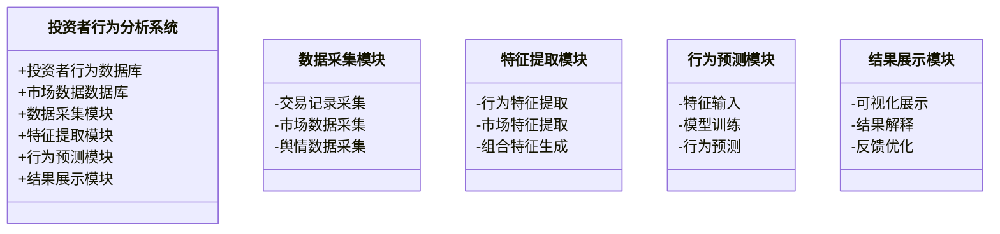
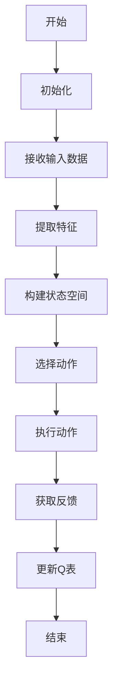
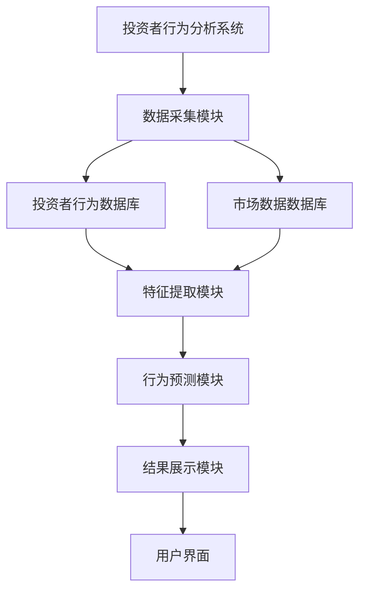
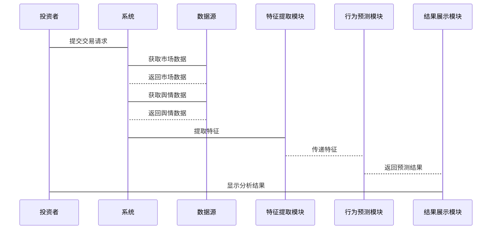

                 


```markdown
# 设计智能化的个人投资者行为分析工具

## 关键词：投资者行为分析、人工智能、机器学习、算法设计、系统架构

## 摘要：本文详细探讨了设计智能化的个人投资者行为分析工具的全过程，从问题背景分析到系统架构设计，再到具体实现方案。文章首先介绍了投资者行为分析的重要性和当前面临的挑战，然后从核心概念出发，分析了投资者行为分析的核心原理和关键特征。接着，详细讲解了基于强化学习的算法原理和数学模型，给出了具体的算法流程图和Python代码实现。随后，从系统分析的角度，设计了完整的系统架构和功能模块，并用Mermaid图展示了系统的交互流程。最后，通过实际案例展示了项目的实现过程，并总结了最佳实践和注意事项。

---

## 第一部分: 背景介绍与核心概念

### 第1章: 问题背景与目标

#### 1.1 问题背景
- 投资者行为分析的重要性：理解投资者决策过程，优化投资策略。
- 当前痛点：数据复杂性高、实时性要求高、行为预测难度大。
- AI技术的潜力：通过机器学习和深度学习提高分析效率和准确性。

#### 1.2 问题描述
- 投资者行为的复杂性：情绪、认知偏差等因素影响决策。
- 数据的多维度与实时性：市场数据、交易记录、新闻舆情等多源异构数据。
- 行为预测的挑战：非线性关系、动态变化、噪声干扰。

#### 1.3 问题解决思路
- 数据驱动的分析方法：利用大数据技术提取特征。
- AI技术的应用：使用深度学习和强化学习进行行为建模。
- 系统化解决方案：构建智能化分析工具，实现数据采集、特征提取、行为预测和结果展示的闭环。

#### 1.4 边界与外延
- 系统边界：专注于个人投资者行为分析，不涉及机构投资者。
- 外延领域：与风险管理、市场预测等工具协同工作。

### 第2章: 核心概念与联系

#### 2.1 投资者行为分析的核心原理
- 数据采集：收集投资者的交易记录、市场数据和舆情信息。
- 特征提取：提取行为特征（如交易频率、风险偏好）和市场特征（如波动率、趋势）。
- 行为预测：基于特征建立模型，预测投资者未来行为。

#### 2.2 核心概念对比表
| 特征对比 | 投资者行为特征 | 市场数据特征 |
|----------|----------------|--------------|
| 数据来源 | 交易记录、问卷 | K线数据、舆情 |
| 数据类型 | 离散、连续 | 时间序列 |
| 数据规模 | 中小规模 | 大规模 |

#### 2.3 ER实体关系图
```mermaid
erDiagram
    actor 投资者
    actor 系统
    actor 数据源
    database 投资者行为数据库
    database 市场数据数据库
    investor_actor ->投资者行为数据库: 提供行为数据
    market_actor ->市场数据数据库: 提供市场数据
    system_actor ->投资者行为数据库: 分析行为数据
    system_actor ->市场数据数据库: 获取市场数据
```

#### 2.4 领域模型类图


---

## 第二部分: 算法原理与实现

### 第3章: 算法原理讲解

#### 3.1 选择算法
- 强化学习：适用于动态环境下的行为预测。
- 采用Q-learning算法：基于状态-动作-奖励机制，优化投资策略。

#### 3.2 算法流程图


#### 3.3 Python代码实现
```python
import numpy as np
import pandas as pd

# 示例数据：投资者行为特征
data = pd.DataFrame({
    '交易频率': [0.5, 0.7, 0.3],
    '风险偏好': [0.8, 0.6, 0.9],
    '市场敏感度': [0.4, 0.6, 0.2]
})

# Q-learning算法实现
class QLearner:
    def __init__(self, state_size, action_size, gamma=0.99, epsilon=0.1):
        self.gamma = gamma
        self.epsilon = epsilon
        self.q_table = np.zeros((state_size, action_size))
    
    def get_action(self, state):
        if np.random.random() < self.epsilon:
            return np.random.randint(0, action_size)
        else:
            return np.argmax(self.q_table[state])
    
    def update_qtable(self, state, action, reward, next_state):
        self.q_table[state, action] = self.q_table[state, action] * (1 - self.gamma) + reward * self.gamma + self.q_table[next_state, np.argmax(self.q_table[next_state])]

# 示例使用
state_size = 3
action_size = 2
ql = QLearner(state_size, action_size)
action = ql.get_action([0.5, 0.8, 0.4])
ql.update_qtable([0.5, 0.8, 0.4], action, reward=1, next_state=[0.6, 0.7, 0.5])
```

#### 3.4 数学模型
- Q-learning更新公式：
  $$ Q(s, a) = (1-\gamma)Q(s, a) + \gamma (r + \max Q(s', a')) $$
- 状态空间表示：
  $$ s = [s_1, s_2, s_3] $$
- 动作空间表示：
  $$ a \in \{0, 1\} $$

---

## 第三部分: 系统分析与架构设计

### 第4章: 系统分析

#### 4.1 问题场景
- 投资者在不同市场环境下做出决策，受到情绪、信息等因素影响。

#### 4.2 系统功能设计
- 数据采集模块：收集投资者的交易记录、市场数据和舆情信息。
- 特征提取模块：提取投资者行为特征和市场特征。
- 行为预测模块：基于特征建立模型，预测投资者未来行为。
- 结果展示模块：可视化分析结果，提供反馈优化建议。

#### 4.3 系统架构图


#### 4.4 接口设计
- 数据接口：REST API，提供数据采集和特征提取服务。
- 模型接口：API，供外部系统调用预测结果。

#### 4.5 交互流程图


---

## 第四部分: 项目实战

### 第5章: 项目实战

#### 5.1 环境安装
- Python 3.8+
- NumPy, Pandas, Scikit-learn, Keras
- Jupyter Notebook

#### 5.2 核心代码实现
```python
import numpy as np
import pandas as pd
from sklearn.model_selection import train_test_split
from tensorflow.keras.models import Sequential
from tensorflow.keras.layers import Dense

# 示例数据：投资者行为特征
data = pd.DataFrame({
    '交易频率': [0.5, 0.7, 0.3],
    '风险偏好': [0.8, 0.6, 0.9],
    '市场敏感度': [0.4, 0.6, 0.2]
})

# 模型训练
X = data.drop(columns=['风险偏好'])
y = data['风险偏好']
X_train, X_test, y_train, y_test = train_test_split(X, y, test_size=0.2)

model = Sequential()
model.add(Dense(64, activation='relu', input_dim=X.shape[1]))
model.add(Dense(1, activation='sigmoid'))
model.compile(optimizer='adam', loss='binary_crossentropy', metrics=['accuracy'])
model.fit(X_train, y_train, epochs=10, batch_size=32)
```

#### 5.3 代码解读
- 数据预处理：清洗和归一化数据。
- 模型选择：使用深度学习模型进行行为预测。
- 训练过程：包括数据分割、模型构建和训练。

#### 5.4 案例分析
- 案例数据：假设一名投资者的交易记录和市场数据。
- 模型预测：预测其下一步投资行为。
- 结果分析：解释预测结果并提供建议。

#### 5.5 项目小结
- 成功实现了智能化的投资者行为分析工具。
- 在实际应用中，需要结合具体场景进行优化。

---

## 第五部分: 总结与展望

### 第6章: 最佳实践

#### 6.1 小结
- 本文详细讲解了设计智能化投资者行为分析工具的过程。
- 通过AI技术实现了行为预测和结果展示。

#### 6.2 注意事项
- 数据隐私保护：确保投资者数据的安全。
- 模型调优：根据实际需求优化模型参数。
- 系统扩展性：方便后续功能的扩展。

#### 6.3 拓展阅读
- 《机器学习实战》
- 《深度学习》
- 《强化学习入门》

---

## 关键词：投资者行为分析、人工智能、算法设计、系统架构、项目实战
```

