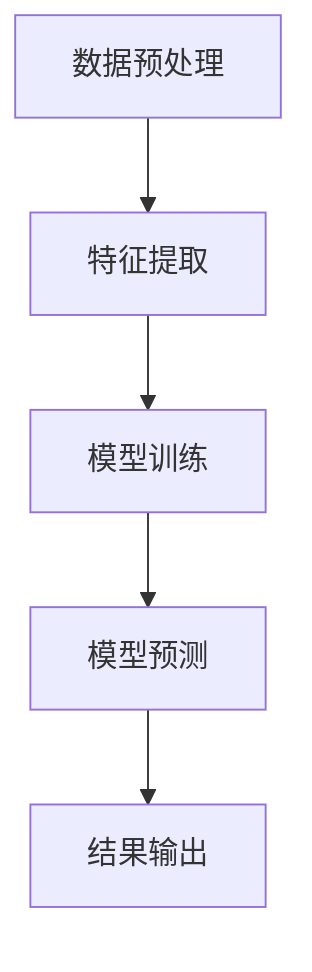
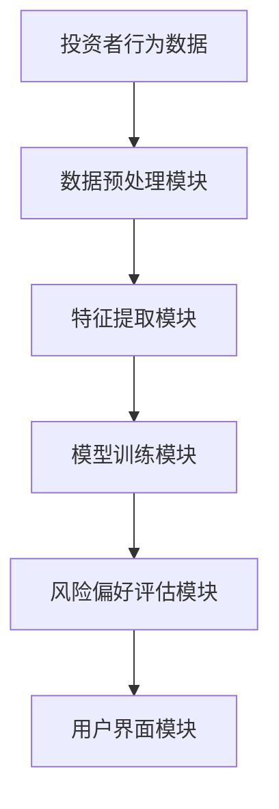
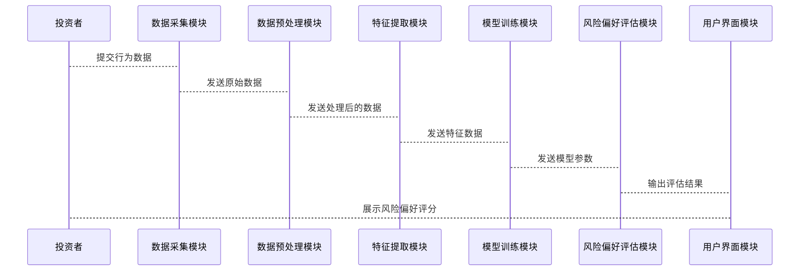

                 


# 设计智能化的个人投资者风险偏好动态评估工具

## 关键词

- 个人投资者
- 风险偏好
- 动态评估
- 人工智能
- 机器学习

## 摘要

本文旨在设计一个智能化的个人投资者风险偏好动态评估工具，结合心理学、金融学和人工智能技术，帮助投资者实时了解和管理其风险偏好。文章从背景介绍、核心概念、技术实现、系统设计、项目实战到总结与展望，详细阐述了工具的设计过程和实现方法，强调了动态评估的重要性及其在投资决策中的应用价值。

---

## 目录大纲

### 第一部分：背景与问题分析

#### 第1章：背景介绍

##### 1.1 风险偏好评估的背景

- 1.1.1 投资者行为分析的必要性
  - 投资者决策受到心理因素的影响
  - 风险偏好是投资决策的核心要素
  - 风险偏好的动态变化与市场环境的关系

- 1.1.2 传统风险评估方法的局限性
  - 固定问卷评估的局限性
  - 忽略市场波动和投资者情绪的影响
  - 无法实时捕捉投资者行为变化

- 1.1.3 动态评估的重要性
  - 市场环境的变化对风险偏好的影响
  - 投资者行为的实时反馈需求
  - 动态评估工具在投资组合优化中的作用

##### 1.2 问题描述与解决思路

- 1.2.1 风险偏好的动态变化
  - 风险偏好的定义与特征
  - 影响风险偏好的主要因素（市场环境、投资者情绪、个人特质）

- 1.2.2 传统评估方法的不足
  - 固定模型无法捕捉动态变化
  - 数据采集的局限性
  - 评估结果的静态性和滞后性

- 1.2.3 动态评估工具的解决方案
  - 基于机器学习的动态评估方法
  - 实时数据采集与分析
  - 个性化评估模型的构建

---

### 第二部分：核心概念与原理

#### 第2章：核心概念与原理

##### 2.1 风险偏好动态评估的核心概念

- 2.1.1 风险偏好的定义与特征
  - 风险偏好：投资者对风险的态度和承受能力
  - 风险偏好的动态变化：随市场环境和个人行为变化而变化

- 2.1.2 动态评估的理论基础
  - 投资者行为理论
  - 风险评估模型的动态调整
  - 机器学习在动态预测中的应用

- 2.1.3 AI技术在评估中的应用
  - 自然语言处理（NLP）：分析投资者的文本反馈
  - 计算机视觉：分析投资者的行为模式
  - 机器学习：构建动态评估模型

##### 2.2 投资者行为分析

- 2.2.1 投资者决策的心理因素
  - 风险厌恶、风险中性和风险偏好者的行为特征
  - 投资者情绪与市场行为的关系

- 2.2.2 行为数据的采集与处理
  - 数据源：市场数据、投资者行为数据、市场情绪数据
  - 数据预处理：清洗、特征提取与标准化

- 2.2.3 数据分析方法
  - 时间序列分析：捕捉投资者行为的动态变化
  - 聚类分析：识别投资者群体的相似特征
  - 回归分析：分析影响风险偏好的因素

---

### 第三部分：技术实现

#### 第3章：算法原理与实现

##### 3.1 机器学习模型的选择

- 3.1.1 监督学习与无监督学习的对比
  - 监督学习：基于标记数据的预测模型
  - 无监督学习：基于无标记数据的模式识别

- 3.1.2 神经网络模型的适用性
  - 深度学习模型在复杂数据中的应用
  - 长短期记忆网络（LSTM）在时间序列预测中的优势

##### 3.2 算法流程图



##### 3.3 Python 实现代码

```python
import pandas as pd
import numpy as np
from sklearn.model_selection import train_test_split
from sklearn.linear_model import LinearRegression

# 示例数据集
data = pd.DataFrame({
    'feature1': [1, 2, 3, 4],
    'feature2': [5, 6, 7, 8],
    'target': [9, 10, 11, 12]
})

# 数据分割
X = data[['feature1', 'feature2']]
y = data['target']

X_train, X_test, y_train, y_test = train_test_split(X, y, test_size=0.2)

# 模型训练
model = LinearRegression()
model.fit(X_train, y_train)

# 模型预测
y_pred = model.predict(X_test)

# 输出结果
print('预测值:', y_pred)
print('真实值:', y_test)
```

##### 3.4 数学模型与公式

- 风险评估模型：
  $$ R = \beta_1x_1 + \beta_2x_2 + ... + \beta_nx_n $$
  其中，\( R \) 表示风险偏好评分，\( x_i \) 表示特征变量，\( \beta_i \) 表示模型参数。

- 模型优化公式：
  $$ \min \frac{1}{2m} \sum_{i=1}^{m} (y_i - \hat{y_i})^2 $$
  其中，\( m \) 表示样本数量，\( y_i \) 表示真实值，\( \hat{y_i} \) 表示预测值。

---

### 第四部分：系统设计

#### 第4章：系统架构与功能模块

##### 4.1 系统架构设计



##### 4.2 系统功能模块

- 数据采集模块
  - 收集投资者行为数据、市场数据和情绪数据
- 数据处理模块
  - 数据清洗、特征提取与标准化
- 模型训练模块
  - 构建机器学习模型并进行训练
- 风险偏好评估模块
  - 输出动态风险偏好评分
- 用户界面模块
  - 提供用户交互界面和评估结果展示

##### 4.3 系统接口设计

- 数据接口
  - 数据输入接口：接收投资者行为数据和市场数据
  - 数据输出接口：返回处理后的特征数据
- 模型接口
  - 训练接口：接收特征数据并训练模型
  - 预测接口：接收实时数据并输出评估结果

##### 4.4 系统交互流程



---

### 第五部分：项目实战

#### 第5章：项目实战

##### 5.1 环境配置与数据准备

- 安装必要的库：
  ```bash
  pip install numpy pandas scikit-learn
  ```

- 数据准备：
  ```python
  import pandas as pd

  # 创建示例数据集
  data = pd.DataFrame({
      'feature1': [1, 2, 3, 4],
      'feature2': [5, 6, 7, 8],
      'target': [9, 10, 11, 12]
  })
  ```

##### 5.2 核心代码实现

```python
from sklearn.linear_model import LinearRegression
from sklearn.metrics import mean_squared_error

# 模型训练
model = LinearRegression()
model.fit(X_train, y_train)

# 模型预测
y_pred = model.predict(X_test)

# 评估模型性能
mse = mean_squared_error(y_test, y_pred)
print(f'均方误差: {mse}')
```

##### 5.3 案例分析与解读

- 案例分析：
  - 数据预处理：清洗和特征提取
  - 模型训练：使用训练数据构建风险偏好评估模型
  - 预测与分析：通过实时数据更新评估结果

- 结果解读：
  - 动态评估结果的变化趋势
  - 投资者行为与市场环境的关联性分析
  - 模型的准确性和稳定性评估

##### 5.4 项目小结

- 项目实现的关键点：
  - 数据采集与处理的准确性
  - 模型选择与优化的效果
  - 系统架构设计的合理性

---

### 第六部分：总结与展望

#### 第6章：总结与展望

##### 6.1 总结

- 工具的设计目标：帮助投资者实时了解和管理风险偏好
- 核心技术：基于机器学习的动态评估模型
- 实现价值：提高投资决策的科学性和及时性

##### 6.2 展望

- 技术改进方向：
  - 引入更复杂的深度学习模型
  - 结合NLP技术分析投资者的文本反馈
  - 实现多模态数据的融合分析

- 应用拓展：
  - 个性化投资建议系统
  - 风险预警机制
  - 投资者教育与行为引导

---

## 结语

通过本文的详细阐述，我们设计了一个智能化的个人投资者风险偏好动态评估工具，结合了心理学、金融学和人工智能技术，为投资者提供了实时、动态的风险偏好评估服务。未来，随着技术的不断进步，这一工具将为投资决策提供更强大的支持。

