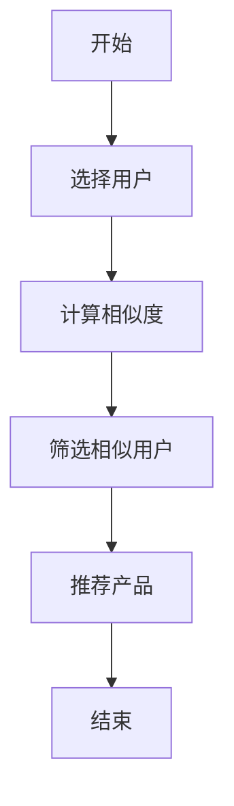
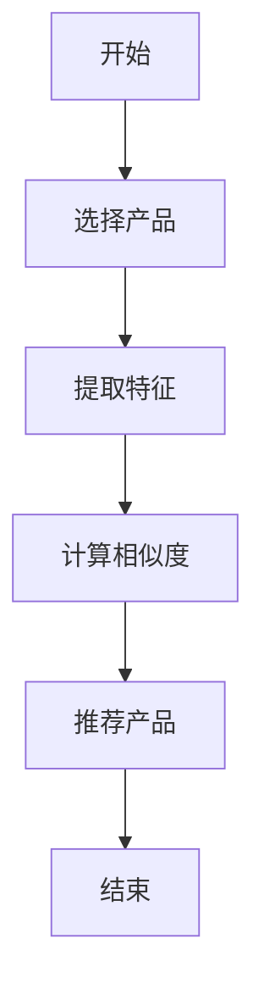
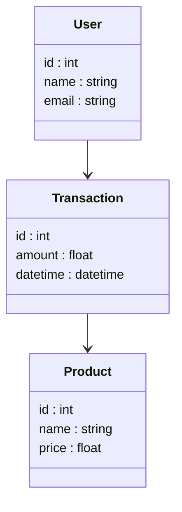
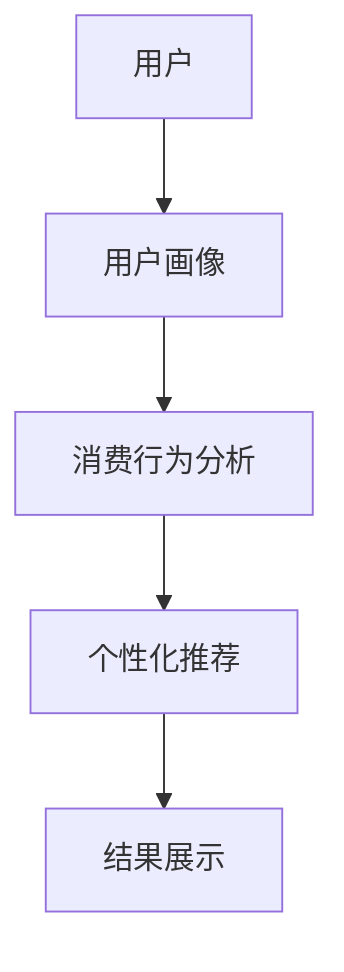
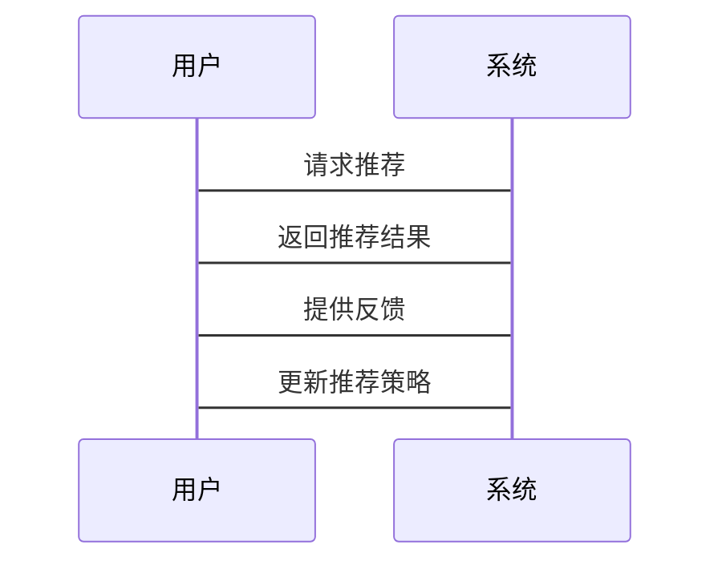

                 


# 设计智能化的个人消费行为分析系统

---

## 关键词：  
智能化消费分析、人工智能、大数据、用户画像、推荐算法、系统架构、数据隐私

---

## 摘要：  
本文详细探讨了设计智能化个人消费行为分析系统的各个方面。从背景介绍到系统架构，从算法原理到项目实战，全面分析了该系统的构建过程。文章通过对比分析、ER实体关系图、算法流程图和系统交互图等多种方式，深入解析了系统的核心概念与技术实现。此外，文章还提供了实际案例分析和代码实现，帮助读者更好地理解如何构建一个高效的智能化个人消费行为分析系统。

---

# 第一部分: 智能化个人消费行为分析系统背景与概述

---

## 第1章: 个人消费行为分析系统背景

### 1.1 问题背景与重要性  
#### 1.1.1 个人消费行为分析的背景  
随着人工智能和大数据技术的快速发展，个人消费行为分析变得越来越重要。通过对个人消费数据的分析，企业可以更好地理解用户需求，优化产品和服务，提升用户体验。  

#### 1.1.2 问题的重要性与意义  
个人消费行为分析可以帮助企业：  
1. 提高用户满意度和忠诚度。  
2. 优化营销策略，降低营销成本。  
3. 发现市场趋势，提前布局。  

#### 1.1.3 当前技术的发展趋势  
近年来，深度学习、自然语言处理和强化学习等技术的快速发展，为个人消费行为分析提供了更强大的工具和技术支持。  

---

### 1.2 问题描述与目标  
#### 1.2.1 个人消费行为的复杂性  
个人消费行为受到多种因素的影响，包括用户的兴趣、偏好、经济状况、社会环境等。因此，分析个人消费行为需要综合考虑多个维度的数据。  

#### 1.2.2 系统的目标与核心任务  
系统的目标是通过分析用户的消费数据，预测用户的消费行为，提供个性化的推荐服务。核心任务包括：  
1. 数据采集与预处理。  
2. 消费行为建模与分析。  
3. 智能推荐系统的实现。  

#### 1.2.3 解决方案的初步构想  
初步构想是通过构建一个基于机器学习的推荐系统，结合用户画像和实时数据，实现对个人消费行为的智能化分析与预测。  

---

### 1.3 系统边界与外延  
#### 1.3.1 系统的功能范围  
系统主要功能包括：  
1. 数据采集与存储。  
2. 用户画像构建。  
3. 消费行为分析与预测。  
4. 个性化推荐服务。  

#### 1.3.2 系统的边界定义  
系统的边界是用户端和数据源之间，不涉及企业的内部管理和供应链管理。  

#### 1.3.3 系统的外延与扩展  
系统可以通过扩展功能模块，如社交网络分析、情感分析等，进一步提升分析的深度和广度。  

---

### 1.4 核心要素与组成结构  
#### 1.4.1 数据来源与处理  
数据来源包括：  
1. 用户的基本信息（如年龄、性别、职业）。  
2. 消费记录（如购买时间、金额、产品类别）。  
3. 用户行为数据（如浏览记录、点击行为）。  

#### 1.4.2 分析模型与算法  
核心算法包括：  
1. 协同过滤推荐算法。  
2. 基于内容的推荐算法。  
3. 深度学习模型（如神经网络）。  

#### 1.4.3 用户界面与交互  
用户界面需要简洁直观，支持用户查询历史记录、查看推荐结果和进行反馈。  

---

## 1.5 本章小结  
本章从背景、问题、目标和系统边界等多个方面，详细介绍了智能化个人消费行为分析系统的构建背景和核心要素。  

---

# 第二部分: 智能化个人消费行为分析系统的核心概念与联系

---

## 第2章: 核心概念与模块关系

### 2.1 核心概念原理  
#### 2.1.1 数据采集与预处理  
数据采集是系统的核心环节，需要确保数据的完整性和准确性。预处理包括数据清洗、特征提取和数据标准化。  

#### 2.1.2 消费行为建模  
通过分析用户的行为数据，构建用户画像，提取用户的兴趣和偏好特征。  

#### 2.1.3 智能分析与预测  
基于机器学习模型，对用户消费行为进行预测和推荐。  

---

### 2.2 核心概念对比分析  
#### 2.2.1 数据采集模块对比  
| 模块 | 特点 | 功能 |  
|------|------|------|  
| 数据采集 | 实时采集 | 获取用户行为数据 |  
| 数据预处理 | 清洗数据 | 去除噪声数据 |  

#### 2.2.2 分析模型对比  
| 模型 | 特点 | 适用场景 |  
|------|------|----------|  
| 协同过滤 | 基于用户相似性 | 用户数量较多时 |  
| 基于内容的推荐 | 基于产品特征 | 用户数量较少时 |  

#### 2.2.3 用户交互方式对比  
| 方式 | 特点 | 优缺点 |  
|------|------|----------|  
| 基于规则的推荐 | 简单易实现 | 精度低 |  
| 基于模型的推荐 | 精度高 | 实现复杂 |  

---

### 2.3 ER实体关系图  
```mermaid
erDiagram
    user {
        id : int
        name : string
        email : string
    }
    transaction {
        id : int
        amount : float
        datetime : datetime
        user_id : int
    }
    product {
        id : int
        name : string
        price : float
    }
    user) --> (transaction)
    transaction) --> (product)
```

---

## 2.4 本章小结  
本章通过对比分析和ER实体关系图，详细介绍了智能化个人消费行为分析系统的核心概念和模块关系。  

---

# 第三部分: 智能化个人消费行为分析系统的算法原理

---

## 第3章: 算法原理与实现

### 3.1 协同过滤推荐算法  
#### 3.1.1 算法原理  
协同过滤推荐算法基于用户之间的相似性，推荐与相似用户具有相同偏好的产品或服务。  

#### 3.1.2 算法流程图  


#### 3.1.3 算法实现  
```python
def collaborative_filtering(user_id, user_data):
    # 计算用户相似度
    similarity = {}
    for user in user_data:
        if user != user_id:
            similarity[user] = cosine_similarity(user_data[user_id], user_data[user])
    # 筛选相似用户
    similar_users = sorted(similarity.items(), key=lambda x: x[1], reverse=True)[:5]
    # 推荐产品
    recommendations = []
    for user in similar_users:
        recommendations.extend(user_data[user[0]])
    return recommendations
```

---

### 3.2 基于内容的推荐算法  
#### 3.2.1 算法原理  
基于内容的推荐算法通过分析产品的特征，推荐与当前用户兴趣相符的产品。  

#### 3.2.2 算法流程图  


#### 3.2.3 算法实现  
```python
def content_based_recommendation(product_id, product_data):
    # 提取产品特征
    features = product_data[product_id]
    # 计算相似度
    similarity = {}
    for product in product_data:
        if product != product_id:
            similarity[product] = cosine_similarity(features, product_data[product])
    # 筛选相似产品
    similar_products = sorted(similarity.items(), key=lambda x: x[1], reverse=True)[:5]
    return similar_products
```

---

### 3.3 算法对比与优化  
#### 3.3.1 算法对比  
| 算法 | 优点 | 缺点 |  
|------|------|------|  
| 协同过滤 | 推荐精度高 | 对新用户的适应性差 |  
| 基于内容的推荐 | 对新用户的适应性强 | 推荐精度较低 |  

#### 3.3.2 算法优化  
结合协同过滤和基于内容的推荐，构建混合推荐模型，提升推荐精度和适应性。  

---

## 3.4 本章小结  
本章通过详细讲解协同过滤和基于内容的推荐算法，展示了如何实现智能化个人消费行为分析系统的推荐功能。  

---

# 第四部分: 智能化个人消费行为分析系统的系统架构与设计

---

## 第4章: 系统架构设计

### 4.1 系统功能设计  
#### 4.1.1 领域模型  


#### 4.1.2 功能模块  
系统主要功能模块包括：  
1. 数据采集模块。  
2. 用户画像模块。  
3. 消费行为分析模块。  
4. 个性化推荐模块。  

---

### 4.2 系统架构设计  
#### 4.2.1 分层架构  
系统采用分层架构，包括数据层、业务逻辑层和表现层。  

#### 4.2.2 系统架构图  


---

### 4.3 系统接口设计  
#### 4.3.1 数据接口  
系统提供RESTful API接口，支持数据的增删改查操作。  

#### 4.3.2 用户接口  
用户可以通过网页或移动应用界面进行交互，查询推荐结果和历史记录。  

---

### 4.4 系统交互流程  
#### 4.4.1 交互流程图  


---

## 4.5 本章小结  
本章通过系统架构设计和接口设计，展示了如何构建一个高效、可靠的智能化个人消费行为分析系统。  

---

# 第五部分: 智能化个人消费行为分析系统的项目实战

---

## 第5章: 项目实战与案例分析

### 5.1 环境安装与配置  
#### 5.1.1 工具安装  
安装Python、Jupyter Notebook、TensorFlow和Scikit-learn等工具。  

#### 5.1.2 数据集准备  
准备用户数据、消费记录和产品信息等数据集。  

---

### 5.2 核心功能实现  
#### 5.2.1 数据预处理  
```python
import pandas as pd
data = pd.read_csv('user_behavior.csv')
data.dropna(inplace=True)
```

#### 5.2.2 用户画像构建  
```python
from sklearn.cluster import KMeans
features = data[['age', 'income', 'gender']]
kmeans = KMeans(n_clusters=3)
kmeans.fit(features)
clusters = kmeans.labels_
```

#### 5.2.3 消费行为分析  
```python
from datetime import datetime
data['datetime'] = data['datetime'].apply(lambda x: datetime.strptime(x, '%Y-%m-%d'))
data.set_index('datetime', inplace=True)
data.resample('D').sum()
```

#### 5.2.4 个性化推荐  
```python
from surprise import Dataset, SVD
data = Dataset.load_from_df(data[['user_id', 'product_id', 'rating']], 'user_id')
svd = SVD()
s

