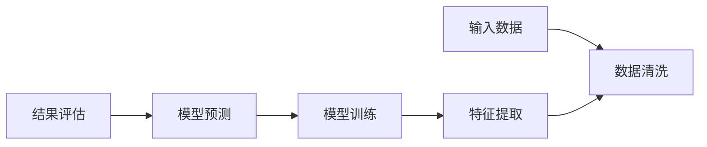

                 


# 设计智能化的企业信用评级模型性能监控与预警系统

## 关键词：企业信用评级，智能化模型，性能监控，预警系统，机器学习，算法实现

## 摘要：  
本文将详细探讨如何设计一个智能化的企业信用评级模型，并建立一个高效的性能监控与预警系统。通过分析信用评级的核心问题，结合现代机器学习算法和大数据技术，提出了一种创新的解决方案。本文不仅介绍了模型的设计与实现，还详细阐述了系统架构与监控预警机制，最后通过实际案例展示了系统的应用效果。

---

# 第一部分: 背景介绍与核心概念

## 第1章: 企业信用评级模型与预警系统概述

### 1.1 企业信用评级的背景与问题背景  
企业信用评级是衡量企业信用状况的重要工具，广泛应用于银行、投资机构和其他金融机构的风险评估。传统的信用评级方法依赖于财务数据和人工经验，存在效率低、主观性强、难以量化的问题。随着人工智能和大数据技术的快速发展，智能化信用评级模型成为解决这些问题的关键。智能化模型能够快速处理海量数据，提高评级的准确性和客观性。

**表1-1：传统信用评级与智能化信用评级的对比**

| 对比维度         | 传统信用评级                | 智能化信用评级               |
|------------------|-----------------------------|------------------------------|
| 数据来源         | 有限的财务数据              | 多源化数据（财务、市场、行为） |
| 模型复杂度       | 简单，依赖人工经验            | 复杂，基于机器学习算法        |
| 处理效率         | 低效，依赖人工分析            | 高效，自动化处理              |
| 精度             | 可能存在偏差，主观性较高      | 更高，基于数据驱动            |

### 1.2 智能化信用评级模型的定义与特点  
智能化信用评级模型是一种基于机器学习和大数据技术的自动化评级系统。其核心特点包括：  
1. **数据驱动**：利用企业财务数据、市场数据、行业趋势等多源数据进行分析。  
2. **自动化**：从数据输入到评级结果输出，整个过程高度自动化。  
3. **实时性**：能够实时更新数据，快速反映企业的信用状况变化。  
4. **可解释性**：模型需要提供可解释的结果，以便用户理解和信任。  

### 1.3 企业信用评级模型的边界与外延  
- **输入数据范围**：包括企业财务报表数据（如收入、利润、负债等）、市场数据（如行业指数、宏观经济指标）、企业行为数据（如合同履行情况）。  
- **输出结果定义**：模型输出企业信用等级（如AAA、AA、A、BBB等）及相应的风险评分。  
- **系统边界**：信用评级模型仅负责计算信用评分，不直接涉及评分后的决策（如贷款审批）。  
- **外延扩展**：模型可以与其他系统（如风险管理系统）集成，提供更全面的信用评估服务。  

### 1.4 核心概念与关系分析  
- **核心概念**：企业、信用评级、模型算法、数据输入、数据输出。  
- **实体关系图（ER图）**：展示各实体之间的关系。  
  ```mermaid
  graph LR
  A[企业] --> B[信用评级]
  C[财务数据] --> B
  D[市场数据] --> B
  E[模型算法] --> B
  ```

### 1.5 本章小结  
本章介绍了企业信用评级的背景、智能化信用评级模型的定义与特点，以及系统的核心概念和关系。智能化信用评级模型通过数据驱动和自动化处理，能够显著提高评级的效率和准确性。

---

# 第二部分: 智能化信用评级模型的算法原理

## 第2章: 信用评级模型的设计与实现

### 2.1 模型设计的核心原理  
智能化信用评级模型的设计基于以下核心步骤：  
1. **数据预处理**：清洗数据，处理缺失值和异常值。  
2. **特征提取**：从多源数据中提取有意义的特征（如财务比率、市场趋势）。  
3. **模型选择**：根据数据特点选择合适的机器学习算法（如随机森林、支持向量机）。  
4. **模型训练**：使用训练数据训练模型，并验证模型的准确性。  
5. **模型优化**：调整模型参数，提高预测精度。  

### 2.2 基于机器学习的信用评级算法  
#### 2.2.1 算法原理概述  
随机森林是一种基于树的集成学习算法，通过构建多个决策树并进行投票来提高模型的准确性和鲁棒性。  

#### 2.2.2 算法流程图  


#### 2.2.3 Python代码实现  
```python
import pandas as pd
from sklearn.ensemble import RandomForestClassifier
from sklearn.metrics import accuracy_score

# 数据加载与预处理
data = pd.read_csv('credit_data.csv')
X = data.drop('credit_rating', axis=1)
y = data['credit_rating']

# 特征选择与模型训练
model = RandomForestClassifier(n_estimators=100, random_state=42)
model.fit(X, y)

# 模型预测与评估
predicted = model.predict(X)
accuracy = accuracy_score(y, predicted)
print(f'Accuracy: {accuracy}')
```

### 2.3 算法实现的数学模型  
#### 2.3.1 随机森林模型  
随机森林通过构建多个决策树，并对结果进行投票来提高模型的准确性。其核心公式为：  
$$ y_{\text{预测}} = \text{多数投票}(\{y_i\}_{i=1}^{n}) $$  

#### 2.3.2 支持向量机模型  
支持向量机的目标是找到一个超平面，使得正负样本的分类间隔最大化。其数学公式为：  
$$ \text{最大化} \quad \frac{1}{\|\omega\|^2} $$  

---

# 第三部分: 系统分析与架构设计

## 第3章: 系统架构与功能设计

### 3.1 项目场景介绍  
企业信用评级模型性能监控与预警系统的应用场景包括银行贷款审批、企业债券发行、供应链金融等。系统需要实时监控模型的性能，并根据预设阈值发出预警信号。  

### 3.2 系统功能设计  
- **数据采集模块**：从多种数据源（如数据库、API接口）获取企业数据。  
- **模型计算模块**：执行信用评级模型的计算，并输出评级结果。  
- **性能监控模块**：实时监控模型的运行状态和预测精度。  
- **预警模块**：根据预设规则，当模型性能下降时发出预警。  

### 3.3 系统架构设计  


### 3.4 系统接口设计  
- **数据接口**：与企业数据库和API接口对接，获取实时数据。  
- **预警接口**：与短信系统或邮件系统对接，发送预警通知。  

### 3.5 系统交互设计  


---

## 第四部分: 项目实战

### 4.1 环境安装与配置  
- 安装Python和相关库（如Pandas、Scikit-learn、Flask）。  
- 数据库配置（如MySQL或MongoDB）。  

### 4.2 系统核心代码实现  
```python
from flask import Flask, request, jsonify
import joblib
import pandas as pd

app = Flask(__name__)
model = joblib.load('credit_rating_model.pkl')

@app.route('/predict', methods=['POST'])
def predict():
    data = request.json
    df = pd.DataFrame([data])
    prediction = model.predict(df)
    return jsonify({'credit_rating': str(prediction[0])})

if __name__ == '__main__':
    app.run(debug=True)
```

### 4.3 案例分析与效果评估  
通过实际案例分析，验证系统的性能监控与预警功能。例如，当某企业的信用评分突然下降，系统会触发预警，并通知相关机构进行风险评估。

---

## 第五部分: 最佳实践与总结

### 5.1 最佳实践  
- **数据质量**：确保数据来源的多样性和准确性。  
- **模型调优**：定期更新模型，适应市场变化。  
- **预警机制**：设置合理的预警阈值，避免过度预警或漏报。  

### 5.2 小结  
智能化企业信用评级模型性能监控与预警系统通过结合机器学习和大数据技术，显著提高了信用评级的效率和准确性。系统不仅能够实时监控模型性能，还能通过预警机制帮助企业及时应对信用风险。

### 5.3 注意事项  
- 模型需要定期更新，以适应市场变化。  
- 预警阈值的设置需要根据具体业务需求进行调整。  

### 5.4 拓展阅读  
- 《机器学习实战》  
- 《大数据技术与应用》  
- 《信用风险评估方法论》  

---

以上是《设计智能化的企业信用评级模型性能监控与预警系统》的完整目录大纲与文章内容。

