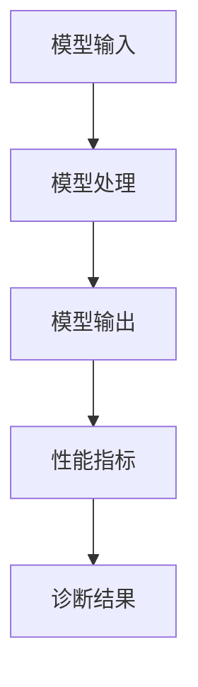
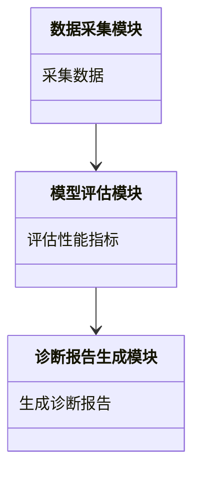
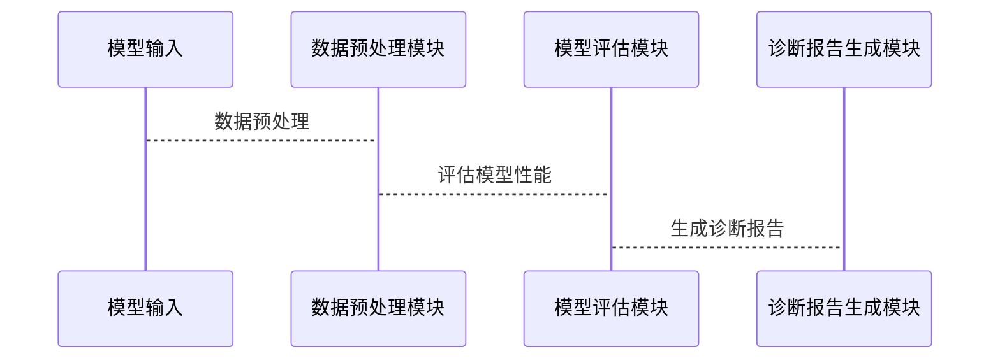

                 


# 设计智能化的企业信用评级模型性能诊断系统

## 关键词：企业信用评级、模型性能诊断、人工智能、系统架构、算法原理、系统设计、项目实战

## 摘要

设计智能化的企业信用评级模型性能诊断系统，旨在解决现有信用评级模型在实际应用中的性能问题。通过引入先进的算法和系统架构设计，该系统能够自动诊断模型性能，识别潜在问题，并提供优化建议，从而提升信用评级的准确性和可靠性。本文详细探讨了系统设计的核心概念、算法原理、系统架构，并通过项目实战展示了系统的实现过程。

---

## 第一部分：背景介绍

### 第1章：企业信用评级模型性能诊断的背景

#### 1.1 问题背景

企业信用评级是评估企业信用状况的重要工具，广泛应用于银行、投资机构等领域。然而，现有的信用评级模型在实际应用中常常面临性能不稳定的问题，例如数据质量差、模型过拟合、特征选择不当等。这些问题可能导致评级结果的偏差，影响决策的准确性。

#### 1.2 问题描述

信用评级模型的性能诊断涉及多个方面，包括模型的准确率、召回率、F1值等指标。然而，现有诊断方法通常依赖人工分析，效率低下且难以覆盖所有潜在问题。此外，模型的复杂性和数据的动态变化进一步增加了诊断的难度。

#### 1.3 问题解决

引入智能化的性能诊断系统，可以自动分析模型的表现，识别异常情况，并提供优化建议。通过结合机器学习和大数据分析技术，该系统能够实时监控模型性能，确保评级结果的准确性。

#### 1.4 边界与外延

该系统主要关注信用评级模型的性能诊断，不涉及模型训练和部署的具体细节。系统的边界包括数据输入、模型评估、诊断报告生成等环节。系统的外延则涉及数据来源、用户界面设计等外部因素。

#### 1.5 核心概念与核心要素

- **核心概念**：模型性能诊断是指通过分析模型的输出结果，评估其在实际应用中的表现。
- **核心要素**：数据输入、模型评估指标、诊断算法、优化建议。

---

## 第二部分：核心概念与联系

### 第2章：模型性能诊断的核心概念

#### 2.1 模型性能诊断的原理

模型性能诊断通过分析模型的输出结果，评估其在实际应用中的表现。具体步骤包括数据预处理、模型评估、异常检测和优化建议。

#### 2.2 模型性能特征对比

以下是常见模型性能指标的对比：

| 指标名称   | 定义                                                                 | 计算公式                                  |
|------------|----------------------------------------------------------------------|-----------------------------------------|
| 准确率     | 正确预测的样本数占总样本数的比例                                 | $\text{准确率} = \frac{\text{正确预测数}}{\text{总样本数}}$ |
| 召回率     | 正确预测的正类样本数占实际正类样本数的比例                         | $\text{召回率} = \frac{\text{TP}}{\text{TP}+\text{FN}}$        |
| F1值       | 准确率和召回率的调和平均数                                       | $\text{F1} = 2 \cdot \frac{\text{准确率} \cdot \text{召回率}}{\text{准确率} + \text{召回率}}$ |

（以下为Mermaid图）



---

## 第三部分：算法原理讲解

### 第3章：模型性能诊断的算法原理

#### 3.1 数据预处理

数据预处理是模型诊断的基础，包括数据清洗、特征选择和标准化。

```python
def preprocess_data(data):
    # 数据清洗
    data = data.dropna()
    # 特征选择
    selected_features = ['feature1', 'feature2']
    data = data[selected_features]
    # 标准化
    data = (data - data.mean()) / data.std()
    return data
```

#### 3.2 模型评估指标

模型评估指标用于衡量模型的性能，包括准确率、召回率、F1值等。

#### 3.3 异常检测

异常检测算法用于识别模型输出中的异常情况。

```python
def detect_anomalies(predictions, labels):
    # 计算异常分数
    anomaly_score = []
    for i in range(len(predictions)):
        if abs(predictions[i] - labels[i]) > threshold:
            anomaly_score.append(1)
        else:
            anomaly_score.append(0)
    return anomaly_score
```

#### 3.4 优化建议

根据诊断结果，系统会自动生成优化建议，例如调整模型参数或更换算法。

---

## 第四部分：数学模型和公式

### 第4章：模型性能诊断的数学模型

#### 4.1 准确率公式

$$\text{准确率} = \frac{\text{正确预测数}}{\text{总样本数}}$$

#### 4.2 召回率公式

$$\text{召回率} = \frac{\text{TP}}{\text{TP}+\text{FN}}$$

#### 4.3 F1值公式

$$\text{F1} = 2 \cdot \frac{\text{准确率} \cdot \text{召回率}}{\text{准确率} + \text{召回率}}$$

---

## 第五部分：系统分析与架构设计

### 第5章：系统分析与架构设计

#### 5.1 问题场景介绍

系统需要实时监控信用评级模型的性能，及时发现并解决问题。

#### 5.2 系统功能设计

- 数据采集模块：负责采集信用评级数据。
- 模型评估模块：评估模型的性能指标。
- 诊断报告生成模块：生成诊断报告并提供优化建议。

（以下为Mermaid图）



#### 5.3 系统架构设计

系统架构采用分层设计，包括数据层、业务逻辑层和用户界面层。

（以下为Mermaid图）


#### 5.4 接口设计和交互流程图

（以下为Mermaid图）



---

## 第六部分：项目实战

### 第6章：项目实战

#### 6.1 环境安装

安装必要的Python库，例如numpy、pandas、scikit-learn等。

```bash
pip install numpy pandas scikit-learn
```

#### 6.2 核心代码实现

```python
def diagnose_model(model, X_test, y_test):
    # 预测结果
    y_pred = model.predict(X_test)
    # 计算准确率
    accuracy = accuracy_score(y_test, y_pred)
    # 计算召回率
    recall = recall_score(y_test, y_pred)
    # 计算F1值
    f1 = f1_score(y_test, y_pred)
    return accuracy, recall, f1
```

#### 6.3 代码应用解读

代码实现模型性能诊断的核心功能，包括预测、评估指标计算和异常检测。

#### 6.4 实际案例分析

通过实际案例分析，展示系统在诊断模型性能方面的应用。

#### 6.5 项目小结

总结项目实现的关键点和经验教训。

---

## 第七部分：最佳实践

### 第7章：最佳实践

#### 7.1 经验总结

在项目中积累的经验和教训，例如数据预处理的重要性、模型选择的策略等。

#### 7.2 小结

总结全文，强调智能化企业信用评级模型性能诊断系统的重要性和实际应用价值。

#### 7.3 注意事项

提醒读者在实际应用中需要注意的事项，例如数据隐私保护、模型更新频率等。

#### 7.4 拓展阅读

推荐相关的书籍和资源，供读者深入学习。

---

## 结语

设计智能化的企业信用评级模型性能诊断系统，不仅能够提升模型的性能，还能为企业决策提供更准确的支持。通过本文的详细讲解，读者可以掌握系统设计的核心概念和实现方法，为实际应用提供有力的技术支持。

