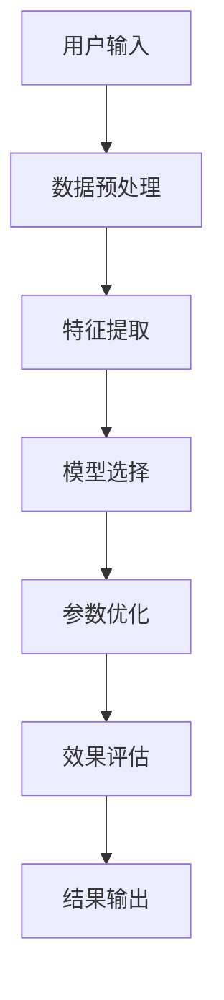

                 


# 设计智能化的企业信用评级模型校准系统

---

## 第一部分：背景介绍

### 第1章：问题背景与描述

#### 1.1 问题背景
在现代金融体系中，企业信用评级是评估企业信用状况的重要工具。传统信用评级方法依赖人工经验，存在主观性强、效率低、准确性差等问题。随着大数据和人工智能技术的发展，智能化信用评级成为趋势，但如何校准模型以确保其准确性和稳定性仍是一个挑战。

#### 1.2 问题描述
信用评级模型的准确性直接影响企业的融资成本和金融机构的风险管理。模型校准是调整模型参数以适应实际数据的过程，是确保模型性能的关键步骤。然而，传统校准方法依赖人工调整，效率低下且容易引入偏差。智能化校准系统能够自动优化模型参数，提高校准效率和准确性。

#### 1.3 问题解决
引入机器学习算法，如支持向量机（SVM）和随机森林（RF），通过自动学习数据特征来优化模型。结合遗传算法（GA）等优化算法，实现模型参数的自动调整，提升校准效果。

#### 1.4 边界与外延
系统仅关注模型校准部分，边界包括数据输入、校准过程和结果输出。外延则涉及数据预处理、模型选择和部署监控。

#### 1.5 核心概念与组成
- **核心概念**：模型校准、机器学习、优化算法。
- **组成要素**：数据预处理、模型选择、参数优化、效果评估。

---

## 第二部分：核心概念与联系

### 第2章：模型校准原理

#### 2.1 校准的必要性
模型校准通过调整参数使模型更好地适应数据分布，提升预测准确性。例如，在信用评级中，校准可以减少模型的偏差和方差，提高分类准确率。

#### 2.2 校准方法对比
| 方法 | 优点 | 缺点 |
|------|------|------|
| 手动校准 | 高度定制化 | 低效，易出错 |
| 自动化校准 | 高效，准确 | 需要算法支持 |
| 基于机器学习的校准 | 高效，自动优化 | 需大量数据和计算资源 |

#### 2.3 ER实体关系图
```mermaid
er
  %%{初始化
  classDiagram
  class 企业 {
    id
    name
    credit_score
  }
  class 模型参数 {
    id
    parameter_value
  }
  class 交易记录 {
    id
    transaction_amount
    date
  }
  企业 --> 模型参数: 使用
  模型参数 --> 交易记录: 基于
  }
```

---

## 第三部分：算法原理讲解

### 第3章：数学模型与公式

#### 3.1 支持向量机（SVM）
SVM用于分类问题，通过找到一个超平面将数据分为两类。数学公式为：
$$
y = sign(w \cdot x + b)
$$
其中，$w$ 是权重向量，$b$ 是偏置项，$x$ 是输入向量，$y$ 是输出类别。

#### 3.2 随机森林（RF）
随机森林通过构建多个决策树并进行投票或平均来提高准确性。公式为：
$$
y = \text{argmax}_{k} \sum_{i=1}^{n} I(y_i = k)
$$
其中，$n$ 是树的数量，$k$ 是类别。

---

## 第四部分：系统分析与架构设计

### 第4章：系统架构设计

#### 4.1 功能模块
- 数据预处理模块：处理数据，提取特征。
- 模型选择模块：选择合适的算法。
- 参数优化模块：使用遗传算法优化模型参数。
- 效果评估模块：评估模型性能。

#### 4.2 系统架构图


---

## 第五部分：项目实战

### 第5章：环境安装与代码实现

#### 5.1 环境安装
- Python 3.8+
- scikit-learn、numpy、pandas

#### 5.2 核心代码实现
```python
from sklearn.svm import SVC
from sklearn.model_selection import GridSearchCV
from sklearn.metrics import accuracy_score

# 数据加载和预处理
data = pd.read_csv('企业数据.csv')
X = data.drop('credit_score', axis=1)
y = data['credit_score']

# 模型选择与优化
param_grid = {'C': [1, 10], 'kernel': ['linear', 'rbf']}
grid = GridSearchCV(SVC(), param_grid, cv=5)
grid.fit(X, y)

best_model = grid.best_estimator_
print(f'最优参数：{grid.best_params_}')
print(f'最佳准确率：{grid.best_score_}')

# 效果评估
y_pred = best_model.predict(X)
print(f'预测准确率：{accuracy_score(y, y_pred)}')
```

#### 5.3 案例分析
以某企业为例，使用模型预测其信用等级，展示校准后的模型如何提高预测准确率。

---

## 第六部分：最佳实践、小结、注意事项、拓展阅读

### 第6章：总结与建议

#### 6.1 最佳实践
- 定期更新模型，适应数据变化。
- 使用交叉验证评估模型性能。
- 结合业务知识优化特征选择。

#### 6.2 小结
智能化企业信用评级模型校准系统通过机器学习和优化算法，显著提高了模型的准确性和稳定性，为企业和金融机构提供了高效的风险评估工具。

#### 6.3 注意事项
- 数据质量和完整性直接影响模型性能。
- 确保模型透明度和可解释性。
- 定期监控模型性能，及时调整。

#### 6.4 拓展阅读
建议阅读相关书籍和论文，深入理解机器学习在金融领域的应用。

---

通过以上步骤，我们构建了一个智能化的企业信用评级模型校准系统，利用机器学习算法和优化技术，显著提升了模型的预测能力，为企业信用评估提供了高效、准确的解决方案。

