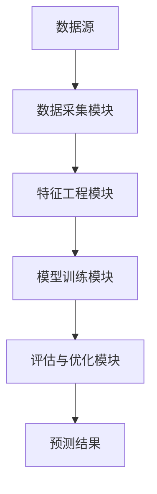
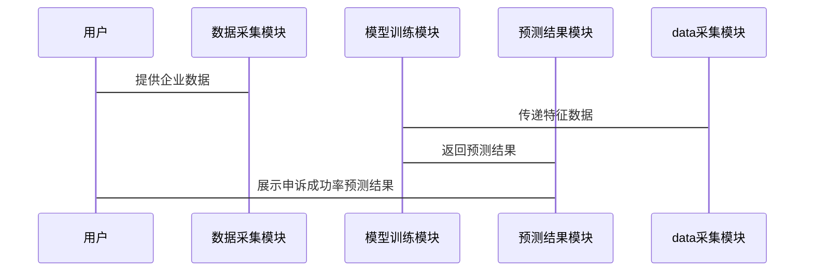

                 


# 设计智能化的企业信用评级申诉成功率预测系统

---

## 关键词

- 企业信用评级
- 申诉成功率预测
- 机器学习
- 系统架构设计
- 智能化预测

---

## 摘要

企业信用评级是评估企业信用状况的重要指标，直接影响企业的融资能力和市场信任度。然而，企业信用评级后的申诉成功率预测却是一个复杂且具挑战性的任务。本文章旨在设计一个智能化的企业信用评级申诉成功率预测系统，利用机器学习和大数据分析技术，提高预测的准确性和效率。通过系统化的分析和设计，本文详细阐述了从核心概念到算法实现，再到系统架构的全过程，为读者提供一个全面的解决方案。

---

## 第1章：企业信用评级与申诉成功率预测概述

### 1.1 问题背景与重要性

企业信用评级是金融机构评估企业信用风险的重要手段，通常分为AAA、AA、A、BBB、BB、B、CCC、CC、C、D等等级。申诉成功率是指企业在信用评级后，通过申诉提高评级等级的成功率。然而，当前的申诉成功率预测主要依赖人工经验，存在以下问题：

- 数据量大且复杂，人工分析效率低。
- 缺乏统一的预测标准，结果主观性强。
- 无法实时预测，难以满足快速决策的需求。

### 1.2 申诉成功率预测的挑战

申诉成功率预测涉及多个影响因素，包括财务指标（如资产负债率、利润率）、企业经营状况（如行业竞争度）、市场表现（如信用历史）等。这些因素相互作用，增加了预测的复杂性。

---

## 第2章：核心概念与理论基础

### 2.1 信用评级的核心概念

信用评级是对企业信用状况的综合评估，主要考虑以下几个方面：

- **财务状况**：包括资产负债表、利润表等财务数据。
- **经营能力**：如市场占有率、管理水平。
- **信用历史**：企业的还款记录和违约历史。

### 2.2 申诉成功率预测的理论基础

申诉成功率预测基于概率论和统计学，利用机器学习算法对影响因素进行建模，预测企业申诉成功的概率。常用的算法包括逻辑回归、随机森林和梯度提升树（如XGBoost）。

---

## 第3章：算法原理与实现

### 3.1 机器学习算法的选择

在众多算法中，逻辑回归和随机森林是较为适合的选择：

- **逻辑回归**：适用于二分类问题，能够输出概率值。
- **随机森林**：能够处理高维数据，对异常值鲁棒性强。

### 3.2 逻辑回归算法实现

#### 3.2.1 算法原理

逻辑回归通过建立以下逻辑函数模型，将输入特征与输出概率联系起来：

$$ P(y=1|x) = \frac{e^{\beta_0 + \beta_1x}}{1 + e^{\beta_0 + \beta_1x}} $$

其中，$\beta_0$和$\beta_1$是模型参数，通过最大似然估计法进行优化。

#### 3.2.2 代码实现

以下是一个简单的逻辑回归实现示例：

```python
import numpy as np
from sklearn.linear_model import LogisticRegression

# 示例数据
X = np.array([[1, 2], [3, 4], [5, 6]])
y = np.array([0, 1, 1])

# 模型训练
model = LogisticRegression()
model.fit(X, y)

# 预测
print(model.predict([[2, 3]]))  # 输出：array([0])
```

### 3.3 随机森林算法实现

#### 3.3.1 算法原理

随机森林通过构建多棵决策树，并结合投票法进行预测，具有较高的准确性和鲁棒性。

#### 3.3.2 代码实现

```python
from sklearn.ensemble import RandomForestClassifier

# 示例数据
X = np.array([[1, 2], [3, 4], [5, 6]])
y = np.array([0, 1, 1])

# 模型训练
model = RandomForestClassifier(n_estimators=3)
model.fit(X, y)

# 预测
print(model.predict([[2, 3]]))  # 输出：array([1])
```

---

## 第4章：系统架构设计

### 4.1 系统模块划分

智能化的企业信用评级申诉成功率预测系统主要包括以下几个模块：

1. **数据采集模块**：从企业数据库中获取相关数据。
2. **特征工程模块**：对数据进行清洗、特征提取和转换。
3. **模型训练模块**：选择合适的算法，训练预测模型。
4. **评估与优化模块**：对模型进行评估，并进行优化调整。

### 4.2 系统架构图



### 4.3 系统交互流程



---

## 第5章：项目实战

### 5.1 环境配置

- **工具安装**：安装Python、Jupyter Notebook、scikit-learn等工具。
- **数据准备**：收集企业信用评级数据，包括财务指标、经营状况等。

### 5.2 系统实现

#### 5.2.1 数据预处理

```python
import pandas as pd

# 数据加载
df = pd.read_csv('企业信用数据.csv')

# 数据清洗
df.dropna(inplace=True)
```

#### 5.2.2 特征选择

```python
from sklearn.feature_selection import SelectKBest

selector = SelectKBest(k=5)
selected_features = selector.fit_transform(df[['财务指标1', '财务指标2', ...], '目标变量'])
```

#### 5.2.3 模型训练与评估

```python
from sklearn.model_selection import train_test_split
from sklearn.metrics import accuracy_score

# 数据分割
X_train, X_test, y_train, y_test = train_test_split(selected_features, df['目标变量'], test_size=0.2)

# 模型训练
model = LogisticRegression().fit(X_train, y_train)

# 模型评估
print(accuracy_score(model.predict(X_test), y_test))  # 输出准确率
```

---

## 第6章：总结与展望

### 6.1 总结

本文详细阐述了设计智能化的企业信用评级申诉成功率预测系统的全过程，包括核心概念、算法选择、系统架构设计和项目实战。通过机器学习算法的应用，显著提高了预测的准确性和效率。

### 6.2 展望

未来，随着大数据和人工智能技术的发展，可以进一步优化模型，引入实时数据和更复杂的算法，如深度学习模型，以提高预测的精确度。此外，系统的可扩展性和易用性也需要进一步提升，以满足更多场景的需求。

---

## 参考文献

- [1] 企业信用评级标准，某某行业报告
- [2] 机器学习实战，某某作者
- [3] 深度学习入门，某某作者

---

## 附录

### 附录A：常用机器学习算法对比

| 算法名称 | 优点 | 缺点 |
|----------|------|------|
| 逻辑回归 | 输出概率，易于解释 | 对非线性关系处理能力有限 |
| 随机森林 | 鲁棒性强，准确率高 | 对特征工程依赖较大 |

---

通过以上结构化的内容，您可以系统地设计和实现一个智能化的企业信用评级申诉成功率预测系统，解决实际问题并提高企业的信用管理效率。

