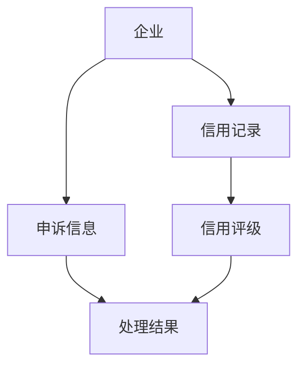
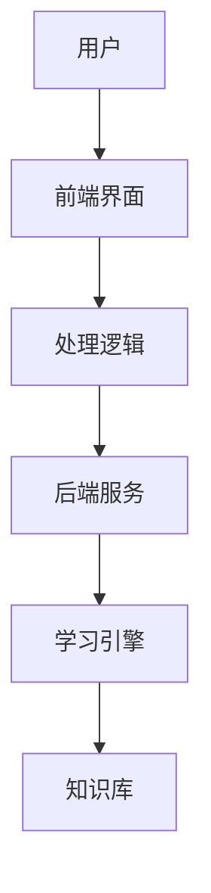
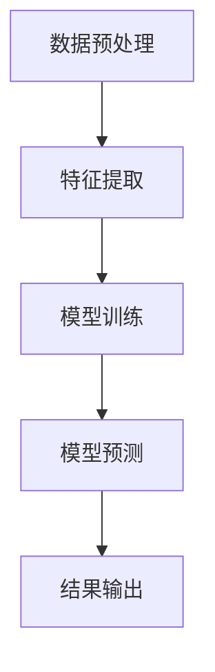
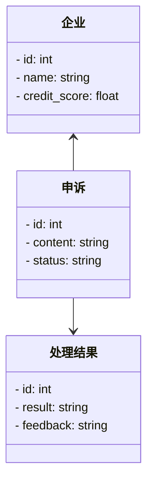
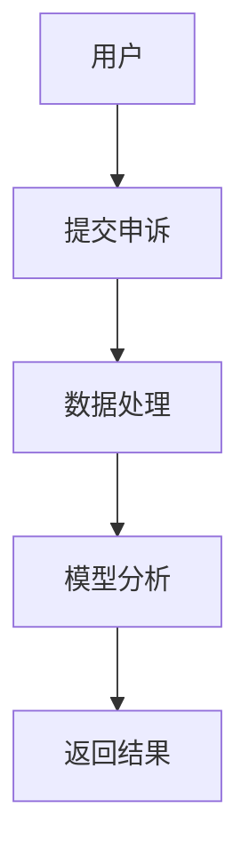

                 


# 设计智能化的企业信用评级申诉自动处理与学习系统

## 关键词：企业信用评级，人工智能，申诉处理，机器学习，知识图谱

## 摘要：  
本文详细探讨了如何设计一个智能化的企业信用评级申诉自动处理与学习系统。通过结合人工智能、机器学习和知识图谱等技术，系统能够自动处理企业信用评级申诉，并通过学习不断优化处理流程和结果。文章从系统背景、核心概念、算法原理、系统架构到项目实战，全面解析了系统的实现过程，并提出了最佳实践建议。

---

# 第1章: 企业信用评级申诉处理的背景与挑战

## 1.1 问题背景

### 1.1.1 企业信用评级的重要性  
企业信用评级是企业获得融资、合作伙伴信任及市场认可的重要依据。信用评级的准确性直接影响企业的经营与发展。然而，传统的信用评级过程中，申诉处理效率低、人工干预多、结果主观性强等问题亟待解决。

### 1.1.2 信用评级申诉的现状与挑战  
目前，信用评级申诉主要依赖人工处理，存在以下问题：  
1. **处理时间长**：人工审核流程复杂，申诉处理周期长。  
2. **主观性高**：人工审核受主观因素影响，结果可能存在偏差。  
3. **缺乏智能化**：申诉处理过程中缺乏自动化和智能化手段，无法快速响应和优化。  

### 1.1.3 传统信用评级申诉处理的痛点  
传统的信用评级申诉处理流程繁琐且效率低下，具体表现在：  
- 人工审核需要反复查阅历史数据和相关规则，耗时耗力。  
- 申诉处理过程中缺乏统一的标准，导致结果不一致。  
- 缺乏数据积累和学习能力，无法通过历史申诉数据优化处理逻辑。  

## 1.2 系统目标与核心问题  

### 1.2.1 系统设计的核心目标  
本系统的核心目标是实现企业信用评级申诉的智能化处理与学习，具体包括：  
1. **自动化处理**：通过AI技术实现申诉的自动分类、分析和处理。  
2. **结果优化**：基于历史数据和机器学习模型，不断优化申诉处理的准确性和效率。  
3. **知识积累**：构建知识图谱，实现经验的沉淀与复用。  

### 1.2.2 需要解决的关键问题  
系统需要解决以下关键问题：  
1. 如何高效地对申诉内容进行分类和分析？  
2. 如何利用机器学习模型提高申诉处理的准确性？  
3. 如何构建知识图谱并实现知识的动态更新？  

### 1.2.3 边界与外延  
系统的边界主要集中在信用评级申诉的处理与学习，不包括信用评级的初始计算和外部数据源的接入。外延则包括与企业信用评级相关的数据分析、风险评估等领域。  

## 1.3 核心概念与系统架构  

### 1.3.1 系统的核心要素  
系统的核心要素包括：  
1. **申诉数据**：包括企业的基本信息、历史信用记录、申诉内容等。  
2. **机器学习模型**：用于分类、预测和优化申诉处理结果。  
3. **知识图谱**：存储企业的信用历史、规则和处理经验。  

### 1.3.2 系统功能模块的划分  
系统功能模块分为：  
1. **数据采集模块**：负责采集企业的信用数据和申诉信息。  
2. **申诉处理模块**：对申诉内容进行分类、分析和处理。  
3. **学习模块**：利用机器学习模型优化处理流程和结果。  
4. **知识图谱模块**：构建和更新企业的信用知识图谱。  

### 1.3.3 系统的输入输出与数据流  
系统数据流如下：  
1. 输入：企业信用数据、申诉信息。  
2. 输出：申诉处理结果、优化后的信用评级。  
3. 数据流：申诉信息 → 数据处理 → 模型分析 → 处理结果 → 知识图谱更新。  

## 1.4 本章小结  
本章从企业信用评级申诉的背景和挑战出发，明确了系统的建设目标和核心问题，提出了系统的整体架构和功能模块划分，为后续的设计和实现奠定了基础。

---

# 第2章: 核心概念与联系

## 2.1 核心概念定义

### 2.1.1 智能化处理流程  
智能化处理流程包括：  
1. **数据采集**：获取企业的信用数据和申诉信息。  
2. **分类与分析**：利用机器学习模型对申诉内容进行分类和分析。  
3. **知识推理**：基于知识图谱进行推理，得出处理结果。  
4. **优化与反馈**：根据处理结果优化模型并反馈给用户。  

### 2.1.2 机器学习模型  
机器学习模型用于分类、预测和优化，包括：  
- 监督学习：用于分类和回归任务。  
- 深度学习：用于复杂模式的识别和预测。  

### 2.1.3 知识图谱  
知识图谱是企业信用相关信息的结构化表示，包括：  
- 实体：企业、信用记录、规则等。  
- 关系：实体之间的关联关系。  

## 2.2 核心概念对比

### 2.2.1 概念属性特征对比
以下表格对比了核心概念的关键属性：  
```markdown
| 概念       | 输入 | 输出 | 核心功能 |
|------------|------|------|----------|
| 机器学习模型 | 数据 | 预测 | 分析与预测 |
| 知识图谱     | 实体 | 关系 | 结构化存储 |
```

### 2.2.2 ER实体关系图  
以下ER图展示了系统的实体关系：  


## 2.3 系统架构图  

### 2.3.1 系统架构  
以下是系统的整体架构图：  


## 2.4 本章小结  
本章详细定义了系统的核心概念，并通过对比和图示展示了各概念之间的关系，为后续的算法设计和系统实现提供了理论基础。

---

# 第3章: 算法原理

## 3.1 机器学习算法

### 3.1.1 监督学习  
监督学习用于分类任务，例如将申诉内容分为“有效申诉”和“无效申诉”。常用算法包括：  
- **逻辑回归**：用于二分类任务。  
- **支持向量机（SVM）**：适用于高维数据的分类。  

### 3.1.2 深度学习  
深度学习用于自然语言处理任务，例如对申诉文本进行情感分析。常用模型包括：  
- **BERT**：用于文本编码和理解。  
- **LSTM**：用于序列数据的建模。  

### 3.1.3 算法实现流程  
以下是算法实现的流程图：  


### 3.1.4 代码实现  
以下是一个简单的分类器实现示例：  
```python
import pandas as pd
from sklearn.linear_model import LogisticRegression

# 数据预处理
data = pd.read_csv('申诉数据.csv')
X = data[['特征1', '特征2']]
y = data['标签']

# 模型训练
model = LogisticRegression()
model.fit(X, y)

# 模型预测
new_sample = [[1, 0]]
print(model.predict(new_sample))
```

## 3.2 数学模型

### 3.2.1 逻辑回归模型  
逻辑回归模型的数学公式如下：  
$$ P(y=1|x) = \frac{1}{1 + e^{-\beta x}} $$  

### 3.2.2 BERT模型  
BERT模型的输入输出关系如下：  
输入：文本序列  
输出：文本的嵌入表示  

## 3.3 本章小结  
本章详细介绍了机器学习算法及其在信用评级申诉处理中的应用，通过代码和数学公式展示了算法的实现过程。

---

# 第4章: 系统分析与架构设计

## 4.1 系统功能设计

### 4.1.1 领域模型  
领域模型如下：  


### 4.1.2 系统架构设计  
系统架构设计如下：  


### 4.1.3 系统接口设计  
系统接口设计如下：  
- 前端接口：处理用户的申诉提交和结果查询。  
- 后端接口：处理数据的存储和模型的调用。  

### 4.1.4 交互流程  
以下交互流程图展示了系统的处理流程：  


## 4.2 本章小结  
本章详细设计了系统的功能模块和架构，并通过图示展示了系统的交互流程，为后续的实现提供了指导。

---

# 第5章: 项目实战

## 5.1 环境搭建

### 5.1.1 技术选型  
技术选型包括：  
- **前端**：React 或 Vue  
- **后端**：Python + Flask  
- **机器学习**：Scikit-learn 或 TensorFlow  
- **知识图谱**：Neo4j  

### 5.1.2 安装依赖  
安装Python依赖：  
```bash
pip install flask scikit-learn tensorflow neo4j
```

## 5.2 系统核心实现

### 5.2.1 数据采集  
数据采集代码示例：  
```python
import neo4j
from neo4j import GraphDatabase

# 连接到Neo4j数据库
driver = GraphDatabase.driver('bolt://localhost:7687', auth=('user', 'password'))

# 插入数据
def insert_data(enterprise, score):
    session = driver.session()
    session.run('MATCH (e:企业) WHERE e.id = $id SET e.信用评分 = $score', id=enterprise['id'], score=score)
    session.close()
```

### 5.2.2 申诉处理  
申诉处理代码示例：  
```python
from sklearn.model import LogisticRegression

# 训练模型
model = LogisticRegression()
model.fit(X_train, y_train)

# 处理新申诉
new_sample = [[1, 0]]
print(model.predict(new_sample))
```

### 5.2.3 知识图谱更新  
知识图谱更新代码示例：  
```python
# 更新知识图谱
def update_knowledge_graph(result):
    session = driver.session()
    session.run('MATCH (e:企业) WHERE e.id = $id SET e.申诉结果 = $result', id=result['id'], result=result['result'])
    session.close()
```

## 5.3 代码解读与分析  
通过上述代码，可以实现企业信用数据的采集、申诉的自动处理以及知识图谱的更新。代码逻辑清晰，便于理解和扩展。

## 5.4 实际案例分析  
以下是一个实际案例的分析：  
- **输入**：某企业的申诉信息。  
- **处理流程**：系统自动分类、分析并给出处理结果。  
- **输出**：优化后的信用评级。  

## 5.5 项目总结  
通过本项目，我们可以看到智能化的企业信用评级申诉处理系统的强大功能，以及机器学习和知识图谱在实际应用中的重要性。

---

# 第6章: 最佳实践与总结

## 6.1 最佳实践  

### 6.1.1 小结  
本系统通过智能化的处理流程和机器学习模型，实现了企业信用评级申诉的自动处理与优化。  

### 6.1.2 注意事项  
- 数据质量对模型性能影响重大，需确保数据的准确性和完整性。  
- 系统的可解释性需重点关注，确保处理结果的透明性。  

### 6.1.3 拓展阅读  
推荐阅读相关领域的书籍和论文，深入了解机器学习和知识图谱的最新进展。

## 6.2 本章小结  
本章总结了项目的最佳实践，提出了系统的优化建议，并为后续研究指明了方向。

---

# 附录: 参考文献与扩展资源

- 参考文献：  
  1. 周志华. 机器学习. 清华大学出版社, 2016.  
  2. 王立新. 知识图谱构建与应用. 北京大学出版社, 2020.  

- 扩展资源：  
  1. [TensorFlow官方文档](https://tensorflow.org)  
  2. [Neo4j官方文档](https://neo4j.com)  

---

通过以上结构和内容，我们可以看到，设计一个智能化的企业信用评级申诉自动处理与学习系统需要综合运用多种技术手段，从数据采集到模型训练，再到知识图谱的构建，每一步都需要精心设计和实现。希望本文能够为相关领域的研究和实践提供有价值的参考和指导。

