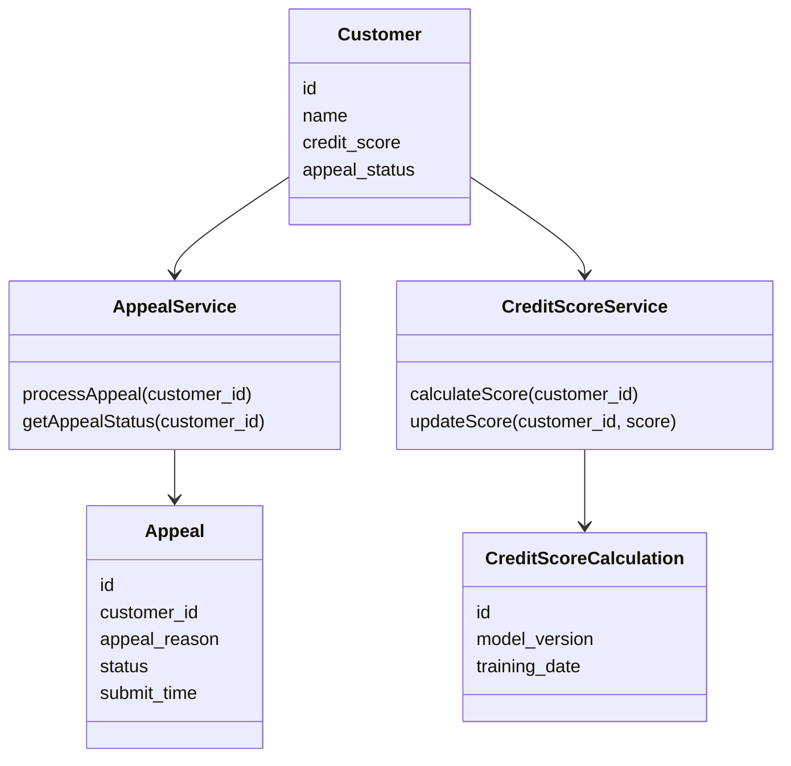

                 


# 设计智能化的企业信用评级申诉自动处理系统

> 关键词：企业信用评级、人工智能、自然语言处理、机器学习、系统架构设计

> 摘要：随着企业信用评级的重要性日益增加，信用申诉的处理也变得愈发复杂。传统的信用申诉处理方式效率低下、容易出错，且难以满足日益增长的业务需求。本文将详细介绍如何设计一个智能化的企业信用评级申诉自动处理系统，通过人工智能和自然语言处理技术，实现自动化、高效、准确的信用申诉处理。我们将从背景与概述、核心概念与系统架构、算法与数学模型、系统设计与实现、项目实战、总结与展望等多个方面进行深入分析。

---

# 第一部分: 企业信用评级申诉自动处理系统背景与概述

## 第1章: 问题背景与系统目标

### 1.1 企业信用评级的重要性
企业信用评级是评估企业信用状况的重要工具，直接关系到企业的融资能力、合作伙伴的选择以及市场信任度。然而，信用评级的申诉处理过程复杂且耗时，传统的人工处理方式存在效率低、易出错的问题。

#### 1.1.1 信用评级的定义与作用
信用评级是通过对企业的财务状况、经营能力、市场表现等多方面进行综合评估，给出信用等级（如AAA、AA、A等）。信用评级的结果直接影响企业的融资成本和市场机会。

#### 1.1.2 企业信用评级的常见问题
- **数据复杂性**：企业信用数据来源多样，包括财务报表、合同、新闻报道等，数据清洗和整合难度大。
- **人工处理低效**：传统的信用申诉处理需要大量人工审核，耗时长，容易出错。
- **信息不透明**：申诉处理过程中缺乏透明度，企业难以及时了解申诉进度和结果。

#### 1.1.3 申诉处理的难点
- 申诉内容涉及多方数据，需要快速准确地提取关键信息。
- 申诉处理需要结合上下文，理解企业的实际情况，避免误判。
- 申诉结果需要符合行业标准，确保公正性和准确性。

### 1.2 系统目标与功能定位
本系统的目标是通过智能化技术实现企业信用评级申诉的自动化处理，提升处理效率和准确性。系统功能包括：

#### 1.2.1 自动化处理的核心目标
- 自动提取申诉相关数据。
- 自动分析数据，评估信用状况。
- 自动生成申诉结果报告。

#### 1.2.2 系统功能的边界与外延
- 系统仅处理信用评级申诉，不涉及其他类型的信用评估。
- 系统支持多种数据来源，包括财务报表、新闻、合同等。
- 系统提供友好的用户界面，方便企业提交申诉和查询结果。

#### 1.2.3 与现有系统的区别与联系
区别于传统的人工处理方式，本系统通过人工智能和自然语言处理技术实现自动化处理，提升效率和准确性。同时，系统能够实时更新信用评估结果，提供更及时的服务。

---

## 第2章: 系统的技术基础与优势

### 2.1 人工智能与自然语言处理
人工智能和自然语言处理技术是系统的核心技术基础，主要用于数据的自动分析和处理。

#### 2.1.1 AI在信用评级中的应用
- **数据清洗**：通过AI技术自动识别和清洗数据，确保数据的准确性和一致性。
- **模式识别**：利用机器学习算法识别信用数据中的模式，发现潜在风险。
- **预测模型**：基于历史数据训练信用评分模型，预测企业的信用状况。

#### 2.1.2 NLP技术在文本处理中的作用
- **文本分类**：将企业提交的申诉文本分类，识别关键信息。
- **实体识别**：从文本中提取公司名称、金额、时间等实体信息。
- **情感分析**：分析文本中隐含的情感倾向，辅助信用评估。

#### 2.1.3 机器学习算法的优势
- **高效性**：机器学习算法能够快速处理大量数据，提高处理效率。
- **准确性**：通过训练模型，系统能够准确识别信用数据中的关键信息。
- **可扩展性**：系统支持多种机器学习算法，可以根据需求灵活调整。

### 2.2 系统架构的技术优势
系统采用微服务架构设计，具备高可用性和扩展性。

#### 2.2.1 微服务架构的特点
- **模块化设计**：系统功能模块化，每个模块独立运行，便于维护和扩展。
- **高可用性**：通过负载均衡和容错设计，确保系统稳定运行。
- **灵活扩展**：可以根据业务需求快速扩展功能模块。

#### 2.2.2 高可用性与扩展性
- **负载均衡**：通过负载均衡技术分配请求，确保系统不会因为单点故障而崩溃。
- **容错设计**：系统模块之间 loosely coupled，单个模块故障不会影响整体系统。

#### 2.2.3 数据安全与隐私保护
- **数据加密**：通过加密技术保护敏感数据，防止数据泄露。
- **访问控制**：采用严格的访问控制策略，确保只有授权用户可以访问数据。

---

# 第二部分: 核心概念与系统架构

## 第3章: 系统核心概念与原理

### 3.1 系统核心概念与原理
系统的核心概念包括数据采集、数据预处理、信用评分计算和申诉处理。

#### 3.1.1 数据采集
- **数据来源**：包括企业财务报表、新闻报道、合同信息等。
- **数据清洗**：通过数据清洗技术去除噪声数据，确保数据质量。

#### 3.1.2 数据预处理
- **特征提取**：从原始数据中提取有用的特征，如财务指标、市场表现等。
- **数据标准化**：将数据标准化，确保不同数据来源的数据具有可比性。

#### 3.1.3 信用评分计算
- **评分模型**：基于机器学习算法训练信用评分模型，评估企业的信用状况。
- **评分调整**：根据申诉内容调整评分，确保评分的准确性。

#### 3.1.4 申诉处理
- **自动审核**：通过自然语言处理技术自动审核申诉内容，生成审核结果。
- **人工复核**：对于复杂申诉，系统会自动分派给人工复核。

### 3.2 核心概念与联系

#### 3.2.1 系统核心模块的ER图
```mermaid
erDiagram
    customer[CUSTOMER] {
        id INTEGER
        name STRING
        credit_score INTEGER
        appeal_status STRING
    }
    appeal[APPEAL] {
        id INTEGER
        customer_id INTEGER
        appeal_reason STRING
        status STRING
        submit_time DATETIME
    }
    credit_score_calculation[CREDIT_SCORE_CALCULATION] {
        id INTEGER
        model_version STRING
        training_date DATETIME
    }
    (
    CUSTOMER
    ) o2m (
    APPEAL
    )
    (
    CUSTOMER
    ) o2m (
    CREDIT_SCORE_CALCULATION
    )
```

#### 3.2.2 系统架构的类图


---

## 第4章: 算法与数学模型

### 4.1 机器学习算法原理
机器学习算法是信用评分的核心技术，主要采用逻辑回归（Logistic Regression）和随机森林（Random Forest）算法。

#### 4.1.1 逻辑回归算法
逻辑回归是一种常用的分类算法，适用于二分类问题。其数学模型如下：

$$ P(y=1|x) = \frac{e^{\beta_0 + \beta_1 x_1 + \cdots + \beta_n x_n}}{1 + e^{\beta_0 + \beta_1 x_1 + \cdots + \beta_n x_n}} $$

其中，$\beta_i$ 是模型的系数，$x_i$ 是输入特征。

#### 4.1.2 随机森林算法
随机森林是一种基于决策树的集成算法，适用于特征较多的分类问题。其核心思想是通过随机采样和特征选择生成多个决策树，并通过投票方式得到最终结果。

### 4.2 信用评分模型
信用评分模型是系统的核心算法，基于企业的财务数据和市场表现数据进行评分。

#### 4.2.1 数据预处理
- **特征选择**：选择对信用评分影响较大的特征，如资产负债率、利润率等。
- **数据标准化**：将特征值标准化，确保不同特征具有相同的量纲。

#### 4.2.2 模型训练
- **训练数据**：使用历史信用数据训练模型，调整模型参数。
- **模型调优**：通过交叉验证优化模型参数，提高模型准确率。

#### 4.2.3 模型评估
- **评估指标**：采用准确率、召回率和F1分数评估模型性能。
- **评估结果**：根据评估结果调整模型参数，优化模型性能。

---

## 第5章: 系统设计与实现

### 5.1 系统功能设计
系统功能包括数据采集、信用评分计算、申诉处理和用户界面。

#### 5.1.1 数据采集
- **数据来源**：包括企业财务报表、新闻报道、合同信息等。
- **数据清洗**：通过数据清洗技术去除噪声数据，确保数据质量。

#### 5.1.2 信用评分计算
- **评分模型**：基于机器学习算法训练信用评分模型，评估企业的信用状况。
- **评分调整**：根据申诉内容调整评分，确保评分的准确性。

#### 5.1.3 申诉处理
- **自动审核**：通过自然语言处理技术自动审核申诉内容，生成审核结果。
- **人工复核**：对于复杂申诉，系统会自动分派给人工复核。

### 5.2 系统架构设计
系统采用微服务架构设计，分为数据采集模块、信用评分计算模块和申诉处理模块。

#### 5.2.1 微服务架构
- **模块划分**：系统分为数据采集模块、信用评分计算模块和申诉处理模块。
- **模块交互**：模块之间通过API接口进行交互，确保系统高效运行。

#### 5.2.2 系统接口设计
- **API接口**：系统提供RESTful API接口，方便模块之间的交互。
- **接口文档**：提供详细的接口文档，方便开发人员理解和使用。

### 5.3 系统交互设计
系统交互设计包括用户提交申诉、系统自动审核和人工复核。

#### 5.3.1 用户提交申诉
- **提交方式**：用户通过网页或API提交申诉信息。
- **信息验证**：系统对提交的申诉信息进行验证，确保信息的完整性。

#### 5.3.2 系统自动审核
- **自动处理**：系统自动审核申诉内容，生成审核结果。
- **结果反馈**：系统将审核结果反馈给用户，确保用户及时了解申诉进度。

#### 5.3.3 人工复核
- **复核流程**：对于复杂申诉，系统会自动分派给人工复核。
- **复核结果**：人工复核完成后，系统将结果反馈给用户。

---

## 第6章: 项目实战

### 6.1 环境配置
- **开发环境**：建议使用Python 3.8及以上版本，安装必要的库如scikit-learn、nltk、flask等。
- **数据准备**：收集企业信用数据，包括财务报表、新闻报道等。

### 6.2 核心代码实现
以下是系统核心代码实现：

#### 6.2.1 数据预处理代码
```python
import pandas as pd
import numpy as np

# 读取数据
data = pd.read_csv('credit_data.csv')

# 删除缺失值
data = data.dropna()

# 标准化数据
from sklearn.preprocessing import StandardScaler

scaler = StandardScaler()
data_scaled = scaler.fit_transform(data)
```

#### 6.2.2 信用评分模型训练代码
```python
from sklearn.linear_model import LogisticRegression
from sklearn.ensemble import RandomForestClassifier
from sklearn.model_selection import train_test_split

# 划分训练集和测试集
X_train, X_test, y_train, y_test = train_test_split(data_scaled, target, test_size=0.2, random_state=42)

# 训练逻辑回归模型
lr_model = LogisticRegression(max_iter=1000).fit(X_train, y_train)

# 训练随机森林模型
rf_model = RandomForestClassifier(n_estimators=100, random_state=42).fit(X_train, y_train)
```

#### 6.2.3 申诉处理代码
```python
from sklearn.metrics import accuracy_score, recall_score, f1_score

# 评估逻辑回归模型
y_pred_lr = lr_model.predict(X_test)
accuracy_lr = accuracy_score(y_test, y_pred_lr)
recall_lr = recall_score(y_test, y_pred_lr)
f1_lr = f1_score(y_test, y_pred_lr)

# 评估随机森林模型
y_pred_rf = rf_model.predict(X_test)
accuracy_rf = accuracy_score(y_test, y_pred_rf)
recall_rf = recall_score(y_test, y_pred_rf)
f1_rf = f1_score(y_test, y_pred_rf)

print(f"Logistic Regression Accuracy: {accuracy_lr}")
print(f"Random Forest Accuracy: {accuracy_rf}")
```

### 6.3 系统测试与优化
- **系统测试**：对系统进行全面测试，确保系统稳定运行。
- **性能优化**：根据测试结果优化系统性能，提升处理效率。

---

## 第7章: 总结与展望

### 7.1 总结
本系统通过智能化技术实现企业信用评级申诉的自动化处理，显著提高了处理效率和准确性。系统采用微服务架构设计，具备高可用性和扩展性，能够满足企业的多样化需求。

### 7.2 未来展望
未来，系统将进一步优化信用评分模型，引入更多先进的机器学习算法，如XGBoost和LightGBM，提升模型的准确性和稳定性。同时，系统将拓展更多的数据来源，如社交媒体数据，进一步增强系统的分析能力。

### 7.3 最佳实践 Tips
- **数据质量**：确保数据的准确性和完整性，是系统运行的基础。
- **模型优化**：定期更新和优化模型，确保系统的准确性和稳定性。
- **系统维护**：定期检查和维护系统，确保系统的高效运行。

---

通过本文的详细分析，我们能够清晰地理解如何设计一个智能化的企业信用评级申诉自动处理系统。希望本文的内容能够为相关领域的技术人员提供有价值的参考和启示。

