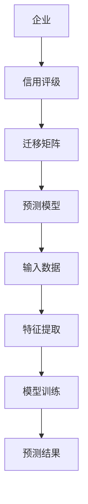
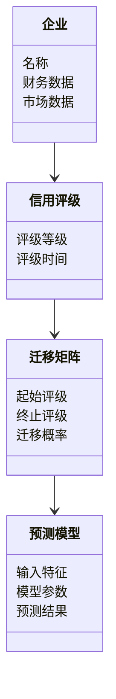
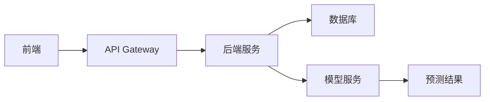
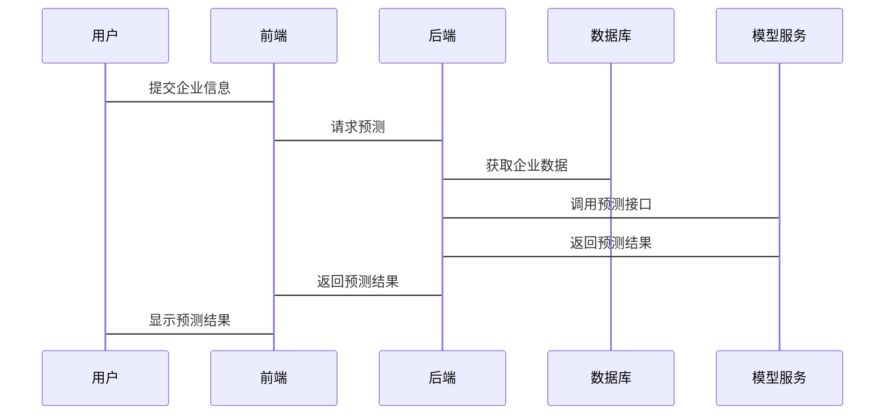

                 


# 设计智能化的企业信用评级迁移矩阵预测模型

> 关键词：企业信用评级，迁移矩阵，预测模型，迁移学习，特征工程，深度学习

> 摘要：本文详细探讨了设计智能化企业信用评级迁移矩阵预测模型的方法。从背景介绍到核心概念，再到算法原理、系统设计、项目实战和总结，全面解析了该模型的设计与实现过程，帮助读者理解如何利用迁移学习和深度学习技术构建高效的信用评级预测系统。

---

## 第1章 企业信用评级迁移矩阵预测模型的背景与概述

### 1.1 问题背景
#### 1.1.1 企业信用评级的重要性
企业信用评级是评估企业信用状况的重要指标，直接影响企业的融资成本和市场信任度。然而，传统的评级方法依赖于人工分析，效率低且容易受到主观因素的影响。

#### 1.1.2 迁移矩阵预测的需求
信用评级的变化往往受到多种因素的影响，如经济波动、行业变化等。通过迁移矩阵预测企业信用评级的变化趋势，可以帮助金融机构提前做出风险控制和投资决策。

#### 1.1.3 当前模型的局限性
传统的方法难以捕捉复杂的市场变化和多维度的特征，导致预测准确率不高。因此，引入智能化的预测模型显得尤为重要。

### 1.2 问题描述
#### 1.2.1 信用评级的基本概念
信用评级是对企业的信用状况进行评估，通常分为多个等级，如AAA、AA、A、BBB、BB、B、CCC、CC、C和D（违约）。每个评级反映了企业的偿债能力和风险水平。

#### 1.2.2 迁移矩阵的定义
迁移矩阵描述了企业在不同评级等级之间的转移概率。例如，从BBB评级转移到BB评级的概率是多少，或者从A评级降级到BBB评级的可能性有多大。

#### 1.2.3 预测模型的目标
构建一个能够预测企业信用评级迁移概率的模型，帮助金融机构优化风险管理和投资策略。

### 1.3 问题解决方法
#### 1.3.1 数据驱动的解决方案
通过收集和分析大量企业的历史数据，包括财务数据、市场数据、行业数据等，提取特征并训练模型。

#### 1.3.2 迁移学习的应用
利用迁移学习技术，将已有的知识迁移到新的任务中，提升模型的泛化能力和预测精度。

#### 1.3.3 矩阵预测的实现路径
通过机器学习算法，如随机森林、支持向量机（SVM）、神经网络等，构建迁移矩阵的预测模型，并进行模型调优和验证。

### 1.4 模型的边界与外延
#### 1.4.1 数据范围的界定
明确数据的来源、范围和格式，例如数据的时间范围、样本数量、特征维度等。

#### 1.4.2 模型适用的场景
模型适用于对具有足够历史数据的企业进行评级迁移预测，但对新兴企业或数据不足的情况可能效果有限。

#### 1.4.3 边界条件的处理
处理数据缺失、异常值等问题，确保模型的输入数据质量。

### 1.5 概念结构与核心要素
#### 1.5.1 核心概念的层次结构
企业信用评级 -> 迁移矩阵 -> 预测模型。

#### 1.5.2 关键要素的定义
- **输入数据**：企业的财务数据、市场数据等。
- **特征提取**：从输入数据中提取有用的特征。
- **模型训练**：利用训练数据训练预测模型。
- **预测结果**：输出企业的信用评级迁移概率。

#### 1.5.3 概念间的相互关系
企业信用评级是基础，迁移矩阵描述了评级的变化，预测模型则是实现迁移矩阵预测的工具。

---

## 第2章 核心概念与联系

### 2.1 核心概念原理
#### 2.1.1 迁移学习的原理
迁移学习是一种机器学习技术，通过将已有的知识迁移到新的任务中，减少新任务的数据需求，提高模型的性能。

#### 2.1.2 矩阵预测的机制
矩阵预测通过分析历史数据，建立企业的评级迁移概率模型，预测未来的评级变化。

#### 2.1.3 综合模型的工作流程
数据预处理 -> 特征提取 -> 模型训练 -> 模型预测。

### 2.2 概念属性特征对比
#### 2.2.1 数据特征对比表
| 特征类型 | 输入数据 | 特征提取 |
|----------|----------|----------|
| 示例 | 财务数据、市场数据 | 主成分分析、LDA等 |

#### 2.2.2 模型参数对比表
| 模型类型 | 参数数量 | 调参复杂度 |
|----------|----------|------------|
| 线性回归 | 少 | 低 |
| 神经网络 | 多 | 高 |

#### 2.2.3 预测结果对比表
| 评级等级 | 预测迁移概率 | 实际迁移概率 |
|----------|--------------|--------------|
| AAA      | 0.9          | 0.8          |
| AA       | 0.8          | 0.7          |

### 2.3 ER实体关系图


---

## 第3章 算法原理讲解

### 3.1 迁移学习算法
#### 3.1.1 迁移学习的流程
1. 数据预处理：清洗数据，处理缺失值、异常值等。
2. 特征提取：提取关键特征，如财务指标、市场指标等。
3. 建立源任务模型：在源任务上训练模型。
4. 迁移到目标任务：利用源任务的知识，提升目标任务的性能。
5. 调整和优化：根据目标任务的数据调整模型参数。

```mermaid
graph T
    A[源任务数据] --> B[特征提取]
    B --> C[源任务模型]
    C --> D[目标任务数据]
    D --> E[目标任务模型]
    E --> F[预测结果]
```

#### 3.1.2 特征工程
特征工程是提升模型性能的关键步骤，包括特征选择、特征组合、特征降维等。

##### 3.1.2.1 特征选择
使用统计方法或模型选择重要特征，如使用Lasso回归进行特征选择。

##### 3.1.2.2 特征组合
将多个特征组合成新的特征，如将收入增长率和利润增长率组合成一个复合特征。

##### 3.1.2.3 特征降维
使用主成分分析（PCA）等方法减少特征维度，降低模型复杂度。

#### 3.1.3 迁移学习的数学模型
$$ L_{source} = \sum_{i=1}^{n} (y_i - f(x_i))^2 $$
$$ L_{target} = \sum_{i=1}^{m} (y'_i - f(x'_i))^2 $$
目标是最小化两个损失函数的加权和：
$$ L = \lambda L_{source} + (1-\lambda) L_{target} $$

---

## 第4章 系统分析与架构设计

### 4.1 问题场景介绍
企业信用评级迁移矩阵预测系统的应用场景包括银行贷款审批、债券评级、投资决策等。

### 4.2 系统功能设计
#### 4.2.1 领域模型


#### 4.2.2 系统架构设计


#### 4.2.3 接口设计
- 前端接口：提交企业信息，获取预测结果。
- 后端接口：处理请求，调用模型服务进行预测。
- 数据库接口：存储和检索企业数据及模型参数。

#### 4.2.4 交互流程


---

## 第5章 项目实战

### 5.1 环境安装
- 安装Python、Jupyter Notebook、Pandas、Scikit-learn、TensorFlow等工具。

### 5.2 核心代码实现
#### 5.2.1 数据预处理
```python
import pandas as pd
import numpy as np

# 加载数据
data = pd.read_csv('企业数据.csv')

# 处理缺失值
data = data.dropna()

# 标准化处理
from sklearn.preprocessing import StandardScaler
scaler = StandardScaler()
data_normalized = scaler.fit_transform(data)
```

#### 5.2.2 模型训练
```python
from sklearn.model_selection import train_test_split
from sklearn.ensemble import RandomForestClassifier
from sklearn.metrics import accuracy_score

# 划分训练集和测试集
X_train, X_test, y_train, y_test = train_test_split(data_normalized, data['评级等级'], test_size=0.2)

# 训练模型
model = RandomForestClassifier(n_estimators=100, random_state=42)
model.fit(X_train, y_train)

# 预测结果
y_pred = model.predict(X_test)
print("准确率:", accuracy_score(y_test, y_pred))
```

#### 5.2.3 案例分析
通过实际案例分析模型的预测效果，调整模型参数，优化模型性能。

### 5.3 项目小结
总结项目中的经验教训，分析模型的优缺点，提出改进建议。

---

## 第6章 最佳实践与总结

### 6.1 最佳实践 tips
- 数据预处理是关键，确保数据质量。
- 特征工程可以显著提升模型性能。
- 模型调参和优化是提高准确率的重要步骤。

### 6.2 总结
本文详细介绍了企业信用评级迁移矩阵预测模型的设计与实现过程，从背景到算法，从系统设计到项目实战，全面解析了该模型的构建方法。未来，随着技术的进步，模型的准确性和效率将进一步提升。

### 6.3 注意事项
- 数据隐私和安全问题需要高度重视。
- 模型的实时性和可解释性是实际应用中的重要考量因素。
- 持续监控模型性能，及时更新和优化。

### 6.4 拓展阅读
建议读者进一步阅读相关书籍和论文，深入理解迁移学习和深度学习技术的应用。

---

## 参考文献
1. 《迁移学习：从理论到实践》
2. 《深度学习实战：模型构建与优化》
3. 《信用评级与风险控制》

---

通过以上目录结构，读者可以系统地学习和掌握设计智能化企业信用评级迁移矩阵预测模型的方法和技术。

