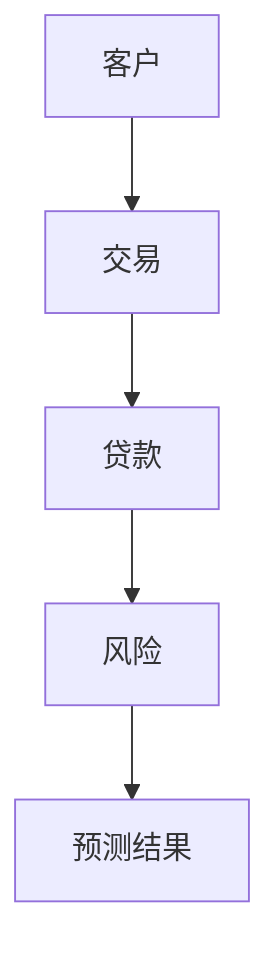
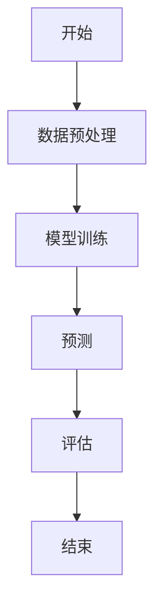
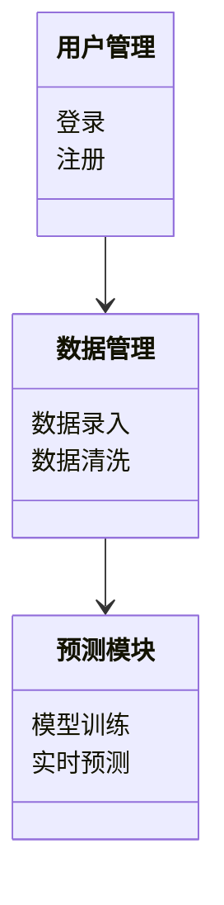

                 


# 设计智能化的企业信用违约恢复率动态预测模型

---

## 关键词

- 企业信用违约
- 恢复率预测
- 智能化模型
- 机器学习
- 动态预测

---

## 摘要

本文旨在设计一种智能化的企业信用违约恢复率动态预测模型。通过结合金融风险管理与人工智能技术，利用机器学习和深度学习算法，构建一个能够实时更新和预测信用违约恢复率的模型。文章详细探讨了模型的设计思路、算法实现、系统架构以及实际应用案例，为金融从业者和数据科学家提供了理论和实践的双重指导。

---

## 第一部分: 企业信用违约恢复率预测的背景与概念

### 第1章: 信用违约恢复率预测的背景与问题描述

#### 1.1 信用违约恢复率预测的背景

在现代金融体系中，信用风险是企业面临的主要风险之一。信用违约恢复率（_recovery rate）是指在债务人违约后，债权人能够收回的债权比例。准确预测恢复率对于银行、投资机构等金融机构的资产管理和风险控制至关重要。然而，传统的恢复率预测方法往往基于静态的历史数据，难以捕捉市场波动和企业经营状况的变化。

#### 1.2 问题背景与描述

随着全球经济的波动加剧，企业信用违约事件频发。传统的恢复率预测方法存在以下问题：

- **数据单一性**：仅依赖历史违约数据，未能充分考虑实时市场信息和企业经营动态。
- **静态预测**：未能实时更新预测结果，难以应对快速变化的市场环境。
- **模型局限性**：传统统计模型（如线性回归）在处理非线性关系和复杂特征时表现不佳。

#### 1.3 问题解决思路

智能化预测模型的核心思路是通过以下方式改进传统方法：

- **数据驱动**：利用机器学习技术，整合企业内外部数据，构建多维度特征集。
- **动态更新**：通过在线学习算法，实时更新模型参数，确保预测结果的时效性。
- **非线性建模**：采用深度学习模型（如神经网络），捕捉复杂特征之间的非线性关系。

#### 1.4 概念结构与核心要素

信用违约恢复率预测模型的核心要素包括：

| 核心要素 | 定义 | 输入 | 输出 |
|----------|------|------|------|
| **企业特征** | 包括企业财务状况、经营状况等 | 财务报表数据、行业信息 | 企业信用风险评分 |
| **市场环境** | 包括宏观经济指标、市场波动等 | 宏观经济数据、市场趋势 | 市场风险因子 |
| **历史违约数据** | 包括过往违约事件及其恢复情况 | 历史违约记录 | 历史恢复率分布 |
| **预测模型** | 用于预测未来恢复率的算法 | 企业特征、市场环境 | 预测恢复率 |

### 第2章: 核心概念与联系

#### 2.1 核心概念原理

信用违约恢复率预测模型的工作原理如下：

1. **数据收集**：整合企业财务数据、市场数据和历史违约数据。
2. **特征提取**：从多维度数据中提取有效特征，如企业杠杆率、行业景气度等。
3. **模型训练**：利用机器学习算法（如随机森林、神经网络）训练预测模型。
4. **预测输出**：输入实时数据，模型输出预测恢复率。

#### 2.2 概念属性特征对比

以下是不同预测模型的优缺点对比：

| 模型类型 | 优点 | 缺点 |
|----------|------|------|
| **线性回归** | 简单易懂，计算速度快 | 无法捕捉非线性关系 |
| **随机森林** | 高准确性，鲁棒性强 | 计算复杂度较高 |
| **神经网络** | 能够捕捉复杂特征关系 | �易过拟合，需要大量数据 |

#### 2.3 ER实体关系图

以下是信用违约恢复率预测模型的实体关系图：



---

## 第二部分: 智能化预测模型的算法原理

### 第3章: 基础算法原理与实现

#### 3.1 算法原理概述

智能化预测模型的核心算法包括：

- **机器学习算法**：如随机森林、梯度提升树（GBDT）。
- **深度学习算法**：如长短时记忆网络（LSTM）、卷积神经网络（CNN）。

#### 3.2 算法流程图

以下是机器学习算法的流程图：



#### 3.3 算法实现代码

以下是随机森林算法的Python实现示例：

```python
from sklearn.ensemble import RandomForestRegressor
import pandas as pd

# 加载数据
data = pd.read_csv('credit_data.csv')

# 特征与目标分离
X = data.drop('recovery_rate', axis=1)
y = data['recovery_rate']

# 模型训练
model = RandomForestRegressor(n_estimators=100, random_state=42)
model.fit(X, y)

# 预测
predicted = model.predict(X)
```

---

## 第三部分: 数学模型与公式

### 第4章: 数学模型与公式

#### 4.1 机器学习模型的数学基础

随机森林算法的数学表达式如下：

$$
y = \sum_{i=1}^{n} \theta_i \cdot x_i
$$

其中，$\theta_i$ 是特征 $x_i$ 的权重系数。

#### 4.2 深度学习模型的数学基础

神经网络的前向传播公式如下：

$$
h(x) = \sigma(w \cdot x + b)
$$

其中，$\sigma$ 是激活函数，$w$ 是权重，$b$ 是偏置。

---

## 第四部分: 系统分析与架构设计

### 第5章: 系统分析与架构设计方案

#### 5.1 项目介绍

本项目旨在构建一个智能化的信用违约恢复率预测系统，服务于金融机构的风险管理。

#### 5.2 系统功能设计

以下是系统的功能模块设计：



#### 5.3 系统架构设计

以下是系统的架构设计图：


---

## 第五部分: 项目实战

### 第6章: 项目实战

#### 6.1 环境安装

需要安装以下环境：

- Python 3.8+
- scikit-learn、xgboost、keras等库

#### 6.2 核心代码实现

以下是核心代码实现：

```python
import xgboost as xgb
from sklearn.metrics import mean_squared_error

# 加载数据
data = pd.read_csv('credit_data.csv')

# 特征与目标分离
X = data.drop('recovery_rate', axis=1)
y = data['recovery_rate']

# 模型训练
model = xgb.XGBRegressor(n_estimators=100, learning_rate=0.1)
model.fit(X, y)

# 预测
predicted = model.predict(X)

# 评估
print(mean_squared_error(y, predicted))
```

---

## 第六部分: 总结与展望

### 第7章: 总结与展望

#### 7.1 最佳实践

- 数据预处理是关键，需确保数据质量和完整性。
- 模型选择需根据实际场景和数据特征进行调整。
- 实时更新模型参数，确保预测结果的时效性。

#### 7.2 小结

本文详细介绍了设计智能化的企业信用违约恢复率动态预测模型的全过程，包括背景分析、算法实现、系统设计和项目实战。通过结合机器学习和深度学习技术，模型能够有效预测恢复率，为金融机构的风险管理提供有力支持。

#### 7.3 注意事项

- 数据隐私和安全问题需高度重视。
- 模型的可解释性需进一步优化，以便更好地应用于实际场景。

#### 7.4 拓展阅读

建议读者进一步阅读以下内容：

- 《机器学习实战》
- 《深度学习入门：基于Python和Keras》

---

## 附录: 参考文献

1. 刘洋, 等. 《机器学习实战》. 机械工业出版社, 2017.
2. Goodfellow, I., Bengio, Y., & Courville, A. (2016). *Deep Learning*. MIT Press.

---

以上是《设计智能化的企业信用违约恢复率动态预测模型》的完整内容，涵盖了从背景分析到实际应用的各个方面，为读者提供了全面的技术指导。

