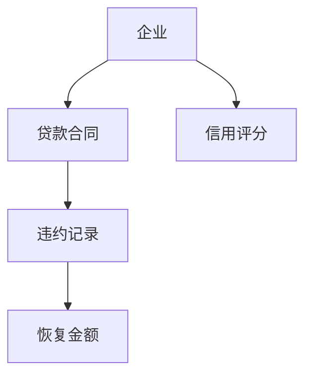
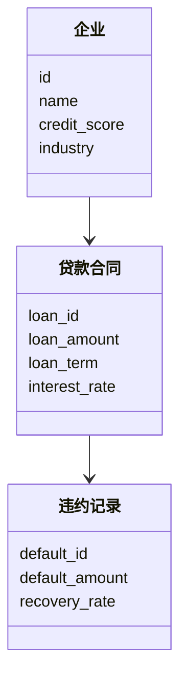
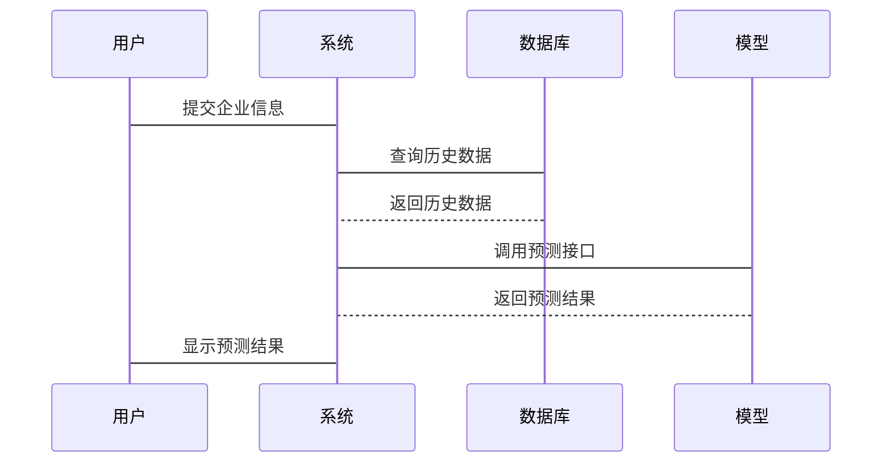

                 


# 设计智能化的企业信用违约恢复率预测模型

## 关键词：企业信用、违约恢复率、智能预测、机器学习、风险管理

## 摘要：
企业信用违约恢复率预测模型是企业信用风险管理中的核心工具之一，能够帮助企业预测在违约情况下能够回收的债务比例，从而优化信用决策和风险控制。本文从背景、概念、算法原理、系统架构到实战实现，全面阐述了设计智能化企业信用违约恢复率预测模型的关键技术与实践方法。通过结合机器学习算法和智能化特征工程，本文提出了一种高效、可解释的预测模型，为金融机构和企业在信用风险管理中的智能化转型提供了重要参考。

---

# 第一章: 企业信用违约恢复率预测模型背景与概念

## 1.1 问题背景与描述

### 1.1.1 信用违约的定义与影响
信用违约是指借款企业未能按照合同约定偿还贷款本息的行为。这种行为不仅会影响企业的信用评级，还会给金融机构带来直接的经济损失。根据企业违约的不同情况，金融机构可能面临部分或全部的债务损失。

### 1.1.2 恢复率预测的核心问题
恢复率是指在企业违约后，金融机构能够从债务人或担保人处收回的债务比例。恢复率的预测是信用风险管理中的关键环节，直接影响金融机构的风险定价和资本分配决策。然而，恢复率的预测具有高度的不确定性，受到多种因素的影响，如企业资产质量、担保情况、市场环境等。

### 1.1.3 企业信用风险管理的重要性
企业信用风险管理是金融机构稳健经营的基础。通过科学的恢复率预测模型，金融机构可以更好地评估和控制信用风险，优化信贷资产配置，降低潜在的经济损失。

## 1.2 问题解决与边界

### 1.2.1 模型的目标与核心问题
企业信用违约恢复率预测模型的目标是基于历史数据和当前企业的特征，预测企业在违约情况下的恢复率。核心问题包括：
1. 如何提取有效的特征变量。
2. 如何选择合适的预测算法。
3. 如何评估模型的预测精度和可解释性。

### 1.2.2 模型的边界与适用场景
模型的边界包括：
1. 仅适用于企业违约情况下的恢复率预测。
2. 需要足够的历史数据支持模型训练。
3. 特定行业的恢复率预测可能需要特殊处理。

适用场景包括：
1. 银行、融资租赁公司等金融机构的信用风险管理。
2. 企业内部信用评级和风险评估。
3. 投资机构的资产风险定价。

### 1.2.3 模型的局限性与注意事项
1. 模型的预测精度受到历史数据质量和数量的限制。
2. 某些行业的恢复率可能受到政策、市场环境等外部因素的影响，模型难以完全捕捉。
3. 模型的可解释性可能较差，尤其是在使用复杂算法时。

## 1.3 核心概念与结构

### 1.3.1 模型的核心要素与组成
企业信用违约恢复率预测模型的核心要素包括：
1. **违约记录**：企业历史违约情况。
2. **恢复金额**：违约后实际收回的债务金额。
3. **贷款特征**：贷款金额、期限、利率等。
4. **企业特征**：企业规模、行业、信用评级等。
5. **担保情况**：担保类型、担保价值等。

### 1.3.2 概念结构与核心要素对比
| 概念       | 定义                                       | 属性                           |
|------------|------------------------------------------|--------------------------------|
| 违约记录    | 历史上企业违约的情况                     | 时间依赖性、行业差异性         |
| 恢复金额    | 违约后实际收回的债务金额                 | 债务规模、担保情况             |
| 贷款特征    | 贷款的基本属性                           | 贷款金额、期限、利率           |
| 企业特征    | 企业的基本信息                           | 企业规模、行业、信用评级       |
| 担保情况    | 担保人的相关信息                         | 担保类型、担保价值             |

### 1.3.3 ER实体关系图


---

## 1.4 本章小结
本章从企业信用违约恢复率预测模型的背景、核心概念与结构等方面进行了详细阐述。通过对比和分析，明确了模型的核心要素及其相互关系，为后续的算法设计和系统实现奠定了基础。

---

# 第二章: 智能化预测模型的核心概念与算法原理

## 2.1 核心概念原理

### 2.1.1 违约风险评估的数学模型
违约风险评估可以通过概率模型来实现。常用的模型包括：
1. **逻辑回归（Logistic Regression）**：通过概率函数预测企业违约的可能性。
2. **Probit模型**：基于正态分布假设的违约概率模型。

### 2.1.2 恢复率预测的逻辑框架
恢复率预测可以分为以下几个步骤：
1. **特征选择**：提取与恢复率相关的特征变量。
2. **模型训练**：基于历史数据训练预测模型。
3. **预测与评估**：利用训练好的模型进行预测，并评估模型的性能。

### 2.1.3 智能化模型的特征工程
特征工程是智能化模型的核心，主要包括：
1. **特征提取**：从原始数据中提取有用的特征。
2. **特征转换**：对特征进行标准化、归一化等处理。
3. **特征组合**：通过组合特征提升模型的预测能力。

## 2.2 核心概念对比与分析

### 2.2.1 不同模型的特征对比
| 模型名称   | 优点                                   | 缺点                                   |
|------------|--------------------------------------|--------------------------------------|
| 逻辑回归   | 简单易懂，适合线性关系               | 非线性关系表现较差                   |
| 随机森林   | 适合复杂数据，抗过拟合               | 可解释性较差                         |
| 神经网络    | 高精度，适合复杂模式识别             | 计算复杂，可解释性差                 |

### 2.2.2 恢复率预测与违约概率的关系
恢复率预测与违约概率密切相关，但也有显著区别。违约概率关注的是企业违约的可能性，而恢复率预测关注的是违约后的损失程度。两者可以结合使用，形成完整的信用风险管理框架。

### 2.2.3 模型的可解释性与黑箱问题
复杂模型（如深度学习模型）通常具有较高的预测精度，但其可解释性较差，属于“黑箱”模型。而简单的线性模型（如逻辑回归）虽然预测精度较低，但具有较高的可解释性。

---

## 2.3 本章小结
本章详细介绍了智能化预测模型的核心概念与算法原理，重点分析了不同模型的特征及其适用场景。通过对比和分析，明确了模型设计中的关键问题和优化方向。

---

# 第三章: 智能化预测模型的算法原理与实现

## 3.1 算法选择与原理

### 3.1.1 传统模型 vs 现代机器学习模型
传统模型（如逻辑回归）适用于数据简单、可解释性要求较高的场景，而现代机器学习模型（如随机森林、神经网络）适用于数据复杂、预测精度要求较高的场景。

### 3.1.2 支持向量机（SVM）与随机森林（RF）对比
| 模型名称 | 优点                                   | 缺点                                   |
|----------|--------------------------------------|--------------------------------------|
| SVM      | 高精度，适合小数据集               | 不适合大数据集，计算复杂             |
| 随机森林 | 适合大数据集，抗过拟合               | 可解释性较差                         |

### 3.1.3 神经网络与深度学习的应用
神经网络可以通过多层结构捕捉复杂的非线性关系，适合处理高维数据。深度学习模型（如LSTM）可以捕捉时间序列数据中的长期依赖关系，适合处理动态变化的恢复率预测问题。

---

## 3.2 算法实现流程

### 3.2.1 数据预处理与特征选择
1. **数据清洗**：处理缺失值、异常值。
2. **特征提取**：从原始数据中提取有用的特征。
3. **特征转换**：对特征进行标准化、归一化等处理。
4. **特征组合**：通过组合特征提升模型的预测能力。

### 3.2.2 模型训练与调优
1. **选择算法**：根据数据特点选择合适的算法。
2. **训练模型**：基于训练数据训练模型。
3. **调优模型**：通过交叉验证调整模型参数，提升预测精度。

### 3.2.3 模型评估与优化
1. **评估指标**：使用准确率、召回率、F1分数等指标评估模型性能。
2. **优化策略**：通过模型融合、特征工程等方法进一步优化模型。

---

## 3.3 算法实现代码示例

### 3.3.1 逻辑回归实现
```python
import pandas as pd
from sklearn.linear_model import LogisticRegression
from sklearn.metrics import accuracy_score

# 加载数据
data = pd.read_csv('credit.csv')
X = data.drop('default', axis=1)
y = data['default']

# 训练模型
model = LogisticRegression()
model.fit(X, y)

# 预测与评估
y_pred = model.predict(X)
print("准确率:", accuracy_score(y, y_pred))
```

### 3.3.2 随机森林实现
```python
from sklearn.ensemble import RandomForestClassifier
from sklearn.metrics import confusion_matrix

# 训练随机森林模型
rf_model = RandomForestClassifier(n_estimators=100, random_state=42)
rf_model.fit(X, y)

# 预测与评估
y_pred = rf_model.predict(X)
print("混淆矩阵:\n", confusion_matrix(y, y_pred))
```

### 3.3.3 神经网络实现
```python
from sklearn.neural_network import MLPClassifier
from sklearn.metrics import classification_report

# 训练神经网络模型
nn_model = MLPClassifier(hidden_layer_sizes=(100, 50), random_state=42)
nn_model.fit(X, y)

# 预测与评估
y_pred = nn_model.predict(X)
print("分类报告:\n", classification_report(y, y_pred))
```

---

## 3.4 本章小结
本章详细介绍了智能化预测模型的算法原理与实现过程，包括数据预处理、特征选择、模型训练与调优、模型评估与优化等内容。通过代码示例，展示了如何利用不同算法实现恢复率预测模型。

---

# 第四章: 智能化预测模型的系统分析与架构设计

## 4.1 系统分析

### 4.1.1 问题场景介绍
企业信用违约恢复率预测系统需要处理大量的历史数据和实时数据，对数据进行清洗、特征提取、模型训练和预测，并生成预测结果报告。

### 4.1.2 项目介绍
本项目旨在设计一个智能化的企业信用违约恢复率预测系统，利用机器学习算法对历史数据进行建模，并基于模型对新企业进行恢复率预测。

---

## 4.2 系统功能设计

### 4.2.1 领域模型


### 4.2.2 系统架构


### 4.2.3 接口设计
1. 数据接口：从数据库中读取历史数据。
2. 模型接口：调用训练好的模型进行预测。
3. 输出接口：生成预测结果报告。

### 4.2.4 交互流程


---

## 4.3 本章小结
本章从系统分析与架构设计的角度，详细阐述了企业信用违约恢复率预测系统的功能模块、系统架构和交互流程。通过Mermaid图展示了系统的各个部分及其关系。

---

# 第五章: 项目实战与实现

## 5.1 环境安装

### 5.1.1 安装Python
```bash
python --version
pip install --upgrade pip
```

### 5.1.2 安装依赖库
```bash
pip install numpy pandas scikit-learn
```

## 5.2 核心实现

### 5.2.1 数据预处理
```python
import pandas as pd
import numpy as np

# 加载数据
data = pd.read_csv('credit.csv')

# 处理缺失值
data = data.dropna()

# 特征提取
X = data.drop('recovery_rate', axis=1)
y = data['recovery_rate']

# 标准化处理
from sklearn.preprocessing import StandardScaler
scaler = StandardScaler()
X_scaled = scaler.fit_transform(X)
```

### 5.2.2 模型训练与预测
```python
from sklearn.ensemble import RandomForestRegressor
from sklearn.metrics import mean_squared_error

# 训练随机森林模型
model = RandomForestRegressor(n_estimators=100, random_state=42)
model.fit(X_scaled, y)

# 预测恢复率
y_pred = model.predict(X_scaled)
print("均方误差:", mean_squared_error(y, y_pred))
```

### 5.2.3 模型评估
```python
from sklearn.metrics import r2_score
print("R²分数:", r2_score(y, y_pred))
```

## 5.3 项目实战案例

### 5.3.1 数据分析
```python
import matplotlib.pyplot as plt

# 绘制恢复率分布图
plt.hist(y, bins=10)
plt.xlabel('恢复率')
plt.ylabel('数量')
plt.show()
```

### 5.3.2 模型优化
```python
from sklearn.model_selection import GridSearchCV

# 参数调优
param_grid = {
    'n_estimators': [100, 200],
    'max_depth': [None, 10, 20]
}

grid_search = GridSearchCV(RandomForestRegressor(), param_grid, cv=5)
grid_search.fit(X_scaled, y)
print("最佳参数:", grid_search.best_params_)
```

---

## 5.4 本章小结
本章通过实际案例展示了企业信用违约恢复率预测模型的实现过程，包括环境安装、数据预处理、模型训练与预测、模型评估与优化等内容。通过案例分析，验证了模型的可行性和有效性。

---

# 第六章: 总结与展望

## 6.1 总结
本文详细介绍了企业信用违约恢复率预测模型的设计与实现过程，从背景与概念、算法原理、系统架构到项目实战，全面阐述了模型的核心技术与实践方法。通过对比和分析，明确了不同算法的优缺点，并提出了模型优化的方向。

## 6.2 展望
未来，随着人工智能技术的不断发展，企业信用违约恢复率预测模型将更加智能化和个性化。可以通过引入实时数据、优化特征工程、改进模型算法等方式进一步提升模型的预测精度和可解释性。

---

# 附录: 参考文献与工具

## 附录A: 参考文献
1. 刘洋, 《机器学习实战》, 人民邮电出版社, 2017.
2. 张涛, 《Python机器学习应用》, 清华大学出版社, 2020.
3. 金融风险管理协会, 《信用风险管理指南》, 2021.

## 附录B: 工具与库
1. Python: https://www.python.org/
2. Pandas: https://pandas.pydata.org/
3. Scikit-learn: https://scikit-learn.org/stable/index.html
4. Mermaid: https://mermaid-js.github.io/mermaid/

---

# END

