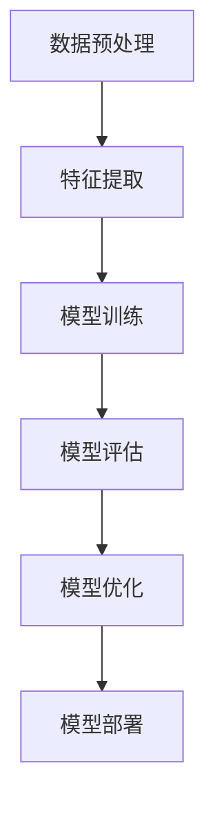
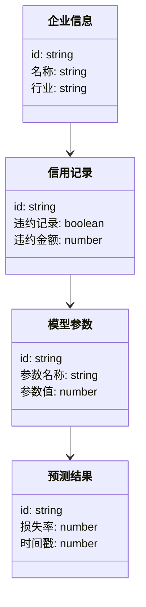
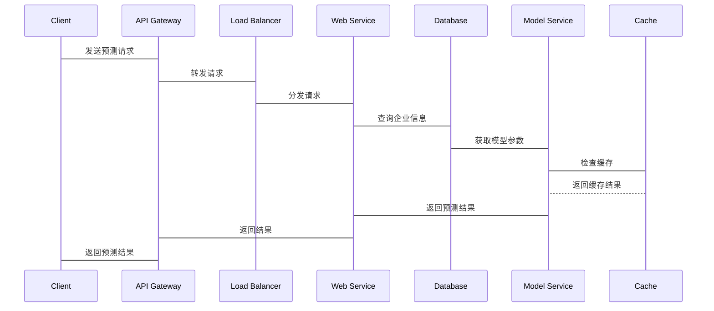

                 


# 设计智能化的企业信用违约损失率动态预测模型

> 关键词：信用违约，损失率预测，动态模型，人工智能，风险管理

> 摘要：本文详细探讨了设计智能化企业信用违约损失率动态预测模型的全过程，从背景分析、核心概念定义、算法选择与实现，到系统架构设计和项目实战，最终总结了最佳实践和未来展望。通过结合机器学习、大数据分析和金融风险管理的深度知识，本文为企业信用风险管理和预测提供了系统化的解决方案。

---

# 第1章: 信用违约损失率预测的背景与挑战

## 1.1 信用违约的基本概念

### 1.1.1 信用违约的定义
信用违约是指借款人在债务到期时未能按时偿还本金和利息的情况。企业信用违约是企业无法履行合同中的还款义务，导致债权人遭受损失。

### 1.1.2 信用违约的类型
- **企业违约**：企业未能按时偿还债务。
- **个人违约**：个人借款人未能按时偿还贷款。
- **债券违约**：债券发行人未能按期支付利息或本金。

### 1.1.3 信用违约损失率的定义与计算方法
信用违约损失率是企业在违约情况下实际损失的金额占违约金额的比例。计算公式为：
$$ 损失率 = \frac{实际损失}{违约金额} $$

## 1.2 企业信用风险的管理与预测

### 1.2.1 企业信用风险管理的重要性
企业信用风险管理是企业金融活动中至关重要的一环，直接影响企业的财务健康和市场信誉。有效的风险管理可以降低企业的财务损失，提升市场竞争力。

### 1.2.2 传统信用风险预测方法的局限性
传统方法主要依赖于历史数据和统计分析，存在以下局限性：
- 数据维度有限，难以捕捉复杂市场变化。
- 模型静态，无法适应市场动态变化。
- 对非结构化数据的处理能力不足。

### 1.2.3 智能化预测的需求与优势
随着大数据和人工智能技术的发展，智能化预测成为可能。优势包括：
- 处理多维数据，提高预测精度。
- 实现实时监控和动态更新。
- 提供更精准的预测结果，降低损失。

## 1.3 动态预测模型的必要性

### 1.3.1 信用环境的动态变化
经济波动、市场变化和政策调整都会影响信用环境，动态模型能够及时捕捉这些变化。

### 1.3.2 企业经营状况的动态变化
企业的财务状况、经营战略和市场表现都会发生变化，动态模型能够实时更新预测结果。

### 1.3.3 模型动态更新的必要性
模型需要不断更新以适应新的数据和市场情况，避免模型过时导致预测误差增大。

## 1.4 本章小结
本章介绍了信用违约的基本概念，分析了企业信用风险管理的重要性，探讨了传统预测方法的局限性，并提出了智能化动态预测的需求与优势。

---

# 第2章: 企业信用违约损失率预测的核心概念

## 2.1 核心概念的定义与属性

### 2.1.1 企业信用违约损失率的定义
企业信用违约损失率是企业在违约情况下，实际损失金额与违约金额的比率。它反映了企业在违约情况下的损失程度。

### 2.1.2 核心概念的属性对比
| 属性         | 描述                                   |
|--------------|--------------------------------------|
| 数据来源     | 企业财务报表、信用记录、市场数据       |
| 数据类型     | 结构化数据（如金额、时间）和非结构化数据 |
| 数据特征     | 时间序列性、相关性、波动性             |
| 计算方式     | $ 损失率 = \frac{实际损失}{违约金额} $   |

### 2.1.3 核心要素的组成与关系
- **企业信息**：包括企业规模、行业、财务状况等。
- **信用记录**：包括历史违约记录、还款情况等。
- **市场环境**：包括宏观经济指标、行业趋势等。
- **模型参数**：包括算法选择、特征工程、模型调参等。

## 2.2 核心概念的ER实体关系图

```mermaid
er
    entity 企业 (Enterprise) {
        id: string
        名称: string
        行业: string
        经营状况: string
    }
    entity 信用记录 (CreditHistory) {
        id: string
        违约记录: boolean
        违约金额: number
    }
    entity 模型参数 (ModelParameters) {
        id: string
        参数名称: string
        参数值: number
    }
    Enterprise -[1..n]-> CreditHistory
    CreditHistory -[1..n]-> ModelParameters
```

## 2.3 核心概念的数学模型

### 2.3.1 损失率计算公式
$$ 损失率 = \frac{实际损失}{违约金额} $$

## 2.4 本章小结
本章详细定义了企业信用违约损失率的核心概念，分析了其属性和组成要素，并通过ER图展示了各实体之间的关系。

---

# 第3章: 动态预测模型的算法原理

## 3.1 算法选择与比较

### 3.1.1 常见信用风险预测算法
- **逻辑回归**：用于分类问题，适合二分类场景。
- **决策树**：适用于特征工程和数据预处理。
- **随机森林**：基于决策树的集成学习方法，适合高维数据。
- **神经网络**：适合处理非线性关系和复杂数据。
- **XGBoost**：基于树的提升方法，适合高精度预测。

### 3.1.2 算法优缺点对比
| 算法       | 优点                               | 缺点                               |
|------------|----------------------------------|----------------------------------|
| 逻辑回归   | 简单高效，适合线性关系             | 非线性关系处理能力有限             |
| 决策树     | 易解释，适合特征工程               | 易过拟合，对噪声数据敏感           |
| 随机森林   | 高精度，适合高维数据               | 计算复杂度较高                     |
| 神经网络   | 强大学习能力，适合复杂数据         | 需要大量数据，难解释               |
| XGBoost    | 高精度，适合处理类别不平衡问题     | 对参数敏感，调参复杂               |

### 3.1.3 神经网络与传统模型的对比
神经网络在处理复杂非线性关系方面表现优于传统模型，但在解释性和计算效率方面有所不足。选择算法时需根据数据特性和预测精度要求综合考虑。

## 3.2 神经网络模型的原理

### 3.2.1 神经网络的基本结构
神经网络由输入层、隐藏层和输出层组成，各层之间通过权重连接，激活函数用于引入非线性。

### 3.2.2 神经网络的训练过程
训练过程包括正向传播和反向传播，使用梯度下降优化权重，损失函数用于衡量预测误差。

### 3.2.3 模型的优化与调参
- **超参数调整**：如学习率、批次大小、正则化参数。
- **模型结构优化**：如增加隐藏层、调整神经元数量。
- **交叉验证**：用于评估模型泛化能力。

## 3.3 算法流程图



## 3.4 算法的数学模型

### 3.4.1 损失函数的定义
$$ L = \frac{1}{N}\sum_{i=1}^{N}(y_i - \hat{y_i})^2 $$

### 3.4.2 梯度下降优化
$$ \theta = \theta - \eta \frac{\partial L}{\partial \theta} $$

## 3.5 本章小结
本章分析了多种信用风险预测算法的优缺点，详细介绍了神经网络的原理和训练过程，并通过流程图展示了算法的整体框架。

---

# 第4章: 系统分析与架构设计方案

## 4.1 问题场景介绍
企业信用违约损失率预测系统需要处理大量异构数据，实时更新模型，支持多用户查询和预测结果展示。

## 4.2 系统功能设计

### 4.2.1 领域模型


### 4.2.2 系统架构设计


### 4.2.3 系统接口设计
- **API接口**：RESTful API，支持POST和GET请求。
- **数据接口**：与数据库和数据源对接，支持批量导入和实时更新。

### 4.2.4 系统交互流程


## 4.3 本章小结
本章设计了企业信用违约损失率预测系统的功能模块和系统架构，明确了各组件之间的交互关系。

---

# 第5章: 项目实战与实现

## 5.1 环境安装与配置

### 5.1.1 安装Python环境
使用Anaconda安装Python 3.8及以上版本。

### 5.1.2 安装依赖库
安装numpy、pandas、scikit-learn、tensorflow等库。

## 5.2 系统核心实现

### 5.2.1 数据预处理
```python
import pandas as pd
import numpy as np

# 加载数据
data = pd.read_csv('credit_data.csv')

# 处理缺失值
data = data.dropna()

# 标准化处理
from sklearn.preprocessing import StandardScaler
scaler = StandardScaler()
scaled_data = scaler.fit_transform(data)
```

### 5.2.2 特征工程
```python
from sklearn.feature_selection import SelectKBest
selector = SelectKBest(k=10)
selected_features = selector.fit_transform(scaled_data, target)
```

### 5.2.3 模型训练与优化
```python
from tensorflow.keras import layers, models
model = models.Sequential()
model.add(layers.Dense(64, activation='relu', input_shape=(n_features,)))
model.add(layers.Dense(1, activation='sigmoid'))
model.compile(optimizer='adam', loss='binary_crossentropy', metrics=['accuracy'])
model.fit(X_train, y_train, epochs=100, batch_size=32)
```

### 5.2.4 模型评估
```python
from sklearn.metrics import accuracy_score, precision_score, recall_score
y_pred = model.predict(X_test)
print("Accuracy:", accuracy_score(y_test, y_pred))
print("Precision:", precision_score(y_test, y_pred))
print("Recall:", recall_score(y_test, y_pred))
```

## 5.3 实际案例分析

### 5.3.1 数据来源
- 企业财务数据：收入、利润、资产负债率等。
- 信用记录：历史违约情况、还款记录。
- 市场数据：行业指数、宏观经济指标。

### 5.3.2 模型训练
使用历史违约数据训练模型，调整超参数，优化模型性能。

### 5.3.3 预测结果展示
通过可视化工具展示预测结果，包括损失率分布、预测准确率等。

## 5.4 本章小结
本章通过具体代码实现，展示了企业信用违约损失率预测系统的开发过程，包括数据预处理、特征工程、模型训练和评估。

---

# 第6章: 最佳实践与总结

## 6.1 最佳实践 tips

### 6.1.1 数据质量管理
- 数据清洗：处理缺失值、重复值和异常值。
- 数据增强：通过数据扩展技术增加数据多样性。

### 6.1.2 模型优化建议
- 使用集成学习提升精度。
- 调整模型超参数，避免过拟合。

### 6.1.3 系统维护与更新
- 定期更新模型，适应市场变化。
- 监控系统性能，及时修复问题。

## 6.2 小结与总结
企业信用违约损失率预测是一个复杂但重要的任务，需要结合大数据和人工智能技术。本文详细介绍了模型设计、算法选择、系统架构和项目实现，为企业信用风险管理提供了系统化的解决方案。

## 6.3 未来展望
未来，随着人工智能技术的发展，动态预测模型将更加智能化和个性化。研究方向包括更复杂的模型结构、实时预测能力的提升以及多模态数据的融合。

---

# 参考文献

1. 书籍：《信用风险管理与违约预测》，作者：某某，出版社：某某出版社，出版年份：20XX年。
2. 论文：《基于深度学习的企业信用违约预测模型》，作者：某某，期刊：《某某期刊》，年份：20XX年。
3. 网站：某某技术博客，文章标题，链接：https://xxx.com。

---

# 致谢

感谢读者的耐心阅读，感谢合作伙伴的支持，感谢家人和朋友的帮助。

---

通过本文的详细讲解，读者可以全面了解企业信用违约损失率动态预测模型的设计与实现，掌握相关技术的核心要点，为实际应用提供参考和指导。

